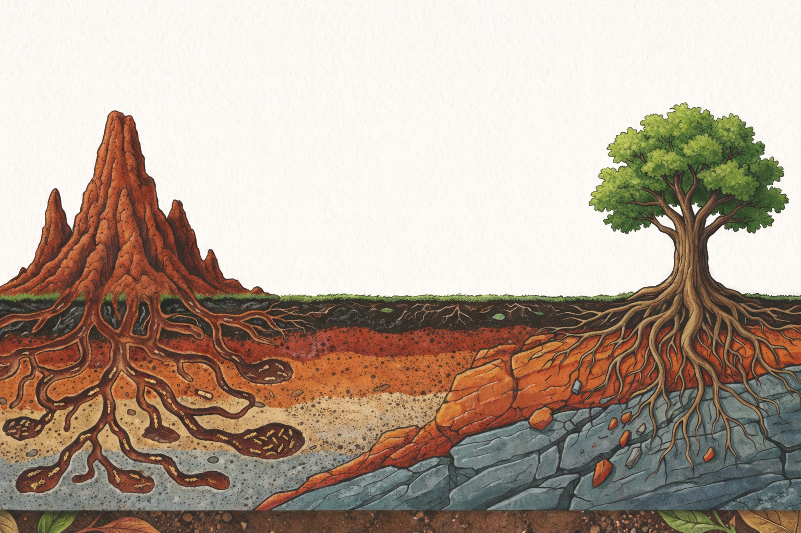
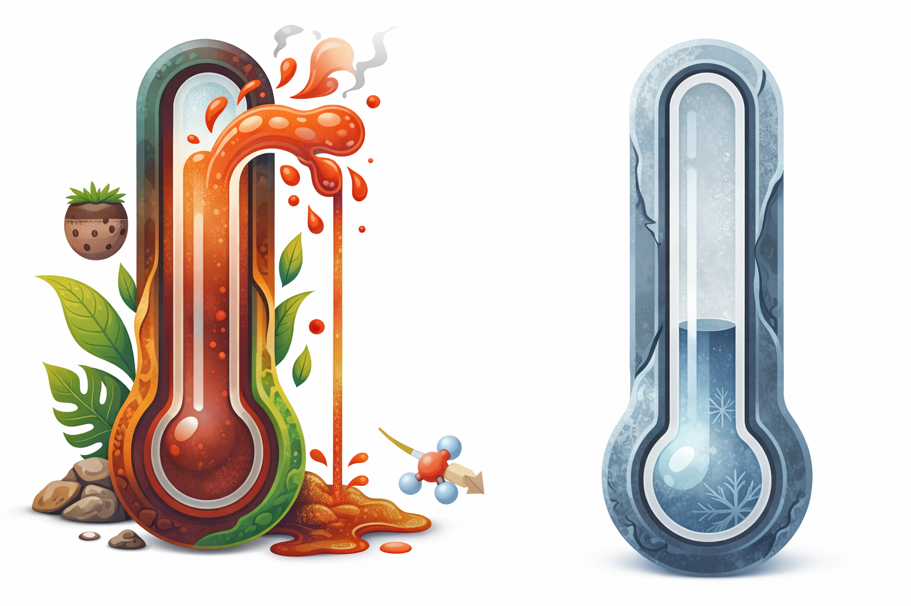
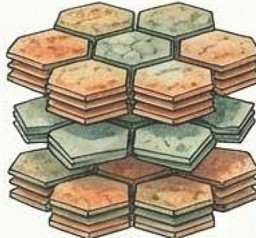

# Intemperismo e Transformação do Solo {#sec-intemperismo}

## Conceito de Intemperismo

O **intemperismo** é o conjunto de processos físicos, químicos e biológicos que transformam rochas consolidadas em materiais inconsolidados (saprolito e solo). É o processo fundamental que "fabrica" o substrato sobre o qual atua a bioengenharia.

Em regiões tropicais, o intemperismo é **mais intenso e profundo** do que em qualquer outra zona climática, resultando em mantos de alteração que podem alcançar dezenas de metros de espessura.

## Intemperismo Físico

{#fig-agentes fig-alt="Agentes ativos do intemperismo" width="80%"}

O intemperismo físico fragmenta mecanicamente a rocha **sem alterar sua composição mineralógica**. Os principais agentes em regiões tropicais são:

### Alívio de Pressão

{#fig-alivio fig-alt="Alívio de pressão em rocha granítica" width="70%"}

Quando rochas profundas são expostas pela erosão, a descompressão gera fraturas subparalelas à superfície (*sheet joints* ou *sheeting*). Esse processo é particularmente importante em rochas graníticas e gnáissicas nos inselbergs nordestinos.

### Termoclastia

{#fig-termoclastia fig-alt="Termoclastia e amplitude térmica" width="65%"}

A variação diurna de temperatura causa expansão/contração diferencial dos minerais. Em regiões semiáridas tropicais, a amplitude térmica superficial pode alcançar **60 °C** (rocha ao sol a 70 °C vs. ar noturno a 10 °C), gerando tensões suficientes para fraturar a rocha.

### Crescimento de Cristais

Em ambientes semiáridos, a evaporação de soluções salinas nos poros da rocha gera cristais que exercem pressão de até **300 MPa**, fragmentando progressivamente o substrato (haloclastia).

### Ação Biológica

Raízes de árvores penetram fraturas e exercem pressão mecânica de expansão. Liquens e fungos contribuem para a fragmentação superficial combinando ação mecânica e química.

## Intemperismo Químico

O intemperismo químico é o **processo dominante nos trópicos úmidos**, transformando minerais primários em minerais secundários (argilas e óxidos). A água é o agente principal.

### Papel da Água

A molécula de água atua simultaneamente como solvente (dissolvendo íons e moléculas dos minerais), como reagente (participando diretamente das reações químicas de hidrólise) e como meio de transporte (removendo produtos solúveis por lixiviação).

A taxa de intemperismo químico aumenta exponencialmente com a temperatura, seguindo a Lei de Arrhenius:

$$
k = A \cdot e^{-E_a / RT}
$$

onde $k$ é a constante de velocidade, $A$ é o fator de frequência, $E_a$ é a energia de ativação, $R$ é a constante dos gases e $T$ é a temperatura absoluta.

### Principais Reações

A **hidrólise** constitui a reação mais importante nos trópicos. O exemplo clássico é a hidrólise do feldspato potássico para caulinita:

$$
2 \text{KAlSi}_3\text{O}_8 + 2\text{H}^+ + 9\text{H}_2\text{O} \rightarrow \text{Al}_2\text{Si}_2\text{O}_5(\text{OH})_4 + 4\text{H}_4\text{SiO}_4 + 2\text{K}^+
$$

A **oxidação** promove a conversão de Fe²⁺ em Fe³⁺, formando os óxidos de ferro responsáveis pelas cores vermelhas e amarelas dos solos tropicais:

$$
4\text{Fe}^{2+} + 3\text{O}_2 + 6\text{H}_2\text{O} \rightarrow 4\text{FeOOH} + 8\text{H}^+
$$

A **dissolução** corresponde à remoção completa de íons solúveis (Ca²⁺, Mg²⁺, K⁺, Na⁺), concentrando residualmente os óxidos de Fe e Al.

### Série de Goldich

A **série de estabilidade de Goldich** (inversa da série de Bowen) indica a susceptibilidade dos minerais ao intemperismo:

| Mais susceptível → | → Menos susceptível |
|-------------------|---------------------|
| Olivina | Quartzo |
| Piroxênio | Muscovita |
| Anfibólio | Feldspato potássico |
| Biotita | — |

: Série de estabilidade de Goldich: minerais formados em altas temperaturas (esquerda) intemperizam primeiro. {#tbl-goldich .striped}

## Índice de Intemperismo Químico (CIA)

O grau de intemperismo pode ser quantificado pelo **Chemical Index of Alteration** (CIA):

$$
\text{CIA} = \frac{\text{Al}_2\text{O}_3}{\text{Al}_2\text{O}_3 + \text{CaO}^* + \text{Na}_2\text{O} + \text{K}_2\text{O}} \times 100
$$

| CIA | Grau de intemperismo | Exemplo |
|-----|---------------------|---------|
| 50 | Rocha fresca | Granito inalterado |
| 60–70 | Moderado | Solos de zona temperada |
| 75–85 | Avançado | Argissolos tropicais |
| 85–100 | Extremo | Latossolos, bauxitas |

: Interpretação do CIA para diferentes graus de intemperismo. {#tbl-cia .striped}

## Minerais Diagnósticos dos Solos Tropicais

### Caulinita

{#fig-caulinita fig-alt="Caulinita mineral" width="60%"}

Argila do tipo 1:1, com espaçamento basal de **7,2 Å**. É o argilomineral dominante nos solos tropicais bem drenados. Características:

A caulinita é caracterizada por baixa capacidade de troca catiônica (CTC ≈ 3–15 cmolc/kg), baixa expansibilidade e coesão moderada.

### Goethita (FeOOH)

Óxido de ferro responsável pela **cor amarela** dos solos. Predomina em ambientes mais úmidos e sombreados.

### Hematita (Fe₂O₃)

{#fig-hematita fig-alt="Hematita mineral" width="60%"}

Óxido de ferro responsável pela **cor vermelha**. Predomina em ambientes bem drenados com estação seca definida.

### Gibbsita (Al(OH)₃)

Hidróxido de alumínio indicador de **intemperismo extremo** (ferraltização). Abundante em Latossolos.

## Implicações para a Bioengenharia

O grau de intemperismo determina diretamente as propriedades geotécnicas do solo e, consequentemente, o projeto de bioengenharia:

::: {.callout-warning}
## Atenção
Solos extremamente intemperizados (CIA > 85) possuem:

Esses minerais/produtos conferem propriedades geotécnicas particulares. A baixa CTC demanda matéria orgânica para retenção de nutrientes, a coesão aparente implica perda rápida de resistência quando o solo satura, e a microagregação gera comportamento pseudo-arenoso apesar do alto teor de argila.
:::

Essas propriedades influenciam diretamente a seleção de técnicas. A baixa CTC demanda técnicas que agreguem matéria orgânica (mulch, biomantas, hidrossemeadura), enquanto a coesão aparente torna essencial a drenagem superficial e subsuperficial. Por outro lado, a microagregação facilita a penetração radicular, favorecendo técnicas vegetativas.
