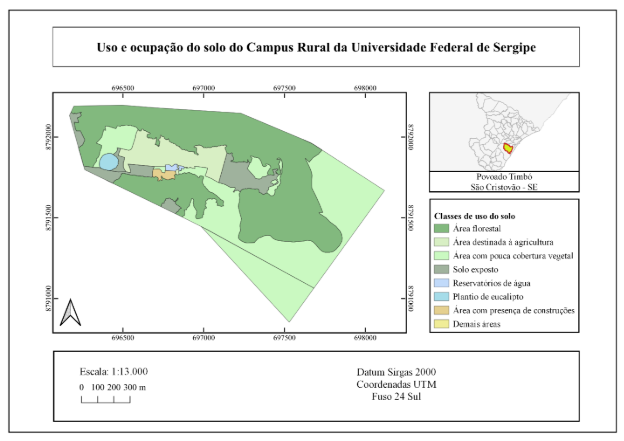
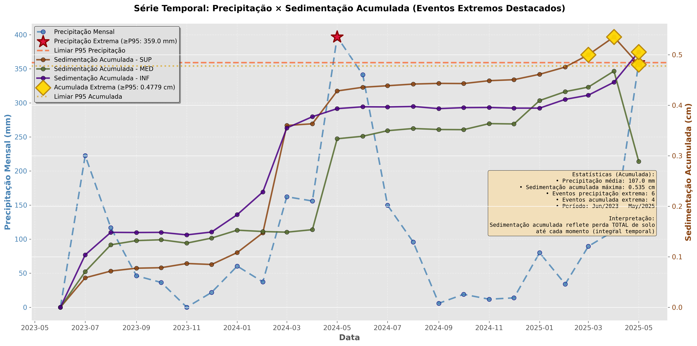

# Erosão do Solo: Tipos e Processos {#sec-erosao}

## Conceito e Magnitude

A erosão hídrica é o processo de desprendimento, transporte e deposição de partículas de solo pela ação da água. Embora a erosão seja um fenômeno natural que ocorre em todas as paisagens (sendo, de fato, o agente modelador do relevo terrestre ao longo do tempo geológico), as atividades humanas (desmatamento, agricultura intensiva, urbanização) aceleraram esse processo em taxas que superam em 10 a 100 vezes a erosão natural. Em escala global, estima-se que 75 bilhões de toneladas de solo sejam erodidas anualmente, com custo econômico superior a US$ 400 bilhões/ano [@morgan2005], considerando-se perdas de produtividade agrícola, assoreamento de reservatórios, degradação da qualidade da água e destruição de infraestrutura.

Para quem atua em bioengenharia de solos, compreender os mecanismos erosivos é o ponto de partida obrigatório, pois cada tipo de erosão demanda técnicas de controle específicas. Um tratamento projetado para erosão laminar será ineficaz contra uma voçoroca ativa, e vice-versa.

Em regiões tropicais, a erosividade da chuva (fator R da RUSLE) é tipicamente 3 a 5 vezes maior do que em zonas temperadas, devido à maior frequência de chuvas convectivas intensas (com gotas de grande diâmetro e alta energia cinética), tornando a erosão um dos processos geomorfológicos mais ativos e um dos maiores desafios ambientais do Brasil.

## RUSLE (Equação Universal de Perda de Solo)

O modelo RUSLE (*Revised Universal Soil Loss Equation*) [@renard1997] é a ferramenta mais amplamente utilizada para estimar a perda de solo por erosão laminar e em sulcos. Apesar de suas limitações (não modela erosão em ravinas nem deposição), a RUSLE é fundamental para o planejamento de intervenções de bioengenharia, pois permite quantificar a perda de solo atual e simular a eficácia de diferentes práticas conservacionistas antes de sua implantação.

$$
A = R \cdot K \cdot L \cdot S \cdot C \cdot P
$$

A @tbl-rusle descreve cada fator da equação. É importante notar que o resultado ($A$) expressa a média anual de perda de solo em toneladas por hectare por ano, e que a equação assume condições de estado estacionário para uma encosta retilínea com comprimento e declividade uniformes.

| Fator | Significado | Unidade | O que controla |
|-------|------------|---------|----------------|
| $A$ | Perda de solo | t ha⁻¹ ano⁻¹ | Resultado do modelo |
| $R$ | Erosividade da chuva | MJ mm ha⁻¹ h⁻¹ ano⁻¹ | Energia e intensidade das chuvas |
| $K$ | Erodibilidade do solo | t h MJ⁻¹ mm⁻¹ | Susceptibilidade intrínseca do solo |
| $L$ | Comprimento da rampa | adimensional | Distância percorrida pelo escoamento |
| $S$ | Declividade | adimensional | Inclinação da encosta |
| $C$ | Uso e manejo do solo | adimensional | Cobertura e práticas culturais |
| $P$ | Práticas conservacionistas | adimensional | Intervenções de controle da erosão |

: Fatores da RUSLE e suas unidades. {#tbl-rusle .striped}

::: {.callout-tip}
## Parâmetro-chave para bioengenharia
Os fatores $C$ e $P$ são os diretamente manipuláveis pela bioengenharia. Uma cobertura de gramíneas pode reduzir $C$ de 1,0 (solo nu) para 0,01, representando uma redução de 99% na erosão. Da mesma forma, paliçadas ou cordões vegetativos reduzem efetivamente o fator $L$ (comprimento da rampa), enquanto terraços alteram o fator $S$ (declividade). A combinação dessas intervenções pode reduzir a perda de solo de centenas de toneladas por hectare/ano para valores abaixo da tolerância.
:::

## Método SCS-CN para Estimativa de Escoamento

Além da RUSLE, que estima a perda de solo por erosão laminar, o projetista de bioengenharia necessita estimar o volume e o pico de escoamento superficial gerado por eventos de chuva, informação essencial para dimensionar paliçadas (ver @sec-palicadas), bacias de captação (ver @sec-bacias-captacao) e canaletas verdes (ver @sec-canaleta-verde). O método SCS-CN (*Soil Conservation Service — Curve Number*), desenvolvido pelo USDA, é a ferramenta mais amplamente utilizada para essa finalidade.

O escoamento superficial direto ($Q$, em mm) gerado por uma precipitação total ($P$, em mm) é estimado por

$$
Q = \frac{(P - 0{,}2S)^2}{P + 0{,}8S}
$$

válida para $P > 0{,}2S$ (caso contrário, $Q = 0$), onde $S$ é a retenção potencial máxima do solo (mm), calculada a partir do *Curve Number* ($CN$) pela relação

$$
S = \frac{25400}{CN} - 254
$$

O $CN$ é um parâmetro adimensional (0–100) que integra os efeitos do tipo hidrológico do solo, da cobertura vegetal e da condição de umidade antecedente. A @tbl-cn apresenta valores de $CN$ para condições típicas em projetos de bioengenharia no Brasil tropical.

| Uso do solo / cobertura | Solo tipo A | Solo tipo B | Solo tipo C | Solo tipo D |
|--------------------------|------------|------------|------------|------------|
| Floresta densa (Mata Atlântica) | 25 | 55 | 70 | 77 |
| Cerrado denso | 36 | 60 | 73 | 79 |
| Pastagem em boas condições | 39 | 61 | 74 | 80 |
| Pastagem degradada (solo exposto > 50%) | 68 | 79 | 86 | 89 |
| Solo nu (pós-desmatamento) | 77 | 86 | 91 | 94 |
| Estrada rural não pavimentada | 72 | 82 | 87 | 89 |

: Valores de CN para condições típicas de projetos de bioengenharia em solos tropicais (condição de umidade antecedente II). {#tbl-cn .striped .hover}

::: {.callout-tip}
## Aplicação prática
A redução do $CN$ é o objetivo hidrológico de qualquer intervenção de bioengenharia. Ao converter uma pastagem degradada ($CN = 86$, solo tipo C) em uma encosta revegetada com espécies nativas ($CN \approx 73$), a retenção potencial $S$ aumenta de 41 mm para 94 mm, reduzindo o escoamento gerado por uma chuva de 80 mm de 35,5 mm para 11,6 mm, o que representa uma diminuição de 67% no volume de enxurrada. Esse cálculo justifica tecnicamente a prioridade dada à revegetação em projetos de controle de erosão.
:::

A vazão de pico ($Q_p$) pode ser estimada pelo método racional modificado do SCS, que incorpora o tempo de concentração da bacia

$$
Q_p = \frac{0{,}208 \cdot A \cdot Q}{t_p}
$$

onde $A$ é a área da bacia contribuinte (km²), $Q$ é o escoamento direto (mm, calculado pela equação anterior) e $t_p$ é o tempo de pico (h), dado por $t_p = 0{,}6 \cdot t_c$ (onde $t_c$ é o tempo de concentração estimado pela fórmula de Kirpich ou equivalente). Essa vazão de pico é o dado de entrada para o dimensionamento hidráulico das estruturas de dissipação, contenção e condução de enxurrada, conforme detalhado nos capítulos subsequentes.

## Tipos de Erosão

A erosão hídrica se manifesta em diferentes formas, que representam um contínuo de intensidade crescente. A @fig-tipos-erosao apresenta uma comparação visual desses tipos, desde a erosão laminar (praticamente imperceptível) até as feições lineares de grande porte.

{#fig-tipos-erosao fig-alt="Montagem comparativa dos tipos de erosão" width="90%"}

### Erosão Laminar (*Sheet Erosion*)

A erosão laminar consiste na remoção uniforme de uma fina camada de solo pela ação do escoamento superficial difuso (uma lâmina d'água rasa que escoa uniformemente sobre a superfície). É a forma mais insidiosa de erosão por ser visualmente imperceptível; o agricultor perde solo progressivamente sem notar, até que a exposição dos horizontes subsuperficiais (mais claros, mais compactos) revele a gravidade da situação. Em regiões tropicais, a erosão laminar sob chuvas intensas pode remover 1–3 mm de solo por evento, o que equivale a 15–45 t/ha. A proteção da superfície por cobertura vegetal viva, morta (mulch) ou artificial (biomantas) é a estratégia primária de controle.

### Erosão em Sulcos (*Rill Erosion*)

Quando o escoamento superficial se concentra em pequenos canais paralelos à encosta (com profundidade inferior a 30 cm), escava-se uma rede de sulcos que concentra progressivamente o fluxo de água e sedimentos. Os sulcos ainda podem ser desfeitos por operações agrícolas convencionais (aração, gradagem), o que os distingue das ravinas. Entretanto, se não corrigidos, representam o estágio inicial da formação de feições erosivas permanentes. O controle se dá pela redução do comprimento da rampa (implantação de cordões vegetativos, paliçadas ou terraços que interrompem o escoamento concentrado).

### Erosão em Ravinas (*Gully Erosion*)

A ravina é um canal permanente com profundidade superior a 30 cm que não pode ser eliminado por operações agrícolas convencionais. Representa o estágio avançado da erosão hídrica concentrada e é o tipo de feição erosiva que mais demanda intervenções de bioengenharia. A @fig-ravina-campo mostra uma ravina ativa em solo tropical, onde é possível observar as paredes verticais expostas e a ausência de cobertura vegetal no interior do canal.

{#fig-ravina-campo fig-alt="Ravina ativa em campo" width="75%"}

As ravinas podem ser classificadas segundo seu mecanismo de crescimento dominante. As ravinas de cabeceira retrocedem por erosão remontante, na qual o escoamento concentrado escava a montante, alargando progressivamente a área de contribuição. As ravinas laterais se expandem por solapamento e desabamento das paredes, processo acelerado pelo umedecimento diferencial e pela ação do gelo em altas altitudes ou pela simples saturação em ambientes tropicais. As ravinas de fundo se aprofundam por incisão do talvegue, podendo atingir horizontes mais compactos ou o lençol freático. É comum que os três mecanismos atuem simultaneamente na mesma ravina, exigindo um tratamento integrado de bioengenharia que aborde cabeceira, paredes e fundo do canal.

### Voçorocas

As voçorocas são feições erosivas de grande porte (profundidade > 1,5 m, largura > 3 m) que frequentemente atingem o lençol freático, adicionando a contribuição de água subterrânea ao processo erosivo. Representam o estágio mais severo de degradação do solo e constituem um dos maiores desafios para a bioengenharia.

A formação de voçorocas está associada a três mecanismos interconectados. O primeiro é a progressão da erosão superficial, na qual ravinas não controladas se ampliam e aprofundam até atingir dimensões de voçoroca. O segundo é a erosão subsuperficial (*piping*), na qual a percolação de água através de descontinuidades do solo (fraturas, raízes mortas, galerias de animais) gera túneis internos cujo colapso súbito forma a feição erosiva. O terceiro é a instabilidade de taludes, na qual o solapamento da base pela exfiltração do lençol freático causa desabamentos sucessivos das paredes, ampliando lateralmente a voçoroca.

{#fig-vocoroca-incipiente fig-alt="Voçoroca em estágio incipiente de formação em solo tropical" width="75%"}

O tratamento de voçorocas ativas exige um projeto integrado que combine drenagem superficial (desvio das águas de contribuição), drenagem subsuperficial (interceptação de *pipes*), estabilização mecânica das paredes (gabiões vivos, paredes Krainer, retaludamento) e revegetação progressiva. Abordagens pontuais ou parciais tendem ao fracasso, pois os processos atuantes são múltiplos e interconectados.

## Mecanismos de Erosão

O processo erosivo envolve três fases sequenciais cujo entendimento é fundamental para projetar intervenções eficazes.

### 1. Desprendimento (*Detachment*)

O impacto das gotas de chuva (*splash*) é o principal agente de desprendimento de partículas de solo. Para dimensionar essa magnitude, considere que uma gota de 5 mm de diâmetro (comum em chuvas convectivas tropicais) atinge o solo a aproximadamente 9 m/s, exercendo pressão instantânea de até 6 MPa (equivalente a cerca de 60 atmosferas), força suficiente para desagregar partículas e projetá-las a mais de 1 metro de distância. Uma chuva tropical intensa pode gerar milhares de impactos por centímetro quadrado por hora.

A taxa de desprendimento é função da energia cinética da chuva:

$$
D_r = K_I \cdot I^2
$$

onde $D_r$ é a taxa de desprendimento (kg m⁻² s⁻¹), $K_I$ é a erodibilidade intergoticular (propriedade do solo) e $I$ é a intensidade da chuva (mm h⁻¹). O expoente quadrático indica que a duplicação da intensidade da chuva quadruplica o desprendimento, o que explica por que as chuvas tropicais de curta duração e alta intensidade são tão erosivas.

A proteção contra o desprendimento é a primeira linha de defesa da bioengenharia. A cobertura vegetal (viva ou morta) intercepta as gotas de chuva antes que atinjam o solo, eliminando o efeito *splash*. Uma cobertura de 70% da superfície reduz o desprendimento em mais de 90%.

### 2. Transporte

As partículas desprendidas são transportadas pelo escoamento superficial. A capacidade de transporte ($T_c$) determina a quantidade máxima de sedimento que o fluxo pode carregar e depende diretamente da velocidade e da profundidade do escoamento:

$$
T_c = k_t \cdot \tau^{1.5}
$$

onde $\tau$ é a tensão cisalhante do fluxo (que depende da velocidade, profundidade e declividade do escoamento) e $k_t$ é um coeficiente empírico que varia com o tamanho das partículas do solo. Essa equação revela que a redução da velocidade do escoamento (por meio de obstáculos como paliçadas, cordões vegetativos ou bacias de contenção) é a estratégia mais eficaz para limitar o transporte de sedimentos.

### 3. Deposição

Quando a capacidade de transporte diminui (por redução de velocidade ou declividade), as partículas em suspensão são depositadas. A deposição é seletiva quanto ao tamanho das partículas: partículas grossas (areia) são depositadas primeiro, seguidas por partículas intermediárias (silte), enquanto partículas finas (argila) podem ser transportadas por quilômetros até atingir corpos d'água. Esse fenômeno de seletividade granulométrica explica por que as paliçadas e bacias de sedimentação são eficazes para reter areia e silte, mas têm eficácia limitada para argila em suspensão.

## Erosão em Regiões Tropicais

A erosão nas regiões tropicais apresenta particularidades que a distinguem dos processos erosivos em outras zonas climáticas e que devem ser consideradas no projeto de bioengenharia. A @fig-mapa-erosao ilustra um mapa de susceptibilidade à erosão, ferramenta fundamental para o planejamento espacial das intervenções.

{#fig-mapa-erosao fig-alt="Mapa de erosão e capacidade de uso" width="85%"}

Mapas como o da @fig-mapa-erosao são construídos a partir do cruzamento de informações topográficas (modelo digital de elevação), pedológicas (classes de solo e erodibilidade), climáticas (erosividade da chuva) e de uso do solo (cobertura vegetal), e permitem identificar as áreas prioritárias para intervenção (hotspots erosivos) e dimensionar as técnicas mais adequadas para cada zona.

{#fig-mapa-uso-solo fig-alt="Mapa de uso e cobertura do solo" width="85%"}

::: {.callout-important}
## Particularidades tropicais
Nas regiões tropicais, quatro fatores condicionam a intensidade e a dinâmica dos processos erosivos. Primeiro, a elevada erosividade das chuvas, com $EI_{30}$ superior a 10.000 MJ mm ha⁻¹ h⁻¹ ano⁻¹ (contra 1.000–3.000 em zonas temperadas), concentrada em poucos meses da estação chuvosa. Segundo, os solos com coesão aparente, que se mostram estáveis quando secos mas colapsam quando saturados, gerando rupturas súbitas e imprevisíveis. Terceiro, a ocorrência frequente de erosão subsuperficial (*piping*), especialmente em solos com gradiente textural (Argissolos) ou com camadas de impedimento (Plintossolos), que gera túneis subterrâneos cujo colapso forma ravinas e voçorocas. Quarto, os ciclos repetitivos de umedecimento e secagem, que causam fissuração superficial, criando caminhos preferenciais para infiltração concentrada e acelerando a desagregação do solo.
:::

{#fig-eventos-extremos fig-alt="Relação entre eventos climáticos extremos e processos erosivos" width="80%"}

## Erosão Marginal

Em regiões tropicais, a erosão das margens fluviais é um processo crítico que afeta diretamente comunidades ribeirinhas, áreas agrícolas, infraestrutura viária e ecossistemas ripários. O mecanismo envolve o solapamento da base da margem pelo fluxo do rio (que remove material na zona de contato com a água), seguido pelo desabamento gravitacional do bloco superior, ciclo que se repete a cada cheia. O Baixo São Francisco (SE/AL), por exemplo, perde em média 2 a 5 metros de margem por ano, com registro de trechos onde a erosão atingiu 10 m/ano, resultando em perda de terras agriculturáveis, destruição de residências e desestabilização de rodovias.

A bioengenharia de solos oferece soluções específicas para erosão marginal, combinando retaludamento (suavização do ângulo da margem para estabilização geométrica), enrocamento vegetado na base da margem (resistência mecânica à abrasão pelo fluxo com enraizamento progressivo) e revegetação ciliar no topo do talude (ancoragem radicular e interceptação de escoamento superficial). Essas técnicas serão detalhadas nos capítulos sobre gabiões vivos (@sec-gabiao-vivo), paredes Krainer (@sec-parede-krainer) e revegetação (@sec-revegetacao).

## Tolerância de Perda de Solo

A tolerância de perda de solo ($T$) é um conceito fundamental para justificar a necessidade de intervenções de bioengenharia. Trata-se da taxa máxima de erosão compatível com a manutenção da produtividade do solo em longo prazo, ou seja, a taxa na qual a formação de novo solo (por intemperismo) equilibra a perda por erosão.

| Classe de solo | T (t ha⁻¹ ano⁻¹) | Justificativa |
|---------------|-------------------|---------------|
| Solos profundos (Latossolos) | 9–12 | Manto espesso permite maior perda sem comprometer a raiz |
| Solos moderadamente profundos | 5–9 | Equilíbrio entre profundidade e taxa de formação |
| Solos rasos (Neossolos) | 2–5 | Qualquer perda compromete rapidamente a capacidade produtiva |

: Tolerância de perda de solo para classes de solos tropicais [@bertoni2017]. {#tbl-tolerancia .striped}

Quando a perda atual ($A$, calculada pela RUSLE ou medida em parcelas experimentais) excede a tolerância ($T$), intervenções de bioengenharia são necessárias para evitar a degradação irreversível do recurso solo. Essa relação $A > T$ é o critério técnico que fundamenta a recomendação de intervenção e orienta o dimensionamento das técnicas de controle, cuja intensidade deve ser proporcional ao excedente $A - T$.
