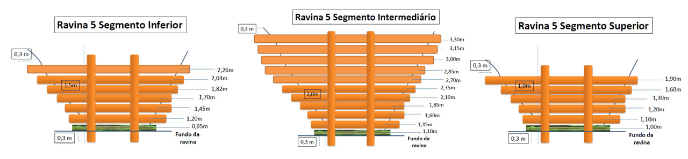
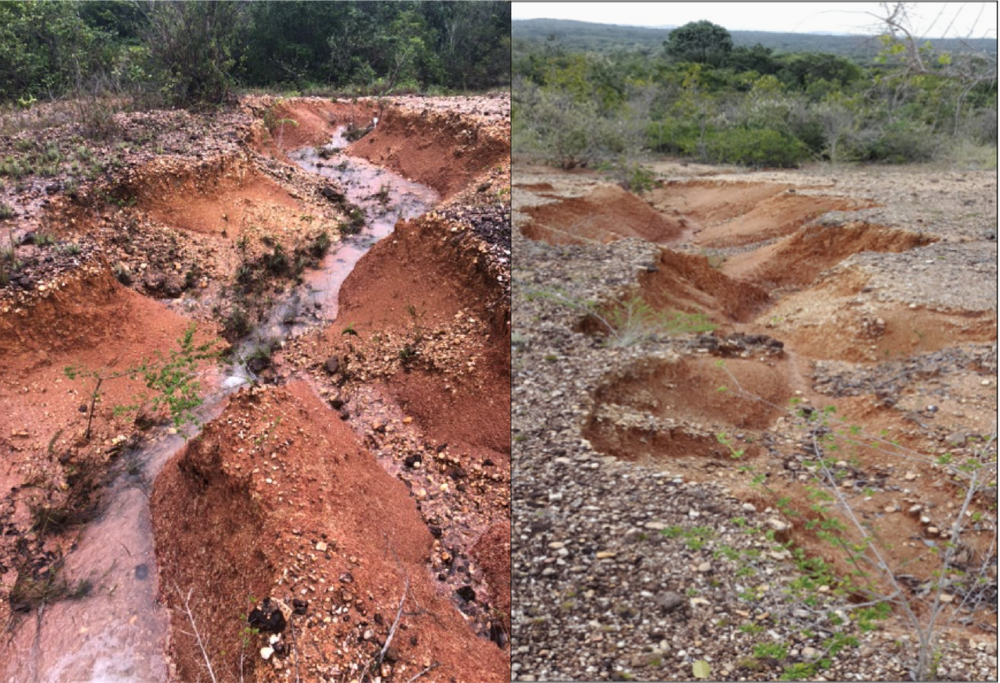

# Erosão do Solo: Tipos e Processos {#sec-erosao}

## Conceito e Magnitude

A erosão hídrica é o processo de desprendimento, transporte e deposição de partículas de solo pela ação da água. Em escala global, estima-se que **75 bilhões de toneladas de solo** sejam erodidas anualmente, com custo econômico superior a **US$ 400 bilhões/ano** [@morgan2005].

Em regiões tropicais, a erosividade da chuva (fator R da RUSLE) é tipicamente **3 a 5 vezes maior** do que em zonas temperadas, tornando a erosão um dos processos geomorfológicos mais ativos.

## RUSLE (Equação Universal de Perda de Solo)

O modelo RUSLE [@renard1997] quantifica a perda de solo por erosão laminar e em sulcos:

$$
A = R \cdot K \cdot L \cdot S \cdot C \cdot P
$$

onde:

| Fator | Significado | Unidade |
|-------|------------|---------|
| $A$ | Perda de solo | t ha⁻¹ ano⁻¹ |
| $R$ | Erosividade da chuva | MJ mm ha⁻¹ h⁻¹ ano⁻¹ |
| $K$ | Erodibilidade do solo | t h MJ⁻¹ mm⁻¹ |
| $L$ | Comprimento da rampa | adimensional |
| $S$ | Declividade | adimensional |
| $C$ | Uso e manejo do solo | adimensional |
| $P$ | Práticas conservacionistas | adimensional |

: Fatores da RUSLE e suas unidades. {#tbl-rusle .striped}

::: {.callout-tip}
## Parâmetro-chave para bioengenharia
Os fatores $C$ e $P$ são os diretamente manipuláveis pela bioengenharia. Uma cobertura de gramíneas pode reduzir $C$ de 1,0 (solo nu) para 0,01, representando uma **redução de 99% na erosão**.
:::

## Tipos de Erosão

{#fig-tipos-erosao fig-alt="Montagem comparativa dos tipos de erosão" width="90%"}

### Erosão Laminar (*Sheet Erosion*)

Remoção uniforme de uma fina camada de solo pela ação do escoamento superficial difuso. É a forma **mais insidiosa** por ser visualmente imperceptível, de modo que o agricultor perde solo sem perceber.

### Erosão em Sulcos (*Rill Erosion*)

Quando o escoamento superficial se concentra em pequenos canais (< 30 cm de profundidade), escavando sulcos paralelos à encosta. Os sulcos podem ser desfeitos por operações agrícolas normais.

### Erosão em Ravinas (*Gully Erosion*)

{#fig-ravina-campo fig-alt="Ravina ativa em campo" width="75%"}

Canais permanentes com profundidade > 30 cm que **não podem ser eliminados por operações agrícolas**. Representam o estágio mais avançado da erosão hídrica concentrada.

As ravinas podem ser classificadas em ravinas de cabeceira, que retrocedem por erosão remontante, ravinas laterais, que se expandem por solapamento das paredes, e ravinas de fundo, que se aprofundam por incisão do talvegue.

### Voçorocas

Feições erosivas de grande porte (profundidade > 1,5 m, largura > 3 m) que frequentemente atingem o lençol freático. Representam o estágio mais severo de degradação do solo.

## Mecanismos de Erosão

O processo erosivo envolve três fases:

### 1. Desprendimento (*Detachment*)

O impacto das gotas de chuva (*splash*) é o principal agente de desprendimento. Uma gota de 5 mm de diâmetro atinge o solo a ~9 m/s, exercendo pressão de até **6 MPa**, suficiente para desagregar partículas e projetá-las a mais de 1 metro de distância.

A taxa de desprendimento é função da energia cinética da chuva:

$$
D_r = K_I \cdot I^2
$$

onde $D_r$ é a taxa de desprendimento (kg m⁻² s⁻¹), $K_I$ é a erodibilidade intergoticular e $I$ é a intensidade da chuva (mm h⁻¹).

### 2. Transporte

As partículas desprendidas são transportadas pelo escoamento superficial. A capacidade de transporte ($T_c$) depende da velocidade e da profundidade do escoamento:

$$
T_c = k_t \cdot \tau^{1.5}
$$

onde $\tau$ é a tensão cisalhante do fluxo e $k_t$ é um coeficiente empírico.

### 3. Deposição

Quando a capacidade de transporte diminui (redução de velocidade ou declividade), as partículas são depositadas. A seletividade granulométrica faz com que partículas grossas (areia) sejam depositadas primeiro, enquanto partículas finas (argila) sejam transportadas a distâncias maiores.

## Erosão em Regiões Tropicais

{#fig-mapa-erosao fig-alt="Mapa de erosão e capacidade de uso" width="85%"}

::: {.callout-important}
## Particularidades tropicais
Nas regiões tropicais, a erosão hídrica é condicionada por chuvas com $EI_{30}$ superior a 10.000 MJ mm ha⁻¹ h⁻¹ ano⁻¹ (contra 1.000–3.000 em zonas temperadas), por solos com coesão aparente que se mostram estáveis quando secos mas colapsam quando saturados, por erosão subsuperficial (*piping*) frequente em solos com gradiente textural, e por ciclos de umedecimento-secagem que causam fissuração e desagregação.
:::

## Erosão Marginal

Em regiões tropicais, a erosão das margens fluviais é um processo crítico, especialmente em rios de planície com solos coesivos. O Baixo São Francisco (SE/AL) perde em média **2 a 5 metros de margem por ano**, com consequências diretas para comunidades ribeirinhas e agricultura.

A bioengenharia de solos oferece soluções específicas para erosão marginal, combinando retaludamento para estabilização geométrica, enrocamento vegetado na base da margem e revegetação ciliar no topo do talude.

## Tolerância de Perda de Solo

A **tolerância de perda de solo** ($T$) é a taxa máxima de erosão compatível com a manutenção da produtividade em longo prazo:

| Classe de solo | T (t ha⁻¹ ano⁻¹) |
|---------------|-------------------|
| Solos profundos (Latossolos) | 9–12 |
| Solos moderadamente profundos | 5–9 |
| Solos rasos (Neossolos) | 2–5 |

: Tolerância de perda de solo para classes de solos tropicais [@bertoni2017]. {#tbl-tolerancia .striped}

Quando a perda atual ($A$) excede a tolerância ($T$), intervenções de bioengenharia são **necessárias** para evitar a degradação irreversível.
