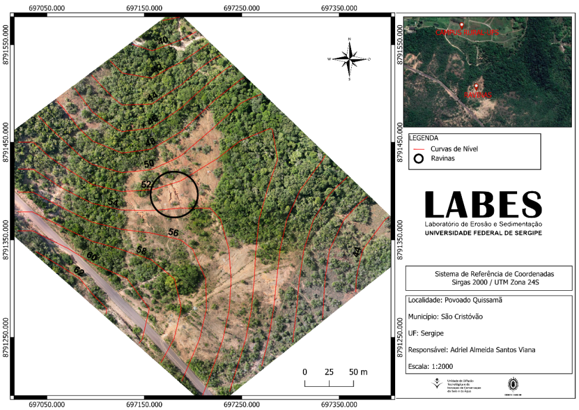
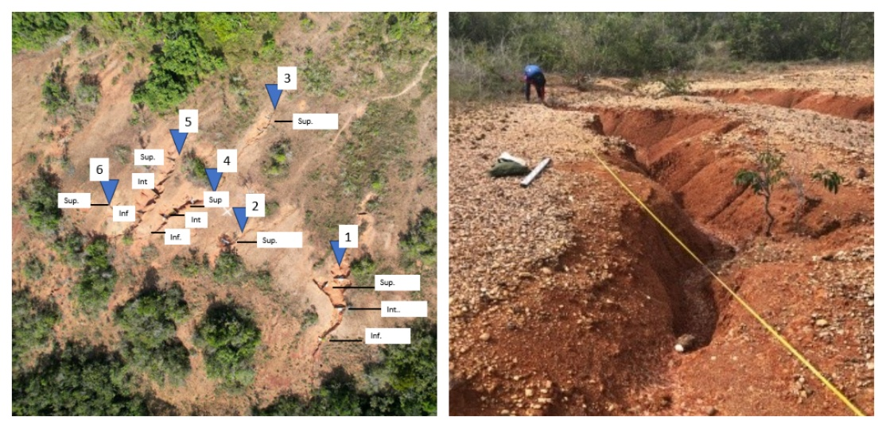
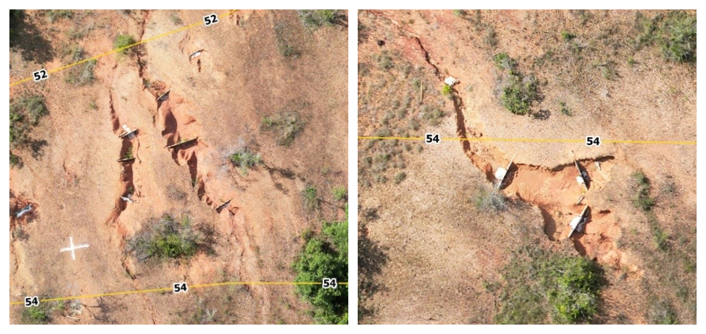

# Classificação de Feições Erosivas {#sec-classificacao-feicoes}

## Importância da Classificação

A classificação precisa das feições erosivas é o primeiro passo para o dimensionamento de intervenções de bioengenharia. Sem uma classificação rigorosa, corre-se o risco de subdimensionar o tratamento (aplicar uma solução simples a um problema complexo, resultando em falha) ou de superdimensioná-lo (gastar recursos desnecessários com técnicas sofisticadas onde uma solução simples bastaria). Uma ravina de cabeceira com 0,5 m de profundidade demanda técnicas completamente diferentes de uma voçoroca com 8 m de profundidade e contribuição do lençol freático, embora ambas sejam "feições erosivas".

O mapeamento das feições erosivas pode ser realizado por diferentes métodos, desde o reconhecimento visual em campo até o uso de tecnologias de sensoriamento remoto. A @fig-foto-aerea demonstra a capacidade dos sistemas RPAS (Remotely Piloted Aircraft Systems, popularmente chamados drones) para identificar e mapear feições erosivas com resolução espacial centimétrica.

{#fig-foto-aerea fig-alt="Foto aérea de feições erosivas" width="85%"}

A partir de imagens como a da @fig-foto-aerea, é possível extrair informações geométricas detalhadas (largura, profundidade, comprimento, área da seção transversal) que alimentam os sistemas de classificação e orientam a seleção de técnicas de bioengenharia.

## Elementary Gully Classification (EGC)

O sistema Elementary Gully Classification (EGC) é uma abordagem sistemática que permite classificar feições erosivas com base em suas características geométricas e hidráulicas, utilizando dados obtidos por levantamento topográfico convencional, GNSS de precisão ou sensoriamento remoto (drone/VANT). A vantagem do EGC é fornecer critérios quantitativos e objetivos para distinguir entre classes de feições, substituindo classificações subjetivas baseadas apenas na impressão visual do observador.

### Parâmetros Geométricos

Para classificar uma feição erosiva pelo EGC, é necessário medir seis parâmetros fundamentais, descritos na @tbl-parametros. Esses parâmetros podem ser obtidos tanto em campo (com trena, nível óptico ou estação total) quanto a partir do modelo digital de superfície gerado por levantamento com drone.

| Parâmetro | Símbolo | Descrição | Como medir |
|-----------|---------|-----------|------------|
| Largura | $W$ | Distância entre bordas (m) | Trena ou perfil transversal do MDS |
| Profundidade | $D$ | Distância vertical da borda ao fundo (m) | Mira topográfica ou diferença altimétrica do MDS |
| Comprimento | $L$ | Extensão longitudinal (m) | Trena ou polyline sobre ortomosaico |
| Área da seção | $A_s$ | Área da seção transversal (m²) | Cálculo por integração do perfil |
| Razão W/D | — | Indicador da forma da seção (V, U ou trapezoidal) | Divisão de W por D |
| Declividade do fundo | $S_f$ | Gradiente longitudinal (%) | Nível óptico ou perfil longitudinal do MDT |

: Parâmetros geométricos para classificação de feições erosivas. {#tbl-parametros .striped}

A razão W/D é particularmente informativa. Feições com W/D < 1 (mais profundas que largas) indicam erosão concentrada ativa com aprofundamento dominante, enquanto feições com W/D > 3 (mais largas que profundas) sugerem alargamento por desabamento das paredes, frequentemente associado à contribuição do lençol freático. Essa distinção orienta a seleção de técnicas: feições profundas e estreitas respondem bem a paliçadas e check-dams, enquanto feições largas e rasas demandam tratamento de paredes (retaludamento, biomantas, revegetação).

### Classificação por Dimensões

A @tbl-dimensoes apresenta os critérios dimensionais para cada classe de feição erosiva. Os limites entre classes não são arbitrários; refletem transições nos processos dominantes e, consequentemente, nas técnicas de controle recomendadas.

| Classe | Profundidade | Largura | Área de seção | Processo dominante |
|--------|-------------|---------|---------------|-------------------|
| Sulco | < 0,3 m | < 0,3 m | < 0,09 m² | Escoamento difuso concentrado |
| Ravina pequena | 0,3–1,0 m | 0,3–1,0 m | 0,09–1,0 m² | Escoamento concentrado com incisão |
| Ravina média | 1,0–3,0 m | 1,0–5,0 m | 1,0–15 m² | Escoamento concentrado + solapamento |
| Ravina grande | 3,0–5,0 m | 5,0–15 m | 15–75 m² | Múltiplos processos superficiais |
| Voçoroca | > 5,0 m | > 15 m | > 75 m² | Superficial + subsuperficial + gravitacional |

: Classificação de feições erosivas por dimensões e processo dominante. {#tbl-dimensoes .striped .hover}

## Levantamento com VANT (Drone)

O uso de Veículos Aéreos Não Tripulados (VANT/drone) revolucionou o levantamento de feições erosivas nas últimas duas décadas. Antes dos drones, o mapeamento detalhado de ravinas e voçorocas exigia levantamentos topográficos de campo laboriosos, custosos e, em muitos casos, perigosos (trabalhar dentro de voçorocas ativas envolve risco de desabamento). Com os drones, é possível obter modelos tridimensionais de alta resolução a partir de sobrevoos de poucos minutos, sem expor operadores a riscos.

As imagens a seguir ilustram dois aspectos complementares do levantamento. A @fig-ravina-detalhe mostra o detalhe de uma ravina em resolução que permite medir os parâmetros geométricos da @tbl-parametros diretamente no modelo digital, enquanto a @fig-perfil-feicoes revela os horizontes do solo expostos pela erosão, informação essencial para dimensionar a profundidade de ancoragem das estruturas de bioengenharia.

::: {layout-ncol=2}
{#fig-ravina-detalhe fig-alt="Detalhe de ravina em solo tropical"}

{#fig-perfil-feicoes fig-alt="Perfil de solo exposto por erosão"}
:::

### Fluxo de Trabalho com VANT

O levantamento com VANT segue uma sequência operacional padronizada em cinco etapas. A primeira etapa é o planejamento de voo, no qual se define a área de cobertura, a altitude de voo (tipicamente 50–100 m acima do terreno, resultando em resolução de 1–3 cm/pixel) e a sobreposição entre imagens (mínimo de 80% frontal e 60% lateral para garantir a reconstrução tridimensional). A segunda etapa é a distribuição de pontos de controle (GCPs, *Ground Control Points*), que são alvos georreferenciados com GNSS RTK (precisão centimétrica) distribuídos pela área de interesse para garantir a acurácia posicional do modelo.

A terceira etapa é o processamento fotogramétrico, realizado por softwares de *Structure from Motion* (SfM) como Agisoft Metashape, OpenDroneMap ou Pix4D, que reconstroem a geometria tridimensional da cena a partir da sobreposição das centenas de fotografias obtidas pelo drone. O resultado é uma nuvem densa de pontos tridimensionais com milhões de coordenadas XYZ. A quarta etapa é a geração de produtos cartográficos, incluindo o ortomosaico (imagem georreferenciada em projeção ortogonal), o MDS (Modelo Digital de Superfície, que inclui a vegetação), o MDT (Modelo Digital do Terreno, obtido pela filtragem da vegetação) e as curvas de nível. Por fim, a quinta etapa é a análise geomorfológica, na qual se extraem seções transversais das feições, calculam-se volumes de perda ou deposição de solo por diferença de MDTs multitemporais e se quantificam taxas de recuo de cabeceira e de alargamento lateral.

## Seleção de Técnicas por Classe

A classificação da feição erosiva orienta diretamente a seleção das técnicas de bioengenharia, conforme sintetizado na @tbl-selecao. A lógica é progressiva: quanto maior e mais complexa a feição, maior o número e a sofisticação das técnicas combinadas.

| Classe | Técnica primária | Técnica complementar |
|--------|-----------------|---------------------|
| Sulco | Cobertura vegetal, palhada | Cordões vegetativos |
| Ravina pequena | Paliçadas de bambu | Revegetação |
| Ravina média | Paliçadas + check-dams | Hidrossemeadura |
| Ravina grande | Gabião vivo | Biomantas + drenagem |
| Voçoroca | Projeto integrado (retaludamento + drenagem + gabião + revegetação) | Parede Krainer, enrocamento |

: Seleção de técnicas de bioengenharia por classe de feição erosiva. {#tbl-selecao .striped .hover}

::: {.callout-tip}
## Regra prática
Quanto maior a feição erosiva, maior a necessidade de combinação de técnicas e de um projeto integrado que considere drenagem, estabilização mecânica e revegetação simultaneamente. Feições pequenas (sulcos e ravinas pequenas) podem ser tratadas com uma única técnica, enquanto voçorocas sempre exigem projeto multidisciplinar envolvendo drenagem, estabilização e revegetação coordenadas.
:::

## Monitoramento Temporal

O monitoramento periódico das feições erosivas é essencial para avaliar a eficácia das intervenções de bioengenharia e tomar decisões de manutenção ou reforço. Sem monitoramento, é impossível saber se a intervenção está funcionando até que uma eventual falha se manifeste de forma catastrófica. A frequência mínima recomendada é trimestral durante os dois primeiros anos após a implantação e semestral a partir do terceiro ano.

Os indicadores-chave que devem ser medidos em cada campanha de monitoramento são a taxa de recuo da cabeceira (m/ano, esperando-se estabilização ou redução progressiva), a taxa de alargamento lateral (m/ano, que indica se as paredes estão sendo estabilizadas), o volume de sedimento retido nas estruturas (m³, medido pela diferença de cota a montante das paliçadas ou check-dams), a cobertura vegetal no interior da feição (%, que deve aumentar progressivamente) e a estabilidade das paredes laterais (ângulo do talude, monitorado por seções transversais).

A comparação de MDTs obtidos por drone em campanhas sucessivas permite calcular com precisão os volumes de perda e deposição de solo, identificando espacialmente as zonas ativas (ainda em erosão) e as zonas estabilizadas (com deposição e revegetação), orientando ações corretivas focalizadas.

## Tecnologias Emergentes de Monitoramento

O avanço das tecnologias de sensoriamento e comunicação sem fio ampliou significativamente o arsenal de ferramentas disponíveis para o monitoramento de feições erosivas e da eficácia de intervenções de bioengenharia. Três tecnologias emergentes merecem destaque por seu potencial de aplicação em condições tropicais.

### Sensores IoT para Monitoramento Contínuo

A Internet das Coisas (*Internet of Things*, IoT) permite a instalação de redes de sensores autônomos em campo, capazes de transmitir dados em tempo real via rede celular (GSM/4G), LoRaWAN ou satélite. Em projetos de bioengenharia, sensores de umidade volumétrica do solo (TDR ou capacitivos) instalados em diferentes profundidades ao longo de perfis transversais à feição erosiva permitem monitorar continuamente a frente de umedecimento durante eventos de chuva, identificando o momento em que a saturação atinge a zona crítica de ruptura. Piezômetros automatizados registram a variação do nível do lençol freático com resolução temporal de minutos, dado essencial para a previsão de instabilidades em voçorocas com contribuição de água subterrânea. Inclinômetros MEMS (*Micro-Electro-Mechanical Systems*) detectam deslocamentos milimétricos nas paredes laterais de feições erosivas, funcionando como sistemas de alerta precoce para desabamentos. Pluviógrafos de báscula conectados à mesma rede permitem correlacionar diretamente a intensidade da chuva com a resposta hidrológica do solo monitorado, alimentando modelos preditivos de erosão em tempo real.

A @tbl-iot sintetiza os sensores recomendados para um sistema de monitoramento IoT aplicado a projetos de bioengenharia.

| Sensor | Variável medida | Resolução | Aplicação |
|--------|----------------|-----------|-----------|
| TDR ou capacitivo | Umidade volumétrica (%) | ±1% | Frente de umedecimento, infiltração |
| Piezômetro vibrating wire | Nível piezométrico (m) | ±1 mm | Poropressão, lençol freático |
| Inclinômetro MEMS | Deslocamento angular (°) | ±0,001° | Movimento de massa, alerta precoce |
| Pluviógrafo de báscula | Precipitação (mm) | 0,2 mm | Correlação chuva-resposta erosiva |
| Sensor de turbidez óptico | Sedimento em suspensão (NTU) | ±2 NTU | Carga sólida no exutório |

: Sensores IoT para monitoramento de projetos de bioengenharia. {#tbl-iot .striped .hover}

### LiDAR Terrestre e Aerotransportado

O LiDAR (*Light Detection and Ranging*) complementa a fotogrametria SfM com a capacidade de penetrar a cobertura vegetal, gerando modelos digitais de terreno (MDT) sob dosséis florestais fechados, situação em que a fotogrametria óptica é incapaz de reconstruir a superfície do solo. Em feições erosivas sob regeneração vegetal avançada, o LiDAR aerotransportado por drone (resolução de 5–20 pontos/m²) permite quantificar volumes de preenchimento e deposição que seriam invisíveis por fotogrametria, sendo particularmente útil no monitoramento de médio e longo prazo (anos 3–10 após a intervenção). O LiDAR terrestre (TLS, *Terrestrial Laser Scanner*), com resolução milimétrica (> 1.000 pontos/m²), é a ferramenta de maior precisão para quantificar taxas de recuo de cabeceira e evolução de seções transversais, funcionando como referência para calibração dos demais métodos.

### Sensoriamento Distribuído por Fibra Óptica

A tecnologia de sensoriamento distribuído por fibra óptica (DFOS, *Distributed Fiber Optic Sensing*) permite monitorar deformações, temperatura e umidade ao longo de cabos de fibra óptica enterrados no maciço de solo, com resolução espacial de 0,5–1,0 m e extensão de até 10 km por canal. Em estruturas de bioengenharia de grande porte (gabiões vivos, paredes Krainer), a fibra óptica instalada durante a construção funciona como um "sistema nervoso" da estrutura, detectando deformações diferenciais, variações de temperatura associadas a fluxo preferencial de água (piping) e mudanças de umidade que indicam saturação localizada. Embora o custo atual do sistema de aquisição (interrogador óptico, R$ 80.000–200.000) limite sua aplicação a obras de grande responsabilidade (barragens, encostas urbanas), a tendência de redução de custos torna essa tecnologia cada vez mais acessível para projetos de pesquisa e monitoramento de referência.

::: {.callout-note}
## Integração de dados
A convergência dessas tecnologias em plataformas de gestão de dados geoespaciais (como GeoNode, QGIS Server ou Google Earth Engine) permite a criação de painéis de monitoramento (*dashboards*) que integram dados de sensores IoT, produtos de sensoriamento remoto (drone, LiDAR, satélite) e modelos hidrológicos em uma interface única de tomada de decisão, viabilizando a gestão adaptativa preconizada pelos critérios IUCN para NBS (ver @sec-nbs).
:::
