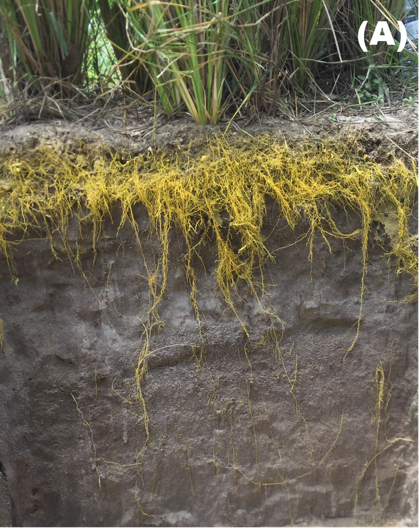

# Revegetação e Espécies para Bioengenharia {#sec-revegetacao}

## Princípios da Revegetação

A revegetação é a técnica fundamental e mais antiga da bioengenharia de solos. Enquanto estruturas como paliçadas, gabiões e paredes Krainer oferecem estabilização mecânica imediata, é a vegetação que assegura a proteção em longo prazo, transformando progressivamente uma superfície vulnerável em um sistema autossustentável. Por essa razão, todas as demais técnicas de bioengenharia são, em última análise, projetadas para criar condições favoráveis ao estabelecimento vegetal.

O sistema radicular é o componente-chave dessa proteção. A @fig-vetiver-raizes apresenta o sistema radicular do vetiver (*Vetiveria zizanioides*), considerado o padrão de referência em bioengenharia tropical, cujas raízes podem ultrapassar 3 m de profundidade em solos bem drenados.

{#fig-vetiver-raizes fig-alt="Sistema radicular de vetiver" width="70%"}

Conforme ilustrado na @fig-vetiver-raizes, a densidade e a profundidade das raízes do vetiver criam uma malha tridimensional que reforça mecanicamente o solo. As plantas protegem o solo por seis mecanismos simultâneos e complementares. A interceptação da energia cinética das gotas de chuva pela copa e pelas folhas reduz em até 90% o impacto direto sobre a superfície, eliminando o efeito *splash* (desprendimento por impacto). A proteção superficial pelo acúmulo de serrapilheira (folhas mortas, restos vegetais) cria uma camada amortecedora que reduz a velocidade do escoamento e protege os agregados do solo contra desagregação. O reforço radicular aumenta a coesão do solo em 5–40 kPa, conforme demonstrado pelo modelo de Wu-Waldron discutido no @sec-solos-tropicais, sendo o incremento proporcional à densidade e à resistência à tração das raízes. A drenagem biológica por evapotranspiração remove água do solo, reduzindo a poropressão e aumentando a tensão efetiva, o que estabiliza encostas suscetíveis a deslizamentos. A criação de macroporos pelo crescimento e pela decomposição das raízes eleva a permeabilidade do solo em 2 a 10 vezes, favorecendo a infiltração (que reduz o escoamento superficial) e melhorando a drenagem interna. Por fim, as raízes pivotantes ancoram camadas superficiais instáveis a substratos estáveis em profundidade, funcionando como tirantes naturais.

## Seleção de Espécies

A seleção de espécies para bioengenharia é uma decisão de engenharia, não apenas uma escolha paisagística. Cada espécie possui características funcionais (profundidade e arquitetura radicular, velocidade de cobertura, tolerância a estresses) que devem ser compatibilizadas com as condições do sítio (tipo de solo, declividade, regime hídrico, clima).

### Critérios Técnicos

Do ponto de vista técnico, cinco critérios devem ser avaliados simultaneamente. O sistema radicular é o mais importante e deve ser compatível com a função desejada (fasciculado para reforço da camada superficial 0–50 cm, ou pivotante para ancoragem profunda > 1 m). A velocidade de estabelecimento determina o tempo de exposição do solo à erosão desprotegida; espécies que cobrem mais de 80% da superfície em 60–90 dias (como braquiária e vetiver) são preferidas para proteção emergencial. A tolerância a estresses (déficit hídrico, encharcamento temporário, solos ácidos com pH 4–5, baixa fertilidade) é fundamental em solos tropicais degradados, onde as condições raramente são favoráveis. A capacidade de regeneração após corte, pastejo ou dano mecânico (por enxurrada, por exemplo) determina a resiliência da cobertura ao longo do tempo. A produção de biomassa para ciclagem de nutrientes e formação de cobertura morta é especialmente importante em solos com baixa CTC, que dependem da matéria orgânica para reter nutrientes.

### Critérios Ecológicos

Sob a perspectiva ecológica, deve-se priorizar espécies nativas ou naturalizadas não invasoras, considerando o bioma e o tipo de vegetação local (Caatinga, Cerrado, Mata Atlântica). A legislação ambiental brasileira exige o uso de espécies nativas em áreas de preservação permanente (APP) e reserva legal (RL), o que restringe o uso de gramíneas exóticas como a braquiária nesses contextos. É essencial evitar espécies com histórico de invasão biológica (como *Leucaena leucocephala* em ilhas oceânicas) e promover a diversidade funcional pela combinação de gramíneas (cobertura rápida), leguminosas (fixação de nitrogênio), arbustos (cobertura intermediária) e árvores (ancoragem profunda e sombreamento).

## Espécies Recomendadas para Regiões Tropicais

### Gramíneas e Leguminosas Herbáceas

A @tbl-gramineas apresenta as principais espécies herbáceas utilizadas em projetos de bioengenharia em regiões tropicais, com destaque para suas características radiculares e aplicações.

| Espécie | Nome popular | Sistema radicular | Uso principal |
|---------|-------------|-------------------|---------------|
| *Vetiveria zizanioides* | Vetiver | Fasciculado profundo (3–4 m) | Barreiras vivas, taludes |
| *Paspalum notatum* | Grama batatais | Fasciculado/estolonífero | Cobertura geral |
| *Brachiaria decumbens* | Braquiária | Fasciculado denso | Cobertura rápida |
| *Stylosanthes guianensis* | Estilosantes | Pivotante + fixação N₂ | Recuperação de fertilidade |
| *Cajanus cajan* | Guandu | Pivotante profundo | Subsolagem biológica |
| *Arachis pintoi* | Amendoim forrageiro | Estolonífero | Cobertura sombreada |

: Gramíneas e leguminosas para bioengenharia em regiões tropicais. {#tbl-gramineas .striped .hover}

::: {.callout-tip}
## Destaque: Vetiver
O vetiver (*Vetiveria zizanioides*) é considerado a planta ideal para bioengenharia tropical. Suas raízes podem atingir 4 m de profundidade, com resistência à tração de 40–120 MPa (comparável a fios de aço fino). A planta tolera pH entre 3 e 11, suporta tanto seca prolongada quanto encharcamento temporário, e suas barreiras vivas reduzem a velocidade do escoamento em 60–70%. Por não produzir sementes viáveis fora do seu centro de origem (Índia), não apresenta risco de invasão biológica.
:::

### Espécies Arbóreas e Arbustivas

Para intervenções que exigem ancoragem profunda e proteção em longo prazo (margens fluviais, taludes de grande porte, áreas de preservação permanente), espécies arbóreas e arbustivas complementam as gramíneas conforme descrito na @tbl-arboreas.

| Espécie | Nome popular | Bioma | Uso principal |
|---------|-------------|-------|---------------|
| *Mimosa caesalpiniifolia* | Sabiá | Caatinga | Estacas vivas, cercas |
| *Gliricidia sepium* | Gliricídia | Pantropical | Estacas vivas, sombreamento |
| *Leucaena leucocephala* | Leucena | Pantropical | Recuperação de fertilidade |
| *Schinus terebinthifolius* | Aroeira | Mata Atlântica | Mata ciliar |
| *Inga edulis* | Ingá | Amazônia/Mata Atlântica | Sombreamento, fixação N₂ |

: Espécies arbóreas para bioengenharia. {#tbl-arboreas .striped .hover}

### Fibras Vegetais para Bioengenharia

Além de seu papel direto na proteção do solo, as plantas tropicais fornecem fibras que são a matéria-prima de geotêxteis, biomantas e geocompostos biodegradáveis (abordados em detalhe nos capítulos sobre geotêxteis e biotêxteis). A @tbl-fibras compara as propriedades mecânicas das principais fibras vegetais tropicais.

| Espécie | Fibra | Resistência à tração (MPa) | Aplicação |
|---------|-------|---------------------------|-----------|
| *Agave sisalana* | Sisal | 400–700 | Geotêxteis, cordas |
| *Cocos nucifera* | Coco | 95–230 | Biomantas, fibras |
| *Typha domingensis* | Taboa | 60–120 | Geotêxteis, Bio-SAP |
| *Boehmeria nivea* | Rami | 400–938 | Reforço de geocompostos |
| *Musa* spp. | Bananeira | 54–136 | Geodrenos |

: Fibras vegetais tropicais e suas propriedades mecânicas. {#tbl-fibras .striped .hover}

## Métodos de Implantação

A escolha do método de implantação depende da espécie selecionada, da acessibilidade do terreno, da declividade, da extensão da área e do orçamento disponível. Cada método possui vantagens, limitações e faixa de custo específicas.

### Plantio Direto

A semeadura direta consiste na deposição manual (a lanço ou em linhas) ou mecanizada (semeadeira) de sementes diretamente sobre o solo previamente preparado. É o método mais indicado para gramíneas de cobertura rápida (*Brachiaria*, *Paspalum*) e leguminosas herbáceas (*Stylosanthes*, *Cajanus*) em áreas planas a suavemente onduladas (declividade < 20%) com acesso a máquinas ou mão de obra local. O custo varia entre R$ 800 e R$ 2.000/ha, dependendo da espécie e da densidade de semeadura. A principal limitação é a vulnerabilidade das sementes ao impacto das gotas de chuva e ao escoamento superficial antes da germinação, o que exige preferencialmente semeadura no início da estação chuvosa e, sempre que possível, cobertura com mulch ou palhada.

### Plantio de Mudas

O transplante de mudas produzidas em viveiro é o método indicado para espécies arbóreas e arbustivas, que possuem sementes de germinação lenta ou irregular e que requerem um porte inicial mínimo para sobreviver às condições adversas do campo. É especialmente utilizado em projetos de recomposição de mata ciliar (APP), revegetação de áreas de mineração e recobrimento de taludes de grande porte. O custo varia entre R$ 3.000 e R$ 8.000/ha (incluindo produção ou aquisição de mudas, transporte, plantio e replantio), sendo o método mais oneroso, porém com maior taxa de sucesso para espécies arbóreas. Recomenda-se o uso de tubetes com substrato fertilizado e de gel hidrorretentores no plantio, especialmente em regiões semiáridas.

### Estacas Vivas

A inserção de estacas vivas consiste em cortar segmentos de ramos de espécies com alta capacidade de enraizamento vegetativo (sabiá, gliricídia, salgueiro, ingá) e inseri-los diretamente no solo úmido, onde emitem raízes e brotações em 2–4 semanas. É um método versátil e econômico (R$ 1.500 a R$ 4.000/ha), indicado para encostas e taludes (onde as estacas são inseridas em ângulo de 45° para ancoragem), margens fluviais (estacas de salgueiro na zona de flutuação do nível d'água) e combinação com estruturas de bioengenharia (estacas inseridas em gabiões vivos, paredes Krainer e paliçadas). As estacas devem ter diâmetro entre 3 e 8 cm, comprimento de 50–100 cm, e ser inseridas com no mínimo 2/3 do comprimento enterrado. O corte deve ser feito durante o período de dormência (estação seca) para maximizar as reservas de carboidratos.

### Hidrossemeadura

A hidrossemeadura é a projeção mecanizada de uma mistura aquosa de sementes, mulch, fertilizante e fixador sobre superfícies erodíveis. Por sua importância e complexidade operacional, é detalhada em capítulo próprio (@sec-hidrossemeadura). É o método mais produtivo (até 5.000 m²/h) e é a escolha preferencial para taludes rodoviários, mineração e barragens.

## Cuidados na Implantação

::: {.callout-warning}
## Atenção
O sucesso da revegetação depende fortemente do momento da implantação e dos cuidados pós-plantio. Recomenda-se plantar preferencialmente no início da estação chuvosa (quando o solo tem umidade suficiente para germinação, mas as chuvas mais intensas ainda não iniciaram) e proteger o solo imediatamente após a implantação com mulch ou biomanta. A taxa de cobertura deve ser monitorada nos primeiros 90 dias, sendo obrigatório o replantio quando a cobertura for inferior a 60% aos 60 dias. Em solos com baixa fertilidade (CTC < 5 cmolc/kg), a adubação de arranque com NPK e matéria orgânica é indispensável para garantir o estabelecimento inicial.
:::
