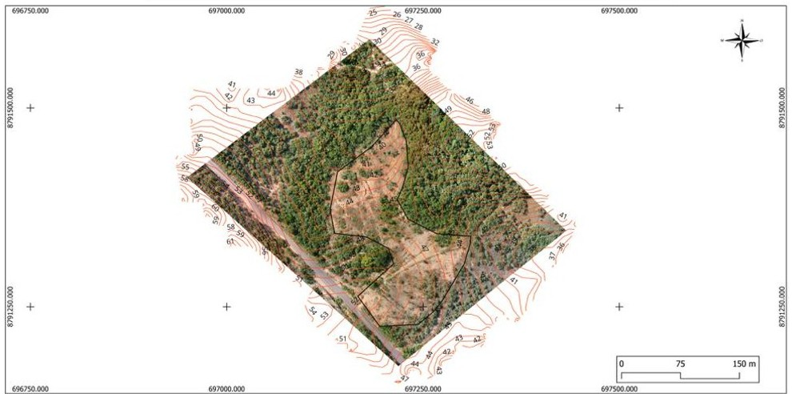
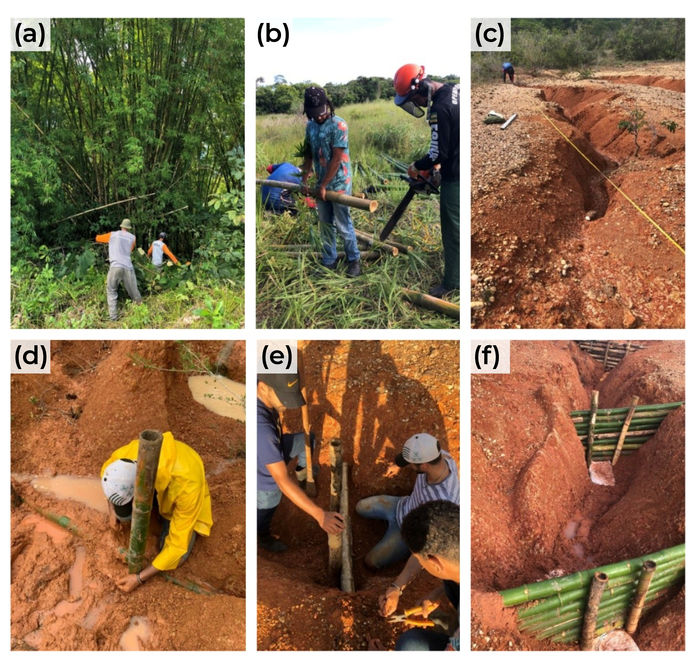
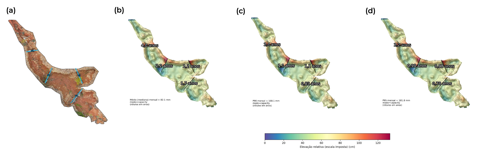

# Paliçadas para Controle de Ravinas {#sec-palicadas}

## Conceito

As paliçadas são barreiras transversais permeáveis instaladas no interior de ravinas para reduzir a velocidade do escoamento, reter sedimentos e criar condições favoráveis ao estabelecimento vegetal. Trata-se da técnica mais simples e econômica de bioengenharia para controle de erosão concentrada, sendo frequentemente o primeiro recurso empregado em projetos de estabilização de ravinas em regiões tropicais.

O princípio de funcionamento é direto: ao interpor um obstáculo permeável no caminho do escoamento concentrado, a velocidade da água é reduzida imediatamente a montante da estrutura, o que diminui a tensão cisalhante e, consequentemente, a capacidade de transporte de sedimentos. As partículas em suspensão depositam-se progressivamente a montante da paliçada, gerando um assoreamento controlado que, ao longo de meses, cria patamares de sedimento que suavizam a declividade do fundo da ravina. Sobre esses patamares, a vegetação se estabelece espontaneamente (ou por plantio), completando a estabilização. A @fig-palicada-campo ilustra uma paliçada instalada em campo, onde é possível observar a estrutura transversal de bambu entrelaçado e a ancoragem nas paredes laterais da ravina.

{#fig-palicada-campo fig-alt="Paliçada instalada em ravina" width="80%"}

## Materiais

A escolha do material para a paliçada depende da disponibilidade local, do custo e da durabilidade necessária. Em regiões tropicais, três materiais predominam.

### Bambu

O bambu (*Bambusa* spp., *Dendrocalamus* spp.) é o material mais utilizado em regiões tropicais por combinar alta resistência à tração (100–400 MPa, comparável a aço de construção), disponibilidade abundante em propriedades rurais, baixo custo de aquisição, facilidade de corte, transporte e montagem em campo (sem necessidade de ferramentas especializadas) e durabilidade de 2–5 anos quando tratado com preservativos naturais (imersão em solução de sulfato de cobre ou tratamento por oclusão com bórax e ácido bórico). O bambu sem tratamento degrada-se em 6–12 meses em ambiente tropical úmido, período que pode ser suficiente para o estabelecimento vegetal em ravinas de pequeno porte.

### Madeira Roliça

Troncos de eucalipto, pinus ou espécies nativas de rápido crescimento (como leucena ou gliricídia) oferecem maior resistência mecânica e durabilidade (3–8 anos sem tratamento, 10–15 anos com tratamento autoclave). São indicados para ravinas de médio a grande porte onde a pressão hidrostática exige maior robustez estrutural, mas seu custo e peso são superiores ao bambu.

### Pedra Seca

Em regiões com disponibilidade de pedras (encostas serranas, leitos pedregosos de rios intermitentes), as paliçadas podem ser construídas com pedras empilhadas sem argamassa, combinando função de filtro (a permeabilidade entre as pedras permite a passagem da água enquanto retém sedimentos grossos), alta durabilidade (décadas), resistência a incêndios e nenhuma necessidade de manutenção. A desvantagem é o peso e a dificuldade de transporte em terrenos íngremes.

## Dimensionamento

O dimensionamento de paliçadas envolve três cálculos fundamentais que determinam o espaçamento entre estruturas, a altura máxima e a capacidade de retenção de sedimentos.

### Espaçamento entre Paliçadas

O espaçamento ($E$) entre paliçadas consecutivas deve garantir que a crista da paliçada a jusante esteja no mesmo nível que a base da paliçada a montante, criando uma sequência de patamares que, quando assoreados, eliminam o gradiente longitudinal original da ravina:

$$
E = \frac{H}{S_f}
$$

onde $H$ é a altura efetiva da paliçada (porção acima do nível do fundo da ravina, em metros) e $S_f$ é a declividade do fundo da ravina (em m/m, não em percentual). Por exemplo, para uma paliçada de 0,50 m de altura efetiva em uma ravina com declividade de 10% (0,10 m/m), o espaçamento será de 5,0 m.

### Altura Efetiva

A altura efetiva da paliçada não deve exceder um terço da profundidade da ravina na seção de instalação, garantindo que o escoamento possa transbordar pela crista sem gerar erosão lateral:

$$
H_{max} = \frac{D}{3}
$$

onde $D$ é a profundidade da ravina (m). Paliçadas mais altas que $D/3$ geram represamento excessivo, com risco de erosão por contorno (a água contorna a estrutura pelas laterais, escavando as paredes da ravina) ou de ruptura por sobrecarga hidrostática.

### Capacidade de Retenção

O volume de sedimento retido por uma paliçada pode ser estimado pela geometria do prisma trapezoidal que se forma a montante da estrutura:

$$
V_r = \frac{E \cdot W \cdot H}{2}
$$

onde $W$ é a largura da ravina na posição da paliçada. Esse volume permite estimar o tempo de preenchimento e, consequentemente, a necessidade de manutenção ou substituição.

## Construção

O processo de construção de uma paliçada de bambu é relativamente simples e pode ser executado por equipes de 2–4 trabalhadores com ferramentas manuais (enxada, facão, marreta). A @fig-instalacao ilustra as etapas de instalação em sequência.

{#fig-instalacao fig-alt="Instalação de paliçadas" width="85%"}

### Passo a Passo

Conforme mostrado na @fig-instalacao, o procedimento inicia com a escavação de uma vala transversal perpendicular ao eixo da ravina, com profundidade igual à altura efetiva $H$ (ou seja, metade da paliçada ficará enterrada, garantindo ancoragem contra tombamento e percolação por baixo). Em seguida, realiza-se o cravamento de estacas verticais de bambu ou madeira a cada 30–50 cm ao longo da vala, com cada estaca penetrando ao menos 30 cm abaixo do fundo da vala. O entrelaçamento de varas horizontais entre as estacas é feito alternando os lados (frente e trás), de forma análoga à tecelagem, criando uma estrutura flexível mas resistente. Após o entrelaçamento, compacta-se terra contra a face montante da paliçada para vedar a base e evitar percolação concentrada. As laterais são ancoradas nas paredes da ravina por pelo menos 50 cm de cada lado, com as varas horizontais embutidas em entalhes escavados nas paredes. Por fim, semeiam-se gramíneas a montante da paliçada para acelerar a cobertura vegetal sobre os sedimentos que serão depositados.

::: {.callout-important}
## Ponto crítico
As paliçadas devem ser ancoradas nas paredes laterais da ravina por pelo menos 50 cm de cada lado. A principal causa de falha em paliçadas é a erosão lateral por contorno da estrutura, que ocorre quando a água encontra caminho mais fácil pelas laterais do que pelo corpo permeável da paliçada. A ancoragem insuficiente é um erro de projeto que compromete toda a intervenção.
:::

## Eficiência

Os dados de eficiência das paliçadas são essenciais para justificar tecnicamente a escolha dessa técnica em detrimento de alternativas mais caras. A @fig-simulacao apresenta a evolução temporal da retenção de sedimentos em uma sequência de paliçadas, demonstrando como o assoreamento progressivo cria patamares que estabilizam o perfil longitudinal da ravina.

{#fig-simulacao fig-alt="Simulação de retenção de sedimentos" width="85%"}

Conforme observado na @fig-simulacao, o processo de estabilização é progressivo. Estudos em Plintossolo degradado nos Tabuleiros Costeiros de Sergipe demonstraram resultados quantitativos expressivos: retenção de 76 cm de sedimento em 12 meses (paliçada de 1,0 m de altura), redução de 85% na velocidade do escoamento no interior da ravina e colonização vegetal espontânea a montante das paliçadas após 6 meses. A projeção de preenchimento total do espaço entre paliçadas consecutivas estima-se entre 3 e 5 anos, período no qual a vegetação assume progressivamente a função de estabilização, realizando a transição funcional discutida no @sec-introducao.

## Custos Comparativos

A viabilidade econômica das paliçadas de bambu em relação às alternativas convencionais (check-dams de alvenaria ou concreto) é uma das principais vantagens da técnica, conforme demonstrado na @tbl-custos-palicada.

| Item | Paliçada de bambu | Check-dam de alvenaria |
|------|------------------|----------------------|
| Material | R$ 15–30/m² | R$ 150–300/m² |
| Mão de obra | R$ 20–40/m² | R$ 80–150/m² |
| Total | R$ 35–70/m² | R$ 230–450/m² |
| Vida útil | 3–5 anos | 20+ anos |
| Manutenção | Anual | Quinquenal |

: Comparativo de custos entre paliçadas de bambu e check-dams de alvenaria. {#tbl-custos-palicada .striped .hover}

::: {.callout-tip}
## Vantagem econômica
O custo das paliçadas de bambu é 5 a 7× menor que check-dams de alvenaria. Mesmo considerando a reposição a cada 5 anos (três ciclos em 15 anos), o custo acumulado das paliçadas permanece inferior ao da solução convencional. Adicionalmente, as paliçadas podem ser construídas com mão de obra local não especializada, o que gera renda na comunidade e reduz custos logísticos de transporte de materiais pesados (cimento, areia, brita).
:::
