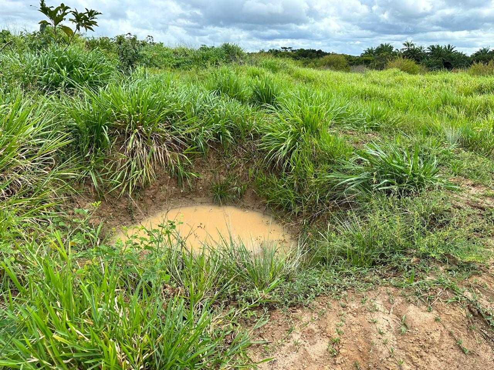
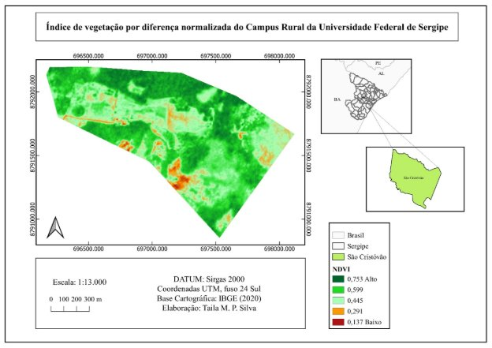
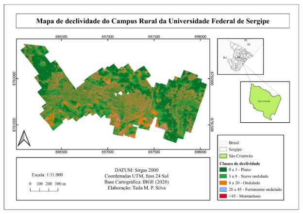

# Bacias de Captação e Barraginhas {#sec-bacias-captacao}

## Conceito

{#fig-barraginha fig-alt="Barraginha em estrada rural" width="80%"}

As **bacias de captação** (ou **barraginhas**) são estruturas de retenção de enxurrada escavadas ao longo de estradas rurais ou em encostas, com o objetivo de interceptar, reter e infiltrar o escoamento superficial antes que ele cause erosão a jusante.

## Funções

::: {layout-ncol=2}
{#fig-barraginha2 fig-alt="Barraginha após chuva"}

{#fig-mapa-decliv fig-alt="Mapa de declividade"}
:::

As bacias de captação desempenham quatro funções principais. A retenção de sedimentos opera com eficiência de 50–80%, enquanto a recarga de aquíferos promove infiltração de 20–60 m³ por evento. Além disso, o amortecimento do pico de cheia pode atingir 40%, e a proteção de estradas rurais evita a formação de ravinas laterais.

## Dimensionamento

### Método EUPS + VIB

O volume da bacia deve ser suficiente para conter o escoamento gerado por uma chuva de projeto:

$$
V_{bacia} = A_c \cdot P \cdot C \cdot (1 - VIB/P)
$$

onde:

- $A_c$ = área de contribuição (m²)
- $P$ = precipitação de projeto (m)
- $C$ = coeficiente de escoamento
- $VIB$ = velocidade de infiltração básica do solo (m/h)

### Área de Contribuição

Para estradas rurais, a área de contribuição é calculada como:

$$
A_c = L \cdot (W_{estrada} + W_{talude})
$$

onde $L$ é o comprimento da estrada que drena para a bacia.

### Dimensões Típicas

| Parâmetro | Valor típico |
|-----------|-------------|
| Profundidade | 0,8–1,5 m |
| Diâmetro superior | 3–6 m |
| Volume | 5–30 m³ |
| Espaçamento | 30–80 m |
| Declividade lateral | 1:1 a 1:1,5 |

: Dimensões típicas de bacias de captação para estradas rurais. {#tbl-dimensoes-bacia .striped}

## Espaçamento

O espaçamento entre bacias consecutivas deve garantir que cada uma receba um volume compatível com sua capacidade:

$$
E_{bacias} = \frac{V_{bacia}}{W_{estrada} \cdot P \cdot C}
$$

Em terrenos com declividade $> 8\%$, o espaçamento deve ser reduzido em 30–50%.

## Vida Útil e Manutenção

A vida útil projetada das bacias situa-se entre 10 e 20 anos. A manutenção principal consiste na limpeza de sedimentos a cada 2–5 anos, sendo que o sinal de esgotamento é o assoreamento superior a 70% da capacidade.

::: {.callout-warning}
## Atenção
Em solos com VIB muito baixa (< 5 mm/h), as bacias podem transbordar com frequência. Nesse caso, dimensionar com chuva de menor período de retorno ou prever sangradouro lateral vegetado.
:::

## Custos

Os custos de implantação variam entre R$ 200 e R$ 500 por bacia para escavação mecanizada (retroescavadeira) e entre R$ 400 e R$ 800 por bacia para escavação manual (2–3 dias de trabalho), resultando em custo por hectare protegido de R$ 500 a R$ 1.500.

A relação **custo-benefício** é extremamente favorável: cada real investido em barraginhas evita R$ 5–12 em custos de manutenção de estradas rurais.
