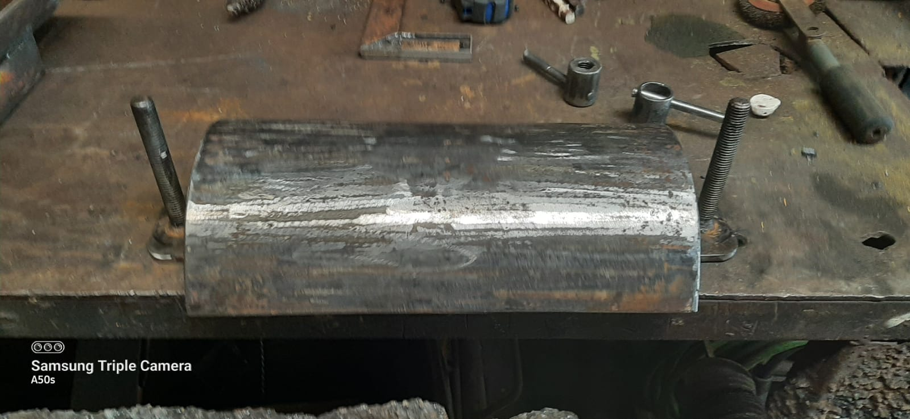
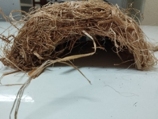

# Feixes Vivos e Drenos Verdes {#sec-feixes-drenos}

## Feixes Vivos (*Fascines*)

### Conceito de Feixes Vivos

Os feixes vivos (*fascines* ou *wattle fences*) são amarrados de ramos vivos e flexíveis, dispostos em valas rasas ao longo de curvas de nível para interceptar o escoamento superficial laminar e promover simultaneamente a infiltração e a retenção de sedimentos. O princípio de funcionamento é análogo ao das paliçadas (ver @sec-palicadas), porém os feixes atuam contra o escoamento difuso em encostas (não concentrado em ravinas), funcionando como barreiras lineares de baixa altura (15–30 cm) que fragmentam a lâmina d'água, reduzem a velocidade superficial e criam uma zona de deposição a montante onde sedimentos finos se acumulam e a vegetação se restabelece.

A grande vantagem dos feixes em relação a cordões de pedra ou leiras de terra é que, sendo compostos por ramos vivos, enraízam e brotam após a instalação, transformando-se progressivamente em sebes vivas que mantêm e até ampliam sua função de barreira ao longo do tempo, sem necessidade de reposição. Essa transição de estrutura morta para estrutura viva é o mecanismo central que confere sustentabilidade à técnica. A @fig-feixes-campo mostra feixes vivos recém-instalados em campo, onde se observam os amarrados de ramos posicionados em valas rasas e fixados com estacas verticais.

{#fig-feixes-campo fig-alt="Feixes vivos instalados em campo" width="80%"}

A @fig-feixe-diagrama apresenta o diagrama em corte transversal do feixe instalado na vala, detalhando as proporções entre profundidade de enterramento, diâmetro do feixe e altura exposta acima da superfície. Já a @fig-estacas mostra em detalhe o material vegetativo utilizado como estacas de fixação, evidenciando os pontos de brotação que garantem o enraizamento futuro da estrutura.

::: {layout-ncol=2}
{#fig-feixe-diagrama fig-alt="Diagrama de feixe vivo"}

{#fig-estacas fig-alt="Estacas vivas para feixes"}
:::

### Materiais

A seleção de espécies vegetais para composição dos feixes deve priorizar ramos com elevada capacidade de brotação vegetativa (capacidade de emitir raízes e brotos a partir de estacas sem tratamento hormonal), flexibilidade suficiente para ser curvados e amarrados sem quebrar, e resistência mecânica mínima para suportar o impacto do escoamento durante os primeiros meses antes do enraizamento. Os materiais mais utilizados no Brasil são ramos de sabiá (*Mimosa caesalpiniifolia*) na Caatinga, espécie de alta durabilidade natural (2–3 anos sem tratamento) e excelente brotação; ramos de gliricídia (*Gliricidia sepium*) em regiões pantropicais, que enraíza facilmente e fixa nitrogênio, enriquecendo o solo adjacente; ramos de salgueiro (*Salix* spp.) em zonas temperadas e subtropicais, escolha tradicional na bioengenharia europeia, com taxa de brotação superior a 90%; e bambu verde, de disponibilidade praticamente universal, muito flexível e de fácil obtenção, embora com menor capacidade de brotação que as demais espécies.

### Dimensionamento

O dimensionamento dos feixes envolve cinco parâmetros interconectados. O diâmetro do feixe deve situar-se entre 15 e 30 cm, sendo que feixes mais espessos (25–30 cm) são indicados para encostas com declividade superior a 15%, onde a energia do escoamento é maior. O comprimento de cada segmento deve ser de 2 a 4 m (amarrados com arame galvanizado n.º 18 ou fibra de sisal a cada 50 cm), permitindo manuseio e transporte por dois trabalhadores. A profundidade da vala corresponde a metade do diâmetro do feixe (por exemplo, 10 cm para um feixe de 20 cm de diâmetro), de modo que a metade inferior fique enterrada (garantindo contato com o solo úmido para brotação) e a metade superior fique exposta (interceptando o escoamento). O espaçamento entre feixes segue as curvas de nível, a cada 5–10 m de desnível vertical, com espaçamentos menores em declividades acentuadas ou em solos de alta erodibilidade. As estacas de fixação devem ser de material vivo (gliricídia, sabiá ou salgueiro), com 50 cm de comprimento e diâmetro de 3–5 cm, cravadas a cada 1,0–1,5 m ao longo do feixe e penetrando pelo menos 30 cm abaixo do fundo da vala.

### Instalação

O procedimento de instalação é executado em quatro etapas sequenciais. Primeiro, traça-se a curva de nível no terreno com auxílio de nível de mangueira ou clinômetro, marcando a posição da vala. Em seguida, escava-se a vala rasa ao longo da curva de nível, com largura igual ao diâmetro do feixe e profundidade equivalente à metade desse diâmetro. O feixe é então posicionado na vala, com os ramos orientados transversalmente à direção do escoamento, e fixado com estacas vivas cravadas através do feixe e no solo abaixo. Por fim, compacta-se terra contra o feixe no lado montante, assegurando vedação da base e criando uma pequena "barreira de solo" que impede a percolação por baixo nos primeiros eventos chuvosos, antes que o enraizamento consolide a estrutura.

::: {.callout-note}
## Taxa de sobrevivência
Estudos em encostas de Plintossolo no Nordeste brasileiro demonstraram taxas de brotação de 70–95% dos feixes de sabiá após 90 dias da instalação quando a implantação ocorreu no início da estação chuvosa, com redução para 30–40% quando implantados na estação seca. O posicionamento temporal da instalação é, portanto, tão crítico quanto o dimensionamento físico.
:::

## Drenos Verdes

### Conceito de Drenos Verdes

Os drenos verdes (*vegetated drains* ou *bioswales*) são canais de drenagem superficial ou subsuperficial revegetados, projetados para conduzir o escoamento excedente de forma controlada, reduzindo a velocidade por meio da rugosidade da vegetação e promovendo simultaneamente a infiltração e a filtração de sedimentos ao longo de todo o percurso. Enquanto os feixes vivos atuam contra o escoamento laminar (difuso), os drenos verdes gerenciam o escoamento concentrado nos talvegues (linhas naturais de convergência do fluxo), constituindo elementos complementares dentro de um sistema integrado de manejo de enxurrada.

Diferentemente dos drenos convencionais de concreto, que conduzem a água em alta velocidade sem nenhuma atenuação de pico ou retenção de sedimentos, os drenos verdes transformam o canal de drenagem em um biofiltro linear, onde a vegetação atua como filtro mecânico (interceptação física de partículas pela folhagem e sistema radicular) e como redutor de velocidade (aumento do coeficiente de rugosidade de Manning de 0,013, típico de concreto, para 0,03–0,05 em canais vegetados).

### Tipos

O dreno superficial vegetado consiste em um canal trapezoidal revestido com gramíneas de alta densidade (tipicamente *Paspalum notatum*, *Cynodon* spp. ou *Stenotaphrum secundatum*), funcionando como uma berma vegetada. A velocidade máxima do escoamento deve ser limitada a 0,5–1,0 m/s para evitar erosão do revestimento vegetal. Para canais de maior porte, esta técnica evolui para a canaleta verde, cuja abordagem é desenvolvida em detalhe na @sec-canaleta-verde.

O dreno subsuperficial biodegradável consiste em um tubo ou camada drenante composta por materiais vegetais (feixes de bambu, cascas de coco, fibras de palmeira) enterrados a 30–60 cm de profundidade, envolvidos em geotêxtil biodegradável (ver @sec-biotexteis). Essa configuração cria uma zona preferencial de percolação que drena o excesso de umidade do solo sem necessidade de tubulação plástica, degradando-se naturalmente em 3–5 anos, período no qual a drenagem se estabelece por caminhos preferenciais consolidados no solo.

### Dimensionamento do Dreno Superficial

A capacidade de vazão do dreno é calculada pela equação de Manning, que relaciona a geometria do canal, sua rugosidade e a declividade

$$
Q = \frac{1}{n} \cdot A \cdot R_h^{2/3} \cdot S^{1/2}
$$

onde $n$ é o coeficiente de rugosidade de Manning (0,03–0,05 para canais vegetados com gramíneas curtas a médias, podendo chegar a 0,10 para gramíneas altas e densas), $A$ é a área da seção molhada (m²), $R_h$ é o raio hidráulico (razão entre área molhada e perímetro molhado, em metros) e $S$ é a declividade longitudinal do canal (m/m). O dimensionamento inicia com a estimativa da vazão de projeto (método racional: $Q = C \cdot i \cdot A$) e prossegue com a determinação iterativa da seção transversal que comporta essa vazão com velocidade inferior a 1,0 m/s.

### Vantagens dos Drenos Verdes

A @tbl-drenos sintetiza o comparativo técnico-econômico entre drenos convencionais e drenos verdes, evidenciando as vantagens em termos de infiltração, filtração, custo e integração paisagística.

| Aspecto | Dreno convencional (concreto) | Dreno verde |
|---------|------------------------------|-------------|
| Infiltração | Nula (superfície impermeável) | 30–60% do volume |
| Filtração de sedimentos | Nenhuma | 50–80% |
| Custo de implantação | R$ 200–500/m | R$ 40–100/m |
| Manutenção | Limpeza mecânica (semestral) | Roçada periódica (trimestral) |
| Paisagem | Impacto visual negativo | Integrado ao ambiente |
| Vida útil | 30–50 anos | Indefinida (autorrenovável) |

: Comparativo entre drenos convencionais e drenos verdes. {#tbl-drenos .striped .hover}

::: {.callout-tip}
## Aplicação ideal
Drenos verdes são especialmente eficazes em áreas periurbanas (loteamentos, campi universitários, parques industriais) e estradas rurais, onde a infraestrutura convencional de concreto é cara, pouco sustentável e esteticamente desarmônica. Em projetos de Soluções Baseadas na Natureza (ver @sec-nbs), os drenos verdes são frequentemente combinados com jardins de chuva e tetos verdes para compor sistemas de drenagem urbana sustentável (SUDS).
:::

## Integração Feixes + Drenos

A combinação de feixes vivos ao longo de curvas de nível com drenos verdes nos talvegues cria um sistema integrado de manejo de enxurrada que opera em três escalas funcionais complementares. Na escala de encosta, os feixes interceptam o escoamento laminar difuso, reduzindo sua velocidade e promovendo a deposição de sedimentos finos, de modo que a água que atinge os talvegues já chega com menor carga sólida e menor energia cinética. Na escala dos talvegues, os drenos verdes recebem o escoamento concentrado remanescente e o conduzem de forma controlada até o exutório, infiltrando 30–60% do volume e filtrando 50–80% dos sedimentos restantes. Na escala de bacia, a integração dos dois sistemas reduz a conectividade hidrossedimentológica entre as vertentes e os corpos d'água receptores, diminuindo simultaneamente o pico de vazão (amortecimento) e a carga sólida total exportada.

A complementaridade dos dois sistemas é sinérgica: os feixes protegem os drenos de obstrução por excesso de sedimentos, enquanto os drenos protegem os feixes de sobrecarga por concentração de escoamento, garantindo que cada componente opere dentro de sua faixa de projeto. Esse arranjo integrado é particularmente eficaz em encostas longas (> 100 m de comprimento de rampa) onde nenhuma das duas técnicas, isoladamente, seria suficiente para controlar o escoamento e a erosão de forma satisfatória.
