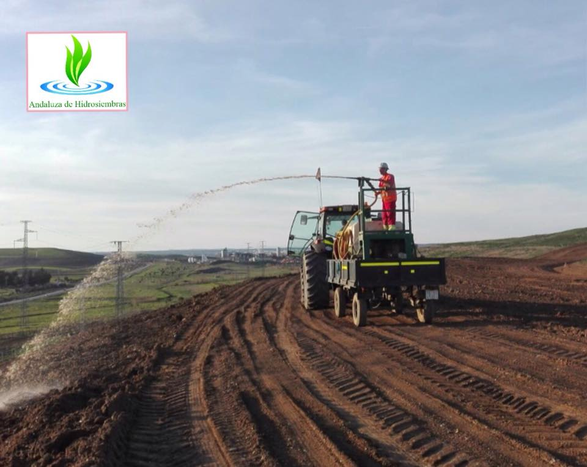
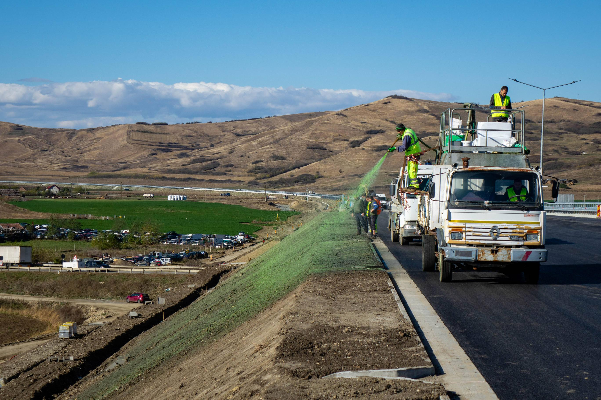

# Hidrossemeadura {#sec-hidrossemeadura}

## Hidrossemeadura

A hidrossemeadura (*hydroseeding* ou *hydraulic mulch seeding*) é a técnica de projeção mecanizada de uma mistura aquosa contendo sementes, mulch (cobertura morta), fertilizante e fixador (*tackifier*) sobre taludes e superfícies erodíveis. O princípio consiste em aplicar, simultaneamente e de forma homogênea, todos os insumos necessários para o estabelecimento vegetal em um único passo operacional, utilizando um equipamento (hidrossemeador) que projeta a pasta sob pressão a distâncias de 30 a 60 m. Essa abordagem elimina a necessidade de acesso direto a superfícies íngremes, o que torna a hidrossemeadura particularmente adequada para taludes rodoviários, barragens, pedreiras, aterros sanitários e áreas de mineração onde o plantio manual seria impraticável ou perigoso.

Em termos de produtividade, a hidrossemeadura é a técnica mais eficiente de revegetação de grandes áreas, alcançando até 5.000 m²/h com equipamentos de grande porte, cifra que se compara aos 50–100 m²/h do plantio manual de mudas e aos 200–500 m²/h da semeadura a lanço. Essa diferença de escala explica por que a hidrossemeadura domina o mercado de revegetação de obras lineares (rodovias, ferrovias, gasodutos, linhas de transmissão) em todo o mundo. A @fig-hidrossemeadura mostra a aplicação da técnica em um talude rodoviário, onde é possível observar o jato de projeção da pasta verde (a coloração distingue-se da superfície do solo, permitindo ao operador controlar visualmente a uniformidade de cobertura).

{#fig-hidrossemeadura fig-alt="Hidrossemeadura sendo aplicada em talude" width="80%"}

O resultado prático da aplicação pode ser observado em duas situações distintas. A @fig-hidro-restauracao mostra a projeção da pasta em uma área degradada em processo de restauração, enquanto a @fig-hidro-rodovia apresenta o resultado após o estabelecimento vegetal, com gramíneas já consolidadas em talude de alta declividade, demonstrando a eficácia da técnica mesmo em superfícies com inclinação superior a 45°.

::: {layout-ncol=2}
{#fig-hidro-restauracao fig-alt="Hidrossemeadura em restauração"}

{#fig-hidro-rodovia fig-alt="Hidrossemeadura em rodovia"}
:::

## Composição da Pasta

A pasta de hidrossemeadura é uma suspensão aquosa cujos componentes desempenham funções complementares e sinérgicas. A formulação é ajustada conforme o tipo de solo, a declividade, o regime climático e os objetivos de revegetação. A @tbl-pasta apresenta a composição típica e a dosagem de cada componente.

| Componente | Função | Dosagem típica |
|------------|--------|---------------|
| Água | Veículo e hidratação inicial das sementes | 2.000–4.000 L/ha |
| Sementes | Estabelecimento de cobertura vegetal | 50–200 kg/ha |
| Mulch | Proteção superficial contra impacto de gotas e dessecação | 1.500–3.000 kg/ha |
| Fertilizante | Nutrição inicial (N–P–K + micronutrientes) | 200–500 kg/ha |
| Fixador (*tackifier*) | Adesão da pasta ao solo e resistência à erosão hídrica | 50–150 kg/ha |
| Corante | Controle visual de uniformidade de aplicação | 5–10 L/ha |

: Composição típica da pasta de hidrossemeadura. {#tbl-pasta .striped .hover}

A água atua como veículo para homogeneizar e projetar os demais componentes, além de fornecer a umidade inicial para ativação da germinação. O mulch é o componente de maior massa, sendo responsável por proteger a superfície contra o impacto cinético das gotas de chuva (*splash erosion*), manter a umidade superficial e criar um microclima favorável à germinação. O fertilizante fornece nutrientes de liberação lenta (formulação 10-10-10 ou 20-05-20) para sustentar o crescimento vegetal nos primeiros 60–90 dias, período em que as raízes ainda não acessam os nutrientes do solo. O fixador é um polímero (natural ou sintético) que aglutina as partículas de mulch e sementes ao solo, impedindo que a pasta seja lavada pela primeira chuva após a aplicação. O corante (verde, à base de clorofila sintética) permite ao operador identificar visualmente as áreas já cobertas, evitando sobreposição ou omissão.

## Tipos de Mulch

A escolha do mulch é uma das decisões mais críticas do projeto de hidrossemeadura, pois determina o nível de proteção superficial, o tempo de degradação e, consequentemente, a janela de vulnerabilidade entre a aplicação e o estabelecimento vegetal efetivo.

### Mulch de Celulose

O mulch de celulose é composto por fibras de papel reciclado ou celulose virgem moída. Apresenta retenção hídrica moderada (retém 6–8× seu peso em água) e degradação rápida (30–60 dias em clima tropical úmido). Seu custo é o mais baixo entre os mulches comerciais (R$ 3–6/kg), o que o torna a escolha padrão para projetos de grande escala em declividades moderadas (< 30°). A principal limitação é a baixa resistência à erosão hídrica: em taludes íngremes, a chuva intensa pode remover o mulch de celulose antes que a germinação esteja consolidada.

### Mulch de Madeira

O mulch de madeira é composto por fibras de madeira processada (eucalipto, pinus), com fibras mais longas e interconectadas que o de celulose. Oferece retenção hídrica elevada (10–12× seu peso), degradação lenta (90–180 dias) e maior resistência à erosão, sendo indicado para taludes com declividade de 30–45° ou em regiões com chuvas intensas. Seu custo (R$ 5–10/kg) é intermediário, equilibrando proteção e economia.

### Mulch Bonded Fiber Matrix (BFM)

O BFM representa a categoria premium de mulch, combinando fibras longas de madeira com aglutinante biodegradável que, ao secar, forma uma manta coesa sobre o solo. Essa manta pode ser suficientemente resistente para substituir biomantas têxteis (ver @sec-biomantas) em taludes de até 45°, com a vantagem de aplicação por projeção (sem necessidade de desenrolar e fixar rolos manualmente). O custo é o mais elevado (R$ 8–15/kg), justificado em projetos onde a logística de instalação de biomantas é inviável (acessos difíceis, grandes extensões de taludes).

## Fixadores (*Tackifiers*)

Os fixadores são o componente que garante a permanência da pasta aplicada sobre a superfície do solo diante das forças erosivas da chuva e do escoamento. A @tbl-fixadores compara os quatro tipos mais utilizados no mercado brasileiro.

| Tipo | Origem | Resistência à chuva | Duração | Custo (R$/kg) |
|------|--------|---------------------|---------|--------------|
| Guar | Vegetal (goma de guar) | Moderada | 30–60 dias | 15–25 |
| Psyllium | Vegetal (*Plantago*) | Alta | 60–90 dias | 25–40 |
| PAM (poliacrilamida) | Sintético | Muito alta | 90–180 dias | 30–50 |
| Amido | Vegetal (milho/mandioca) | Baixa | 15–30 dias | 8–15 |

: Tipos de fixadores e suas propriedades. {#tbl-fixadores .striped .hover}

A escolha do fixador depende do regime pluviométrico local e da declividade do talude. Em regiões com chuvas intensas e frequentes (pluviosidade > 1.500 mm/ano), fixadores sintéticos (PAM) ou de alta resistência (psyllium) são recomendados. Em regiões semiáridas, onde o risco de lavagem é menor, o amido ou guar oferecem boa relação custo-eficácia.

## Dimensionamento

### Taxa de Aplicação

A taxa de aplicação ($T_a$) é a quantidade total de mulch a ser aplicada por unidade de área, ajustada por fatores multiplicadores que expressam as condições do sítio

$$
T_a = T_{base} \cdot F_d \cdot F_s \cdot F_c
$$

onde $T_{base}$ é a taxa base de 3.000 kg/ha (estabelecida para gramíneas em taludes de até 30° em solo argiloso e clima úmido), $F_d$ é o fator de declividade (1,0 para inclinações inferiores a 30°, 1,3 para 30–45° e 1,6 para ângulos superiores a 45°, refletindo o aumento da energia erosiva com o gradiente), $F_s$ é o fator de solo (1,0 para argilosos, que possuem maior coesão, 1,2 para arenosos e 1,4 para siltosos, que são os mais erodíveis) e $F_c$ é o fator climático (1,0 para clima úmido com chuvas distribuídas e 1,3 para semiárido onde a concentração de chuvas intensas em curtos períodos eleva o risco de lavagem).

### Mistura de Sementes

A composição da mistura de sementes deve atender a três funções temporais complementares. A fração de estabelecimento rápido (70% da mistura) compreende gramíneas de germinação acelerada, como *Brachiaria decumbens*, *Brachiaria brizantha* cv. Marandu e *Paspalum notatum*, cujas plântulas emergem em 5–15 dias e proporcionam cobertura mínima de 40% em 30 dias. A fração de fixação biológica de nitrogênio (20%) inclui leguminosas como *Stylosanthes* spp., *Cajanus cajan* (guandu) e *Crotalaria juncea*, que fixam 50–200 kg N/ha/ano via simbiose com rizóbios, reduzindo a dependência de fertilizantes minerais a médio prazo. A fração de persistência (10%) contempla gramíneas perenes de ciclo longo e raízes profundas, que assumem a proteção do solo após a senescência das espécies pioneiras, garantindo cobertura permanente.

## Equipamentos

O hidrossemeador mecânico é o equipamento central da técnica, consistindo em um tanque cilíndrico de aço ou polietileno com capacidade de 2.000 a 8.000 L, equipado com agitador mecânico interno (para manter a pasta homogênea), bomba centrífuga de alta pressão e canhão de projeção direcional. A pressão de trabalho situa-se entre 4 e 8 bar, gerando um jato com alcance de 30 a 60 m dependendo da viscosidade da pasta e da configuração do bico. O rendimento típico é de 3.000–5.000 m²/h para equipamentos montados em caminhão (os mais comuns no Brasil), podendo chegar a 8.000 m²/h em hidrossemeadores de grande porte montados em carretas. Para áreas de difícil acesso (morros, encostas sem estrada), existem hidrossemeadores portáteis montados em trailers leves (500–1.000 L) ou mochilas motorizadas (50–100 L), com rendimento inferior (500–1.000 m²/h) mas grande versatilidade operacional.

A calibração do equipamento antes de cada aplicação é fundamental: o operador deve ajustar a velocidade do agitador para evitar sedimentação das sementes no fundo do tanque, regular a pressão para obter o alcance desejado sem fragmentar as sementes pelo impacto excessivo, e verificar a uniformidade da distribuição por meio de testes em área controlada.

## Monitoramento

O monitoramento pós-aplicação é indispensável para avaliar o sucesso da hidrossemeadura e identificar precocemente eventuais falhas que exijam reaplicação. A @tbl-monitoramento estabelece as metas quantitativas para cada indicador nos primeiros 90 dias.

| Indicador | Meta (30 dias) | Meta (60 dias) | Meta (90 dias) |
|-----------|---------------|----------------|----------------|
| Germinação | > 50% | — | — |
| Cobertura | > 40% | > 70% | > 90% |
| Erosão visível | < 5% da área | < 2% | 0% |

: Metas de monitoramento pós-hidrossemeadura. {#tbl-monitoramento .striped .hover}

Áreas que não atingirem a meta de 40% de cobertura aos 30 dias devem ser avaliadas quanto à causa da falha (drenagem do fixador, predação de sementes, temperatura inadequada, déficit hídrico) e submetidas a reaplicação localizada. A reaplicação total é indicada apenas quando a cobertura for inferior a 20% aos 30 dias, sugerindo falha sistêmica na formulação ou na aplicação.

## Custos

A @tbl-custos-hidro sintetiza os custos médios de hidrossemeadura em comparação com o plantio manual de mudas e a semeadura a lanço, evidenciando a vantagem competitiva da técnica em projetos de grande escala.

| Item | Hidrossemeadura | Plantio manual | Semeadura a lanço |
|------|----------------|----------------|-------------------|
| Insumos | R$ 8.000–15.000/ha | R$ 12.000–25.000/ha | R$ 3.000–6.000/ha |
| Mão de obra | R$ 1.000–3.000/ha | R$ 8.000–15.000/ha | R$ 2.000–4.000/ha |
| Total | R$ 9.000–18.000/ha | R$ 20.000–40.000/ha | R$ 5.000–10.000/ha |
| Produtividade | 3.000–5.000 m²/h | 50–100 m²/h | 200–500 m²/h |
| Aplicabilidade em taludes | Até 70° | Até 30° | Até 15° |

: Comparativo de custos e produtividade entre métodos de revegetação. {#tbl-custos-hidro .striped .hover}

## Limitações e Contraindicações

Apesar de sua versatilidade, a hidrossemeadura não é indicada em todas as situações. Em solos rochosos sem substrato (rocha exposta com < 5 cm de solo), a pasta não adere adequadamente e as raízes não encontram meio para se desenvolver, exigindo prévia aplicação de substrato orgânico ou tela metálica ancorada na rocha. Em taludes com erosão ativa (presença de sulcos ou ravinas), a pasta será removida pelo escoamento concentrado antes da germinação, sendo necessário primeiro estabilizar as feições erosivas com paliçadas (ver @sec-palicadas) ou biomantas (ver @sec-biomantas) e depois aplicar a hidrossemeadura nas áreas entre elas. Em períodos de seca prolongada, a germinação será nula ou insignificante, resultando em perda total dos insumos aplicados, razão pela qual o planejamento temporal da aplicação deve coincidir com o início da estação chuvosa.

::: {.callout-warning}
## Condições de aplicação
A hidrossemeadura não deve ser aplicada com vento superior a 25 km/h (dispersão irregular da pasta), sobre solo saturado (deslizamento da pasta por gravidade antes da adesão), em temperaturas de solo inferiores a 10 °C (inibição da germinação) nem em superfícies com escoamento concentrado ativo. O período ideal de aplicação corresponde ao início da estação chuvosa, quando a umidade do solo é suficiente para sustentar a germinação mas o solo ainda não está saturado.
:::
