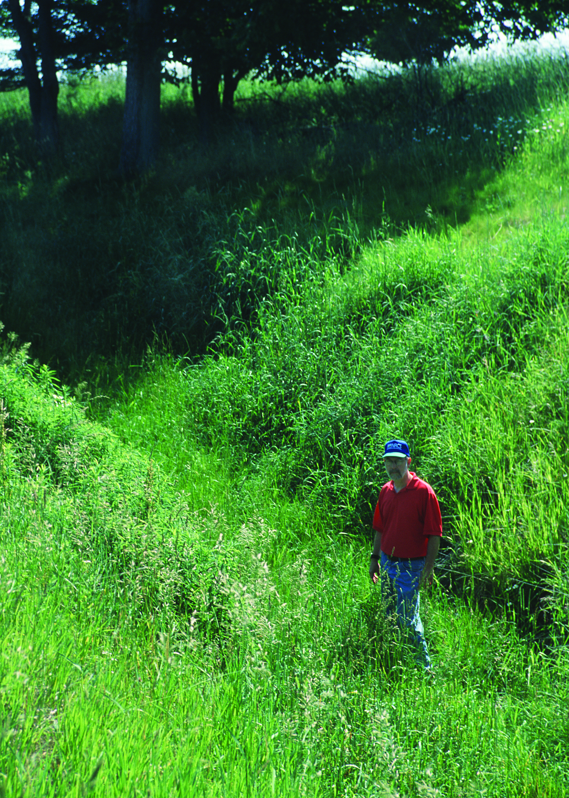
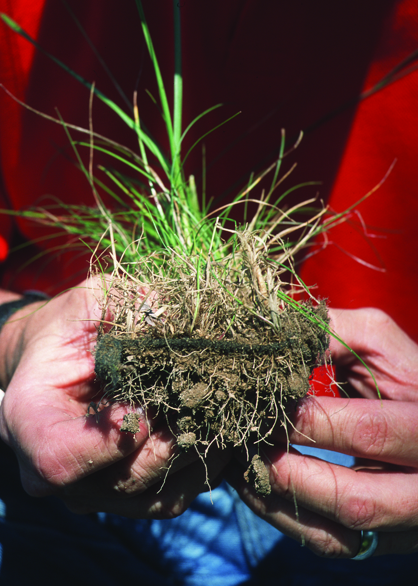

# Biomantas e Geossintéticos Biodegradáveis {#sec-biomantas}

## Conceito

As biomantas são mantas pré-fabricadas de fibras naturais (coco, juta, sisal, palha) mantidas por redes de sustentação biodegradáveis ou fotodegradáveis. Sua função primordial é proporcionar proteção imediata contra a erosão superficial enquanto a vegetação se estabelece, ocupando a janela de vulnerabilidade entre a preparação do terreno e a consolidação da cobertura vegetal (tipicamente 30–90 dias). Sem essa proteção, os primeiros eventos chuvosos após a semeadura podem remover as sementes, o fertilizante e até a camada superficial do solo antes que as raízes tenham se desenvolvido o suficiente para ancorar o substrato.

O mecanismo de proteção é triplo. Primeiro, a biomanta absorve a energia cinética das gotas de chuva (*raindrop impact*), impedindo a desagregação por *splash erosion*, que é o mecanismo erosivo dominante nos primeiros centímetros de solo exposto. Segundo, a rugosidade superficial da manta reduz a velocidade do escoamento laminar, aumentando o coeficiente de Manning de 0,02 (solo nu) para 0,04–0,08, o que diminui a tensão cisalhante sobre a superfície. Terceiro, a retenção hídrica das fibras naturais (especialmente coco e juta) cria um microambiente úmido favorável à germinação, reduzindo a perda de água por evaporação em 30–50% em comparação com solo exposto.

A @fig-biomanta-talude mostra uma biomanta de fibra de coco instalada em um talude, evidenciando a cobertura uniforme da superfície e a fixação com grampos metálicos, enquanto a @fig-biomanta-grama demonstra o estágio seguinte do processo, com a vegetação emergindo através das aberturas da manta, consolidando a proteção biológica que substituirá progressivamente a proteção mecânica da biomanta à medida que esta se biodegrada.

::: {layout-ncol=2}
{#fig-biomanta-talude fig-alt="Biomanta instalada em talude"}

{#fig-biomanta-grama fig-alt="Grama crescendo através de biomanta"}
:::

## Classificação

### Por Material

A escolha do tipo de biomanta depende da durabilidade requerida pelo projeto (que por sua vez depende do tempo necessário para a vegetação se consolidar), do regime pluviométrico, da declividade do talude e do orçamento disponível. A @tbl-biomantas sintetiza as cinco categorias comerciais mais utilizadas no Brasil.

| Tipo | Fibra principal | Durabilidade | Aplicação preferencial |
|------|----------------|-------------|-----------|
| Biomanta de coco | Coco (*Cocos nucifera*) | 2–4 anos | Taludes rodoviários, margens fluviais |
| Biomanta de juta | Juta (*Corchorus* spp.) | 1–2 anos | Canais, áreas planas com chuva moderada |
| Biomanta de palha | Palha de arroz/trigo | 6–12 meses | Proteção temporária de obras em andamento |
| Biomanta de sisal | Sisal (*Agave sisalana*) | 2–5 anos | Taludes íngremes (> 45°) |
| Biomanta mista | Coco + palha | 1–3 anos | Uso geral (melhor custo-benefício) |

: Tipos de biomantas e suas características. {#tbl-biomantas .striped .hover}

A biomanta de coco é a mais versátil e robusta para condições tropicais brasileiras, combinando alta resistência mecânica das fibras de mesocarpo do coco (1 m de comprimento, Ø 0,1–0,3 mm) com excelente retenção hídrica e degradação lenta (2–4 anos), que coincide com o tempo necessário para a vegetação atingir plena maturidade radicular em solos tropicais.

### Por Função (Norma ABNT NBR 16308)

A norma ABNT NBR 16308 classifica as biomantas em quatro classes funcionais que orientam a especificação técnica em projetos de engenharia. A Classe I destina-se à proteção temporária (até 12 meses), adequada para canteiros de obras ou áreas onde a revegetação é rápida. A Classe II provê proteção de curta duração (12–24 meses), indicada para taludes com declividade moderada (< 30°) em clima úmido. A Classe III oferece proteção de média duração (24–48 meses), recomendada para taludes íngremes ou áreas com revegetação lenta (solos arenosos, clima semiárido). A Classe IV garante proteção de longa duração (> 48 meses), reservada para situações críticas como margens fluviais com erosão ativa ou taludes de barragens.

## Propriedades Mecânicas

A especificação técnica de biomantas exige a comparação de propriedades mecânicas e hidráulicas entre os materiais disponíveis. A @tbl-propriedades apresenta essa comparação para as duas biomantas mais utilizadas (coco e juta) e, como referência, para o geotêxtil sintético de polipropileno que constitui a alternativa convencional.

| Propriedade | Biomanta de coco | Biomanta de juta | Geotêxtil sintético |
|-------------|-----------------|-----------------|---------------------|
| Massa por área | 400–900 g/m² | 300–600 g/m² | 100–400 g/m² |
| Resistência à tração | 2–8 kN/m | 1–4 kN/m | 5–50 kN/m |
| Retenção hídrica | Alta (8–10× peso seco) | Moderada (5–7× peso seco) | Baixa (< 2× peso seco) |
| Permeabilidade | Alta | Alta | Variável (depende da gramatura) |
| Biodegradabilidade | Sim (2–4 anos) | Sim (1–2 anos) | Não (> 100 anos) |

: Propriedades mecânicas comparativas. {#tbl-propriedades .striped .hover}

A diferença mais relevante do ponto de vista da bioengenharia é a retenção hídrica: enquanto o geotêxtil sintético praticamente não retém água (funcionando apenas como filtro), a biomanta de coco absorve 8–10× seu peso em água, criando um reservatório superficial que libera umidade gradualmente para as sementes em germinação, efeito particularmente valioso em regiões com períodos secos intermitentes.

## Instalação

A instalação correta da biomanta é tão importante quanto a escolha do material. Falhas de instalação (especialmente bolsões de ar e ancoragem insuficiente) são responsáveis por mais de 60% dos casos de insucesso relatados na literatura técnica.

### Preparação do Terreno

A superfície do talude deve ser previamente regularizada, removendo-se torrões, pedras soltas e saliências que impediriam o contato íntimo entre a manta e o solo. Após a regularização, aplicam-se fertilizante (NPK 10-10-10 a 200–400 kg/ha) e sementes (conforme mistura definida no projeto de revegetação, ver @sec-hidrossemeadura) diretamente sobre o solo antes da instalação da biomanta, de modo que a manta funcione como cobertura protetora das sementes já distribuídas. Em seguida, escava-se a trincheira de ancoragem no topo do talude, com dimensões mínimas de 15×15 cm, onde a borda superior da biomanta será enterrada.

### Fixação

A biomanta é ancorada na trincheira superior com grampos em U (mínimo 3 grampos por metro linear de trincheira) e desenrolada de cima para baixo ao longo do talude, em sentido perpendicular às curvas de nível. A fixação ao solo é feita com grampos metálicos distribuídos a cada 0,5–1,0 m em padrão alternado (trebolillo), garantindo que a manta permaneça em contato direto com o solo mesmo sob a ação do vento e do escoamento. A sobreposição entre faixas adjacentes deve ser de pelo menos 10 cm (15 cm em taludes > 45°), com a faixa superior sobrepondo a inferior (como telhas), evitando que o escoamento penetre sob a manta na junta. O procedimento finaliza com a ancoragem da borda inferior da biomanta em uma segunda trincheira na base do talude.

### Grampeamento

Os grampos são o elemento de fixação que garante a aderência da biomanta ao solo sob as forças de arraste do escoamento e do vento. Utilizam-se grampos em U de aço CA-25 (Ø 5 mm, comprimento 20–30 cm), cravados no solo com martelo ou marreta. A densidade de grampeamento é de 2–4 grampos/m² em taludes inferiores a 45° e de 4–8 grampos/m² em taludes superiores a 45°, valores que devem ser aumentados em 50% nas zonas de maior concentração de escoamento (concavidades, confluências de micro-talvegues) e nas bordas laterais da biomanta.

::: {.callout-important}
## Ponto crítico
O contato íntimo entre a biomanta e o solo é essencial para o sucesso da técnica. Bolsões de ar sob a manta criam caminhos preferenciais de escoamento que concentram o fluxo (fenômeno análogo ao *piping*), gerando erosão subsuperficial localizada que pode destruir toda a instalação em um único evento chuvoso intenso. A principal medida preventiva é a regularização cuidadosa da superfície antes da instalação e o grampeamento em densidade adequada, particularmente nas concavidades do terreno.
:::

## Vantagens sobre Geossintéticos Convencionais

As biomantas oferecem cinco vantagens técnicas e ambientais em relação aos geossintéticos sintéticos (polipropileno, poliéster). A biodegradabilidade garante que não haverá resíduos plásticos permanentes no solo após o cumprimento da função de proteção, evitando a contaminação por microplásticos que ocorre com a fragmentação de geotêxteis sintéticos. A incorporação de matéria orgânica ao solo durante a degradação (1–4 t C/ha) melhora a estrutura, a retenção hídrica e a atividade biológica do substrato. A retenção hídrica das fibras naturais é 3–5× superior à dos sintéticos, favorecendo a germinação em períodos secos. A rugosidade superficial elevada das fibras de coco e juta reduz a velocidade do escoamento em 40–60% em comparação com geotêxteis de polipropileno de superfície lisa. O custo é tipicamente 30–50% inferior ao dos geossintéticos de polipropileno de gramatura equivalente.

## Custos

A @tbl-custos-biomanta apresenta a composição de custos por metro quadrado para a biomanta de coco (700 g/m²), que é a especificação mais comum em projetos de bioengenharia no Brasil.

| Item | Valor (R$/m²) |
|------|--------------|
| Biomanta de coco (700 g/m²) | 8–15 |
| Grampos (4/m²) | 2–4 |
| Mão de obra de instalação | 5–10 |
| Sementes + fertilizante pré-instalação | 3–6 |
| Total | 18–35 |

: Custo médio de implantação de biomanta de coco. {#tbl-custos-biomanta .striped .hover}

O custo total de R$ 18–35/m² compara-se aos R$ 9–18/ha da hidrossemeadura simples (ver @sec-hidrossemeadura) e aos R$ 40–80/m² dos geotêxteis sintéticos com grampeamento. A biomanta é, portanto, a solução intermediária em custo e proteção, indicada quando a hidrossemeadura sozinha é insuficiente (taludes > 30° ou solos muito erodíveis) mas o geotêxtil sintético é dispensável (ausência de cargas estruturais permanentes).
