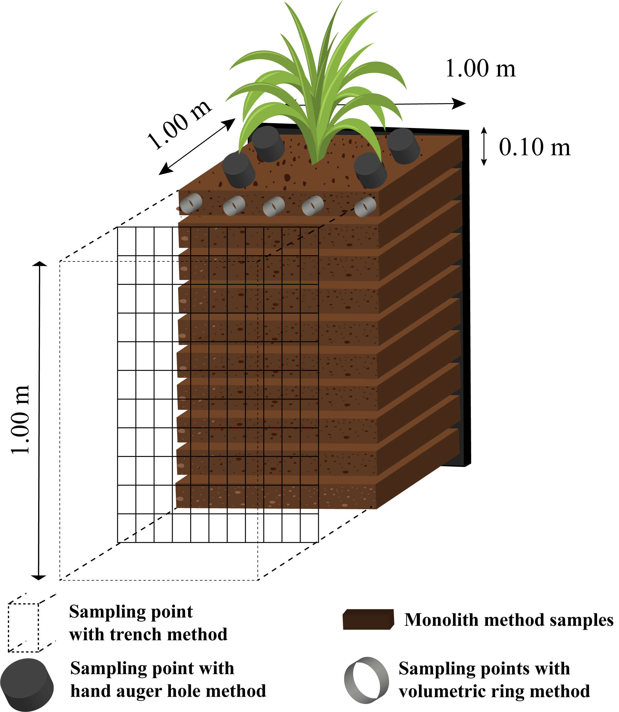

# Cordões Vegetativos e Fascinas {#sec-cordoes-fascinas}

## Cordões Vegetativos

### Conceito

Os **cordões vegetativos** são faixas de vegetação densa (1–3 m de largura) dispostas ao longo de curvas de nível em encostas, formando barreiras biológicas contínuas ao escoamento superficial laminar. Diferentemente dos feixes vivos (ver @sec-feixes-drenos), que são estruturas construídas com ramos amarrados em valas, os cordões vegetativos são faixas **plantadas** de espécies perenes que, após o estabelecimento, formam uma barreira viva permanente, autossustentável e de manutenção mínima.

O mecanismo de funcionamento opera em duas escalas. Em escala superficial, a vegetação densa reduz a velocidade do escoamento laminar por aumento da rugosidade hidráulica, promovendo a deposição dos sedimentos transportados a montante do cordão. Ao longo dos anos, essa deposição acumula uma camada de solo que eleva progressivamente o nível do terreno a montante, criando **terraços naturais** (fenômeno denominado *sediment wedge*) que suavizam a declividade original da encosta. Em escala subsuperficial, o sistema radicular profundo e denso das espécies utilizadas (particularmente o vetiver, com raízes de até 4 m) aumenta a coesão do solo e a resistência ao cisalhamento, reduzindo a suscetibilidade a deslizamentos rasos. A @fig-cordao mostra a construção de um cordão vegetativo por entrelaçamento de ramos, evidenciando a técnica de implantação que combina elementos vivos e mortos para obter barreira funcional desde o primeiro dia.

{#fig-cordao fig-alt="Construção de cordão vegetativo" width="80%"}

Técnicas complementares de estabilização biológica são também utilizadas em contextos semelhantes. A @fig-fascina apresenta uma cerca de fascina construída com salgueiro, estrutura biodegradável que estabiliza taludes por entrelaçamento de ramos vivos, enquanto a @fig-barreira mostra uma barreira de salgueiro em estágio avançado, com as estacas já brotando e formando um cordão vegetativo consolidado.

::: {layout-ncol=2}
{#fig-fascina fig-alt="Fascina de salgueiro"}

{#fig-barreira fig-alt="Barreira de salgueiro"}
:::

### Espécies

A seleção da espécie é determinante para o sucesso do cordão vegetativo, devendo-se considerar a profundidade e a densidade do sistema radicular, a capacidade de formar barreira densa e impenetrável pelo fluxo, a tolerância a condições edáficas extremas e a facilidade de propagação. A @fig-vetiver demonstra o sistema radicular excepcionalmente profundo e denso do vetiver em análise de campo, onde se observam raízes que penetram até 4 m de profundidade, conferindo ancoragem e coesão ao maciço de solo.

{#fig-vetiver fig-alt="Análise de raízes de vetiver" width="80%"}

A espécie mais utilizada mundialmente para cordões vegetativos é o **vetiver** (*Vetiveria zizanioides*), que reúne características excepcionais para a bioengenharia: sistema radicular vertical e profundo (até 4 m), com raízes individuais de resistência à tração de 40–120 MPa (comparável à de aços estruturais de baixa resistência); formação de barreira densa e impenetrável pelo fluxo a partir de 4–6 meses após o plantio; e extrema tolerância a condições adversas, suportando pH de 3 a 11, seca prolongada, encharcamento temporário, salinidade e metais pesados.

Outras opções tropicais incluem o **capim-elefante** (*Pennisetum purpureum*), que produz biomassa abundante e pode ser utilizado como forrageira; a **cana-de-açúcar** em curvas de nível, tradicional em áreas de produção familiar; e a **citronela** (*Cymbopogon nardus*), que adiciona a propriedade repelente de insetos.

### Dimensionamento

O dimensionamento de cordões vegetativos envolve dois parâmetros principais. O **espaçamento vertical** entre cordões deve ser de 1–2 m de desnível, com intervalos menores (1 m) em solos de alta erodibilidade e maiores (2 m) em solos mais estáveis. A **largura da faixa** plantada deve ser de 1–3 m, sendo que faixas mais largas oferecem maior capacidade de filtração e retenção, porém ocupam mais área produtiva. O espaçamento horizontal resultante entre cordões na encosta é determinado pela relação $E_h = \frac{\Delta h}{S}$, onde $\Delta h$ é o desnível vertical permitido entre cordões e $S$ é a declividade local (m/m).

### Eficiência

Estudos em condições tropicais demonstram que cordões de vetiver produzem redução de 60–70% na velocidade do escoamento superficial laminar, retenção de 70–90% dos sedimentos grossos (areia e silte grosso) e 40–60% dos sedimentos finos, e formação progressiva de terraços naturais a montante (acúmulo de 5–15 cm de solo/ano nos primeiros 3–5 anos). A eficiência aumenta cumulativamente ao longo do tempo, pois os terraços formados reduzem a declividade efetiva entre cordões.

## Fascinas

### Conceito

As **fascinas** (*fascines*) são cilindros de ramos vivos ou mortos rigidamente amarrados, instalados em valas ao longo de curvas de nível ou na base de taludes. Diferem dos feixes vivos descritos na @sec-feixes-drenos pela geometria (cilindros compactos), pela aplicação preferencial (base de taludes e margens) e pela maior robustez mecânica.

### Tipos

A **fascina viva** é construída com ramos de espécies com capacidade de rebrota vegetativa (salgueiro, gliricídia, sabiá). Após o enraizamento (30–90 dias em condições favoráveis), transforma-se em uma sebe densa e permanente, tornando-se um cordão vegetativo consolidado.

A **fascina inerte** é construída com ramos secos ou fibras vegetais sem capacidade de rebrota, desempenhando função exclusivamente mecânica com durabilidade de 1–3 anos, período suficiente para o estabelecimento de vegetação adjacente.

### Dimensionamento

Os parâmetros de dimensionamento diferem em função da capacidade de brotação e da necessidade de ancoragem mecânica, conforme sintetizado na @tbl-fascinas.

| Parâmetro | Fascina viva | Fascina inerte |
|-----------|-------------|----------------|
| Diâmetro | 15–30 cm | 20–40 cm (maior, para compensar degradação) |
| Comprimento | 2–4 m | 2–4 m |
| Profundidade de enterrio | 1/2 do diâmetro | 2/3 do diâmetro (maior ancoragem) |
| Fixação | Estacas vivas a cada 1,0 m | Estacas de madeira a cada 0,8 m |
| Durabilidade funcional | Permanente (após brotação) | 1–3 anos |

: Dimensionamento de fascinas vivas e inertes. {#tbl-fascinas .striped .hover}

### Instalação

A instalação inicia com a escavação de vala com profundidade igual a metade do diâmetro da fascina (viva) ou dois terços (inerte), seguindo rigorosamente a curva de nível traçada com nível de mangueira ou clinômetro. O cilindro é posicionado na vala e fixado com estacas alternadas entre as faces montante e jusante, criando travamento contra rolamento. Terra é compactada no lado montante e a face é coberta com solo vegetal misturado a sementes de gramíneas.

### Aplicações

As fascinas são versáteis, prestando-se à estabilização de bases de taludes (na interface solo-ar), à proteção de margens (submersas na cota de nível d'água), ao controle de ravinas (como micro-barragens transversais, função análoga às paliçadas da @sec-palicadas) e à construção de terraços biodegradáveis em substituição aos terraços de terra.

::: {.callout-tip}
## Combinação com outras técnicas
Fascinas vivas + biomantas (ver @sec-biomantas) + hidrossemeadura (ver @sec-hidrossemeadura) formam um sistema triplamente redundante com proteção em três escalas temporais: proteção imediata pela biomanta (dia 1–180), proteção de médio prazo pela fascina viva enraizando e brotando (mês 3–24), e proteção permanente pela vegetação herbácea e arbustiva consolidada (ano 1 em diante).
:::
