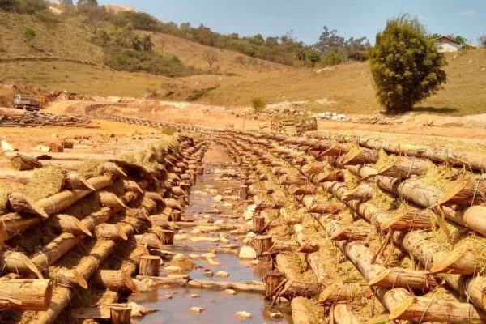
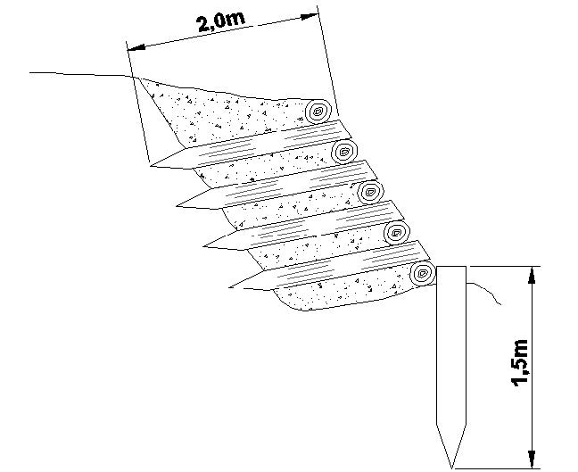
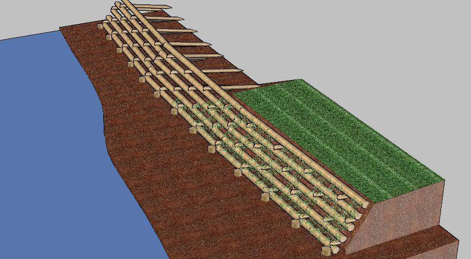

# Parede Krainer {#sec-parede-krainer}

## Conceito

{#fig-krainer fig-alt="Parede Krainer instalada" width="80%"}

A **parede Krainer** (*Krainer wall* ou *crib wall*) é uma estrutura de contenção em grelha de troncos de madeira preenchida com solo e vegetação. Originária dos Alpes austríacos, foi adaptada para uso em regiões tropicais utilizando madeiras locais.

## Tipologia

::: {layout-ncol=2}
{#fig-krainer2 fig-alt="Parede Krainer dupla"}

{#fig-krainer-corte fig-alt="Corte transversal da parede Krainer"}
:::

### Parede Krainer Simples

Grelha de troncos em uma direção (longitudinal), apoiados em troncos transversais. Altura máxima recomendada: **2,0 m**.

### Parede Krainer Dupla

Grelha de troncos em duas direções (longitudinal + transversal), formando células de contenção. Altura máxima recomendada: **4,0 m**.

## Dimensionamento Estrutural

### Geometria

A base ($B$) da parede deve ser igual ou superior a $0{,}5 \cdot H$ (mínimo de 1,0 m), com altura máxima ($H$) de 4,0 m para paredes duplas. A inclinação frontal situa-se entre 10 e 15° em relação à vertical, utilizando troncos com diâmetro de 15–30 cm e espaçamento entre troncos de 30–60 cm.

### Verificação de Estabilidade

As mesmas verificações do gabião vivo:

$$
FS_{tomb} \geq 1{,}5 \quad;\quad FS_{desl} \geq 1{,}5 \quad;\quad FS_{cap} \geq 3{,}0
$$

### Peso Específico da Estrutura

O peso específico aparente da parede preenchida ($\gamma_{ap}$):

$$
\gamma_{ap} = n_{madeira} \cdot \gamma_{madeira} + (1 - n_{madeira}) \cdot \gamma_{solo}
$$

onde $n_{madeira}$ é a fração volumétrica da madeira (tipicamente 15–25%).

## Seleção de Madeiras Tropicais

| Espécie | Densidade (kg/m³) | Durabilidade natural | Disponibilidade |
|---------|-------------------|---------------------|-----------------|
| *Eucalyptus* spp. | 550–800 | 5–15 anos | Alta |
| *Mimosa caesalpiniifolia* (sabiá) | 800–1.000 | 10–20 anos | Média (Nordeste) |
| *Acacia mangium* | 500–650 | 5–10 anos | Média |
| *Bambusa* spp. (bambu) | 400–700 | 3–5 anos (tratado) | Alta |
| *Tectona grandis* (teca) | 550–700 | 20+ anos | Baixa |

: Madeiras tropicais para paredes Krainer. {#tbl-madeiras .striped .hover}

::: {.callout-tip}
## Tratamento preservativo
Madeiras não naturalmente duráveis devem receber tratamento com CCA (Arseniato de Cobre Cromatado) ou CCB (Borato de Cobre Cromatado) em autoclave, aumentando a durabilidade para 15–25 anos.
:::

## Estacas Vivas

A inserção de estacas vivas entre os troncos é o que diferencia a parede Krainer convencional da versão de bioengenharia. Utilizam-se as mesmas espécies empregadas em gabiões vivos e enrocamento vegetado, com diâmetro de 3–8 cm e comprimento suficiente para transpor toda a seção da parede mais 30 cm para cada lado. As estacas são inseridas horizontalmente entre camadas de troncos, em densidade de 3–5 estacas por m² de face.

## Construção

A construção inicia com a escavação da fundação (trincheira de encastramento de 40–60 cm), posicionando-se os troncos longitudinais na base com o espaçamento definido. Os troncos transversais são apoiados perpendicularmente e fixados com pregos ou parafusos. As células formadas são preenchidas com solo vegetal compactado, intercalando-se estacas vivas entre camadas. O procedimento é repetido por empilhamento até a altura de projeto, finalizando com o plantio de gramíneas e arbustos na face e no topo.

::: {layout-ncol=2}
{#fig-krainer-3d fig-alt="Vista 3D da parede Krainer"}

{#fig-krainer-pecas fig-alt="Peças da parede Krainer"}
:::

## Drenagem

A parede Krainer é **autordrenante** graças aos espaços entre troncos. No entanto, em solos com alto teor de finos, recomenda-se a instalação de barbacãs de PVC (Ø 50 mm) a cada 2–3 m² e de uma camada de brita ou geotêxtil na interface solo-parede.

## Aplicações

| Aplicação | Altura típica | Tipo de parede |
|-----------|--------------|----------------|
| Margens de rios | 1,5–3,0 m | Dupla |
| Taludes viários | 1,0–2,5 m | Simples ou dupla |
| Estabilização de encostas | 2,0–4,0 m | Dupla |
| Controle de voçorocas | 1,0–2,0 m | Simples |

: Aplicações típicas da parede Krainer. {#tbl-aplicacoes .striped}
