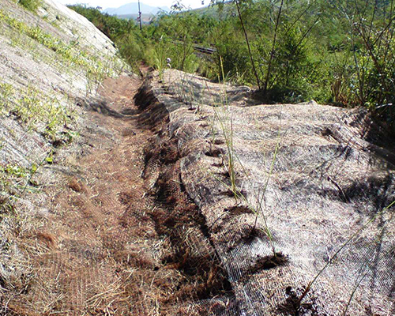
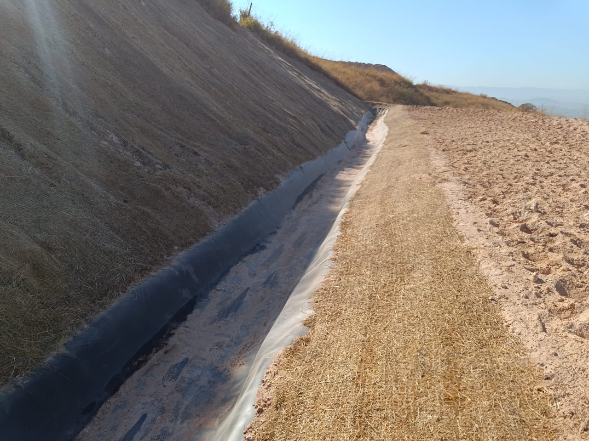

# Canaleta Verde {#sec-canaleta-verde}

## Conceito

A canaleta verde (*vegetated swale* ou *bioswale*) é um canal de drenagem aberto com seção trapezoidal ou parabólica, revestido com vegetação herbácea densa, que funciona simultaneamente como condutor hidráulico e como sistema de tratamento por infiltração e filtração. Diferentemente das canaletas de concreto (estruturas impermeáveis que apenas transportam o escoamento), a canaleta verde intercepta, desacelera e filtra o escoamento superficial, promovendo a remoção de sedimentos, nutrientes e poluentes difusos antes que atinjam os corpos hídricos receptores. A @fig-canaleta ilustra uma canaleta verde com vegetação herbácea plenamente estabelecida, onde a rugosidade da cobertura vegetal reduz a velocidade do escoamento e a superfície permeável permite infiltração ao longo de todo o percurso.

{#fig-canaleta fig-alt="Canaleta verde com vegetação" width="80%"}

## Funções

A canaleta verde desempenha cinco funções hidráulicas e ambientais simultâneas, o que justifica sua classificação como técnica de infraestrutura verde multifuncional. A primeira é a condução controlada do escoamento superficial, substituindo tubulações enterradas por um canal aberto que pode ser inspecionado visualmente e mantido com baixo custo operacional. A segunda é a infiltração para recarga do aquífero, com taxas que dependem da permeabilidade do solo subjacente e da altura da vegetação (canaletas em solos arenosos podem infiltrar 30–60% do volume escoado). A terceira é a filtração de sedimentos e nutrientes pela interação entre o escoamento e a vegetação densa, que funciona como filtro biológico com eficiência de remoção de 60–85% para sólidos suspensos. A quarta é o amortecimento do pico de cheia por laminação, em que a rugosidade vegetal retarda o escoamento e distribui o hidrograma ao longo de um período mais prolongado. A quinta é a integração paisagística com geração de serviços ecossistêmicos (habitat para polinizadores, corredor ecológico, sequestro de carbono). A @fig-canaleta-hidro mostra a integração entre a canaleta verde e a técnica de hidrossemeadura (ver @sec-hidrossemeadura), utilizada para o estabelecimento rápido da cobertura vegetal protetora no canal recém-construído.

{#fig-canaleta-hidro fig-alt="Canaleta verde com hidrossemeadura" width="80%"}

## Dimensionamento Hidráulico

O dimensionamento hidráulico da canaleta verde segue os mesmos princípios aplicados a canais abertos em regime permanente e uniforme, com a particularidade de que o coeficiente de resistência ao escoamento ($n$ de Manning) é significativamente maior do que em canais revestidos com concreto, pois a rugosidade da vegetação é o elemento que confere à canaleta suas funções de filtração e amortecimento.

### Equação de Manning

A vazão de projeto ($Q$) é calculada pela equação de Manning para escoamento uniforme em canais abertos

$$
Q = \frac{1}{n} \cdot A \cdot R_h^{2/3} \cdot S^{1/2}
$$

onde $Q$ é a vazão (m³/s), $n$ é o coeficiente de Manning (adimensional, função da rugosidade vegetal), $A$ é a área da seção molhada (m²), $R_h$ é o raio hidráulico ($A/P$, onde $P$ é o perímetro molhado, em metros), e $S$ é a declividade longitudinal do canal (m/m). Para canais vegetados, o coeficiente $n$ varia com a espécie, a altura e a densidade da vegetação, conforme a @tbl-manning.

| Cobertura vegetal | *n* de Manning | Observação |
|-------------------|---------------|------------|
| Grama curta (< 10 cm) | 0,030–0,035 | Gramados manejados com roçada frequente |
| Grama média (10–25 cm) | 0,035–0,045 | Condição típica de manutenção |
| Grama alta (> 25 cm) | 0,045–0,060 | Maior filtração, menor capacidade de vazão |
| Vegetação densa + arbustos | 0,060–0,100 | Máxima retenção de sedimentos |

: Coeficientes de Manning para canais vegetados. {#tbl-manning .striped}

A escolha do valor de $n$ implica um compromisso de projeto entre capacidade hidráulica e eficiência de tratamento. Valores baixos de $n$ (grama curta) maximizam a vazão conduzida, mas reduzem a filtração e a infiltração; valores altos de $n$ (vegetação densa) maximizam a remoção de poluentes, mas exigem seções maiores para conduzir a mesma vazão de projeto.

### Regime de Escoamento

Para que a canaleta funcione como sistema de filtração e infiltração sem causar erosão no leito ou nas laterais, o escoamento deve ser mantido em regime subcrítico, condição verificada pelo número de Froude

$$
Fr = \frac{V}{\sqrt{g \cdot y}} < 1{,}0
$$

onde $V$ é a velocidade média do escoamento (m/s), $g$ é a aceleração gravitacional (9,81 m/s²) e $y$ é a profundidade do escoamento (m). O regime subcrítico ($Fr < 1$) garante que a energia cinética do escoamento é inferior à energia potencial (profundidade), o que significa que perturbações se propagam para montante e o escoamento é controlável. Em regime supercrítico ($Fr > 1$), a velocidade excessiva causa erosão na base da canaleta e impede a sedimentação de partículas.

### Tensão Cisalhante Admissível

A estabilidade do revestimento vegetal depende da tensão cisalhante ($\tau$) exercida pelo escoamento sobre o leito, que não deve exceder a resistência da cobertura vegetal

$$
\tau = \gamma_w \cdot R_h \cdot S
$$

onde $\gamma_w$ é o peso específico da água (9,81 kN/m³), $R_h$ é o raio hidráulico (m) e $S$ é a declividade longitudinal. A @tbl-tensao apresenta os valores admissíveis de tensão cisalhante e velocidade máxima para diferentes tipos de cobertura, que devem ser respeitados para evitar o arrancamento da vegetação e a consequente erosão do canal.

| Cobertura | $\tau_{adm}$ (Pa) | $V_{max}$ (m/s) | Aplicação típica |
|-----------|-------------------|-----------------|------------------|
| Grama curta | 30–50 | 1,5–2,0 | Declividades baixas (< 3%) |
| Grama densa | 50–100 | 2,0–2,5 | Declividades moderadas (3–5%) |
| Grama + arbustos | 100–170 | 2,5–3,0 | Declividades maiores ou picos de cheia |

: Tensão cisalhante e velocidade admissíveis para canais vegetados. {#tbl-tensao .striped}

### Seção Trapezoidal

A seção trapezoidal é a geometria mais utilizada para canaletas verdes, pois combina facilidade construtiva com estabilidade dos taludes laterais. A área da seção molhada ($A$) e o perímetro molhado ($P$) são calculados por

$$
A = (b + m \cdot y) \cdot y
$$

$$
P = b + 2y\sqrt{1 + m^2}
$$

onde $b$ é a largura da base (m), $m$ é a inclinação dos taludes laterais expressa como relação horizontal/vertical (H:V), e $y$ é a profundidade do escoamento (m). A inclinação lateral mínima recomendada é de 3:1 (H:V), o que facilita a mecanização da roçada, permite o acesso seguro para manutenção e reduz o risco de instabilidade dos taludes laterais.

## Projeto Típico

A @tbl-projeto sintetiza os parâmetros recomendados para o projeto de canaletas verdes em condições típicas (áreas urbanas, rurais ou viárias). Esses valores devem ser ajustados em função da vazão de projeto (calculada pelo método racional ou por modelagem hidrológica), das características do solo local e dos objetivos de tratamento (filtração, infiltração ou amortecimento).

| Parâmetro | Valor recomendado | Justificativa |
|-----------|------------------|---------------|
| Largura da base | 0,5–2,0 m | Mínimo para manutenção mecanizada |
| Profundidade | 0,3–0,6 m | Limita velocidade e garante contato com vegetação |
| Inclinação lateral | ≥ 3:1 (H:V) | Estabilidade e acessibilidade |
| Declividade longitudinal | 1–5% | < 1% causa empoçamento; > 5% exige proteção adicional |
| Borda livre | ≥ 15 cm | Segurança contra transbordamento |
| Velocidade máxima | ≤ 2,0 m/s | Proteção do revestimento vegetal |

: Parâmetros de projeto para canaleta verde. {#tbl-projeto .striped}

## Vantagens sobre Canaletas de Concreto

A @tbl-comparativo demonstra que a canaleta verde é superior à canaleta de concreto em praticamente todos os critérios ambientais e econômicos, com custo de implantação 50–70% menor, capacidade de infiltração e filtração ausente em canais impermeáveis, e manutenção simplificada (roçada mecânica versus limpeza de detritos em canaleta de concreto). A única vantagem da canaleta de concreto é a maior capacidade hidráulica por unidade de área de seção (menor $n$ de Manning), o que pode ser relevante em áreas com espaço extremamente limitado para a seção do canal.

| Critério | Canaleta de concreto | Canaleta verde |
|----------|---------------------|----------------|
| Custo de implantação | R$ 150–400/m | R$ 40–120/m |
| Infiltração | Nula | 30–60% do volume |
| Remoção de sedimentos | ~ 0% | 60–85% |
| Manutenção | Limpeza mecânica | Roçada 2–4×/ano |
| Vida útil | 30+ anos | Permanente (vegetal) |
| Emissão de CO₂ | Alta (concreto) | Sequestro |

: Comparativo entre canaletas de concreto e canaletas verdes. {#tbl-comparativo .striped .hover}

::: {.callout-tip}
## Infraestrutura verde
Canaletas verdes são um componente central da infraestrutura verde urbana (*green infrastructure*), reconhecidas como solução baseada na natureza (NbS) pela IUCN e pelo Banco Mundial. Sua integração com outras técnicas de bioengenharia, como biomantas (@sec-biomantas) e hidrossemeadura (@sec-hidrossemeadura), potencializa a eficiência de tratamento e o estabelecimento da cobertura vegetal protetora.
:::
