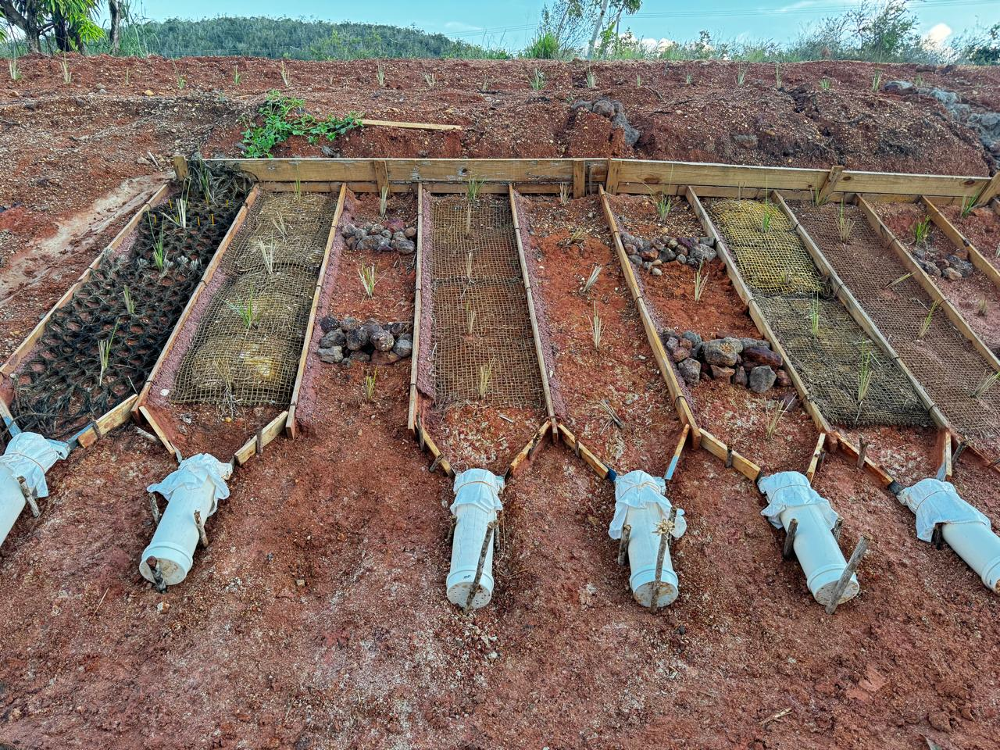
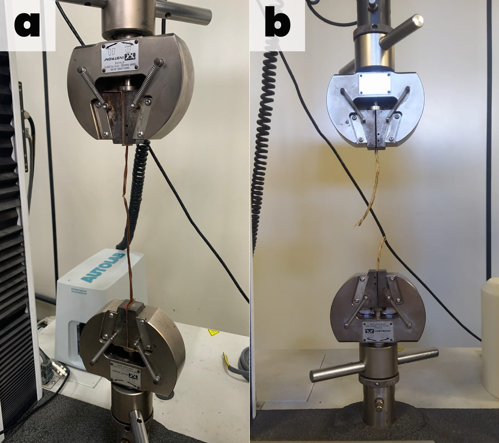
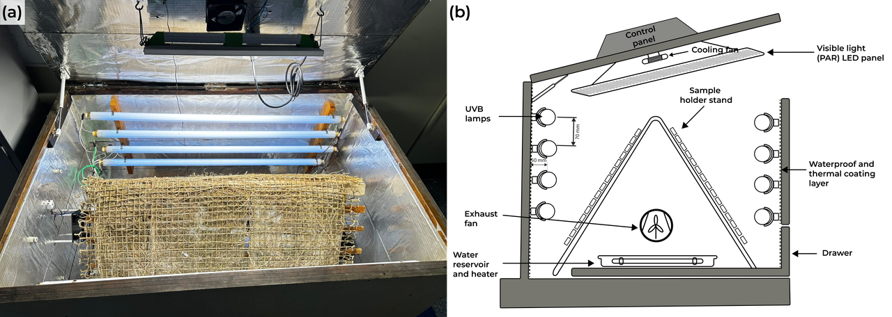
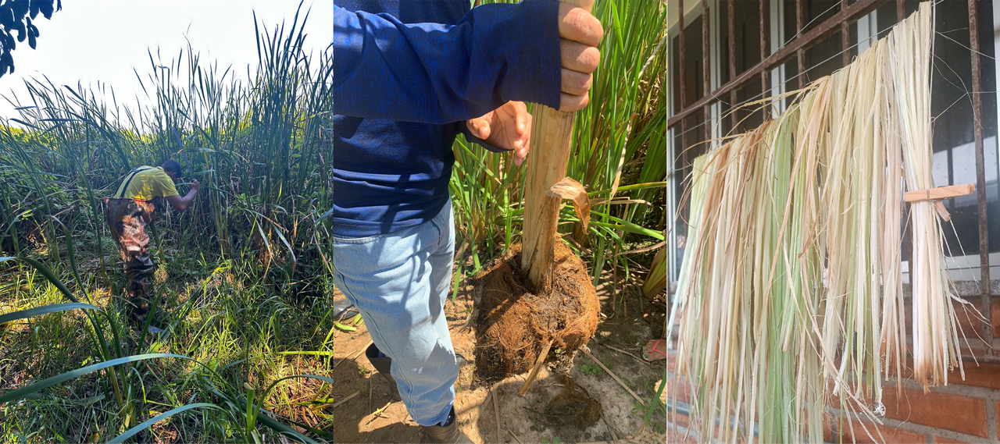

# Geotêxteis no Controle de Erosão {#sec-geotexteis}

## Geotêxteis

Os geotêxteis são produtos têxteis permeáveis utilizados em contato direto com o solo para desempenhar funções de filtração, separação, reforço, drenagem e proteção superficial. No contexto da bioengenharia de solos, os geotêxteis controlam a erosão superficial ao reduzir o impacto direto das gotas de chuva (*splash erosion*), diminuir a velocidade do escoamento superficial e reter partículas de solo, enquanto permitem a infiltração de água e o estabelecimento progressivo da cobertura vegetal. A @fig-geotextil-talude mostra um talude revestido com geotêxtil, onde o material têxtil fornece proteção mecânica imediata ao solo exposto enquanto a vegetação se estabelece através das aberturas da malha.

{#fig-geotextil-talude fig-alt="Talude com geotêxtil instalado" width="80%"}

## Classificação

Os geotêxteis podem ser classificados segundo dois critérios fundamentais: o processo de fabricação (que define a estrutura interna e as propriedades mecânicas) e a matéria-prima (que define a durabilidade e a pegada ambiental). A caracterização laboratorial dessas propriedades requer ensaios normatizados conduzidos em equipamentos específicos. A @fig-maquina ilustra uma máquina universal de ensaios mecânicos, utilizada para determinar a resistência à tração e ao puncionamento, enquanto a @fig-camara mostra uma câmara de degradação acelerada que simula envelhecimento por radiação UV e intempéries para avaliar a durabilidade em campo.

::: {layout-ncol=2}
{#fig-maquina fig-alt="Máquina universal de ensaios"}

{#fig-camara fig-alt="Câmara de degradação"}
:::

### Por Processo de Fabricação

Os geotêxteis tecidos são fabricados pelo entrelaçamento de fibras em trama regular (urdume e trama), produzidos em máquinas de tecelagem industrial. Essa estrutura ordenada confere alta resistência à tração em uma ou duas direções (dependendo da distribuição de fios), com alongamento na ruptura relativamente baixo (10–30%), o que os torna adequados para aplicações de reforço de solo e contenção onde deformações excessivas são indesejáveis. Os geotêxteis não tecidos, por sua vez, são compostos por fibras dispostas aleatoriamente e unidas por agulhamento mecânico, termofusão ou ligação química. A disposição aleatória das fibras confere alta permeabilidade em todas as direções, deformabilidade elevada (alongamento de 50–100%+) e distribuição uniforme de poros, características que os tornam ideais para funções de filtração, drenagem e proteção de geomembranas.

### Por Matéria-Prima

Os geotêxteis sintéticos são fabricados a partir de polímeros derivados do petróleo, principalmente polipropileno (PP), poliéster (PET) e polietileno (PE), com durabilidade de 50–100+ anos em condições de aterramento (ausência de UV). Os geotêxteis naturais (ou biogeotêxteis) são fabricados a partir de fibras vegetais como coco, juta, sisal e taboa (*Typha*), com tempo de biodegradação de 1–5 anos conforme a fibra e as condições ambientais (ver @sec-biotexteis). A biodegradabilidade não é uma desvantagem, mas uma característica de projeto: em aplicações de controle de erosão, o geotêxtil deve durar apenas o tempo necessário para o estabelecimento da cobertura vegetal (tipicamente 6–24 meses), após o qual a vegetação assume a função protetora e o material se incorpora ao solo como matéria orgânica.

## Funções Geotécnicas

A @tbl-funcoes sintetiza as seis funções geotécnicas que os geotêxteis podem desempenhar, com o mecanismo físico envolvido e a aplicação correspondente em bioengenharia de solos. Em muitas situações de campo, um único geotêxtil desempenha duas ou mais funções simultaneamente (por exemplo, filtração + separação na base de enrocamento vegetado, conforme @sec-enrocamento).

| Função | Mecanismo | Aplicação na bioengenharia |
|--------|-----------|---------------------------|
| Filtração | Reter partículas de solo, permitir passagem de água | Drenos, base de enrocamento, interface solo-pedra |
| Separação | Impedir mistura de camadas granulometricamente distintas | Interface solo-brita em canaletas verdes (@sec-canaleta-verde) |
| Reforço | Resistir a esforços de tração no interior do solo | Taludes íngremes, solo reforçado em paredes Krainer (@sec-parede-krainer) |
| Proteção | Absorver energia de impacto | Proteção de geomembranas em aterros |
| Drenagem | Conduzir fluidos no plano do geotêxtil | Geodrenos verticais e horizontais |
| Controle de erosão | Cobrir e proteger superfície exposta | Biomantas (@sec-biomantas), TRM |

: Funções geotécnicas de geotêxteis e suas aplicações em bioengenharia. {#tbl-funcoes .striped .hover}

## Propriedades

### Mecânicas

As propriedades mecânicas fundamentais determinam o desempenho estrutural do geotêxtil e incluem a resistência à tração (kN/m, medida pelo ensaio de faixa larga conforme ABNT NBR 12824, que aplica carga distribuída em uma amostra de 200 mm de largura até a ruptura), o alongamento na ruptura (% de deformação máxima antes da ruptura, indicador da ductilidade do material), a resistência ao puncionamento (kN, medida pelo ensaio CBR conforme ABNT NBR 13359, que simula a perfuração por pedras pontiagudas ou raízes) e a resistência ao rasgo (kN, ensaio trapezoidal que avalia a propagação de rasgos a partir de defeitos pré-existentes).

### Hidráulicas

As propriedades hidráulicas determinam o comportamento do geotêxtil como filtro e dreno, e compreendem a permissividade ($\psi$, s⁻¹), que indica a capacidade de fluxo perpendicular ao plano do geotêxtil (vazão por unidade de área sob gradiente hidráulico unitário), a transmissividade ($\theta$, m²/s), que mede a capacidade de fluxo no plano do geotêxtil (relevante para funções de drenagem), e a abertura de filtração ($O_{95}$, mm), que define o diâmetro da partícula correspondente ao percentil de 95% da distribuição de tamanhos de poros (indica a maior partícula que pode passar através do geotêxtil).

### Critério de Filtração

Para que o geotêxtil desempenhe adequadamente a função de filtro sem colmatar (entupir com partículas finas) nem permitir a passagem excessiva de solo (piping interno), a abertura de filtração deve satisfazer simultaneamente dois critérios de projeto

$$
O_{95} < (2 \text{ a } 3) \cdot D_{85,solo}
$$

que garante a retenção das partículas de solo (critério de retenção), e

$$
O_{95} > (1 \text{ a } 2) \cdot D_{15,solo}
$$

que garante a passagem de água sem acúmulo de poropressões (critério de permeabilidade). Os parâmetros $D_{85}$ e $D_{15}$ referem-se aos diâmetros correspondentes a 85% e 15% da curva granulométrica do solo adjacente, respectivamente.

## Geotêxteis no Baixo São Francisco

A experiência de campo no Baixo São Francisco constitui um dos estudos de caso mais abrangentes sobre biogeotêxteis em ambiente tropical no Brasil. A aplicação de biotêxteis de fibras de coco, juta e sisal na proteção de taludes marginais do rio São Francisco em Sergipe e Alagoas, monitorada ao longo de múltiplos ciclos hidrológicos, demonstrou resultados expressivos. A @fig-coleta apresenta a coleta de dados em campo, ilustrando o protocolo de monitoramento da performance dos geotêxteis em taludes marginais sujeitos à variação de nível do rio. Os resultados indicaram redução de 90–95% na perda de solo no primeiro ano de instalação, cobertura vegetal superior a 80% em 90 dias sob biomantas de fibra de coco, biodegradação controlada em 2–5 anos (período suficiente para o pleno estabelecimento vegetal) e custo 40–60% inferior ao gabião metálico para a mesma extensão protegida.

{#fig-coleta fig-alt="Coleta de campo no Baixo São Francisco" width="80%"}

## Ensaios Normatizados

A caracterização dos geotêxteis é regulamentada por normas técnicas da ABNT (Brasil) e da ASTM (internacional), que definem os procedimentos de ensaio, as dimensões dos corpos de prova e os critérios de aceitação. A @tbl-ensaios apresenta os ensaios fundamentais e as normas correspondentes, que devem ser indicados na especificação técnica de qualquer projeto de bioengenharia que empregue geotêxteis.

| Ensaio | Norma ABNT | Norma ASTM | Propriedade medida |
|--------|-----------|-----------|-------------------|
| Tração faixa larga | NBR 12824 | D4595 | Resistência à tração e alongamento |
| Puncionamento CBR | NBR 13359 | D6241 | Resistência à perfuração |
| Rasgo trapezoidal | NBR 15314 | D4533 | Resistência à propagação de rasgo |
| Permissividade | NBR 15223 | D4491 | Capacidade de fluxo perpendicular |
| Abertura de filtração | NBR 12956 | D4751 | Tamanho efetivo de poros |
| Massa por unidade de área | NBR 12568 | D5261 | Gramatura (g/m²) |

: Ensaios normatizados para geotêxteis. {#tbl-ensaios .striped .hover}

::: {.callout-note}
## Tendência
A substituição progressiva de geossintéticos sintéticos por naturais (biogeotêxteis) em aplicações de controle de erosão é uma tendência global alinhada com os princípios de economia circular e soluções baseadas na natureza (ver @sec-nbs). Em aplicações temporárias (proteção de taludes durante o estabelecimento vegetal), a biodegradabilidade do biogeotêxtil é uma vantagem funcional, não uma limitação.
:::
