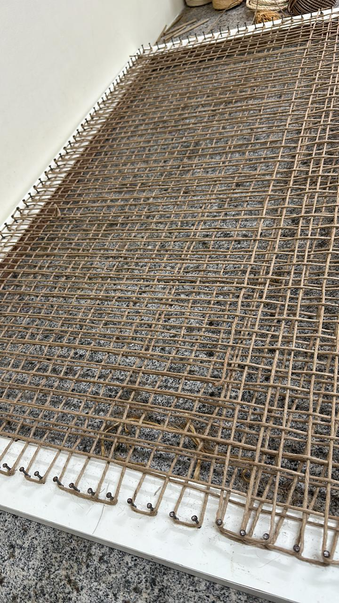

# Biotêxteis de Fibras Vegetais {#sec-biotexteis}

## Conceito

Os biotêxteis são geotêxteis fabricados exclusivamente a partir de fibras vegetais, projetados para biodegradação controlada após o cumprimento de sua função protetora. Enquanto os geotêxteis sintéticos (ver @sec-geotexteis) persistem no solo por décadas ou séculos, os biotêxteis são dimensionados para durar apenas o tempo necessário ao estabelecimento da cobertura vegetal (tipicamente 6–36 meses), após o qual se decompõem e se incorporam ao solo como matéria orgânica, contribuindo para a ciclagem de nutrientes e a melhoria da estrutura edáfica. Essa característica os posiciona como uma evolução dos geotêxteis convencionais alinhada com os princípios de economia circular e soluções baseadas na natureza (ver @sec-nbs). A @fig-tear mostra um tear utilizado na confecção artesanal de biotêxteis, onde fibras vegetais são tramadas para produzir mantas com abertura e gramatura controladas, enquanto a @fig-junco apresenta a fibra de junco antes do processamento, ilustrando a matéria-prima renovável e abundante que sustenta a produção desses materiais.

::: {layout-ncol=2}
{#fig-tear fig-alt="Tear de fibras vegetais"}

{#fig-junco fig-alt="Fibra de junco"}
:::

## Geotêxtil de Taboa (*Typha domingensis*)

### Desenvolvimento

O geotêxtil tecido tipo *geogrid* de taboa é uma inovação protegida por patente INPI BR1020230222110 (concedida 2025), desenvolvida pelo autor e colaboradores. A taboa (*Typha domingensis* Pers.) é uma macrófita aquática cosmopolita que coloniza áreas úmidas, várzeas e margens de reservatórios em todo o território brasileiro, frequentemente considerada planta invasora por sua capacidade de rápida proliferação vegetativa. O aproveitamento de suas folhas fibrosas como matéria-prima para biotêxteis transforma um passivo ambiental (biomassa invasora) em insumo produtivo com valor agregado.

### Características

O geotêxtil de taboa é produzido a partir de folhas de *Typha domingensis* Pers., que são colhidas, secas e tramadas em padrão tela simples (*plain weave*) formando uma malha aberta tipo geogrid com abertura ajustável de 10–30 mm. A abertura da malha é um parâmetro de projeto definido em função da granulometria do solo a ser protegido e da função desejada (aberturas menores para filtração, maiores para intertravamento mecânico). A massa por área varia de 300 a 800 g/m² (ajustável pela espessura e espaçamento das fibras), a resistência à tração situa-se entre 2 e 8 kN/m (inferior aos sintéticos, mas adequada para proteção superficial e reforço leve), e a biodegradação ocorre em 12–36 meses, controlável por tratamento com bioresinas que retardam a decomposição sem comprometer a compostabilidade final.

### Mecanismo de Intertravamento

O padrão geogrid (malha aberta com aberturas regulares) permite o intertravamento mecânico com o solo, um mecanismo distinto da simples cobertura proporcionada por biomantas (ver @sec-biomantas). As partículas de solo penetram nas aberturas da malha durante a compactação ou sob a ação da chuva, criando um efeito de ancoragem que aumenta significativamente a resistência ao cisalhamento na interface solo-geotêxtil. Esse mecanismo é particularmente eficaz em taludes com inclinação superior a 1V:2H, onde a gravidade tende a deslocar a camada superficial de solo.

A resistência de interface pode ser estimada pela expressão

$$
\tau_{interface} = c_a + \sigma_n \cdot \tan \delta
$$

onde $c_a$ é a adesão aparente na interface (kPa), $\sigma_n$ é a tensão normal atuante (kPa) e $\delta$ é o ângulo de atrito de interface, tipicamente correspondente a 0,7–0,9 vezes o ângulo de atrito efetivo do solo ($\phi'$). O valor de $\delta/\phi'$ depende da rugosidade da fibra e do formato das aberturas, e deve ser determinado experimentalmente por ensaio de cisalhamento direto em caixa de cisalhamento de interface (ASTM D5321).

### Vantagens

O geotêxtil de taboa apresenta um conjunto de vantagens que o posicionam como alternativa competitiva aos geotêxteis de fibra de coco (padrão de mercado para biotêxteis). A matéria-prima é abundante em todo o território brasileiro (Typha coloniza áreas úmidas naturais e antropizadas), e sua colheita regular funciona como controle biológico de uma espécie invasora. O custo de produção é 50–70% inferior ao dos geotêxteis sintéticos equivalentes, com pegada de carbono negativa (a planta sequestra CO₂ durante o crescimento e o material se decompõe sem liberar microplásticos). A produção pode ser descentralizada em comunidades rurais, gerando renda local e valorização de áreas úmidas atualmente subutilizadas.

## Geocomposto Híbrido

### Conceito

O geocomposto híbrido combina uma camada de manta de fibras vegetais (coco, juta ou sisal) com uma malha de reforço de rami (*Boehmeria nivea*), criando um material com proteção superficial integrada (interceptação de splash, retenção hídrica) e resistência mecânica suficiente para aplicação em taludes íngremes. A estrutura sanduíche aproveita as propriedades complementares de cada componente, como mostra a @tbl-geocomposto.

### Componentes

| Camada | Material | Função específica |
|--------|----------|-------------------|
| Superior | Manta de fibra de coco (300–500 g/m²) | Proteção contra impacto de gotas, retenção hídrica superficial |
| Intermediária | Malha de rami tecida (tela simples) | Reforço mecânico (tração e rasgo) |
| Inferior | Manta de fibra de coco (200–400 g/m²) | Contato íntimo com o solo, filtração de partículas finas |

: Componentes do geocomposto híbrido e suas funções específicas. {#tbl-geocomposto .striped}

A malha de rami é o elemento estrutural crítico do geocomposto, pois o rami (*Boehmeria nivea*) possui a maior resistência à tração entre as fibras vegetais (até 60 cN/tex), com elongação na ruptura de apenas 2–4% (comportamento quase-rígido), tornando-o ideal para função de reforço.

### Propriedades

O geocomposto híbrido apresenta resistência à tração combinada de 5–15 kN/m (superior à de cada componente isolado, pelo efeito de compósito), massa por área de 600–1.200 g/m² (ajustável pela gramatura de cada camada), durabilidade de 24–48 meses (compatível com o período de estabelecimento vegetal em condições tropicais) e retenção hídrica superior a 200% do peso seco (a camada de fibra de coco absorve e retém água da chuva, liberando-a gradualmente para o solo e as raízes em formação).

## Geodreno Vegetal Biodegradável

### Conceito

O geodreno vegetal é um dispositivo de drenagem subsuperficial fabricado integralmente com materiais de origem vegetal, projetado para rebaixar temporariamente o lençol freático em taludes e encostas instáveis durante o período crítico de estabelecimento da vegetação. Diferentemente dos geodrenos sintéticos (que permanecem indefinidamente no solo), o geodreno vegetal se biodegrada em 18–36 meses, período após o qual a drenagem é assumida pelos macroporos criados pelas raízes da vegetação estabelecida.

### Estrutura

O geodreno vegetal é composto por placas drenantes de fibras de taboa e bananeira prensadas, cuja geometria interna em espinha-de-peixe (*herringbone*) cria canais preferenciais para a condução do fluxo subsuperficial. O aglutinante utilizado é uma resina de mamona (*Ricinus communis*) com D-limoneno (solvente natural extraído de cascas de citros), que confere rigidez estrutural sem comprometer a biodegradabilidade. O envoltório externo consiste em geotêxtil não tecido de fibra de coco, que funciona como filtro de proteção contra o carreamento de partículas finas para o interior do dreno (colmatação).

### Desempenho

O geodreno vegetal atinge vazão drenante de 0,5–2,0 L/(m·min) sob gradiente hidráulico unitário (suficiente para rebaixamento localizado em solos de permeabilidade média), resistência à compressão de 50–150 kPa (suporta a tensão geostática de 3–8 m de solo sobrejacente sem colapso) e biodegradação controlável em 18–36 meses pela concentração do aglutinante.

::: {.callout-note}
## Patentes relacionadas
As inovações biotecnológicas apresentadas neste capítulo incluem o geotêxtil de taboa (BR1020230222110, concedida 2025), o geocomposto híbrido (pedido depositado) e o geodreno vegetal (pedido depositado), representando contribuições nacionais ao avanço dos biomateriais aplicados à bioengenharia de solos.
:::

## Comparativo de Desempenho

A @tbl-comparativo confronta as propriedades dos biotêxteis (coco e taboa) com as de um geotêxtil sintético de polipropileno (PP), evidenciando os compromissos de projeto entre desempenho mecânico e sustentabilidade ambiental. Os biotêxteis apresentam resistência à tração inferior, mas oferecem retenção hídrica elevada, biodegradação controlada (sem acúmulo de resíduos), pegada de carbono negativa e custo competitivo, vantagens decisivas em aplicações de controle de erosão com horizonte temporal de 1–5 anos.

| Propriedade | Geotêxtil de coco | Geotêxtil de taboa | Geotêxtil PP |
|-------------|-------------------|--------------------|----|
| Custo (R$/m²) | 8–15 | 5–12 | 10–25 |
| Biodegradação | 2–4 anos | 1–3 anos | > 100 anos |
| Resistência tração (kN/m) | 3–8 | 2–8 | 5–50 |
| Retenção hídrica | Alta | Muito alta | Baixa |
| Pegada CO₂ | Negativa | Negativa | Positiva |
| Reciclabilidade | Compostável | Compostável | Reciclável |

: Comparativo entre biotêxteis e geotêxtil sintético (PP). {#tbl-comparativo .striped .hover}
