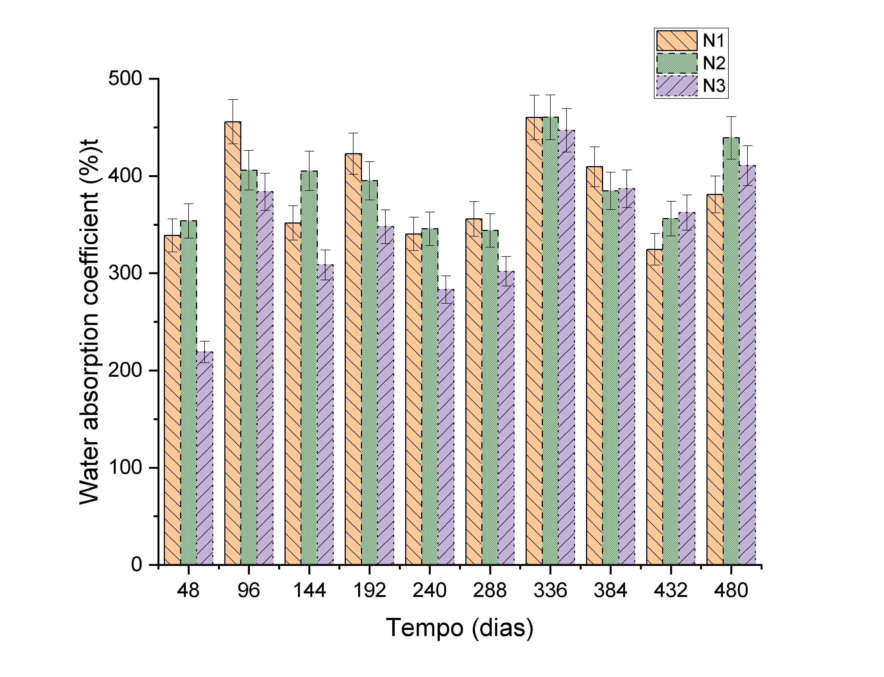
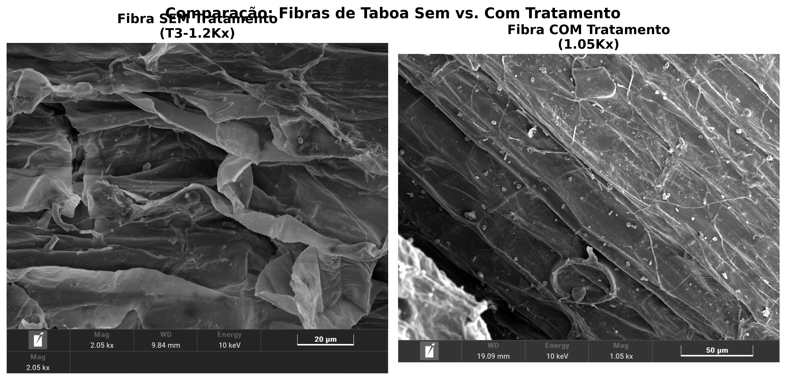
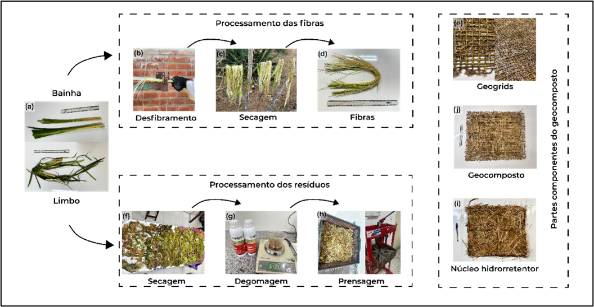
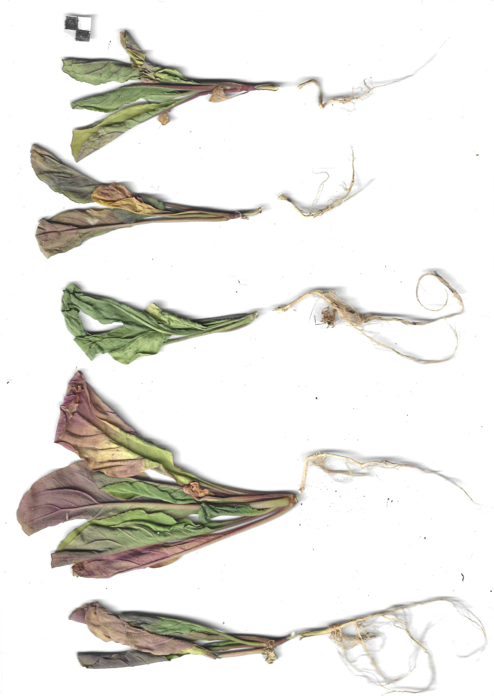

# Biopolímeros Superabsorventes {#sec-biopolimeros}

## Conceito

Os **biopolímeros superabsorventes** (Bio-SAP, do inglês *Superabsorbent Biopolymer*) são materiais de origem vegetal capazes de absorver e reter grandes volumes de água (100–500 vezes seu peso seco), liberando-a gradualmente para a zona radicular das plantas à medida que o potencial matricial do solo diminui por evapotranspiração. Diferentemente dos hidrogéis sintéticos (poliacrilatos de sódio), os Bio-SAPs são integralmente biodegradáveis e não geram resíduos de microplásticos no solo. Essa característica os torna especialmente relevantes para aplicações de bioengenharia de solos em regiões semiáridas, onde o déficit hídrico no período pós-plantio é o principal fator de mortalidade de mudas em taludes recuperados. A @fig-taboa mostra o material vegetal de taboa (*Typha domingensis*) que constitui a matéria-prima do Bio-SAP, cuja polpa celulósica é processada quimicamente para adquirir propriedades superabsorventes.

{#fig-taboa fig-alt="Material de taboa para Bio-SAP" width="80%"}

## Bio-SAP de Taboa

### Desenvolvimento

O Bio-SAP de taboa (*Typha domingensis*) é uma inovação desenvolvida a partir da polpa celulósica da planta, processada por duas reações químicas sequenciais (carboximetilação e reticulação) que modificam a estrutura molecular da celulose, conferindo-lhe a capacidade de formar hidrogéis com elevada retenção hídrica. A celulose nativa possui grupos hidroxila (-OH) que atraem moléculas de água por ligações de hidrogênio, mas a capacidade de absorção é limitada. A carboximetilação substitui parte desses grupos hidroxila por grupos carboximetila (-CH₂COONa), que são aniônicos em solução aquosa e criam pressão osmótica no interior da rede polimérica, atraindo grandes volumes de água. A reticulação subsequente (com epicloridrina) cria ligações covalentes entre as cadeias de celulose, formando uma rede tridimensional que impede a dissolução do material e confere elasticidade mecânica.

### Processo de Produção

O fluxograma abaixo sintetiza as etapas de produção do Bio-SAP, desde a colheita da taboa em campo até a obtenção do produto granulado pronto para aplicação.

```{mermaid}
%%| fig-width: 7
flowchart LR
    A[Colheita\nda taboa] --> B[Extração\nda polpa]
    B --> C[Carboximetilação\n(NaOH + ácido\nmonocloroacético)]
    C --> D[Reticulação\n(epicloridrina)]
    D --> E[Secagem e\nmoagem]
    E --> F[Bio-SAP\ngranulado]
```

### Propriedades

A microestrutura do Bio-SAP pode ser observada na @fig-mev, que apresenta imagens de microscopia eletrônica de varredura (MEV) comparando o material antes e após a absorção de água. No estado seco, o Bio-SAP exibe uma superfície rugosa e compacta com microporos colapsados; após a absorção, a estrutura se expande dramaticamente, revelando uma rede tridimensional de poros interconectados que retêm a água por capilaridade e pressão osmótica. A @tbl-biosap quantifica as principais propriedades do material.

{#fig-mev fig-alt="MEV do Bio-SAP" width="80%"}

| Propriedade | Valor | Significado prático |
|-------------|-------|---------------------|
| Capacidade de absorção em água destilada | 300–500 g/g | 1 kg de Bio-SAP retém 300–500 L de água |
| Capacidade de absorção em solo | 150–250 g/g | Reduzida pela presença de sais e finos |
| Tempo de absorção (90%) | 15–30 min | Resposta rápida a eventos de chuva |
| Taxa de liberação (50%) | 12–48 h | Liberação gradual compatível com demanda radicular |
| Biodegradação completa | 6–18 meses | Não deixa resíduos no solo |
| Granulometria | 0,5–2,0 mm | Compatível com mistura em substrato |

: Propriedades do Bio-SAP de taboa. {#tbl-biosap .striped}

## Geocompostos Hidrorretentores Typha-Rami

### Conceito

Os **geocompostos hidrorretentores** integram o Bio-SAP em uma estrutura sanduíche de biotêxtil (ver @sec-biotexteis), criando um sistema de **retenção hídrica distribuída** que pode ser instalado diretamente sobre o talude como uma manta, eliminando a necessidade de misturar manualmente o Bio-SAP ao solo. A @fig-confeccao mostra o processo de confecção do geocomposto, onde o núcleo de Bio-SAP é confinado entre duas camadas de biotêxtil de taboa-rami.

{#fig-confeccao fig-alt="Confecção do geocomposto" width="80%"}

### Estrutura

A @tbl-geocomposto-hidro detalha os componentes da estrutura sanduíche, onde cada camada desempenha uma função específica e complementar.

| Camada | Material | Função |
|--------|----------|--------|
| Exterior (×2) | Biotêxtil de taboa-rami | Proteção mecânica, filtração e reforço |
| Interior | Núcleo de Bio-SAP (300–800 g/m²) | Reservatório hídrico distribuído |
| Aglutinante | *Aloe vera* + amida 90% | Fixação do Bio-SAP e ativação da absorção |

: Estrutura do geocomposto hidrorretentor Typha-Rami. {#tbl-geocomposto-hidro .striped}

### Desempenho

O geocomposto hidrorretentor apresenta WHC (*Water Holding Capacity*) superior a 300% do peso seco, o que significa que cada m² de geocomposto (com gramatura total de ~1.500 g/m²) retém até 4,5 L de água, funcionando como um reservatório laminar distribuído sobre toda a superfície do talude. A retenção de macronutrientes (N, P, K) é superior a 60%, reduzindo a lixiviação de fertilizantes aplicados durante a revegetação. A integridade estrutural é mantida por pelo menos 180 dias em campo (período crítico de estabelecimento vegetal), e a curva de retenção hídrica do geocomposto pode ser ajustada pela equação de van Genuchten

$$
\theta(h) = \theta_r + \frac{\theta_s - \theta_r}{[1 + (\alpha \cdot h)^n]^m}
$$

onde $\theta_r$ e $\theta_s$ são os teores de água residual e saturado (cm³/cm³), $h$ é o potencial matricial (cm de coluna d'água), e $\alpha$ (cm⁻¹), $n$ e $m = 1 - 1/n$ são parâmetros de ajuste que descrevem a forma da curva. A determinação desses parâmetros por ajuste a dados experimentais permite prever a disponibilidade de água para as plantas em função da tensão do solo, subsidiando o dimensionamento da gramatura de Bio-SAP necessária para cada condição climática.

## Aplicações

A @fig-alelopatia apresenta ensaios de alelopatia e germinação com Bio-SAP, demonstrando que o biopolímero não exerce efeito inibitório sobre a germinação e o desenvolvimento de plântulas, condição essencial para sua aplicação em projetos de revegetação.

{#fig-alelopatia fig-alt="Ensaio de germinação com Bio-SAP" width="75%"}

Em projetos de recuperação de encostas, o Bio-SAP é instalado sob biomantas (ver @sec-biomantas) ou incorporado à pasta de hidrossemeadura (ver @sec-hidrossemeadura), retendo a água da chuva na zona radicular e reduzindo a necessidade de irrigação em 50–70% nos primeiros 90 dias, fator crítico em regiões semiáridas com déficit hídrico prolongado. Na revegetação de taludes em áreas de mineração, onde os substratos são altamente degradados (pH extremo, ausência de matéria orgânica, baixa capacidade de retenção hídrica), a combinação de Bio-SAP com composto orgânico cria condições mínimas para o estabelecimento vegetal ao fornecer um reservatório hídrico e nutricional que compensa as deficiências edáficas. Na produção de mudas em viveiros, a incorporação de Bio-SAP ao substrato reduz a frequência de irrigação em 40–60% e aumenta a taxa de sobrevivência no transplante para campo, reduzindo o estresse hídrico na fase de adaptação.

## Vantagens sobre SAP Sintéticos

A @tbl-comparativo-sap confronta o Bio-SAP de taboa com os SAPs sintéticos (poliacrilatos de sódio) que dominam o mercado atual, evidenciando que o Bio-SAP oferece capacidade de absorção comparável (300–500 g/g versus 300–600 g/g) com as vantagens decisivas de biodegradabilidade total, ausência de microplásticos, matéria-prima renovável e custo inferior.

| Critério | SAP sintético (poliacrilato) | Bio-SAP (taboa) |
|----------|----------------------------|-----------------|
| Absorção (g/g) | 300–600 | 300–500 |
| Biodegradação | Não | Sim (6–18 meses) |
| Microplásticos | Sim | Não |
| Matéria-prima | Petroquímica | Vegetal (renovável) |
| Custo | R$ 15–30/kg | R$ 8–20/kg |
| Toxicidade residual | Possível | Nenhuma |

: Comparativo entre SAP sintético e Bio-SAP de taboa. {#tbl-comparativo-sap .striped .hover}

::: {.callout-important}
## Relevância ambiental
SAPs sintéticos (poliacrilatos) são uma fonte crescente de **microplásticos no solo**, com fragmentação progressiva em partículas < 5 mm que contaminam cadeias tróficas e corpos hídricos. Sua substituição por Bio-SAPs vegetais elimina integralmente esse risco e alinha a prática de bioengenharia com os ODS 12 (Consumo responsável) e 15 (Vida terrestre).
:::
