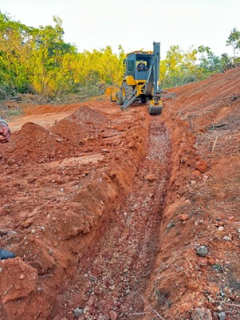

# Soluções Baseadas na Natureza {#sec-nbs}

## Definição

As Soluções Baseadas na Natureza (*Nature-based Solutions*, NBS) são definidas pela IUCN como

> Ações para proteger, gerenciar de forma sustentável e restaurar ecossistemas naturais ou modificados, que abordam desafios sociais de forma eficaz e adaptativa, fornecendo simultaneamente benefícios para o bem-estar humano e para a biodiversidade. [@iucn2020]

Essa definição estabelece que uma intervenção somente se qualifica como NBS quando opera simultaneamente em dois eixos: resolver um desafio social concreto (controle de erosão, mitigação de enchentes, segurança hídrica) e gerar ganho líquido para a biodiversidade. A bioengenharia de solos, conforme apresentada ao longo deste livro, atende integralmente a esse duplo requisito, pois utiliza elementos vivos (vegetação, raízes, fibras naturais) como componentes estruturais que, ao mesmo tempo em que estabilizam taludes e controlam feições erosivas, criam habitat, promovem ciclagem de nutrientes e sequestram carbono.

## Enquadramento Conceitual

O diagrama a seguir posiciona a bioengenharia de solos no campo mais amplo das NBS, evidenciando que ela é uma vertente da engenharia ecológica (aplicação de princípios ecológicos ao projeto de intervenções de engenharia), que por sua vez integra o guarda-chuva conceitual das NBS juntamente com a restauração de ecossistemas, a infraestrutura verde e a adaptação baseada em ecossistemas.

```{dot}
//| fig-width: 7.5
digraph {
    rankdir=TB
    bgcolor="transparent"
    node [shape=box, style="rounded,filled", fontname="Helvetica", fontsize=10, margin="0.25,0.12", penwidth=0.8]
    edge [color="#555555", penwidth=1.0]

    NBS [label="Soluções Baseadas\nna Natureza (NBS)", fillcolor="#2E7D32", fontcolor="white", color="#1B5E20", penwidth=1.5]
    A [label="Restauração de\necossistemas", fillcolor="#E8F5E9", color="#2E7D32"]
    B [label="Engenharia\necológica", fillcolor="#E8F5E9", color="#2E7D32"]
    C [label="Infraestrutura\nverde", fillcolor="#E8F5E9", color="#2E7D32"]
    D [label="Adaptação baseada\nem ecossistemas", fillcolor="#E8F5E9", color="#2E7D32"]
    E [label="Reflorestamento\nRevegetação", fillcolor="#C8E6C9", color="#2E7D32"]
    F [label="Bioengenharia\nde solos", fillcolor="#C8E6C9", color="#2E7D32"]
    G [label="Canaletas verdes\nTelhados verdes", fillcolor="#C8E6C9", color="#2E7D32"]
    H [label="Proteção costeira\nManejo de bacias", fillcolor="#C8E6C9", color="#2E7D32"]

    NBS -> {A B C D}
    A -> E
    B -> F
    C -> G
    D -> H
}
```

## Critérios IUCN para NBS

A IUCN estabelece 8 critérios que qualificam uma intervenção como NBS [@iucn2020], e cada um deles pode ser diretamente associado às técnicas de bioengenharia de solos apresentadas nos capítulos anteriores. A @tbl-criterios-iucn sintetiza cada critério e apresenta um exemplo concreto de como a bioengenharia de solos o satisfaz.

| # | Critério | Aplicação em bioengenharia de solos |
|---|----------|-------------------------------------|
| 1 | Aborda desafios sociais | O controle de erosão protege estradas, infraestrutura e comunidades rurais a jusante |
| 2 | Design em escala de paisagem | O projeto integrado de bacias hidrográficas (@sec-bacias-captacao) considera a conectividade hidrossedimentológica |
| 3 | Ganho líquido para biodiversidade | Espaços entre pedras de enrocamento e células de gabiões criam habitat (@sec-enrocamento, @sec-gabiao-vivo) |
| 4 | Economicamente viável | Custos 3–5× menores que engenharia civil convencional (@tbl-custos-nbs) |
| 5 | Governança inclusiva | A fabricação de biotêxteis em comunidades rurais gera renda local (@sec-biotexteis) |
| 6 | Equilíbrio entre trade-offs | O dimensionamento equilibra estabilidade mecânica e permeabilidade hidráulica |
| 7 | Gestão adaptativa | O monitoramento contínuo permite ajustes nas técnicas ao longo do tempo |
| 8 | Sustentável e integrada | Após 3–5 anos de consolidação, a vegetação assume a função protetora sem necessidade de manutenção |

: Critérios IUCN aplicados à bioengenharia de solos, com exemplos de atendimento para cada critério. {#tbl-criterios-iucn .striped}

## Bioengenharia como NBS

A bioengenharia de solos se qualifica plenamente como NBS porque opera exclusivamente com processos naturais como motores de estabilização, em contraste com a engenharia convencional que depende de materiais inertes (concreto, aço) cuja função é estritamente mecânica. O crescimento radicular incrementa a coesão efetiva do solo (ver modelo de Wu-Waldron em @sec-gabiao-vivo), a interceptação vegetal da chuva reduz a energia cinética do splash, a ciclagem hidrológica pela evapotranspiração reduz a poropressão e estabiliza taludes, e a deposição de serrapilheira cria uma camada orgânica que protege a superfície e alimenta a atividade biológica do solo. Esses processos geram múltiplos co-benefícios (estabilidade geotécnica, conservação de biodiversidade, sequestro de carbono, valorização paisagística) e são autossustentáveis após a fase de consolidação (3–5 anos): diferentemente de um muro de concreto, que se deteriora progressivamente, uma encosta estabilizada por bioengenharia ganha resistência ao longo do tempo à medida que o sistema radicular se expande e a coesão do solo aumenta.

## Análise Econômica

### Custo-benefício de NBS vs. Engenharia Convencional

A @tbl-custos-nbs apresenta uma análise comparativa de custos para estabilização de encostas, incluindo custo inicial, manutenção anual, vida útil e Valor Presente Líquido (VPL) em horizonte de 20 anos (taxa de desconto de 8% a.a.). Os valores demonstram que as técnicas de bioengenharia apresentam custos iniciais sistematicamente inferiores aos das soluções convencionais, e o diferencial se amplifica quando a manutenção ao longo da vida útil é contabilizada, pois a vegetação consolidada requer apenas manejo periódico (roçada, replantio pontual) enquanto estruturas de concreto demandam reparos progressivamente mais caros.

| Intervenção | Custo inicial (R$/m²) | Manutenção anual (R$/m²) | Vida útil (anos) | VPL 20 anos (R$/m²) |
|-------------|----------------------|-------------------------|-------------------|---------------------|
| Muro de concreto | 800–1.500 | 40–80 | 30–50 | 1.400–2.700 |
| Gabião metálico | 400–700 | 20–50 | 25–40 | 700–1.300 |
| Gabião vivo (@sec-gabiao-vivo) | 250–500 | 10–25 | 30–50+ | 400–850 |
| Parede Krainer (@sec-parede-krainer) | 200–450 | 5–15 | 25–40+ | 280–650 |
| Paliçadas + revegetação (@sec-palicadas) | 50–150 | 5–10 | 10–20 | 80–250 |
| Biomantas + hidrossemeadura (@sec-biomantas, @sec-hidrossemeadura) | 30–80 | 2–8 | 3–8 | 45–130 |

: Análise comparativa de custos para estabilização de encostas — valores referenciais para condições tropicais brasileiras. {#tbl-custos-nbs .striped .hover}

### Co-benefícios valorizáveis

Além da função primária de estabilização e controle de erosão, as NBS geram co-benefícios que podem ser monetizados e incorporados à análise de viabilidade econômica. O sequestro de carbono pela biomassa vegetal e pelo solo (2–15 tC/ha/ano, dependendo do bioma e das espécies) viabiliza a comercialização de créditos de carbono (R$ 40–120/tC no mercado voluntário). A regulação hídrica proporcionada pelo aumento de infiltração promove a recarga de aquíferos e reduz picos de cheia a jusante, benefícios que podem ser valorados pelo custo evitado de obras de drenagem urbana ou tratamento de água. A criação de habitat para fauna (polinizadores, predadores naturais de pragas agrícolas) gera serviços ecossistêmicos de biodiversidade com valor econômico real. A valorização estética da paisagem pode impulsionar turismo ecológico e valorização imobiliária, impactos mensuráveis pelo método de preços hedônicos.

::: {.callout-tip}
## Valoração de co-benefícios
Quando os co-benefícios são contabilizados pelo método de Análise de Custo-Benefício expandida (ACBe), as NBS frequentemente apresentam VPL superior às soluções convencionais, mesmo quando o custo inicial é semelhante. A análise deve adotar horizonte de pelo menos 20 anos para capturar os benefícios do amadurecimento da vegetação e da progressiva redução de custos de manutenção.
:::

## Retaludamento como NBS

O retaludamento vegetado é uma técnica de NBS que combina a reconfiguração geométrica do talude (redução do ângulo de inclinação) com a revegetação integrada das superfícies reconformadas, unindo princípios de geotecnia clássica (estabilidade por peso e geometria) com processos biológicos (coesão radicular, interceptação, evapotranspiração). A @fig-talude mostra um talude em campo antes da intervenção, com superfície exposta susceptível à erosão, ilustrando a condição típica que demanda reconfiguração geométrica seguida de revegetação.

{#fig-talude fig-alt="Talude em campo" width="80%"}

### Princípios

O retaludamento vegetado baseia-se em quatro princípios complementares. O primeiro é a redução do ângulo de inclinação do talude para valores inferiores ao ângulo de repouso do material, o que aumenta o fator de segurança por redução da componente de tensão cisalhante atuante. O segundo é a criação de bermas intermediárias a cada 5–8 m de altura, que funcionam como plataformas de captação de água e sedimentos, interrompendo o comprimento de rampa e reduzindo a energia do escoamento superficial. O terceiro é a revegetação das superfícies reconformadas com espécies de raízes profundas e fasciculadas, que incrementam a coesão do solo e reduzem a poropressão por evapotranspiração. O quarto é a implantação de sistema de drenagem naturalizado (canaletas verdes, conforme @sec-canaleta-verde), que conduz o escoamento interceptado pelas bermas sem gerar concentração erosiva.

### Dimensionamento

A inclinação do talude retaludado deve atender ao fator de segurança mínimo de 1,5 contra ruptura por cisalhamento, calculado pela análise de estabilidade de taludes infinitos

$$
FS = \frac{\tau_f}{\tau_a} = \frac{c' + (\sigma - u) \tan \phi'}{(\gamma \cdot z \cdot \cos\beta) \cdot \sin\beta} \geq 1,5
$$

onde $c'$ é a coesão efetiva do solo (kPa), $\phi'$ é o ângulo de atrito efetivo (°), $\sigma$ é a tensão normal atuante na superfície potencial de ruptura (kPa), $u$ é a poropressão (kPa, dependente da posição do lençol freático), $\gamma$ é o peso específico do solo (kN/m³), $z$ é a profundidade da superfície de ruptura (m) e $\beta$ é o ângulo de inclinação do talude com a horizontal (°).

A contribuição da vegetação à estabilidade é quantificada pelo incremento de coesão radicular ($\Delta c_r$), que se soma à coesão do solo

$$
c'_{total} = c'_{solo} + \Delta c_r
$$

onde $\Delta c_r$ é a coesão radicular adicional, calculável pelo modelo de Wu-Waldron conforme detalhado em @sec-gabiao-vivo. Para gramíneas densas, $\Delta c_r$ situa-se entre 2–5 kPa; para arbustos com raízes profundas, entre 5–15 kPa; e para espécies arbóreas com 3–5 anos, entre 10–25 kPa.

## Casos de Aplicação em Regiões Tropicais

### Semiárido brasileiro

No semiárido, o desafio central reside na pluviosidade concentrada em 3–4 meses, com chuvas convectivas de alta intensidade sobre solos rasos e vegetação de caatinga. A estratégia NBS para essas condições combina paliçadas de madeira nas feições erosivas lineares (@sec-palicadas), bacias de captação para armazenamento descentralizado de enxurradas (@sec-bacias-captacao) e revegetação com espécies nativas xerófitas adaptadas ao déficit hídrico prolongado, complementada por Bio-SAP para retenção hídrica na zona radicular (@sec-biopolimeros). Essa abordagem integrada tem demonstrado redução de escoamento superficial de 50–80% e aumento significativo de cobertura vegetal em parcelas experimentais.

### Encostas da Mata Atlântica

Nas encostas da Mata Atlântica, a precipitação intensa (superior a 2.000 mm/ano), os solos profundos com mantos de intemperismo espessos e a susceptibilidade a movimentos de massa demandam soluções de maior robustez mecânica. A combinação de gabiões vivos na base das encostas (@sec-gabiao-vivo), paredes Krainer nas zonas de maior solicitação (@sec-parede-krainer) e revegetação com espécies arbóreas pioneiras de crescimento rápido tem promovido a estabilização de encostas com fator de segurança superior a 1,5 e regeneração florestal progressiva, com cobertura de dossel superior a 70% em 5 anos.

### Margens do rio São Francisco

Nas margens do Baixo São Francisco, a erosão marginal acelerada pós-barragem (resultante da alteração do regime hidrológico natural pela operação de Xingó) em solos arenosos de baixa coesão constitui o principal desafio geomorfológico. A associação de enrocamento vegetado na linha d'água (@sec-enrocamento), biotêxteis de taboa na zona de variação de nível (@sec-biotexteis) e geotêxteis híbridos no talude superior (@sec-geotexteis) reduziu a taxa de recuo marginal em 70–90%, conforme dados de monitoramento topográfico por GNSS com levantamentos semestrais ao longo de 5 anos.

::: {.callout-note}
## NBS e ODS
As Soluções Baseadas na Natureza contribuem diretamente para os Objetivos de Desenvolvimento Sustentável 6 (Água limpa e saneamento), 11 (Cidades e comunidades sustentáveis), 13 (Ação contra a mudança global do clima) e 15 (Vida terrestre), consolidando a bioengenharia de solos como instrumento de política pública ambiental alinhado com compromissos internacionais.
:::
