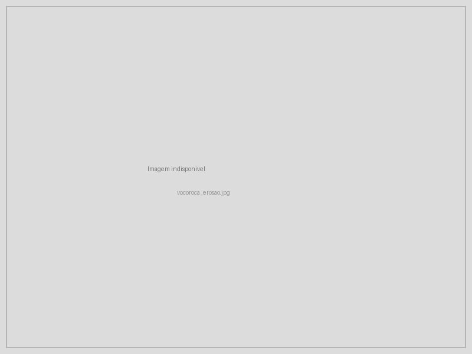
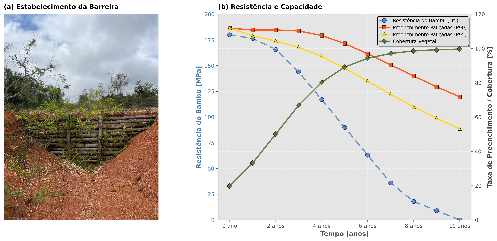

# Projeto Integrador {#sec-projeto-integrador}

## Objetivo

Este capítulo sintetiza os conhecimentos apresentados ao longo do livro em um projeto integrador de bioengenharia de solos, demonstrando como combinar múltiplas técnicas para resolver um problema real de degradação em região tropical. O objetivo não é apresentar uma receita fixa, mas um método de trabalho que permita ao projetista diagnosticar a situação de campo, selecionar as técnicas apropriadas, dimensionar as estruturas e monitorar os resultados, adaptando o projeto às condições locais de solo, clima, declividade e disponibilidade de materiais. A @fig-vocoroca mostra uma voçoroca ativa em solo tropical, feição erosiva de grande porte que exemplifica o tipo de desafio que demanda projeto integrado de múltiplas técnicas.

{#fig-vocoroca fig-alt="Voçoroca ativa em solo tropical" width="85%"}

## Metodologia de Projeto

### Etapas do Projeto de Bioengenharia

O fluxograma a seguir apresenta as 7 etapas do projeto de bioengenharia de solos, desde o diagnóstico de campo até a consolidação, incluindo o ciclo de gestão adaptativa que retorna à seleção de técnicas caso as metas de monitoramento não sejam atingidas.

```{dot}
//| fig-width: 8
digraph {
    rankdir=TB
    bgcolor="transparent"
    node [shape=box, style="rounded,filled", fillcolor="#E8F5E9", color="#2E7D32", fontname="Helvetica", fontsize=10, margin="0.25,0.12", penwidth=0.8]
    edge [color="#555555", penwidth=1.0, fontname="Helvetica", fontsize=9]

    A [label="1. Diagnóstico\n(campo + SIG)"]
    B [label="2. Classificação\nde feições erosivas"]
    C [label="3. Seleção de\ntécnicas"]
    D [label="4. Dimensionamento\nde estruturas"]
    E [label="5. Projeto\nexecutivo"]
    F [label="6. Implantação"]
    G [label="7. Monitoramento\ne manutenção"]
    H [label="Metas\natingidas?", shape=diamond, fillcolor="#FFF9C4", color="#F57F17"]
    I [label="Gestão adaptativa", fillcolor="#FFCDD2", color="#C62828"]
    J [label="Consolidação\ne entrega", fillcolor="#A5D6A7", color="#1B5E20", penwidth=1.5]

    A -> B -> C -> D -> E -> F -> G -> H
    H -> I [label="Não", color="#C62828"]
    I -> C [style=dashed, color="#C62828"]
    H -> J [label="Sim", color="#1B5E20"]
}
```

### Etapa 1: Diagnóstico

O diagnóstico é a etapa mais crítica do projeto, pois a seleção inadequada de técnicas resulta invariavelmente em ineficiência ou fracasso da intervenção. O levantamento deve integrar seis componentes fundamentais, cada um com método específico e produto cartográfico associado, conforme a @tbl-diagnostico.

| Componente | Método | Produto |
|------------|--------|---------|
| Topografia | RPAS/drone + SfM (Structure from Motion) | MDE (Modelo Digital de Elevação) com resolução ≤ 5 cm |
| Solos | Amostragem em campo + ensaios de laboratório | Mapa pedológico com fator de erodibilidade K (RUSLE) |
| Clima | Estação meteorológica local ou interpolação | Série pluviométrica com R de erosividade (RUSLE) |
| Cobertura | Classificação supervisionada de imagem orbital/drone | Mapa de uso e cobertura com fator C (RUSLE) |
| Hidrologia | Modelagem de bacias (SIG) | Mapa de área contribuinte, direções de fluxo e vazões |
| Vegetação | Inventário florístico de campo | Lista de espécies nativas disponíveis para revegetação |

: Componentes do diagnóstico integrado para projeto de bioengenharia. {#tbl-diagnostico .striped}

A integração desses componentes em ambiente SIG permite a geração de mapas de susceptibilidade à erosão e de priorização de intervenções, fundamentais para a alocação eficiente de recursos em projetos de grande escala espacial.

### Etapa 2: Classificação de Feições

Utilizando a metodologia de classificação de feições erosivas apresentada em @sec-classificacao-feicoes, todas as feições erosivas presentes na área de estudo devem ser mapeadas, medidas (comprimento, largura, profundidade, área de seção transversal) e classificadas segundo porte (sulco, ravina, voçoroca) e dinâmica (ativa, estabilizada, reativada). A priorização das intervenções deve considerar o risco associado a cada feição (proximidade de infraestrutura, taxa de expansão, volume de sedimento exportado) e a relação custo-efetividade do tratamento.

### Etapa 3: Seleção de Técnicas

A seleção de técnicas segue uma matriz de decisão multicritério que pondera sete variáveis, cada uma com peso proporcional à sua influência no desempenho da intervenção, conforme a @tbl-selecao.

| Critério | Peso | Variáveis consideradas |
|----------|------|------------------------|
| Tipo de feição | Alto | Classe EGC, profundidade, atividade (ativa/estabilizada) |
| Solo | Alto | Textura, erodibilidade (K), coesão efetiva, permeabilidade |
| Clima | Médio | Pluviosidade anual, intensidade de chuvas, déficit hídrico |
| Inclinação | Alto | Ângulo do talude, comprimento de rampa, área contribuinte |
| Acesso | Médio | Distância de vias, possibilidade de mecanização |
| Custo | Médio | Orçamento disponível, relação benefício/custo |
| Prazo | Baixo | Urgência da intervenção, cronograma de obras |

: Critérios para seleção de técnicas de bioengenharia, com peso e variáveis associadas. {#tbl-selecao .striped}

A árvore de decisão a seguir operacionaliza a seleção de técnicas a partir de perguntas-chave sobre a profundidade da feição, a presença de água e as características do solo, direcionando o projetista para a combinação de técnicas mais adequada.

#### Árvore de Decisão

```{dot}
//| fig-width: 8
digraph {
    rankdir=TB
    bgcolor="transparent"
    node [shape=box, style="rounded,filled", fontname="Helvetica", fontsize=10, margin="0.25,0.12", penwidth=0.8]
    edge [color="#555555", penwidth=1.0, fontname="Helvetica", fontsize=9]

    START [label="Feição erosiva\nidentificada", fillcolor="#2E7D32", fontcolor="white", color="#1B5E20", penwidth=1.5]
    Q1 [label="Profundidade\n> 1,5 m?", shape=diamond, fillcolor="#FFF9C4", color="#F57F17"]
    Q2 [label="Presença\nde água?", shape=diamond, fillcolor="#FFF9C4", color="#F57F17"]
    Q3 [label="Inclinação\n> 45°?", shape=diamond, fillcolor="#FFF9C4", color="#F57F17"]
    Q4 [label="Solo\ncoesivo?", shape=diamond, fillcolor="#FFF9C4", color="#F57F17"]
    T1 [label="Gabião vivo\n+ Geodreno", fillcolor="#C8E6C9", color="#2E7D32"]
    T2 [label="Parede Krainer\n+ Revegetação", fillcolor="#C8E6C9", color="#2E7D32"]
    T3 [label="Paliçadas\n+ Biomanta", fillcolor="#C8E6C9", color="#2E7D32"]
    T4 [label="Canaleta verde\n+ Hidrossemeadura", fillcolor="#C8E6C9", color="#2E7D32"]
    T5 [label="Enrocamento\nvegetado", fillcolor="#C8E6C9", color="#2E7D32"]

    START -> Q1
    Q1 -> Q2 [label="Sim"]
    Q1 -> Q3 [label="Não"]
    Q2 -> T1 [label="Sim"]
    Q2 -> T2 [label="Não"]
    Q3 -> Q4 [label="Sim"]
    Q3 -> T3 [label="Não"]
    Q4 -> T4 [label="Sim"]
    Q4 -> T5 [label="Não"]
}
```

### Etapa 4: Dimensionamento

Para cada técnica selecionada na etapa anterior, o dimensionamento deve seguir os métodos específicos apresentados nos capítulos correspondentes deste livro. O projetista deve consultar os capítulos de espaçamento e altura de paliçadas (@sec-palicadas), volume e arranjo de bacias de captação (@sec-bacias-captacao), taxa de aplicação de hidrossemeadura (@sec-hidrossemeadura), grampeamento e sobreposição de biomantas (@sec-biomantas), verificação de estabilidade de gabiões vivos (@sec-gabiao-vivo), geometria e seleção de madeiras de paredes Krainer (@sec-parede-krainer), dimensionamento hidráulico de canaletas verdes (@sec-canaleta-verde) e critérios de filtração e resistência de geotêxteis (@sec-geotexteis). É fundamental que o dimensionamento de cada elemento considere a interação com os demais, pois as técnicas funcionam em sinergia (por exemplo, paliçadas a montante reduzem a vazão de projeto das canaletas a jusante, e biomantas reduzem a erosão que colmataria bacias de captação).

### Etapa 5: Projeto Executivo

O projeto executivo é o documento técnico que viabiliza a implantação em campo e deve conter seis componentes obrigatórios. O memorial descritivo apresenta as justificativas técnicas para cada decisão de projeto, incluindo os resultados do diagnóstico, a classificação das feições e os critérios de seleção de técnicas. As plantas de locação incluem a planta geral (escala 1:500 a 1:2.000), seções transversais típicas (escala 1:50 a 1:100) e detalhes construtivos (escala 1:10 a 1:20) para cada tipo de estrutura. As especificações técnicas definem os materiais (tipo de madeira, granulometria do enrocamento, espécie e gramatura do geotêxtil, composição da pasta de hidrossemeadura), as espécies vegetais (com justificativa ecofisiológica) e as normas aplicáveis (ABNT, ASTM). O cronograma de implantação define a sequência de fases, obrigatoriamente iniciando pelas estruturas de drenagem e contenção antes da revegetação. O orçamento detalha custos unitários e totais para cada item. O plano de monitoramento define indicadores, métodos, frequência e metas quantitativas para cada fase do projeto.

### Etapa 6: Implantação

A sequência de implantação é crítica para o sucesso do projeto, pois a instalação de vegetação antes das estruturas de contenção e drenagem expõe as mudas à energia erosiva não controlada. O diagrama de Gantt a seguir apresenta o cronograma típico de implantação, com a sequência preparo → estruturas → revegetação → monitoramento.

```{dot}
//| fig-width: 8
digraph {
    rankdir=LR
    bgcolor="transparent"
    node [shape=box, style="rounded,filled", fontname="Helvetica", fontsize=10, margin="0.25,0.12", penwidth=0.8]
    edge [color="#555555", penwidth=1.0]

    subgraph cluster_0 {
        label="Preparo"
        fontname="Helvetica"
        fontsize=11
        style="rounded,dashed"
        color="#90A4AE"
        a1 [label="Mobilização e\ntopografia\n(1 mês)", fillcolor="#BBDEFB", color="#1565C0"]
        a2 [label="Acesso e\ninfraestrutura\n(1 mês)", fillcolor="#BBDEFB", color="#1565C0"]
        a1 -> a2
    }

    subgraph cluster_1 {
        label="Estruturas"
        fontname="Helvetica"
        fontsize=11
        style="rounded,dashed"
        color="#90A4AE"
        b1 [label="Drenagem\n(geodrenos)\n(1 mês)", fillcolor="#FFE0B2", color="#E65100"]
        b2 [label="Estruturas de\ncontenção\n(2 meses)", fillcolor="#FFE0B2", color="#E65100"]
        b3 [label="Paliçadas e\nfascinas\n(1 mês)", fillcolor="#FFE0B2", color="#E65100"]
        b1 -> b2
        b1 -> b3
    }

    subgraph cluster_2 {
        label="Revegetação"
        fontname="Helvetica"
        fontsize=11
        style="rounded,dashed"
        color="#90A4AE"
        c1 [label="Hidrossemeadura\n(1 mês)", fillcolor="#C8E6C9", color="#2E7D32"]
        c2 [label="Biomantas\n(1 mês)", fillcolor="#C8E6C9", color="#2E7D32"]
        c3 [label="Plantio de\nmudas\n(2 meses)", fillcolor="#C8E6C9", color="#2E7D32"]
        c1 -> c2
        c1 -> c3
    }

    subgraph cluster_3 {
        label="Monitoramento"
        fontname="Helvetica"
        fontsize=11
        style="rounded,dashed"
        color="#90A4AE"
        d1 [label="Acompanhamento\nfase 1\n(6 meses)", fillcolor="#E1BEE7", color="#6A1B9A"]
        d2 [label="Gestão\nadaptativa\n(6 meses)", fillcolor="#E1BEE7", color="#6A1B9A"]
        d1 -> d2
    }

    a2 -> b1
    b2 -> c1
    c3 -> d1
}
```

::: {.callout-warning}
## Período de implantação
A implantação da fase de revegetação deve coincidir com o início da estação chuvosa para maximizar a taxa de estabelecimento da vegetação e a sobrevivência de mudas. Em regiões semiáridas com período chuvoso curto, irrigação suplementar pode ser necessária nos primeiros 60 dias após o plantio, período em que as raízes ainda não atingiram profundidade suficiente para acessar reservas hídricas do solo. O uso de Bio-SAP (@sec-biopolimeros) no substrato de plantio pode reduzir a demanda de irrigação em 50–70%.
:::

### Etapa 7: Monitoramento

O monitoramento é obrigatório em projetos de NBS (ver @sec-nbs), pois são sistemas vivos cuja resposta depende de variáveis climáticas e biológicas não inteiramente controláveis. A @tbl-monitoramento define os indicadores mínimos, os métodos de medição, a frequência recomendada e as metas quantitativas para cada fase do projeto.

| Indicador | Método | Frequência | Meta |
|-----------|--------|------------|------|
| Cobertura vegetal (%) | Fotografia aérea por RPAS/drone | Mensal (ano 1), trimestral (anos 2–3) | > 80% em 12 meses |
| Taxa de sobrevivência (%) | Contagem em parcelas permanentes | Trimestral | > 70% |
| Erosão (t/ha/ano) | Pinos de erosão + parcelas Wischmeier | Semestral | < tolerância do solo local |
| Estabilidade do talude (FS) | Piezômetros + inclinômetros | Mensal (estação chuvosa) | FS ≥ 1,5 |
| Qualidade da água | Análise de turbidez e sedimentos em suspensão | Mensal | Turbidez < 100 NTU |

: Plano de monitoramento do projeto integrador, com indicadores, métodos, frequência e metas. {#tbl-monitoramento .striped}

{#fig-painel-integrado fig-alt="Painel integrado de monitoramento de projeto de bioengenharia" width="90%"}

## Ferramentas Computacionais para Modelagem

O projeto integrador de bioengenharia pode ser significativamente potencializado pelo uso de ferramentas computacionais que automatizam cálculos repetitivos, simulam cenários de intervenção e integram dados espaciais de múltiplas fontes. As três categorias de ferramentas apresentadas a seguir cobrem as necessidades computacionais mais frequentes em projetos de bioengenharia.

### Modelagem Hidrológica (SIG)

Os Sistemas de Informação Geográfica (SIG) são a plataforma central de integração de dados espaciais em projetos de bioengenharia. A aplicação da RUSLE em ambiente SIG permite calcular a perda de solo pixel a pixel em toda a bacia contribuinte, identificando espacialmente os *hotspots* erosivos que devem ser priorizados. O QGIS (software livre) com os plugins SAGA e GRASS oferece funcionalidades para derivação automática de bacias hidrográficas a partir de MDE (Modelo Digital de Elevação), cálculo dos fatores $LS$, $C$ e $P$ da RUSLE a partir de dados raster, modelagem de escoamento superficial pelo método SCS-CN para estimativa de vazões de projeto e análise multicritério para priorização de intervenções por sobreposição ponderada de camadas temáticas.

### Estabilidade de Taludes

A análise de estabilidade de taludes é obrigatória para o dimensionamento de gabiões vivos (ver @sec-gabiao-vivo), paredes Krainer (ver @sec-parede-krainer) e retaludamento (ver @sec-nbs). Para análises em duas dimensões, os métodos de equilíbrio-limite (Bishop simplificado, Janbu, Spencer) podem ser executados com softwares como GeoStudio SLOPE/W, Slide2 (Rocscience) ou GEOSLOPE, que calculam automaticamente o fator de segurança mínimo ($FS$) por busca da superfície de ruptura crítica. A incorporação do efeito da vegetação ao modelo requer a adição do termo de coesão radicular ($c_r$) à coesão do solo na faixa de profundidade radicular (0–2 m para gramíneas, 0–5 m para espécies arbóreas), além da aplicação de uma sobrecarga correspondente ao peso da vegetação (0,5–2,0 kPa para gramíneas, 2–5 kPa para arbustos e 5–15 kPa para árvores).

A lógica do cálculo de estabilidade pode ser implementada em linguagem Python para análises paramétricas rápidas. A equação do talude infinito (adequada para rupturas superficiais em encostas com espessura de solo homogênea) pode ser expressa como

$$
FS = \frac{c' + c_r + (\gamma \cdot z \cdot \cos^2\beta - u) \cdot \tan\phi'}{\gamma \cdot z \cdot \sin\beta \cdot \cos\beta}
$$

onde a inclusão explícita de $c_r$ (coesão radicular) permite quantificar o ganho de estabilidade proporcionado pela vegetação para diferentes combinações de profundidade de raiz, densidade radicular e espécie vegetal. Variando sistematicamente os parâmetros $c_r$ (0 a 25 kPa), $u$ (0 a $\gamma_w \cdot z$) e $\beta$ (15° a 60°), o projetista pode gerar abácos de decisão que indicam, para cada condição de campo, se a revegetação sozinha é suficiente ($FS \geq 1{,}5$) ou se estruturas complementares (gabiões, Krainer) são necessárias.

### Modelagem de Erosão e Deposição

Para feições erosivas complexas (voçorocas com múltiplas cabeceiras, contribuição de lençol freático, *piping*), modelos de erosão distribuídos como WEPP (*Water Erosion Prediction Project*) e LISEM (*Limburg Soil Erosion Model*) oferecem simulação física dos processos de desprendimento, transporte e deposição de sedimentos em escala de evento ou contínua, incorporando a variabilidade espacial de solo, cobertura e topografia. Esses modelos, embora mais complexos que a RUSLE, permitem simular o efeito de intervenções pontuais (como paliçadas ou bacias de captação) na redistribuição de sedimentos ao longo da feição, subsidiando o posicionamento ótimo das estruturas.

A modelagem computacional não substitui o julgamento do engenheiro nem a investigação de campo, mas acelera o processo de projeto, permite a avaliação quantitativa de múltiplos cenários de intervenção antes da implantação e fornece subsídios técnicos auditáveis para justificar decisões de projeto perante órgãos licenciadores e financiadores.

## Estudo de Caso: Voçoroca em Latossolo no Cerrado

### Cenário

O estudo de caso exemplifica a aplicação do método de projeto a uma situação real na Bacia do Rio São Francisco (MG). O local apresenta Latossolo Vermelho-Amarelo de textura argilosa, sob clima Aw (Köppen) com precipitação média anual de 1.200 mm concentrada em 6 meses (outubro a março). A feição erosiva consiste em uma voçoroca ativa de 120 m de comprimento, 15 m de largura média e 8 m de profundidade máxima, com área de bacia contribuinte de 12 ha e uso anterior de pastagem degradada com cobertura vegetal inferior a 40%.

### Diagnóstico

A aplicação do modelo RUSLE (Revised Universal Soil Loss Equation) ao cenário permite estimar a perda de solo antes da intervenção. A erodibilidade do solo ($K$) foi determinada em 0,028 t·h/(MJ·mm) por nomograma de Wischmeier a partir dos resultados de análise granulométrica e teor de matéria orgânica. A erosividade da chuva ($R$), calculada a partir de 30 anos de dados pluviométricos da estação meteorológica mais próxima, resultou em 7.500 MJ·mm/(ha·h·ano). O fator topográfico ($LS$), derivado do MDE com resolução de 5 cm obtido por aerofotogrametria com drone, foi de 4,2 para o trecho mais crítico. O fator de cobertura ($C$), determinado por classificação supervisionada de imagem orbital, resultou em 0,35 (característico de pastagem degradada com solo parcialmente exposto). O fator de práticas conservacionistas ($P$) foi de 1,0, indicando ausência total de práticas de conservação.

A perda de solo estimada pela RUSLE resulta em

$$
A = R \cdot K \cdot LS \cdot C \cdot P = 7.500 \times 0{,}028 \times 4{,}2 \times 0{,}35 \times 1{,}0 = 308{,}7 \text{ t/ha/ano}
$$

valor que excede em mais de 30 vezes a tolerância de perda de solo para Latossolos no Cerrado (tipicamente 9–12 t/ha/ano), confirmando a necessidade urgente de intervenção.

### Projeto

A @tbl-plano-intervencao apresenta o plano de intervenção por zona da voçoroca, onde cada zona recebe a combinação de técnicas mais adequada à sua função hidrossedimentológica. A cabeceira, responsável pelo recuo ativo, recebe paliçadas e bacias de captação para interceptar o escoamento concentrado. As paredes laterais, sujeitas a instabilidade geotécnica, recebem gabiões vivos e geotêxtil de taboa. O fundo, com escoamento concentrado, recebe drenos verdes e fascinas vivas para dissipação de energia. A encosta contribuinte a montante, geradora do escoamento erosivo, recebe hidrossemeadura e biomanta para proteção imediata. O topo da encosta recebe revegetação arbórea para interceptação de chuva e coesão radicular profunda.

| Zona | Técnica(s) | Dimensionamento |
|------|-----------|-----------------|
| Cabeceira | Paliçadas permeáveis (3 linhas, @sec-palicadas) + bacias de captação (@sec-bacias-captacao) | E = 5 m entre linhas, H = 0,8 m; 25 bacias (V = 1,2 m³ cada) |
| Corpo (paredes laterais) | Gabiões vivos (@sec-gabiao-vivo) + geotêxtil de taboa (@sec-biotexteis) | 3 camadas de gabiões, H_total = 3 m |
| Corpo (fundo) | Drenos verdes + fascinas vivas (@sec-feixes-drenos) | Dreno central + 6 laterais |
| Encosta contribuinte | Hidrossemeadura (@sec-hidrossemeadura) + biomanta C350 (@sec-biomantas) | T_a = 350 g/m², malha 25 mm |
| Topo | Revegetação arbórea (espécies do Cerrado) | Espaçamento 3 × 3 m = 1.111 mudas/ha |

: Plano de intervenção por zona da voçoroca, com técnicas e dimensionamento específicos. {#tbl-plano-intervencao .striped .hover}

### Resultados Esperados (Modelagem)

A modelagem dos resultados esperados utiliza a mesma equação RUSLE com os fatores $C$ e $P$ atualizados para refletir a progressão da cobertura vegetal e a instalação das práticas conservacionistas.

No Ano 1, espera-se cobertura vegetal de 40–60% (estabelecimento das gramíneas por hidrossemeadura), com redução de erosão da ordem de 65% pela combinação das estruturas de contenção (paliçadas, gabiões) e da proteção superficial (biomantas).

No Ano 3, a cobertura vegetal deve superar 80% (consolidação da hidrossemeadura e crescimento das mudas arbóreas), com fator de segurança superior a 1,5 nos taludes estabilizados pela contribuição da coesão radicular ($\Delta c_r$).

No Ano 5, com a vegetação arbórea estabelecida ($C = 0{,}05$) e todas as práticas conservacionistas operacionais ($P = 0{,}6$), a perda de solo estimada pela RUSLE resulta em

$$
A_{5} = 7.500 \times 0{,}028 \times 4{,}2 \times 0{,}05 \times 0{,}6 = 26{,}5 \text{ t/ha/ano}
$$

representando uma redução de 91,4% em relação à condição pré-intervenção (de 308,7 para 26,5 t/ha/ano), valor próximo à tolerância de perda de solo para Latossolos no Cerrado.

### Orçamento Estimado

A @tbl-orcamento apresenta o orçamento estimado para a recuperação da voçoroca, com valores referenciais para o contexto do Cerrado mineiro. Os custos unitários incluem material e mão de obra de instalação.

| Item | Unidade | Quantidade | Custo Unit. (R$) | Total (R$) |
|------|---------|-----------|-----------------|-----------|
| Paliçadas de bambu | m | 150 | 45 | 6.750 |
| Bacias de captação | un | 25 | 120 | 3.000 |
| Gabião vivo (caixa 2×1×0,5 m) | un | 45 | 350 | 15.750 |
| Geotêxtil de taboa | m² | 600 | 28 | 16.800 |
| Hidrossemeadura | m² | 2.500 | 12 | 30.000 |
| Biomanta C350 | m² | 1.800 | 25 | 45.000 |
| Mudas arbóreas nativas | un | 500 | 8 | 4.000 |
| Mão de obra | h | 800 | 35 | 28.000 |
| Total | | | | 149.300 |

: Orçamento estimado para recuperação da voçoroca — valores referenciais incluindo material e mão de obra. {#tbl-orcamento .striped}

::: {.callout-tip}
## Custo-benefício
O custo estimado de R$ 149.300 corresponde a aproximadamente R$ 100/m linear de voçoroca tratada, ou R$ 12/m² de área estabilizada, valor 3–5× inferior ao de soluções convencionais com muro de concreto armado para feições de porte equivalente (ver @tbl-custos-nbs em @sec-nbs). Quando os co-benefícios de sequestro de carbono e regulação hídrica são contabilizados, o retorno do investimento é estimado em 5–8 anos.
:::

## Considerações Finais

O projeto integrador demonstra que a combinação sinérgica de técnicas de bioengenharia é significativamente mais eficaz do que o uso isolado de qualquer uma delas, pois cada técnica atua em um compartimento específico da feição erosiva (cabeceira, paredes laterais, fundo, encosta contribuinte) e em uma escala temporal distinta (proteção imediata por biomantas, contenção estrutural por gabiões, estabilização radicular em 3–5 anos). O diagnóstico adequado do solo, do clima e das feições erosivas é o fundamento insubstituível para a seleção correta de intervenções, e a aplicação indiscriminada de técnicas sem diagnóstico é a principal causa de insucesso em projetos de recuperação. O monitoramento é obrigatório, não opcional, porque as NBS são sistemas vivos cuja trajetória depende de variáveis climáticas, edáficas e biológicas que exigem gestão adaptativa. O custo é competitivo, especialmente quando os co-benefícios ambientais são contabilizados, consolidando a bioengenharia de solos como uma solução baseada na natureza que atende simultaneamente aos critérios de eficiência técnica, viabilidade econômica e alinhamento com os Objetivos de Desenvolvimento Sustentável.
