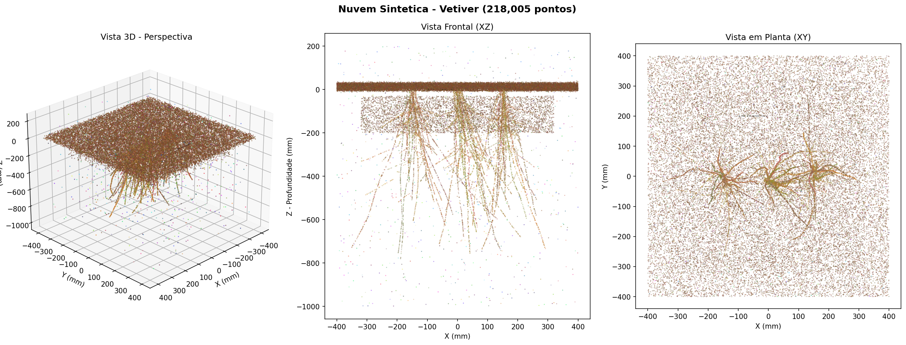

# Modelagem 3D de Sistemas Radiculares {#sec-modelagem-3d}

## Introdução à Fotogrametria Aplicada a Raízes

A quantificação da contribuição mecânica das raízes na estabilidade de taludes é um dos pilares da bioengenharia de solos. Conforme discutido nos capítulos anteriores, os modelos de Wu (@sec-solos-tropicais) e Waldron dependem fundamentalmente de dois parâmetros: a resistência à tração das raízes ($\overline{t_R}$) e a razão de área radicular (*Root Area Ratio* — RAR). Tradicionalmente, o RAR é estimado por métodos bidimensionais — análise de perfis expostos em trincheiras ou contagem de raízes em quadrículas —, que subestimam o volume radicular em 20–40% por não capturarem a distribuição tridimensional das raízes.

A fotogrametria digital *Structure from Motion* (SfM) representa uma alternativa acessível e precisa para superação dessas limitações [@westoby2012]. A técnica permite reconstruir a geometria 3D completa de objetos a partir de múltiplas fotografias tomadas de ângulos diferentes, utilizando algoritmos de correspondência de pontos homólogos e triangulação. A @fig-fluxo-sfm ilustra o fluxo de trabalho completo, desde a captura fotográfica até a extração de parâmetros geotécnicos.

```{mermaid}
%%| label: fig-fluxo-sfm
%%| fig-cap: "Fluxograma do protocolo de fotogrametria SfM para modelagem de sistemas radiculares: da captura fotográfica ao cálculo do Fator de Segurança."
flowchart LR
  A["📷 Captura\nfotográfica\n(80-120 fotos)"] --> B["🔍 Feature\nExtraction\n(SIFT)"]
  B --> C["🔗 Feature\nMatching"]
  C --> D["📐 Structure\nfrom Motion"]
  D --> E["☁️ Nuvem de\npontos densa"]
  E --> F["🧹 Limpeza\n(CloudCompare)"]
  F --> G["✂️ Cortes\ntransversais"]
  G --> H["📊 Cálculo\ndo RAR"]
  H --> I["🛡️ Δcr e Fator\nde Segurança"]
```

As vantagens da SfM para aplicação em bioengenharia incluem baixo custo (câmera de celular com ≥ 12 MP), portabilidade (uso direto em campo), disponibilidade de software livre (Meshroom, CloudCompare) e resolução submilimétrica (0,1–1,0 mm), suficiente para detectar raízes finas de gramíneas como o vetiver.

## Preparação do Sítio Experimental

### Critérios de Seleção

A seleção do sítio experimental deve considerar três critérios principais: vegetação de vetiver ou outra espécie de interesse estabelecida há pelo menos 6 meses (período mínimo para enraizamento funcional), inclinação do talude entre 25° e 45° (faixa crítica para erosão e instabilidade), e ausência de interferência antrópica recente. As coordenadas geográficas e um croqui do local devem ser registrados.

### Abertura da Trincheira e Exposição das Raízes

A área de exposição é demarcada com estacas, formando um retângulo de no mínimo 50 × 50 cm ao redor da touceira selecionada. A escavação deve ser cuidadosa, mantendo as raízes íntegras, e aprofundada até a máxima extensão visível — tipicamente 60–100 cm para vetiver com mais de 12 meses. O jato de água a baixa pressão é utilizado para remover o solo aderido sem romper raízes finas.

::: {.callout-tip}
## Dica de Campo
Após a lavagem com jato d'água, aguarde 5–10 minutos para que as raízes sequem superficialmente antes de fotografar. Raízes secas apresentam melhor contraste com o solo, mas uma leve borrifada de água imediatamente antes da captura melhora a textura visual nas fotos.
:::

### Montagem da Cena

A preparação da cena para fotogrametria requer: (a) posicionamento de escala métrica (trena graduada) em duas direções perpendiculares, (b) distribuição de quatro alvos codificados ao redor da área de interesse, em posições fixas e visíveis em todas as fotos, e (c) instalação de painel de fundo neutro (lona cinza) atrás das raízes para reduzir ruído no processamento.

## Aquisição Fotográfica

### Configuração da Câmera

A câmera deve ser configurada em modo manual (M) ou prioridade de abertura (Av), com ISO 100–400, abertura f/5.6 a f/8 (para máxima profundidade de campo), velocidade ≥ 1/125 s, foco manual fixo e flash desligado. A captura deve ser realizada sob iluminação difusa (céu nublado) ou com sol baixo, evitando sombras projetadas sobre as raízes.

### Protocolo de Captura Orbital

O protocolo de captura segue um padrão de órbitas concêntricas ao redor do sistema radicular, conforme descrito na @tbl-orbitas.

| Órbita | Distância (m) | Ângulo entre fotos | Nº de fotos | Objetivo |
|:------:|:-------------:|:-------------------:|:-----------:|----------|
| 1 — Contexto | 1,0–1,5 | 10–15° | 24–36 | Cobertura 360°, visão geral |
| 2 — Média | 0,5–0,8 | 10° | 36 | Detalhamento intermediário |
| 3 — Detalhe | 0,3–0,5 | Livre | ≥ 20 | Close-ups de zonas densas |

: Protocolo de captura fotográfica orbital para fotogrametria SfM de raízes. {#tbl-orbitas .striped .hover}

O total mínimo é de 80 fotos (recomendado: 100–120), com sobreposição ≥ 70% entre consecutivas. Cada ponto do objeto deve ser visível em pelo menos 3 fotos de ângulos distintos, e a escala métrica deve aparecer em ≥ 50% das imagens.

### Resolução Espacial (GSD)

A viabilidade da detecção de raízes finas depende da resolução espacial das fotos, expressa pelo *Ground Sampling Distance* (GSD):

$$GSD = \frac{d \times p}{f}$$ {#eq-gsd-cap22}

onde $d$ é a distância câmera-objeto (m), $p$ é o tamanho do pixel no sensor (mm) e $f$ é a distância focal (mm). O critério adotado é $GSD \leq d_{min}/2$, onde $d_{min}$ é o diâmetro da menor raiz a detectar. Para raízes de vetiver (diâmetro ≈ 0,5 mm), o GSD deve ser ≤ 0,25 mm/pixel — facilmente alcançável com câmeras de 12 MP a 0,5 m de distância.

## Processamento Fotogramétrico

### Pipeline no Meshroom

O processamento é realizado no Meshroom (AliceVision), software livre de fotogrametria SfM. A pipeline padrão compreende 10 nós sequenciais (@tbl-pipeline-meshroom).

| Passo | Nó | Configuração |
|:-----:|---|---|
| 1 | CameraInit | Auto-detecção |
| 2 | FeatureExtraction | Descritor SIFT, qualidade Normal |
| 3 | ImageMatching | VocabularyTree |
| 4 | FeatureMatching | Sem limite |
| 5 | StructureFromMotion | Padrão |
| 6 | DepthMapEstimation | Resolução Normal |
| 7 | DepthMapFiltering | Padrão |
| 8 | Meshing | maxPoints: 5.000.000 |
| 9 | MeshFiltering | Suavização fator 1 |
| 10 | Texturing | 4096 × 4096 |

: Pipeline de processamento fotogramétrico no Meshroom. {#tbl-pipeline-meshroom .striped .hover}

### Verificação de Qualidade

Após o nó StructureFromMotion, o número de câmeras calibradas deve ser ≥ 90% das fotos importadas. Se inferior a 70%, as fotos são insuficientes e deve-se retornar ao campo. O tempo de processamento varia de 30 minutos (80 fotos, GPU NVIDIA GTX 1060) a 8 horas (120 fotos, apenas CPU).

::: {.callout-warning}
## Requisito de Hardware
O Meshroom requer GPU NVIDIA com suporte CUDA para processamento em tempo razoável. Se não disponível, alternativas como COLMAP (modo CPU) ou Google Colab (GPU gratuita) podem ser utilizadas.
:::

### Exportação

Os produtos do processamento são a nuvem de pontos densa (formato `.ply`, com cores RGB) e a malha texturizada (formato `.obj` + `.mtl` + texturas `.png`).

## Análise no CloudCompare

### Limpeza da Nuvem de Pontos

O CloudCompare é o software utilizado para análise tridimensional. Após importação do arquivo `.ply`, a limpeza compreende três etapas: remoção manual de pontos do solo e fundo por segmentação poligonal (Edit → Segment), remoção estatística de outliers pelo *Statistical Outlier Removal* (SOR Filter, com 6 vizinhos e multiplicador 1,0–2,0), e subamostragem por espaçamento mínimo de 0,5–1,0 mm quando necessário.

### Calibração de Escala

A escala é calibrada pela ferramenta *Point Picking* (Tools → Point Picking), medindo-se a distância entre dois pontos conhecidos na régua graduada e aplicando-se o fator de correção $k = d_{real}/d_{medida}$ via Edit → Multiply/Scale nas três dimensões.

### Visualização por Profundidade

A distribuição vertical das raízes é visualizada pela ferramenta *Height Ramp* (Edit → Colors → Height Ramp), com coloração no eixo Z e paleta Blue-Green-Yellow-Red (azul = superficial, vermelho = profundo). A @fig-cloud-compare-exemplo ilustra o resultado típico.

{#fig-cloud-compare-exemplo fig-alt="Nuvem de pontos colorida por profundidade no CloudCompare" width="80%"}

## Extração do RAR por Cortes Transversais

### Método de Fatiamento

O RAR é o parâmetro principal extraído do modelo 3D. O procedimento consiste em fatiar horizontalmente a nuvem de pontos em camadas de 10 cm de espessura, utilizando a ferramenta *Cross Section* (Tools → Segmentation → Cross Section), com plano de corte XY.

Para cada fatia na profundidade $z_i$, a nuvem é rasterizada no plano XY (Tools → Projection → Rasterize, resolução de célula = 1 mm), e o RAR é calculado como:

$$RAR(z_i) = \frac{A_{raiz}}{A_{total}} = \frac{n_{raiz} \times A_{célula}}{n_{total} \times A_{célula}}$$ {#eq-rar-cap22}

onde $n_{raiz}$ é o número de células ocupadas por raízes e $n_{total}$ é o total de células na área delimitadora.

### Resultados Típicos

A @tbl-rar-exemplo apresenta valores típicos de RAR para vetiver estabelecido há 18 meses em talude rodoviário com solo argiloso tropical, obtidos por este protocolo.

| Camada (cm) | $A_{raiz}$ (cm²) | $A_{total}$ (cm²) | RAR (%) | $\Delta c_r$ — Wu (kPa) |
|:-----------:|:-----------------:|:------------------:|:-------:|:-----------------------:|
| 0–10 | 10,0 | 2500 | 0,40 | 7,2 |
| 10–20 | 7,5 | 2500 | 0,30 | 5,4 |
| 20–30 | 5,0 | 2500 | 0,20 | 3,6 |
| 30–50 | 3,0 | 2500 | 0,12 | 2,2 |
| 50–100 | 1,25 | 2500 | 0,05 | 0,9 |

: RAR e acréscimo de coesão por camada de profundidade para vetiver com 18 meses. {#tbl-rar-exemplo .striped .hover}

A distribuição é não linear, com concentração nas camadas superficiais: 80% do efeito mecânico ocorre nos primeiros 50 cm.

## Estimativa do Acréscimo de Coesão

### Modelo de Wu (1979)

Com os valores de RAR por camada, o acréscimo de coesão conferido pelas raízes é estimado pelo modelo de Wu:

$$\Delta c_r(z) = 1{,}2 \times \overline{t_R} \times RAR(z)$$ {#eq-wu-cap22}

onde $\overline{t_R}$ é a resistência média à tração das raízes e o fator 1,2 corrige a orientação aleatória. Para vetiver, $\overline{t_R}$ varia entre 40 e 180 MPa (média adotada: 75 MPa).

::: {.callout-important}
## Limitação do Modelo de Wu
O modelo de Wu assume que todas as raízes rompem simultaneamente, o que na prática não ocorre. Estudos de @pollen2005 demonstraram superestimação de 50–100% em relação a medições de campo. O modelo é adequado para triagem preliminar, mas projetos executivos devem utilizar o modelo de Waldron ou o modelo de fibras progressivas (FBM).
:::

### Modelo de Waldron (1977)

Para maior acurácia, o modelo de Waldron incorpora o ângulo de distorção da raiz ($\theta$) na zona de cisalhamento:

$$\Delta S = T_r \times \frac{A_r}{A_s} \times (\sin\theta + \cos\theta \tan\phi')$$ {#eq-waldron-cap22}

onde $\phi'$ é o ângulo de atrito efetivo do solo. A @tbl-comparativo-modelos compara os dois modelos para os dados da @tbl-rar-exemplo.

| Modelo | $\Delta c_r$ médio (0–30 cm) | Observação |
|--------|:----------------------------:|------------|
| Wu (1979) | 5,4 kPa | Limite superior (superestima) |
| Waldron (1977) | 3,8 kPa | Mais realista ($\theta$ = 55°, $\phi'$ = 25°) |

: Comparação entre modelos de acréscimo de coesão radicular. {#tbl-comparativo-modelos .striped .hover}

### Fator de Segurança

O efeito do reforço radicular na estabilidade é quantificado pelo Fator de Segurança (FS), calculado pelo modelo de talude infinito:

$$FS = \frac{c' + \Delta c_r + (\gamma z \cos^2\beta - u)\tan\phi'}{\gamma z \sin\beta \cos\beta}$$ {#eq-fs-cap22}

onde $c'$ é a coesão efetiva do solo, $\gamma$ é o peso específico, $z$ é a profundidade da superfície de ruptura, $\beta$ é a inclinação do talude e $u$ é a poropressão.

Para o caso estudado (talude 1V:1,5H, solo argiloso, $c'$ = 5 kPa, $\phi'$ = 25°, $\gamma$ = 18 kN/m³), o FS passou de 1,15 (solo natural) para 1,87 (solo com raízes de vetiver), um incremento de 63%.

## Ensaios Complementares

Os modelos mecânicos dependem de parâmetros obtidos por ensaios complementares de laboratório (@tbl-ensaios-cap22).

| Ensaio | Parâmetro | Norma |
|--------|-----------|-------|
| Tração direta de raízes | $t_R$ (MPa) | Adaptado ASTM D3822 |
| Cisalhamento direto | $c'$, $\phi'$ | ABNT NBR 12770 |
| Arrancamento de raízes | $\theta$ | Protocolo in-situ |
| Caracterização do solo | Textura, LL, LP, $\gamma$ | ABNT NBR 6457/7181 |

: Ensaios complementares de laboratório para alimentar os modelos mecânicos. {#tbl-ensaios-cap22 .striped .hover}

## Vantagens da Análise 3D sobre Métodos Convencionais

A modelagem tridimensional revela características não detectáveis pela análise 2D convencional:

- Distribuição assimétrica: raízes crescem preferencialmente para baixo do talude (geotropismo combinado com gravidade), o que significa que o reforço mecânico não é uniforme ao redor da touceira.

- Conexão entre touceiras: após 12 meses, raízes de touceiras vizinhas se entrelaçam, formando uma "malha viva" que distribui as tensões de cisalhamento de forma mais eficiente que raízes isoladas.

- Zonas de fragilidade: entre touceiras, o solo pode permanecer desprotegido, o que reforça a recomendação de espaçamento inferior a 20 cm entre mudas.

A @tbl-tecnicas-3d compara a fotogrametria SfM com outras técnicas de imagem 3D disponíveis para análise de sistemas radiculares.

| Técnica | Resolução | Custo | Portabilidade | Ideal para |
|---------|:---------:|:-----:|:-------------:|:-----------|
| **Fotogrametria SfM** | 0,1–1 mm | Baixo | Campo | Raízes expostas em taludes |
| LiDAR terrestre | 1–5 mm | Alto | Pesado | Estruturas > 1 m |
| Tomografia (CT) | 10–50 µm | Muito alto | Laboratório | Raízes finas in-situ |
| Ressonância (MRI) | 50–200 µm | Muito alto | Laboratório | Dinâmica de água |
| Scanner 3D estruturado | 0,05–0,5 mm | Médio | Lab/campo | Amostras em bancada |

: Comparativo de técnicas de imagem 3D para sistemas radiculares. {#tbl-tecnicas-3d .striped .hover}

A fotogrametria SfM é a única técnica que combina portabilidade de campo, resolução submilimétrica e custo acessível, tornando-a a ferramenta ideal para laboratórios de bioengenharia em países tropicais.

::: {.callout-tip}
## Aplicação Prática
O protocolo descrito neste capítulo pode ser aplicado a qualquer espécie vegetal de interesse para bioengenharia. Para espécies com raízes mais finas que o vetiver (como gramíneas nativas do Cerrado), reduza a distância de captura na Órbita 3 para 0,2–0,3 m e utilize câmera com resolução ≥ 20 MP para garantir GSD ≤ 0,15 mm/pixel.
:::
