# Introdução à Análise da Paisagem {#sec-introducao}

## O que é Análise da Paisagem?

Quando olhamos pela janela de um avião e vemos o mosaico de lavouras, fragmentos florestais, cidades e rios que se estende abaixo, estamos diante de uma paisagem. Mas o que distingue a Análise da Paisagem de simplesmente *descrever* esse mosaico? A resposta está na integração. Essa abordagem toma a paisagem como totalidade complexa, articulando seus componentes físicos, bióticos e socioespaciais por meio de métodos qualitativos e quantitativos voltados ao diagnóstico e ao planejamento territorial. Não se trata de uma disciplina isolada, mas de um exercício de síntese que reúne tradições complementares numa leitura integrada do espaço.

Pelo viés do *geossistema* [@bertrand2007], a paisagem é compreendida como combinação dinâmica e instável de elementos físicos, biológicos e antrópicos, ao passo que o ferramental da *ecologia da paisagem* (*Landscape Ecology*) quantifica os efeitos do padrão espacial sobre processos ecológicos. Soma-se a essas leituras a dimensão perceptiva e cultural, que reconhece a paisagem como experiência vivida, carregada de afeto, memória e significado. Analisar a paisagem significa, em última instância, compreender padrões e processos que organizam o espaço e, a partir dessa convergência de tradições, propor intervenções territoriais com base em evidências.

Essa visão não nasceu pronta. O conceito moderno de paisagem ecológica foi introduzido pelo geógrafo alemão Carl Troll em 1939, ao combinar fotointerpretação de fotografias aéreas com observações ecológicas de campo [@troll1939]. Troll propôs que a paisagem deveria ser entendida não como um cenário visual, mas como um sistema funcional no qual a heterogeneidade espacial condiciona fluxos de energia, matéria e organismos. Com isso, a paisagem saiu do domínio estético e descritivo para o domínio científico quantificável. A consolidação dessa trajetória levou mais de sete décadas, conforme sintetiza a @fig-evolucao-conceito.

::: {.content-visible when-format="html"}
```{mermaid}
%%| label: fig-evolucao-conceito
%%| fig-cap: "Linha do tempo dos principais marcos na consolidação da Análise da Paisagem como disciplina científica."
%%| fig-width: 7
graph LR
    A["1939<br>Carl Troll cunha<br>Landschaftsökologie"] --> B["1969<br>Neef publica bases<br>teóricas"]
    B --> C["1981<br>Naveh & Lieberman<br>primeiro livro-texto"]
    C --> D["1984<br>Allerton Park<br>formaliza a disciplina"]
    D --> E["1986<br>Forman & Godron<br>Landscape Ecology"]
    E --> F["1995<br>Forman publica<br>Land Mosaics"]
    F --> G["2002<br>McGarigal & Cushman<br>FRAGSTATS"]
    G --> H["2015<br>Turner & Gardner<br>2ª edição"]
    style A fill:#E8F5E9,stroke:#2E7D32,color:#000
    style B fill:#C8E6C9,stroke:#2E7D32,color:#000
    style C fill:#A5D6A7,stroke:#2E7D32,color:#000
    style D fill:#81C784,stroke:#1B5E20,color:#000
    style E fill:#66BB6A,stroke:#1B5E20,color:#000
    style F fill:#4CAF50,stroke:#1B5E20,color:#fff
    style G fill:#388E3C,stroke:#1B5E20,color:#fff
    style H fill:#2E7D32,stroke:#1B5E20,color:#fff
```
:::

::: {#fig-evolucao-conceito .content-visible when-format="pdf" fig-cap="Linha do tempo dos principais marcos na consolidação da Análise da Paisagem como disciplina científica."}

```{=latex}
\begin{tikzpicture}[
  every node/.style={font=\small},
  phase/.style={font=\scriptsize\bfseries, text=white, rounded corners=2pt,
    inner sep=3pt, minimum height=0.45cm},
  yearnode/.style={circle, fill=white, draw=green!50!black, line width=0.7pt,
    inner sep=0pt, minimum size=6mm, font=\footnotesize\bfseries},
  lbl/.style={align=center, font=\scriptsize, text width=2.1cm}
]

% === Eixo principal ===
\draw[green!50!black, line width=1.2pt]
  (0,0) -- (14,0);

% Marcas de fase (barras coloridas atrás do eixo)
\fill[green!80!black, opacity=0.08, rounded corners=3pt]
  (-0.3,-2.8) rectangle (5.3, 2.8);
\fill[green!60!black, opacity=0.08, rounded corners=3pt]
  (5.5,-2.8) rectangle (10.3, 2.8);
\fill[green!40!black, opacity=0.08, rounded corners=3pt]
  (10.5,-2.8) rectangle (14.3, 2.8);

% Rótulos de fase (topo)
\node[phase, fill=green!30!black] at (2.5, 2.5)
  {Fase Fundacional (1939--1981)};
\node[phase, fill=green!45!black] at (7.9, 2.5)
  {Formaliza\c{c}\~{a}o (1984--1995)};
\node[phase, fill=green!60!black] at (12.4, 2.5)
  {Fase Quantitativa};

% === Nós dos anos (no eixo) ===
\node[yearnode] (y39)  at ( 0.0, 0) {39};
\node[yearnode] (y69)  at ( 2.0, 0) {69};
\node[yearnode] (y81)  at ( 4.0, 0) {81};
\node[yearnode] (y84)  at ( 6.0, 0) {84};
\node[yearnode] (y86)  at ( 8.0, 0) {86};
\node[yearnode] (y95)  at (10.0, 0) {95};
\node[yearnode] (y02)  at (12.0, 0) {02};
\node[yearnode] (y15)  at (14.0, 0) {15};

% === Rótulos ACIMA (ímpares: 1,3,5,7) ===
\node[lbl, above=0.5cm of y39]  (L1) {Carl Troll cunha\\
  \textit{Landschafts-\\\"okologie}};
\node[lbl, above=0.5cm of y81]  (L3) {Naveh \&\\Lieberman:\\
  1\textsuperscript{o} livro-texto};
\node[lbl, above=0.5cm of y86]  (L5) {Forman \&\\Godron:\\
  \textit{Landscape\\Ecology}};
\node[lbl, above=0.5cm of y02]  (L7) {McGarigal \&\\Cushman:\\
  FRAGSTATS};

% === Rótulos ABAIXO (pares: 2,4,6,8) ===
\node[lbl, below=0.5cm of y69]  (L2) {Neef publica\\bases te\'{o}ricas};
\node[lbl, below=0.5cm of y84]  (L4) {Allerton Park\\formaliza a\\disciplina};
\node[lbl, below=0.5cm of y95]  (L6) {Forman publica\\\textit{Land Mosaics}};
\node[lbl, below=0.5cm of y15]  (L8) {Turner \&\\Gardner:\\
  2\textsuperscript{a} edi\c{c}\~{a}o};

% === Linhas de conexão (rótulo → nó) ===
\draw[gray!50, thin] (L1.south) -- (y39.north);
\draw[gray!50, thin] (L3.south) -- (y81.north);
\draw[gray!50, thin] (L5.south) -- (y86.north);
\draw[gray!50, thin] (L7.south) -- (y02.north);

\draw[gray!50, thin] (L2.north) -- (y69.south);
\draw[gray!50, thin] (L4.north) -- (y84.south);
\draw[gray!50, thin] (L6.north) -- (y95.south);
\draw[gray!50, thin] (L8.north) -- (y15.south);

% === Setas direcionais no eixo ===
\foreach \a/\b in {y39/y69, y69/y81, y81/y84, y84/y86, y86/y95, y95/y02, y02/y15}
  \draw[-stealth, green!50!black, line width=0.5pt]
    ([xshift=3.5mm]\a.east) -- ([xshift=-3.5mm]\b.west);

\end{tikzpicture}
```

:::

A @fig-evolucao-conceito revela uma trajetória de quase oito décadas que pode ser lida em três fases. Na fase fundacional (1939–1981), geógrafos da Europa Central como Troll [-@troll1939], Neef [-@neef1967] e Schmithüsen [-@schmithusen1976] desenvolveram os alicerces teóricos, enfatizando a paisagem como unidade integradora de processos naturais e culturais [@naveh2000]. O impulso para a formalização (1984–1995) veio da América do Norte, quando o workshop de Allerton Park consolidou a ecologia da paisagem como disciplina autônoma com vocabulário, métodos e questões de pesquisa próprios [@risser1984], culminando nas obras de Forman e Godron [-@forman1986] e Forman [-@forman1995]. Desde 2002, a fase quantitativa trouxe métricas espaciais padronizadas (FRAGSTATS), integração com SIG e sensoriamento remoto e sínteses abrangentes como Turner e Gardner [-@turner2015], que estabelecem o cânone contemporâneo [@wu2004].

## Paisagem como sistema

O que acontece quando paramos de olhar para um único ecossistema e passamos a enxergar o conjunto? A resposta da ecologia da paisagem é que surgem propriedades que simplesmente não existem na escala de uma parcela ou de uma unidade de conservação isolada. Forman e Godron [-@forman1986] captaram isso ao definir paisagem como uma “área heterogênea composta por um conjunto de ecossistemas interativos que se repete de forma similar”. Três propriedades sustentam essa definição e merecem aprofundamento.

A heterogeneidade espacial é a primeira delas. Quando falamos em heterogeneidade, referimo-nos à variação na composição e na configuração dos elementos da paisagem, e essa variação não é ruído a ser eliminado, mas a própria variável explanatória central da disciplina [@gustafson1998]. Uma paisagem é heterogênea porque contém tipos distintos de cobertura (floresta, pastagem, cultivo, área urbana, corpo d'água) distribuídos num arranjo espacial específico, e é precisamente esse arranjo que determina quais processos ecológicos são viáveis, quais espécies persistem e quais serviços ecossistêmicos são mantidos. 

A heterogeneidade pode ser natural (condicionada por relevo, solos e clima) ou antrópica (resultante de uso da terra), e as paisagens reais são tipicamente mosaicos nos quais ambas as fontes de heterogeneidade se sobrepõem [@wiens1999].

Essa heterogeneidade só adquire significado funcional, porém, porque as unidades que compõem a paisagem não existem como ilhas. Fluxos de organismos, nutrientes, energia, propágulos e distúrbios atravessam fronteiras entre os distintos elementos da paisagem. Uma mancha florestal não existe isoladamente, ela troca organismos com outras manchas (por dispersão através da matriz), recebe nutrientes de áreas agrícolas adjacentes (por escoamento superficial), é afetada por vento e luminosidade provenientes de áreas abertas (efeito de borda) e pode ser atingida por fogo propagado a partir de pastagens vizinhas [@taylor1993]. Essas interações entre elementos espacialmente distintos são a essência do que distingue a ecologia da paisagem da ecologia de ecossistemas, que tipicamente estuda uma unidade de cada vez.

Tanto a heterogeneidade quanto essas interações dependem, porém, da lente que usamos para observá-las. Os processos ecológicos que operam na escala da paisagem (tipicamente $10^3$ a $10^5$ ha) diferem qualitativamente daqueles que operam em escalas menores, como a parcela ($10^{-2}$ ha) ou o ecossistema individual ($10^0$ a $10^2$ ha). 

Na escala da paisagem, processos como dispersão de espécies entre fragmentos, propagação de fogo por mosaicos de vegetação, drenagem de bacias hidrográficas e conectividade funcional entre habitats tornam-se observáveis e quantificáveis [@wu2013], enquanto na escala de parcela permanecem invisíveis. A escolha da escala de análise não é, portanto, uma decisão meramente técnica, mas determina quais processos serão detectáveis e quais permanecerão ocultos, tema desenvolvido em profundidade no @sec-escalas.

### A raiz sistêmica: Bertalanffy e a Teoria Geral dos Sistemas

Tratar a paisagem como sistema pressupõe um arcabouço teórico que não nasceu na Geografia. A formulação mais influente veio do biólogo austríaco Ludwig von Bertalanffy (1901–1972), que em 1950 propôs a Teoria Geral dos Sistemas (TGS) como tentativa de encontrar princípios organizacionais válidos para qualquer sistema — biológico, físico ou social [@bertalanffy1968]. A premissa central da TGS é que o todo não se reduz à soma das partes: um organismo não é a coleção de suas células, assim como uma paisagem não é a justaposição de suas manchas. A totalidade possui propriedades emergentes que só existem no nível do sistema e que desaparecem quando se decompõe a análise em elementos isolados.

Cinco conceitos da TGS são particularmente relevantes para a ciência da paisagem. A *totalidade* afirma que as propriedades do sistema derivam das relações entre seus componentes, não de seus atributos individuais — é o que permite que a configuração espacial de uma paisagem explique mais sobre os processos ecológicos do que a soma das áreas de cada tipo de cobertura. O *isomorfismo* reconhece que leis estruturais semelhantes operam em sistemas de natureza distinta, o que fundamenta a transposição de modelos ecológicos para sistemas socioambientais. A *equifinalidade* admite que estados finais semelhantes podem ser alcançados a partir de condições iniciais diferentes — duas bacias hidrográficas com histórias de uso distintas podem convergir para o mesmo padrão de mosaico. A *homeostase* descreve a tendência do sistema a manter-se em equilíbrio dinâmico por meio de mecanismos de retroalimentação negativa, como a regeneração natural de bordas florestais que atenua o efeito de borda. E a *hierarquia* reconhece que sistemas contêm subsistemas organizados em níveis aninhados — do geótopo à zona climática, na formulação de Bertrand [-@bertrand2007].

A TGS ofereceu à Geografia uma linguagem transdisciplinar que permitiu integrar o que antes era estudado separadamente: climatologia, geomorfologia, hidrologia, biogeografia, e a interface entre natureza e sociedade. Foi essa linguagem que habilitou Sochava [-@sochava1977] a propor, em 1963, o conceito de geossistema na escola soviética, e Bertrand [-@bertrand2007] a reformulá-lo, em 1968, como unidade de análise que integra potencial ecológico, exploração biológica e ação antrópica. Sem a TGS, a ideia de paisagem como totalidade funcional teria permanecido uma metáfora, não um programa de pesquisa.

### Da ordem ao caos: a contribuição de Prigogine

Se Bertalanffy explicou como sistemas funcionam, o físico-químico Ilya Prigogine (1917–2003) explicou por que mudam de estado. Laureado com o Nobel de Química em 1977 por seus trabalhos sobre estruturas dissipativas, Prigogine propôs que sistemas abertos longe do equilíbrio termodinâmico podem criar ordem espontaneamente a partir do fluxo contínuo de energia e matéria [@prigogine1977]. Essa formulação, aprofundada em *O Fim das Certezas* [-@prigogine1996], representa uma extensão crítica da TGS: enquanto Bertalanffy enfatizava o equilíbrio dinâmico e a retroalimentação estável, Prigogine mostrou que os fenômenos mais interessantes ocorrem justamente longe do equilíbrio, onde o sistema perde previsibilidade e novas formas de organização emergem.

Quatro conceitos de Prigogine são diretamente aplicáveis à análise da paisagem. As *estruturas dissipativas* explicam por que a paisagem mantém organização espacial: ela é um sistema aberto que dissipa continuamente energia solar e precipitação, e a heterogeneidade do mosaico é, em certa medida, uma forma de ordem sustentada por esse fluxo. A *irreversibilidade* introduz a seta do tempo nos processos paisagísticos: uma voçoroca não retorna espontaneamente a uma encosta estável, e a sequência desmatamento → erosão → assoreamento não pode ser revertida simplesmente pelo replantio, porque o solo perdido, o banco de sementes destruído e a rede de drenagem alterada são transformações com memória. As *bifurcações* (ou limiares) descrevem os pontos críticos em que o sistema "escolhe" um novo estado de organização; na ecologia da paisagem, o exemplo mais estudado é o limiar de percolação, abaixo do qual a conectividade entre fragmentos de habitat colapsa abruptamente quando a cobertura vegetal cai para menos de aproximadamente 30% da paisagem [@stauffer1994]. A *auto-organização* reconhece que padrões espaciais — como a distribuição de manchas de caatinga conforme topografia e disponibilidade hídrica, ou a estruturação de mosaicos agroflorestais sem planejamento centralizado — emergem de interações locais entre componentes do sistema sem a necessidade de um controle externo.

A transição de Bertalanffy a Prigogine pode ser sintetizada como a passagem de uma visão de sistemas em equilíbrio para uma visão de sistemas em transformação. Na prática da análise da paisagem, quando identificamos limiares de fragmentação, avaliamos a resiliência de mosaicos a perturbações ou diagnosticamos trajetórias irreversíveis de degradação, estamos operando, implicitamente, no arcabouço conceitual de Prigogine. Essa cadeia de pensamento sistêmico — TGS (Bertalanffy, 1950) → Geossistema soviético (Sochava, 1963) → Geossistema francês (Bertrand, 1968) → Complexidade e irreversibilidade (Prigogine, 1977/1996) → Análise da paisagem contemporânea — constitui o alicerce epistemológico sobre o qual se erguem os métodos e as métricas abordados nos capítulos seguintes.

## As tradições formadoras

Nenhuma disciplina nasce isolada. A análise da paisagem se construiu ao longo de quatro tradições intelectuais que, embora independentes em origem, convergem progressivamente desde o final do século XX.

### Tradição alemã (*Landschaftskunde*)

Foi na Alemanha que a paisagem primeiro ganhou o estatuto de unidade espacial classificável e cartografável. Siegfried Passarge [-@passarge1921] desenvolveu as primeiras tipologias paisagísticas no início do século XX, e Carl Troll [-@troll1939] formalizou a *Landschaftsökologie* em 1939, ao cruzar fotointerpretação aérea com observações ecológicas de campo. Ernst Neef [-@neef1967] e Josef Schmithüsen [-@schmithusen1976] aprofundaram a cartografia de paisagens e a biogeografia integrada, respectivamente. Essa tradição legou à disciplina a ênfase na forma, na estrutura e na classificação hierárquica das unidades de paisagem.

### Tradição francesa (*science du paysage*)

Se a tradição alemã classificou a paisagem, a francesa a humanizou. Sob influência da geografia vidaliana, centrada na relação sociedade-natureza, Paul Vidal de la Blache [-@vidal1922] introduziu a noção de *gêneros de vida*, que vincula práticas culturais ao substrato biofísico. Georges Bertrand [-@bertrand2007; ver também @bertrand1971] reformulou essa tradição ao propor o *geossistema* como unidade de análise que integra potencial ecológico (relevo, clima, hidrologia), exploração biológica (vegetação, solos, fauna) e ação antrópica (uso e manejo) numa combinação dinâmica e instável. Jean Tricart [-@tricart1977] contribuiu com o conceito de ecodinâmica e fragilidade ambiental, ao passo que Augustin Berque [-@berque1984] acrescentou a dimensão cultural ao tratar a paisagem como mediação entre sociedade e território, conceito aprofundado na @sec-percepcao. Essa tradição trouxe a hierarquia escalar (do geótopo ao domínio) e a integração do componente humano como parte constitutiva da paisagem.

### Tradição anglo-saxônica (*Landscape Ecology*)

Enquanto europeus debatiam o significado da paisagem, norte-americanos trataram de medí-la. A ecologia da paisagem se consolidou na América do Norte a partir do workshop de Allerton Park [@risser1984], com forte ancoragem na ecologia quantitativa e na biologia da conservação. Forman e Godron [-@forman1986] propuseram o modelo *mancha-corredor-matriz*, que operacionaliza a paisagem como mosaico cujas propriedades de composição e configuração podem ser quantificadas por métricas espaciais e correlacionadas com indicadores ecológicos. Monica Turner aprofundou a dinâmica de perturbações [@turner2015], e Kevin McGarigal desenvolveu o FRAGSTATS, programa que padronizou o cálculo de métricas de paisagem [@mcgarigal2012]. O rigor estatístico e computacional é a marca dessa tradição, que produziu também arcabouços como a teoria de metapopulações aplicada a paisagens fragmentadas [@haddad2015].

### Síntese brasileira

O Brasil, por sua posição no mundo tropical e por sua tradição geográfica própria, acabou produzindo uma síntese original dessas tradições. Aziz Ab'Sáber [-@absaber2003] propôs os domínios morfoclimáticos como unidades de paisagem definidas pela interação entre relevo, clima e vegetação, estabelecendo uma leitura macroescalar do território nacional. Carlos Augusto Monteiro [-@monteiro2000] desenvolveu a análise integrada da paisagem e introduziu o conceito de *derivações antropogênicas*, que classifica as transformações impostas pela sociedade em supressão (remoção de componentes nativos), inserção (introdução de elementos exógenos) e alteração funcional (mudança nos fluxos e ritmos do sistema). 

Essas derivações se acumulam no tempo, criando trajetórias de degradação ou recuperação cuja leitura é possível pela análise da paisagem. Milton Santos [-@santos2006] contribuiu com a distinção operacional entre paisagem (forma, herança material) e espaço (forma somada ao conteúdo social que a anima), distinção aprofundada na @sec-distincoes-operacionais. Jean Paul Metzger [-@metzger2001] articulou uma síntese operacional ao definir ecologia de paisagens como "o estudo da estrutura, função e dinâmica de áreas heterogêneas compostas por ecossistemas interativos", sublinhando que o diferencial da abordagem é tratar explicitamente o efeito da configuração espacial sobre os processos em estudo. Essa formulação, que combina o rigor quantitativo da tradição ecológica com a atenção ao contexto territorial da tradição geográfica, guia o presente livro.

## A construção histórica do conceito de paisagem

Antes de se tornar um conceito científico operacional, a paisagem percorreu um longo caminho na história do pensamento ocidental, da contemplação estética renascentista à formulação sistêmica contemporânea. Recuperar essa trajetória ajuda a evitar reducionismos e a reconhecer que a paisagem sempre carregou, simultaneamente, dimensões materiais e imateriais.

### Da pintura ao conceito: a paisagem como forma de ver

O próprio termo *paisagem* (*Landschaft*, *paysage*, *landscape*) emergiu no vocabulário europeu vinculado à representação pictórica do território. Na tradição flamenga do século XVI, pintores como Joachim Patinir inauguraram a paisagem como gênero artístico autônomo [@cosgrove1984], e sua *Travessia do Estige* (Fig. @fig-patinir) ilustra essa virada com clareza. Pela primeira vez, o cenário natural ocupa o papel central da composição, e as figuras humanas, antes protagonistas, tornam-se pequenas diante da imensidão geológica e atmosférica. A paisagem deixa de ser pano de fundo para cenas religiosas e passa a ser, ela mesma, o assunto da pintura.

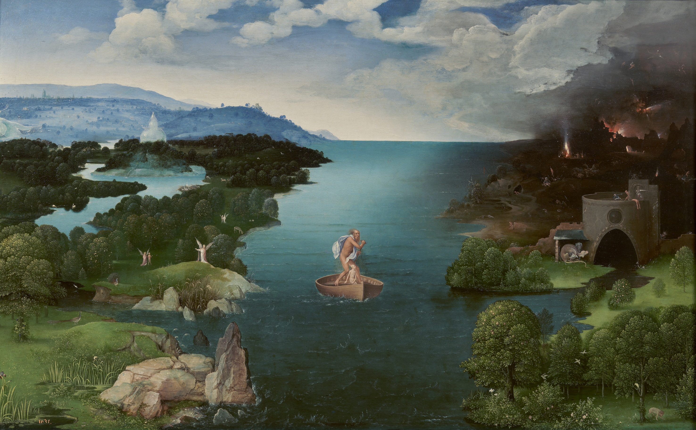{#fig-patinir width="85%"}

Um século e meio depois, a pintura holandesa levou essa autonomia adiante ao vincular a paisagem à identidade de um povo. Na obra de Jacob van Ruisdael (Fig. @fig-ruisdael), o moinho, os canais e o céu vasto não são apenas elementos visuais, mas símbolos do domínio técnico sobre a natureza, da engenharia hidráulica que transformou pântanos em terras produtivas. A paisagem pintada torna-se, nesse momento, expressão de território e pertencimento, um registro visual de como uma sociedade se reconhece no espaço que construiu.

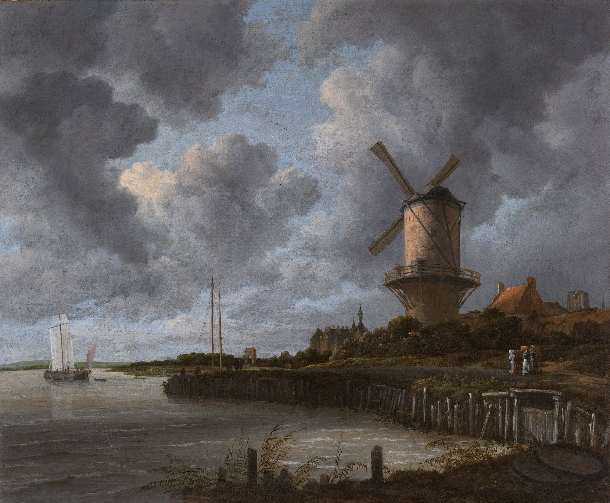{#fig-ruisdael width="85%"}

A terceira inflexão veio com o Romantismo alemão. No célebre *Viajante sobre o mar de névoa* de Caspar David Friedrich (Fig. @fig-friedrich), o observador aparece de costas, contemplando uma paisagem que se dissolve em névoa e montanhas. A pintura já não retrata um território específico, mas a experiência subjetiva de estar diante da imensidão. É o nascimento da paisagem como construção perceptiva, na qual o que importa não é apenas o que se vê, mas quem vê e o que sente ao ver. Essa dimensão afetiva, aparentemente distante da ciência, será recuperada no século XX pela fenomenologia e pela geografia humanística (ver @sec-percepcao).

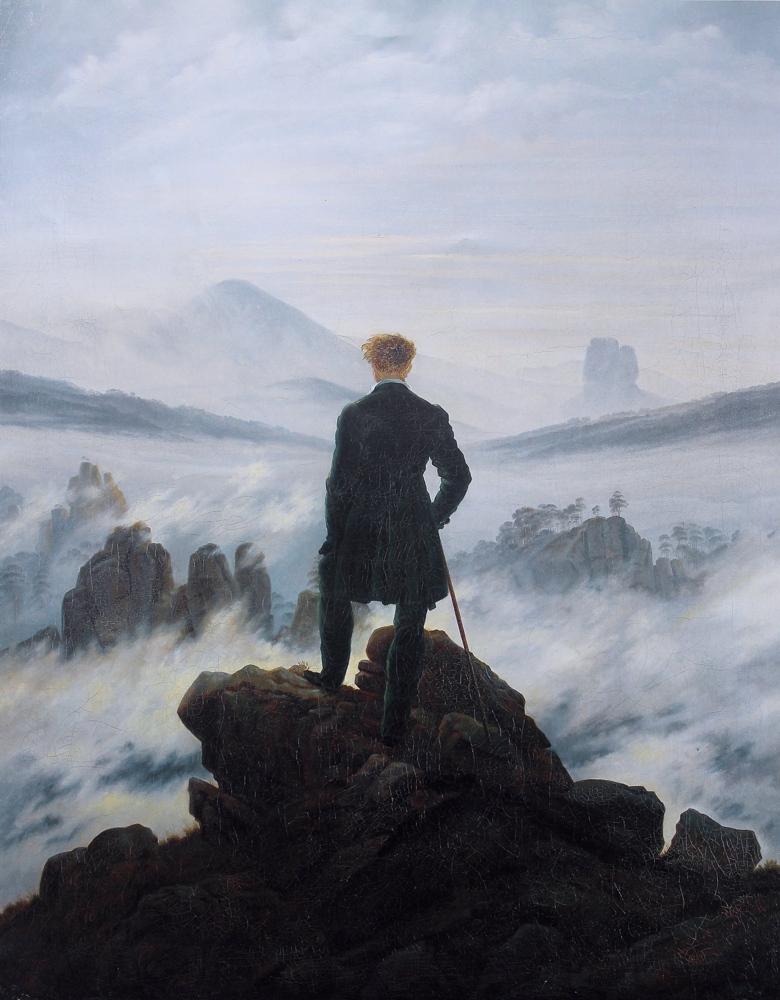{#fig-friedrich width="70%"}

Essa progressão, de Patinir a Friedrich, não é apenas história da arte. Ela demostra que a arte passou também por uma transformação epistemológica na qual a paisagem deixou de ser um espaço dado e passa a ser, simultaneamente, território, identidade e experiência vivida.

### O empirismo raciocinado de Humboldt

A passagem da paisagem estética para a paisagem científica tem um marco decisivo em Alexander von Humboldt (1769–1859). Naturalista, geógrafo e viajante incansável (Fig. @fig-humboldt-retrato), Humboldt recusou a especialização disciplinar numa época em que ela começava a se impor, e dedicou a vida a buscar conexões entre fenômenos que outros tratavam separadamente.

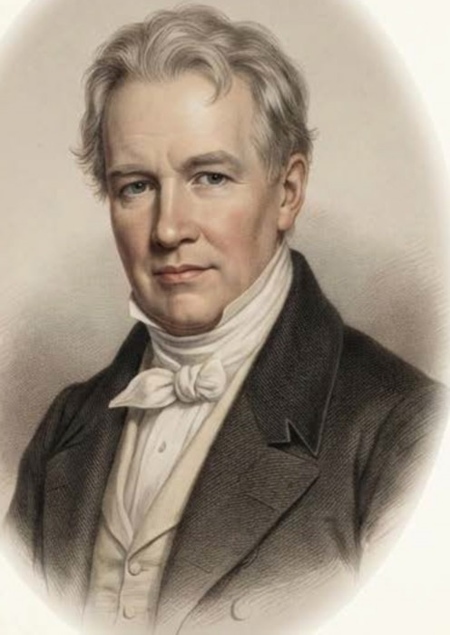{#fig-humboldt-retrato width="45%"}

Em suas expedições pelas Américas (1799–1804), Humboldt desenvolveu o que chamou de *empirismo raciocinado* (*raisonnierter Empirismus*), uma abordagem que integrava observação sistemática de fenômenos naturais com a busca por conexões causais entre eles [@humboldt1807]. A expedição ao Chimborazo (Fig. @fig-humboldt-chimborazo), realizada ao lado de Aimé Bonpland, tornou-se o laboratório dessa abordagem, pois Humboldt registrou, vertente acima, como vegetação, temperatura, pressão e umidade mudavam em conjunto, e não isoladamente.

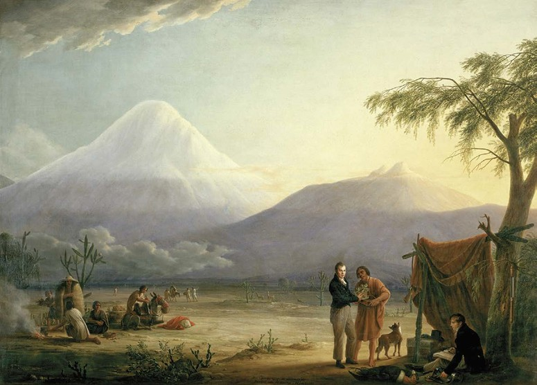{#fig-humboldt-chimborazo width="68%"}

O *Naturgemälde* (quadro da natureza), publicado em 1807, é considerado o primeiro diagrama de paisagem, uma representação integrada do vulcão Chimborazo mostrando, numa única imagem, a variação altitudinal de vegetação, temperatura, pressão atmosférica, umidade e composição química do ar. 

Essa visualização sintetiza o método humboldtiano em seus três pilares complementares. A observação empírica rigorosa fornecia medições sistemáticas de variáveis ambientais em campo, enquanto a intuição das conexões permitia identificar correlações entre fenômenos aparentemente independentes. Da convergência entre ambas emergia a síntese integradora, representação visual e narrativa que revelava o *todo* como mais do que a soma das partes.

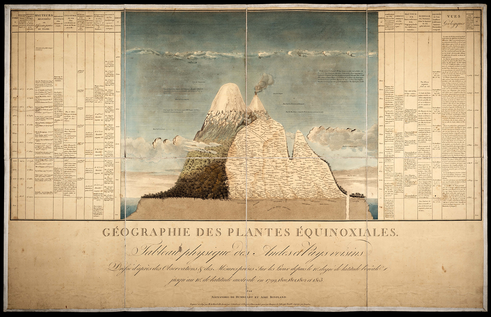{#fig-naturgemalde width="78%"}

O legado humboldtiano ecoa diretamente na ciência da paisagem contemporânea. A premissa de que a paisagem é um sistema integrado, no qual padrões de vegetação resultam da interação entre clima, relevo, solos e ação humana, é a formulação fundacional que Troll viria a operacionalizar em 1939 com o conceito de *Landschaftsökologie*.

### Dimensão perceptiva e afetiva da paisagem

Até aqui, tratamos da paisagem como configuração material mensurável. Mas qualquer pessoa que já sentiu saudade de um lugar sabe que a paisagem é também experiência vivida. A geografia humanística do século XX recuperou essa dimensão ao propor que a relação entre pessoa e lugar é carregada de afeto, memória e significado.

Yi-Fu Tuan [-@tuan1974] introduziu os conceitos complementares de *topofilia* (o vínculo afetivo positivo entre uma pessoa e um lugar, que gera sentimento de pertencimento) e *topofobia* (a aversão ou medo associado a determinadas paisagens, como áreas degradadas, desmatadas ou de risco). Esses conceitos são operacionalmente relevantes porque influenciam diretamente as atitudes e decisões de manejo. Agricultores com forte topofilia tendem a conservar paisagens tradicionais, enquanto a topofobia associada a áreas de vegetação densa pode motivar desmatamento.

Augustin Berque [-@berque1984] aprofundou essa abordagem ao propor a dualidade *paisagem-marca* e *paisagem-matriz*. A paisagem é simultaneamente marca (expressão material de uma sociedade, inscrita no território) e matriz (moldura que condiciona a percepção, a identidade e as práticas futuras dessa sociedade). Uma paisagem de caatinga com cercados de pedra seca é marca da cultura pecuária sertaneja e, ao mesmo tempo, matriz que organiza os modos de vida, os deslocamentos e a identidade das comunidades que ali habitam.

```{mermaid}
%%| label: fig-marca-matriz
%%| fig-cap: "A dualidade paisagem-marca e paisagem-matriz segundo Berque: a sociedade inscreve-se no território (marca) e o território condiciona a sociedade (matriz), num ciclo contínuo."
%%| fig-width: 7
graph LR
    S["Sociedade<br>(cultura, práticas,<br>identidade)"]
    P["Paisagem<br>(território,<br>materialidade)"]
    S -- "inscreve → MARCA" --> P
    P -- "condiciona → MATRIZ" --> S
    style S fill:#FFF3E0,stroke:#E65100,color:#000
    style P fill:#E8F5E9,stroke:#2E7D32,color:#000
```

Essa perspectiva integrada, que reconhece a paisagem como simultaneamente objeto material e construção perceptiva, fundamenta a abordagem adotada neste livro. O desafio é quantificar a estrutura espacial da paisagem sem perder de vista que toda paisagem é percebida, valorada e transformada por sujeitos históricos concretos.

## Conceitos operacionais

Alguns termos aparecerão repetidamente ao longo deste livro, e convém que o leitor tenha desde já uma referência clara de seus significados. A @tbl-conceitos-basicos reúne as definições operacionais que servirão de base para os capítulos seguintes.

| Conceito | Definição operacional |
|:---|:---|
| Paisagem | Mosaico heterogêneo de ecossistemas interativos percebido numa escala espacial definida pelo processo de interesse |
| Elemento da paisagem | Unidade espacial relativamente homogênea distinguível na escala de análise (mancha, corredor ou matriz) |
| Estrutura | Composição (tipos e proporções de elementos) e configuração (arranjo espacial) da paisagem |
| Função | Fluxos de energia, matéria e organismos entre os elementos da paisagem |
| Dinâmica | Mudanças na estrutura e na função ao longo do tempo |
| Escala | Dimensão espacial e temporal na qual um processo é observado, definida pela extensão e pela resolução (grão) |

: Conceitos operacionais fundamentais da Análise da Paisagem, adaptados de Forman e Godron [-@forman1986] e Turner e Gardner [-@turner2015]. {#tbl-conceitos-basicos .striped .hover}

Os conceitos da @tbl-conceitos-basicos são interdependentes. A estrutura condiciona a função (os fluxos ecológicos), que por sua vez retroalimenta a estrutura ao longo do tempo, como quando a perda de biodiversidade altera processos de polinização, dispersão e regeneração que mantinham as manchas de habitat. A dinâmica é o registro temporal dessa interação, e a escala define a janela de observação dentro da qual ela se torna visível.

### Distinções operacionais {#sec-distincoes-operacionais}

Na literatura geográfica e ecológica, os termos *paisagem*, *espaço*, *território* e *ambiente* aparecem frequentemente como sinônimos, o que gera mais confusão do que clareza. Milton Santos [-@santos2006] propôs uma distinção operacional segundo a qual a paisagem é a forma, a herança, o registro material de um momento, enquanto o espaço é a forma somada ao conteúdo social e funcional que a anima. Assim, uma paisagem pode ser fotografada e descrita, mas o espaço exige a compreensão dos processos sociais, econômicos e ecológicos que nela operam.

A @tbl-distincoes-operacionais sintetiza essas distinções conforme formulações clássicas da geografia brasileira e da ecologia da paisagem.

| Categoria | Definição operacional | Ênfase analítica |
|:---|:---|:---|
| **Paisagem** | Configuração material visível num recorte espaço-temporal; forma + herança | Estrutura e padrões espaciais |
| **Espaço** | Paisagem + conteúdo social e funcional; forma + vida que a anima | Processos e relações socioecológicas |
| **Território** | Espaço apropriado e delimitado por relações de poder | Governança, conflitos, gestão |
| **Ambiente** | Conjunto de condições biofísicas e sociais que afetam os organismos | Sustentabilidade, impactos |

: Distinções operacionais entre paisagem, espaço, território e ambiente, adaptadas de Santos [-@santos2006] e Ab'Sáber [-@absaber2003]. {#tbl-distincoes-operacionais .striped .hover}

Essas distinções não são meramente semânticas, pois cada categoria abre um campo de perguntas e métodos diferente. Quando analisamos a *paisagem*, operamos predominantemente com métricas espaciais e imagens de satélite. Quando investigamos o *espaço*, precisamos integrar dados socioeconômicos e entrevistas. Quando abordamos o *território*, entramos no domínio da governança ambiental e dos conflitos fundiários. E quando tratamos do *ambiente*, mobilizamos indicadores de qualidade ambiental e sustentabilidade. Este livro transita entre essas categorias, mas tem na *paisagem*, entendida como configuração espacial mensurável, seu eixo analítico principal.

## Por que a análise da paisagem importa nos trópicos?

Em paisagens tropicais, a análise da paisagem adquire relevância particular por razões que se reforçam mutuamente. A elevada biodiversidade dessas regiões implica que a fragmentação de habitats afeta um número proporcionalmente maior de espécies, muitas das quais endêmicas e com distribuição restrita [@fahrig2003]. Espécies tropicais tendem a ser mais vulneráveis à perda de habitat do que suas congêneres temperadas, em razão de áreas de vida maiores (para grandes mamíferos), menor capacidade de cruzar matrizes hostis (para aves de sub-bosque) e dependência de interações mutualísticas que se degradam em fragmentos pequenos (polinização, dispersão de sementes) [@fahrig2017; @haddad2015]. Essa vulnerabilidade é agravada pela dinâmica acelerada de uso do solo, com taxas de desmatamento e conversão agrícola que alteram a estrutura da paisagem em escalas temporais de poucos anos a décadas [@soares-filho2006]. No Cerrado brasileiro, por exemplo, a fronteira agrícola converteu centenas de milhares de hectares de vegetação nativa por ano nas décadas de 2000–2020, exigindo métodos de monitoramento capazes de detectar mudanças em tempo quase real.

Soma-se a essa dinâmica de conversão a sazonalidade pluviométrica característica dos trópicos, que condiciona processos hidrológicos e erosivos cuja intensidade varia conforme a configuração da cobertura do solo na bacia hidrográfica. Em bacias com alta proporção de solo exposto ou pastagem degradada, a concentração de chuvas no período úmido gera escoamento superficial intenso, erosão acelerada e assoreamento de cursos d'água, processos cuja magnitude depende diretamente da presença, posição e conectividade das manchas de vegetação remanescente na paisagem [@taylor1993; @metzger2006].

::: {.callout-important}
## Paisagens tropicais e urgência analítica
No Brasil, a Mata Atlântica remanescente ocupa menos de 12% de sua extensão original, distribuída em mais de 245.000 fragmentos cuja área mediana é inferior a 50 hectares [@ribeiro2009]. Essa fragmentação extrema torna a análise da paisagem, particularmente a quantificação de conectividade funcional e a identificação de áreas prioritárias para restauração, uma ferramenta indispensável para a conservação da biodiversidade e a manutenção de serviços ecossistêmicos.
:::

### Paisagens agrícolas tradicionais

As paisagens tropicais brasileiras não são apenas repositórios de biodiversidade silvestre. São também o resultado de séculos de manejo por comunidades tradicionais que desenvolveram sistemas agrícolas adaptados às condições edafoclimáticas locais, constituindo paisagens culturais em que biodiversidade, produção e identidade territorial se entrecruzam.

A @tbl-paisagens-tradicionais apresenta exemplos emblemáticos desses sistemas no contexto brasileiro.

| Sistema | Bioma / Região | Princípio de manejo | Legado paisagístico |
|:---|:---|:---|:---|
| Roça de toco / Coivara | Amazônia, Mata Atlântica | Agricultura itinerante com pousio longo | Mosaico de capoeiras em diferentes estágios sucessionais |
| Cabruca | Mata Atlântica (Sul da Bahia) | Cacau cultivado sob dossel florestal nativo | Paisagem agroflorestal que conserva ~60% da estrutura florestal |
| Fundo de Pasto | Caatinga (Bahia) | Pastoreio extensivo comunitário em áreas de vegetação nativa | Paisagem silvipastoril com manutenção da cobertura nativa |
| Agrofloresta quilombola | Mata Atlântica, Cerrado | Policultivos em múltiplos estratos | Paisagem multiestrato com alta agrobiodiversidade |
| Faxinal | Floresta com Araucária (Paraná) | Criação coletiva em áreas comuns florestadas | Paisagem agrossilvipastoril com floresta conservada |
| Quebradeiras de babaçu | Transição Cerrado-Amazônia | Extrativismo do babaçu com manutenção das palmeiras | Paisagem com cobertura de palmeiras integrada a cultivos |
| Palma forrageira | Caatinga (Semiárido) | Cultivo de *Opuntia* como forrageira em áreas secas | Paisagem xérica produtiva adaptada ao déficit hídrico |

: Sistemas agrícolas tradicionais brasileiros como paisagens culturais. {#tbl-paisagens-tradicionais .striped .hover}

A roça de toco, ou coivara (Fig. @fig-coivara), é possivelmente o exemplo mais antigo de manejo paisagístico deliberado nos trópicos. Ao derrubar e queimar pequenas parcelas de floresta, cultivar por dois ou três ciclos agrícolas e depois abandonar a área ao pousio longo, comunidades indígenas e caboclas criaram, ao longo de séculos, mosaicos compostos por capoeiras em diferentes estágios sucessionais, fragmentos de floresta velha e roçados ativos. Cada parcela em pousio segue uma trajetória particular de regeneração, condicionada pela idade do abandono, pela composição do banco de sementes no solo e pela distância de remanescentes florestais que atuam como fontes de propágulos. O resultado, lido pela escala da paisagem, é uma heterogeneidade espacial que sustenta diversidade florística e faunística substancialmente superior à de monocultivos contínuos, pois a alternância temporal de perturbação cíclica e regeneração gera a variedade de estruturas verticais e horizontais que diferentes grupos funcionais de fauna exigem.

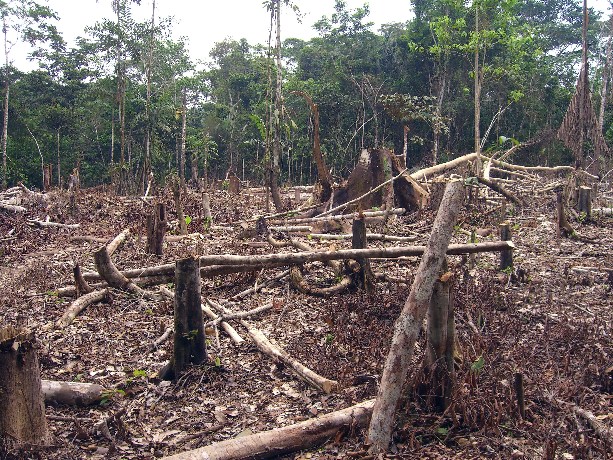{#fig-coivara width="85%"}

Na Mata Atlântica, comunidades quilombolas desenvolveram sistemas agroflorestais em múltiplos estratos nos quais frutíferas, hortaliças, tubérculos e espécies madeireiras coexistem sob e entre árvores nativas, replicando a arquitetura vertical da floresta original. A estrutura multiestratificada da Mata Atlântica remanescente (Fig. @fig-agrofloresta) serve, nesse contexto, como referência estrutural e reservatório genético: os quilombolas identificam nos fragmentos florestais adjacentes as espécies que incorporarão ao estrato superior das agroflorestas, mantendo um fluxo contínuo de material biológico entre o sistema produtivo e a vegetação nativa. O resultado paisagístico é uma matriz agroflorestal que, segundo inventários realizados em comunidades do Sul da Bahia, pode conservar entre 40% e 60% da riqueza florística da floresta nativa original [@diegues2000], ao mesmo tempo que provê alimento, madeira e renda às famílias. Na escala da paisagem, essas agroflorestas atuam como corredores funcionais que ampliam a conectividade entre fragmentos isolados de Mata Atlântica, aumentando a área efetiva de habitat disponível para espécies dependentes do interior florestal.

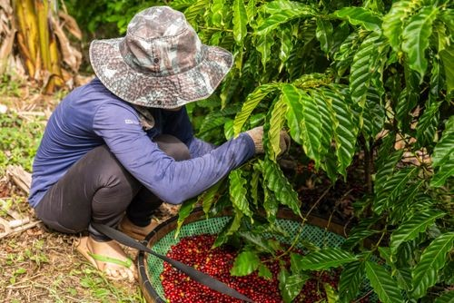{#fig-agrofloresta width="85%"}

Na transição entre Cerrado e Amazônia, as quebradeiras de babaçu (Fig. @fig-quebradeiras) praticam um extrativismo cujo fundamento econômico é inseparável da manutenção da cobertura vegetal. A coleta dos cocos de *Attalea speciosa* para produção de óleo, carvão, farinha e artesanato só é viável enquanto as palmeiras adultas permanecem em pé, o que torna o desmatamento economicamente irracional para as comunidades extrativistas. A palmeira do babaçu coloniza preferencialmente bordas de mata e capoeiras em regeneração, de modo que sua conservação está associada à manutenção de um mosaico de vegetação em diferentes estágios sucessionais. O resultado paisagístico é uma alternância entre cocais densos, áreas de cultivo e capoeiras que preserva tanto a cobertura vegetal quanto a diversidade de usos associados a uma única espécie, ilustrando como incentivos econômicos alinhados à conservação podem estruturar padrões de uso do solo favoráveis à biodiversidade na escala da paisagem.

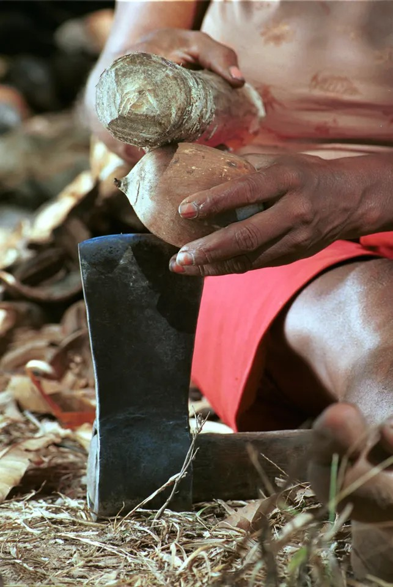{#fig-quebradeiras width="75%"}

No semiárido nordestino, a adaptação produtiva às condições limitantes de solo e regime hídrico produziu padrões paisagísticos igualmente específicos. A agricultura de sequeiro na Caatinga (Fig. @fig-caatinga-agro) opera em sintonia com os pulsos sazonais de chuva, selecionando cultivares localmente adaptados de feijão-caupi, milho crioulo e mandioca e concentrando os roçados nas encostas com maior profundidade efetiva de solo. Essa calibração empírica ao gradiente pedológico e topográfico, acumulada ao longo de gerações, resulta num mosaico de uso da terra que acompanha a heterogeneidade natural do relevo, preservando encostas mais íngremes e fundos de vale sob cobertura nativa de Caatinga. O efeito paisagístico é uma distribuição de remanescentes de vegetação funcionalmente relevante para a fauna local, com conectividade estrutural superior à de monocultivos extensivos que suprimem a cobertura de modo homogêneo.

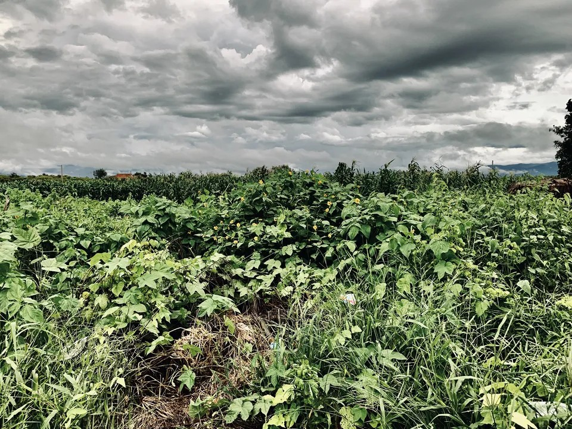{#fig-caatinga-agro width="85%"}

O cultivo de palma forrageira (*Opuntia* spp.) (Fig. @fig-palma) representa uma estratégia de adaptação ao déficit hídrico com consequências paisagísticas que extrapolam o sistema produtivo. Ao fornecer volumoso energético para rebanhos durante estiagens prolongadas, a palma reduz a pressão de pastejo sobre a Caatinga nativa adjacente, preservando indiretamente a cobertura vegetal que seria degradada na ausência dessa fonte de forragem suplementar. Quando manejada em faixas contíguas à vegetação nativa ou intercalada com espécies arbustivas da Caatinga, contribui para a atenuação da erosão hídrica em eventos de chuva concentrada, reduzindo o impacto das entrelinhas de solo exposto sobre a geração de escoamento superficial. Na escala da paisagem, a distribuição de palmatais em mosaico com remanescentes de Caatinga configura uma heterogeneidade espacial distintas da de pastagens convencionais homogêneas, com implicações observáveis sobre a fauna local e sobre a dinâmica hidrológica das microbacias.

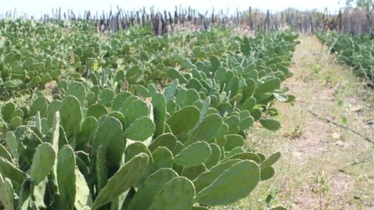{#fig-palma width="85%"}

Os territórios de Fundo de Pasto (Fig. @fig-fundo-pasto), característicos do semiárido baiano, representam um modelo de pastoreio extensivo comunitário em que a vegetação nativa de Caatinga funciona como recurso coletivo gerido de forma compartilhada para a criação de caprinos e ovinos. A distribuição do pastejo ao longo de um território amplo e sazonalmente diferenciado evita a concentração de carga animal que levaria à degradação pontual irreversível da cobertura, mecanismo de degradação recorrente em áreas privadas com gestão individual. O resultado é uma paisagem silvipastoril em que a Caatinga nativa sob pastejo moderado mantém a capacidade de regeneração de espécies forrageiras nativas e a heterogeneidade vertical de hábitats que sustenta a fauna local, com diversidade florística tendencialmente superior à de pastagens convencionais implantadas sobre vegetação suprimida [@diegues2000]. Na perspectiva da análise da paisagem, esses territórios demonstram que o arranjo espacial do pastejo, e não apenas sua intensidade, é uma variável determinante dos impactos sobre a estrutura e a função da paisagem ao longo do tempo.

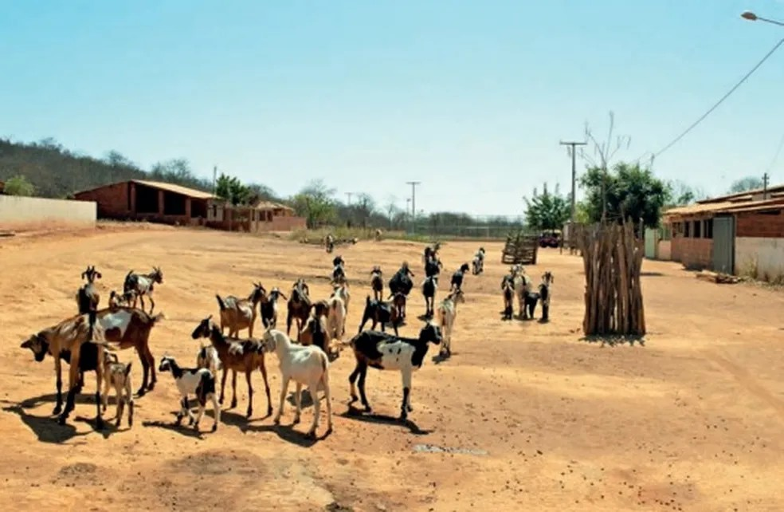{#fig-fundo-pasto width="85%"}

Esses sistemas produzem paisagens cuja heterogeneidade e conectividade funcional podem superar as de monocultivos e pastagens convencionais [@diegues2000], o que os torna referências valiosas para o planejamento de paisagens sustentáveis, tema desenvolvido na Parte IV deste livro.


