# Conceitos e Abordagens da Ecologia da Paisagem {#sec-ecologia-paisagem}

## Fundamentos sistêmicos

A ecologia da paisagem é, em sua essência, uma ciência sistêmica. Antes de abordar seus conceitos e métodos específicos, convém explicitar os fundamentos do pensamento sistêmico que alicerçam a disciplina, pois é a leitura da paisagem como sistema (e não como coleção de elementos independentes) que distingue essa abordagem de inventários descritivos tradicionais.

Um sistema é um conjunto de componentes interconectados que, por meio de suas interações, exibem propriedades emergentes que não podem ser deduzidas da análise isolada das partes. Uma floresta tropical, por exemplo, possui propriedades emergentes (microclima de sub-bosque, ciclagem fechada de nutrientes, corredores de dispersão) que não existem em nenhuma árvore ou parcela isolada, mas emergem da interação entre milhares de organismos organizados espacialmente.

Todo sistema ecológico pode ser caracterizado por cinco propriedades fundamentais. A *estrutura* diz respeito à organização interna, ou seja, quais são os componentes e como se arranjam no espaço. A *função* refere-se ao que o sistema faz, às trocas de energia, matéria e informação entre componentes. 

Já as *entradas e saídas* constituem os fluxos que atravessam os limites do sistema (radiação, precipitação, sedimentos, organismos migrantes). A *retroalimentação* compreende os mecanismos pelos quais a saída de um processo influencia sua própria entrada, podendo ser negativa (estabilizadora) ou positiva (amplificadora). Por fim, o *equilíbrio dinâmico* é o estado no qual os fluxos de entrada e saída se compensam ao longo de um período, mantendo a estrutura sem estagnção.

A @tbl-tipos-sistemas apresenta a classificação dos sistemas conforme o grau de troca com o meio externo, com implicações diretas para a modelagem de paisagens.

| Tipo | Troca de energia | Troca de matéria | Exemplo na paisagem |
|:-----|:---:|:---:|:---|
| Isolado | Não | Não | Inexistente na natureza (modelo teórico) |
| Fechado | Sim | Não | Aproximação: bacia endorreica em curto prazo |
| **Aberto** | Sim | Sim | Geossistema, bacia hidrográfica, fragmento florestal |

: Tipos de sistemas segundo o grau de troca com o meio externo. Os geossistemas e as paisagens reais são sistemas abertos. {#tbl-tipos-sistemas .striped .hover}

Paisagens são, invariavelmente, sistemas abertos, recebem energia solar e precipitação, exportam sedimentos e organismos, e são atravessadas por fluxos de matéria e informação que conectam seus elementos internos entre si e com sistemas adjacentes. Essa abertura implica que nenhuma paisagem pode ser compreendida isoladamente, pois a bacia hidrográfica a montante condiciona os processos a jusante e a paisagem circundante (a *matriz*) determina os fluxos que chegam a cada fragmento de habitat.

::: {.callout-note}
## Limiares e irreversibilidade
Uma propriedade especialmente relevante para a gestão de paisagens é o conceito de *limiar* (*threshold*), um ponto crítico a partir do qual o sistema transita abruptamente de um estado para outro, frequentemente de difícil reversão. Na ecologia da paisagem, limiares de percolação (~60% de habitat) e limiares de extinção (~30% de habitat) demarcam pontos nos quais a conectividade funcional e a viabilidade de populações se degradam de forma não-linear [@fahrig2003]. Esses limiares serão retomados com tratamento quantitativo no @sec-fragmentacao.
:::

## Ecologia da Paisagem como disciplina

A ecologia da paisagem é a subdisciplina da ecologia que investiga explicitamente como a heterogeneidade espacial influencia processos ecológicos e, reciprocamente, como esses processos modificam padrões espaciais ao longo do tempo [@turner2015]. Diferencia-se das demais subdisciplinas ecológicas não pelo organismo ou ecossistema de interesse, mas pela incorporação explícita do contexto espacial como variável explicativa. Onde a ecologia de populações pergunta "quantos indivíduos?", a ecologia da paisagem pergunta "quantos indivíduos, distribuídos em quantas manchas de habitat, com qual grau de conectividade entre elas, e como essa configuração afeta a viabilidade da população?".

Risser, Karr e Forman [-@risser1984], no influente workshop de Allerton Park (1983), identificaram três características que definem a ecologia da paisagem. A primeira é o foco no desenvolvimento e na dinâmica da heterogeneidade espacial, tratada como variável explanatória central e não como ruído a ser controlado. A segunda é a investigação das interações e trocas entre paisagens heterogêneas, especialmente os fluxos de organismos, nutrientes, energia e distúrbios que cruzam limites entre elementos da paisagem. A terceira é a gestão da heterogeneidade espacial, reconhecendo que padrões espaciais podem ser deliberadamente manipulados para atingir objetivos ecológicos e socioeconômicos. Essas três dimensões permanecem como eixos estruturantes da disciplina e organizam as questões de pesquisa abordadas neste livro.

## Abordagem geográfica

A tradição geográfica, predominante na Europa até a década de 1990 e cujas raízes remontam ao trabalho seminal de Carl Troll [-@troll1939], concebe a paisagem como a expressão territorial da interação entre sociedade e natureza. Nessa perspectiva, a paisagem não é apenas um substrato ecológico, mas um produto cultural moldado por séculos de uso da terra, decisões de manejo e valores estéticos [@naveh2000]. 

Uma paisagem agrícola do sul da Bahia, por exemplo, não pode ser compreendida apenas em termos de cobertura do solo e fragmentação florestal, pois sua estrutura reflete decisões fundiárias medievais, políticas agrárias e tradições agrícolas centenárias.

No âmbito dessa tradição, Georges Bertrand [-@bertrand1971] propôs um sistema taxonômico hierárquico que organiza a paisagem em seis níveis escalonados (da zona ao geótopo), tendo o *geossistema* como unidade central de análise. O geossistema integra potencial ecológico (geomorfologia, clima, hidrologia), exploração biológica (vegetação, solo, fauna) e ação antrópica numa mesma unidade espacial, oferecendo um arcabouço operacional para o mapeamento e a classificação de paisagens. A @tbl-bertrand-taxon sintetiza os seis níveis taxonômicos e suas escalas características.

| Nível | Unidade | Escala | Exemplo brasileiro |
|:-----:|:--------|:------:|:------------------|
| I | Zona | $10^7$–$10^8$ ha | Zona tropical |
| II | Domínio | $10^6$–$10^7$ ha | Domínio das caatingas |
| III | Região natural | $10^5$–$10^6$ ha | Depressão sertaneja |
| IV | **Geossistema** | $10^3$–$10^5$ ha | Pediplano cristalino com caatinga arbórea |
| V | Geofácies | $10^1$–$10^3$ ha | Vertente com solo raso e vegetação aberta |
| VI | Geótopo | < $10^1$ ha | Afloramento rochoso com liquens |

: Taxonomia hierárquica de Bertrand (1971). O geossistema (nível IV) é compatível com bacias hidrográficas de 3ª a 5ª ordem e constitui a escala na qual a interação entre componentes é diretamente perceptível pela ação humana. {#tbl-bertrand-taxon .striped .hover}

{#fig-bertrand-hierarquia fig-align="center" width="90%"}

O conceito de geossistema tem raízes na escola soviética de Viktor Sochava [-@sochava1963], que o definiu como um sistema natural aberto integrando litosfera, hidrosfera, atmosfera e biosfera. Sochava distinguiu o estado de equilíbrio dinâmico, em que a produção e o consumo de biomassa se compensam, do estado de transição, característico de perturbações moderadas reversíveis, e do estado degradado ou de derivação, no qual limiares de irreversibilidade são cruzados. Bertrand avançou ao incorporar a ação antrópica como componente interno do geossistema, e não como perturbação externa à maneira de Sochava, reconhecendo que as sociedades humanas são parte constituinte dos geossistemas brasileiros contemporâneos. A estrutura sistêmica que fundamenta essa leitura integrada está representada na @fig-geossistema.

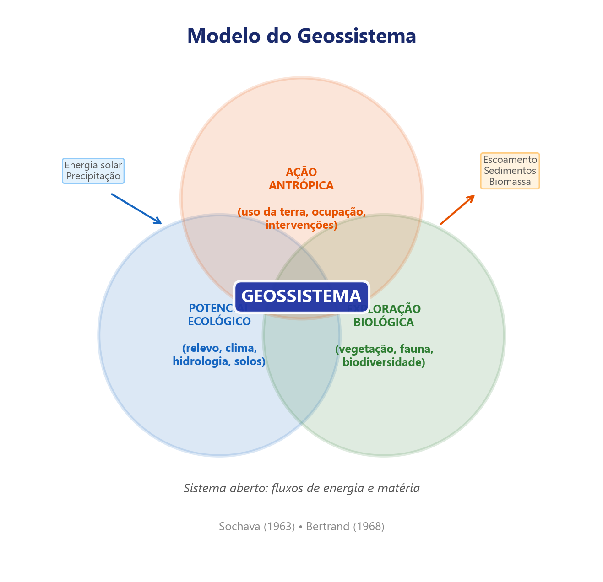{#fig-geossistema fig-align="center" width="80%"}

O geossistema opera como um tripé funcional cujos três componentes se articulam por relações específicas, nas quais o potencial ecológico fornece o *suporte* biofísico (substrato, clima, água), a exploração biológica exerce a *transformação* (ciclagem de nutrientes, sucessão vegetal, regulação hídrica) e a ação antrópica produz o *impacto* (manejo, supressão, inserção de elementos). A @tbl-tripe-geossistema detalha essa articulação.

| Componente | Elementos | Papel no sistema | Relação com os demais |
|:---|:---|:---|:---|
| **Potencial ecológico** | Geomorfologia, clima, hidrologia | Suporte biofísico: define as condições abióticas limites | Sustenta a exploração biológica e condiciona os efeitos da ação antrópica |
| **Exploração biológica** | Vegetação, solo, fauna | Transformação: metaboliza energia e matéria | Transforma o potencial ecológico e é alvo da ação antrópica |
| **Ação antrópica** | Uso da terra, manejo, infraestrutura | Impacto: modifica fluxos e estrutura | Degrada ou potencializa os dois componentes anteriores |

: O tripé funcional do geossistema: suporte–transformação–impacto. {#tbl-tripe-geossistema .striped .hover}

No contexto brasileiro, Carlos Augusto de Figueiredo Monteiro [-@monteiro2000] avançou nessa direção ao formular o conceito de *derivações antropogênicas*, que descreve como as ações humanas produzem desvios progressivos na dinâmica natural da paisagem. A @tbl-derivacoes-monteiro apresenta os três tipos de derivação e exemplos no semiárido nordestino.

| Tipo | Descrição | Exemplo no Semiárido |
|:-----|:----------|:---------------------|
| **Supressão** | Remoção de componentes do sistema natural | Desmatamento da caatinga para pecuária extensiva |
| **Inserção** | Introdução de componentes exógenos | Irrigação em áreas de sequeiro; espécies invasoras |
| **Alteração funcional** | Mudança nos fluxos e ritmos sem remoção ou adição direta | Barramento de rios; impermeabilização urbana de várzeas |

: Tipos de derivações antropogênicas segundo Monteiro (2000). As três formas frequentemente coocorrem numa mesma paisagem, gerando trajetórias de degradação cumulativa. {#tbl-derivacoes-monteiro .striped .hover}

Essas derivações acumulam-se no tempo, criando trajetórias compreensíveis apenas na perspectiva sistêmica do geossistema. Uma sequência típica no Nordeste semiárido envolve desmatamento da Caatinga (supressão), introdução de pastagem exótica (inserção) e impermeabilização do solo pela pecuária com posterior assoreamento de açudes (alteração funcional), configurando degradação progressiva e dificilmente reversível [@verburg2009].

A supressão constitui a forma mais visível de derivação, envolvendo a remoção direta de componentes do sistema natural. Na Amazônia, o desmatamento em padrão de "espinha de peixe" (Fig. @fig-supressao) exemplifica essa modalidade, na qual estradas vicinais servem como eixos de avanço para a conversão florestal em larga escala.

{#fig-supressao fig-align="center" width="80%"}

A inserção distingue-se pela introdução de componentes exógenos, substituindo processos nativos por dinâmicas produtivas importadas. A expansão da fronteira agrícola no MATOPIBA (Fig. @fig-insercao) ilustra essa derivação na região de transição entre cerrado, amazônia e caatinga, onde monoculturas de soja ocupam áreas antes dominadas por vegetação savânica, alterando ciclos hidrológicos e biogeoquímicos regionais.

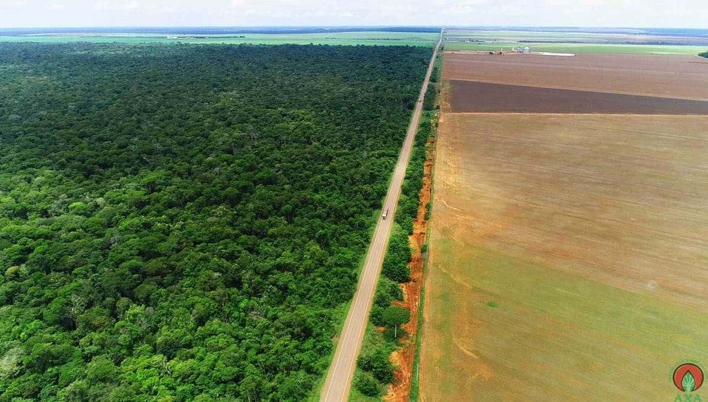{#fig-insercao fig-align="center" width="80%"}

A alteração funcional é, das três derivações, a mais insidiosa, pois modifica os fluxos ecológicos e hidrológicos sem remover necessariamente a cobertura vegetal. A fragmentação extrema da Mata Atlântica (Fig. @fig-alteracao-funcional) constitui exemplo emblemático, pois os remanescentes florestais persistem, mas a ruptura da conectividade entre eles compromete processos de dispersão, fluxo gênico e regulação hidrológica em escala de paisagem.

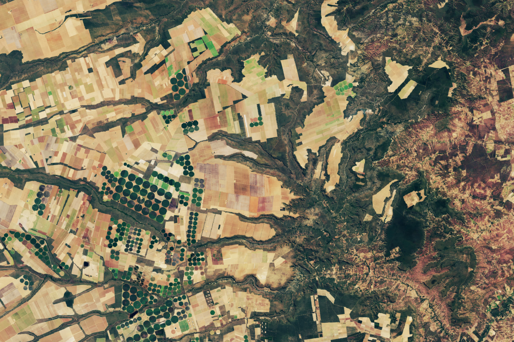{#fig-alteracao-funcional fig-align="center" width="80%"}

A contribuição de Aziz Ab'Sáber [-@absaber2003], com a teoria dos domínios morfoclimáticos, complementa esse quadro ao fornecer uma regionalização do território brasileiro baseada na associação entre formas de relevo, condições climáticas e coberturas vegetais, permitindo situar cada paisagem estudada dentro de um contexto macrorregional. Ab'Sáber articulou as grandes paisagens brasileiras em seis domínios morfoclimáticos separados por faixas de transição biogeográfica. O Amazônico corresponde às terras baixas florestadas; o Cerrado, aos chapadões tropicais do Brasil Central; os Mares de Morros, ao relevo mamelonizado com Mata Atlântica sobre o litoral leste; as Caatingas, às depressões interplanálticas semiáridas do interior nordestino; as Araucárias, ao planalto meridional com floresta mista; e as Pradarias, aos campos do sul. A distribuição espacial desses domínios e suas faixas de transição biogeográfica está representada na @fig-dominios-morfoclimaticos.

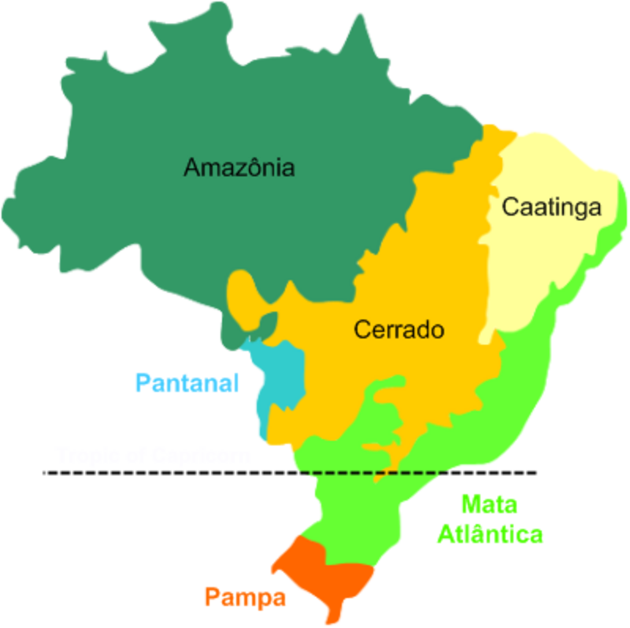{#fig-dominios-morfoclimaticos fig-align="center" width="80%"}

Para a leitura de cada domínio, Ab'Sáber propôs três níveis taxonômicos complementares, a saber, a compartimentação topográfica, que desnuda as formas de relevo regional (planaltos, depressões, planícies), a estrutura superficial da paisagem, que integra solos, formações superficiais e mantos de intemperismo, e a *fisiologia da paisagem*, que compreende a dinâmica climática, hidrológica e ecológica atual, sendo este último nível o mais suscetível às derivações antropogênicas de Monteiro e, portanto, o mais sensível para o diagnóstico de paisagens sob pressão.

A contribuição central da abordagem geográfica reside na atenção às forças motrizes (*driving forces*) que determinam a configuração atual da paisagem. Essas forças incluem fatores biofísicos (geomorfologia, clima, pedologia), fatores socioeconômicos (mercados globais, políticas públicas, pressão demográfica, estrutura fundiária) e fatores culturais (práticas tradicionais de manejo, percepção estética, identidade territorial). O reconhecimento dessas forças é relevante para compreender a trajetória temporal de uma paisagem e projetar cenários futuros de mudança, conforme esquematiza a @fig-forcas-motrizes.

```{mermaid}
%%| label: fig-forcas-motrizes
%%| fig-cap: "Esquema das forças motrizes que condicionam a estrutura da paisagem e sua relação recíproca com processos ecológicos."
%%| fig-width: 7
graph LR
    A["Forças Biofísicas<br>Clima, Geomorfologia, Solos"] --> D["Estrutura da Paisagem<br>Composição e Configuração"]
    B["Forças Socioeconômicas<br>Mercados, Políticas, Demografia"] --> D
    C["Forças Culturais<br>Práticas, Percepção, Identidade"] --> D
    D --> E["Processos Ecológicos<br>Fluxos, Biodiversidade, Serviços"]
    E -. "Retroalimentação" .-> D
    style A fill:#BBDEFB,stroke:#1565C0,color:#000
    style B fill:#FFE0B2,stroke:#E65100,color:#000
    style C fill:#E1BEE7,stroke:#6A1B9A,color:#000
    style D fill:#2E7D32,stroke:#1B5E20,color:#fff
    style E fill:#C8E6C9,stroke:#2E7D32,color:#000
```

Três propriedades da relação entre forças motrizes e paisagem (Fig. @fig-forcas-motrizes) merecem aprofundamento. As setas convergentes indicam que a estrutura observada resulta da interação simultânea de múltiplas forças, e não do domínio de uma única. A seta de retroalimentação (processos ecológicos → estrutura) explicita que a paisagem não é passiva, pois a perda de biodiversidade pode desencadear degradação de solos, alteração hidrológica e mudança de uso que realimentam a estrutura, criando trajetórias auto-reforçantes. Em paisagens semiáridas do Nordeste brasileiro, por exemplo, a remoção de vegetação nativa expõe o solo à erosão laminar, que reduz a fertilidade edáfica, que por sua vez inviabiliza a regeneração natural, perpetuando a matriz degradada [@verburg2009]. A ausência de setas diretas entre as forças biofísicas e os processos ecológicos evidencia, ademais, que essas forças atuam mediadas pela estrutura da paisagem, reforçando o caráter central da configuração espacial como variável integradora.

### O modelo matriz-mancha-corredor

O arcabouço operacional mais influente para a descrição da estrutura da paisagem é o modelo *matriz-mancha-corredor* (*matrix-patch-corridor*), proposto por Forman e Godron [-@forman1986] e consolidado por Forman [-@forman1995]. Esse modelo decompõe qualquer paisagem em três elementos espaciais fundamentais cuja interação determina os processos ecológicos e hidrológicos dominantes.

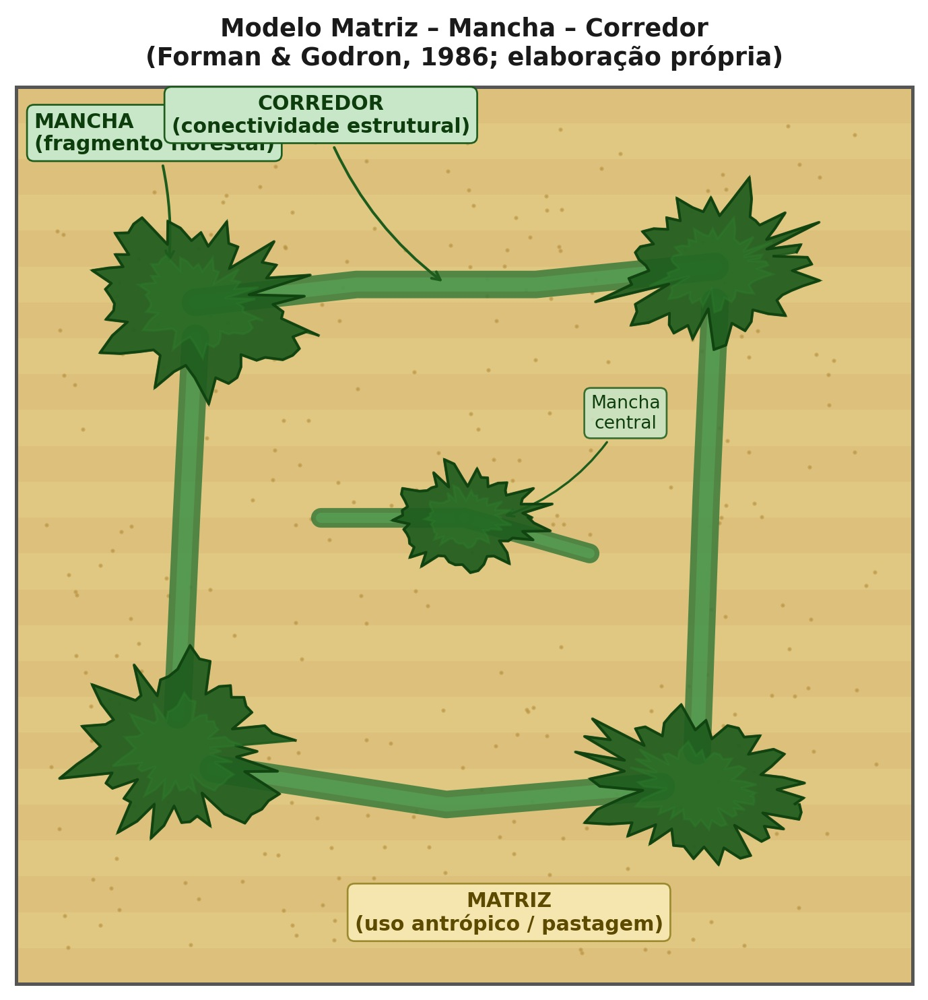{#fig-matriz-mancha-corredor fig-align="center" width="85%"}

A *matriz* é o elemento mais extenso e mais conectado da paisagem, que exerce influência dominante sobre os fluxos de energia, matéria e organismos. Três critérios operacionais permitem identificar a matriz, a saber, maior área relativa, maior conectividade da cobertura e maior influência sobre a dinâmica dos demais elementos. Em paisagens agrícolas do Cerrado, por exemplo, a pastagem ou a monocultura de soja tipicamente constitui a matriz, enquanto os remanescentes de vegetação nativa formam as manchas.

As *manchas* (*patches*) são áreas relativamente homogêneas que diferem de seu entorno. A @tbl-tipos-manchas classifica os cinco tipos fundamentais de manchas segundo sua origem, com implicações diretas para a conservação.

| Tipo de mancha | Origem | Exemplo | Implicação ecológica |
|:---|:---|:---|:---|
| Remanescente | Sobrevivência após distúrbio | Fragmento florestal em paisagem agrícola | Alta riqueza, mas vulnerável ao isolamento |
| De perturbação | Distúrbio localizado | Clareira de queimada, deslizamento | Sucessão secundária, colonização pioneira |
| De recurso | Condição ambiental diferenciada | Vereda, afloramento calcário | Espécies especializadas, endemismo |
| Introduzida | Plantio deliberado | Reflorestamento, parque urbano | Conectividade potencial, mas baixa diversidade |
| Efêmera | Eventos temporários | Poça temporária, concentração de fauna | Funcionalidade sazonal, stepping stones |

: Tipos de manchas segundo origem e implicações ecológicas, adaptado de Forman [-@forman1995]. {#tbl-tipos-manchas .striped .hover}

Os *corredores* são estruturas lineares que conectam manchas de habitat, facilitando o deslocamento de organismos e o fluxo gênico entre populações isoladas. Podem ser corredores de habitat (faixas contínuas de vegetação nativa), corredores ripários (matas ciliares ao longo de cursos d'água) ou *stepping stones* (manchas discretas suficientemente próximas para permitir deslocamento em etapas). A funcionalidade de um corredor depende não apenas de suas dimensões (largura, comprimento), mas de sua qualidade estrutural e compatibilidade com os requerimentos das espécies-alvo. A conectividade, definida como o grau em que a paisagem facilita ou impede o deslocamento de organismos entre manchas de habitat [@taylor1993], pode ser estrutural (derivada do arranjo físico da paisagem) ou funcional (dependente da capacidade efetiva de dispersão de cada espécie), e ambas são condicionadas pela permeabilidade da matriz circundante.

Além de manchas e corredores, o efeito de borda constitui um dos processos mais relevantes na ecologia da paisagem. Na zona de contato entre a mancha florestal e a matriz agrícola (Fig. @fig-efeito-borda), o microclima sofre alterações pronunciadas (aumento de temperatura, redução de umidade, maior incidência de vento), que elevam a mortalidade de árvores e favorecem a invasão de espécies generalistas, reduzindo progressivamente a área funcional do fragmento.

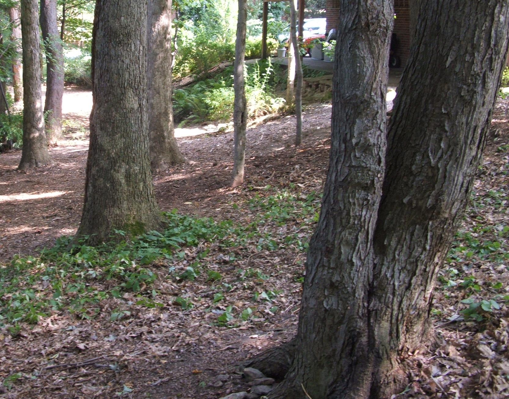{#fig-efeito-borda fig-align="center" width="80%"}

A conectividade estrutural proporcionada pelos corredores pode ser observada em remanescentes de Mata Atlântica (Fig. @fig-corredor-ecologico), onde faixas contínuas de vegetação nativa permitem o trânsito de organismos entre fragmentos que, de outra forma, permaneceriam funcionalmente isolados pela matriz agrícola circundante.

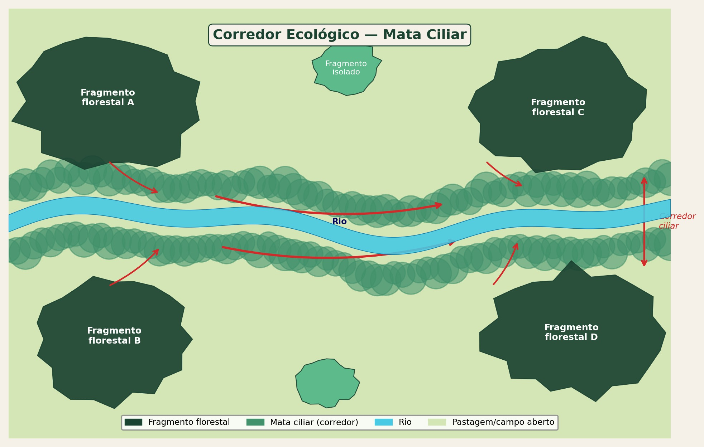{#fig-corredor-ecologico fig-align="center" width="80%"}

### A trilogia GTP de Bertrand

Em revisão posterior ao sistema original de 1968, Bertrand [-@bertrand2007] propôs a *trilogia GTP* (*Geossistema-Território-Paisagem*), reconhecendo que a paisagem não pode ser apreendida por um único sistema conceitual. Nessa formulação, o Geossistema captura a dimensão naturalista (processos biofísicos e produtividade), o Território captura a dimensão socioeconômica (apropriação, uso, governança) e a Paisagem captura a dimensão cultural e perceptiva (identidade, estética, patrimônio). A trilogia GTP não substitui o geossistema da década de 1970, mas o complementa ao explicitar que a leitura integrada de um espaço geográfico exige a articulação simultânea dessas três entradas.

```{mermaid}
%%| label: fig-gtp
%%| fig-cap: "A trilogia GTP de Bertrand: três entradas complementares para a leitura da paisagem."
%%| fig-width: 6
graph LR
    G["GEOSSISTEMA<br>Source → Ressource<br>(processos biofísicos)"] --- T["TERRITÓRIO<br>Ressource → Ressourcement<br>(gestão socioeconômica)"]
    T --- P["PAISAGEM<br>Ressourcement → Identité<br>(percepção e cultura)"]
    P --- G
    style G fill:#C8E6C9,stroke:#2E7D32,color:#000
    style T fill:#FFE0B2,stroke:#E65100,color:#000
    style P fill:#E1BEE7,stroke:#6A1B9A,color:#000
```

## Abordagem ecológica

A tradição ecológica, dominante na América do Norte, concentra-se nos efeitos mensuráveis dos padrões espaciais sobre processos ecológicos. Duas questões centrais orientam essa abordagem e motivam a maior parte dos estudos quantitativos publicados na disciplina.

A primeira questão investiga em que medida a configuração espacial dos habitats afeta a dinâmica de populações e comunidades. Essa pergunta é o motor conceitual dos estudos de fragmentação, conectividade e efeito de borda. Fahrig [-@fahrig2003] indicou que a perda de habitat (redução da proporção total de habitat na paisagem) explica a maior parte da variação em riqueza e abundância de espécies em paisagens fragmentadas, enquanto a fragmentação per se (subdivisão do habitat remanescente em manchas menores e mais isoladas, mantendo a proporção total constante) apresenta efeitos comparativamente menores e frequentemente ambíguos. Essa distinção entre perda e fragmentação tornou-se uma das contribuições mais influentes da tradição ecológica e será retomada em detalhe no @sec-fragmentacao.

A segunda questão investiga como os distúrbios se propagam em função da estrutura da paisagem. Incêndios florestais, por exemplo, propagam-se mais rapidamente em paisagens com grande continuidade de vegetação combustível e são retardados por feições não-combustíveis (rios, estradas, áreas úmidas). Doenças de plantas cultivadas dispersam-se preferencialmente ao longo de corredores de monocultura e são contidas por barreiras de vegetação diversificada. Essa atenção à propagação espacial de distúrbios vincula a ecologia da paisagem à ecologia do fogo, à epidemiologia vegetal e à gestão de riscos ambientais.

Wiens [-@wiens1999] argumentou que a ecologia da paisagem não é simplesmente "ecologia em grande escala", mas uma ciência que se distingue pela atenção à heterogeneidade explícita. Um estudo populacional convencional pode tratar o habitat como presente ou ausente dentro de uma área de estudo, enquanto a ecologia da paisagem quantifica a área, a forma, o isolamento e a conectividade das manchas de habitat, reconhecendo que esses atributos espaciais afetam taxas de colonização, extinção local, fluxo gênico e persistência metapopulacional de maneiras que não podem ser capturadas por modelos espacialmente implícitos.

## Escalas e hierarquias

A questão da escala é possivelmente o tema mais debatido na ecologia da paisagem e será desenvolvida em profundidade no @sec-escalas. Para o enquadramento conceitual do presente capítulo, basta explicitar duas propriedades fundamentais.

A primeira propriedade é a dependência escalar dos padrões. O grão (*grain*), a menor unidade resolvível na análise, e a extensão (*extent*), a área total abrangida, definem o domínio de escala de um estudo. Processos ecológicos operam em escalas características, e a detecção de padrões depende da correspondência entre a escala do processo e a escala de observação. Métricas de paisagem calculadas para uma mesma área podem apresentar valores radicalmente diferentes conforme o grão da classificação, fenômeno denominado dependência escalar [@gustafson1998].

A segunda propriedade é a organização hierárquica da paisagem. A teoria hierárquica propõe que os sistemas ecológicos são organizados em níveis aninhados, nos quais cada nível opera numa faixa de escalas espaço-temporais característica. Níveis superiores impõem restrições (*constraints*) sobre os inferiores, enquanto os níveis inferiores fornecem os mecanismos. O clima regional restringe os tipos de vegetação possíveis numa bacia hidrográfica, enquanto as propriedades do solo local e a competição interespecífica determinam qual comunidade vegetal efetivamente se estabelece num dado sítio. Essa perspectiva obriga o pesquisador a explicitar qual nível hierárquico está sendo analisado e a reconhecer as restrições e mecanismos provenientes dos níveis adjacentes.

É importante distinguir *escala geográfica* de *escala ecológica*. A escala geográfica é definida pelo observador humano (extensão e grão do mapa ou imagem), enquanto a escala ecológica é definida pelo organismo, pois cada espécie percebe e utiliza a paisagem numa escala própria, determinada por sua área de vida, capacidade de deslocamento e sensibilidade a feições. Um beija-flor opera na escala de dezenas de metros (manchas florais), enquanto uma onça opera na escala de dezenas de quilômetros (mosaico de habitats). A correspondência entre essas duas escalas, a do pesquisador e a do organismo, é condição necessária para que a análise produza inferências ecologicamente válidas.

A *multiescalaridade* é, portanto, não apenas uma propriedade da paisagem, mas um requisito metodológico, e a boa prática em ecologia da paisagem exige que o pesquisador examine os padrões em múltiplas escalas (*zoom in* e *zoom out*), verificando se as relações detectadas são consistentes ou se mudam de sinal, magnitude ou significância conforme a escala de análise. Processos que parecem dominantes em escala local (por exemplo, efeito de borda sobre a mortalidade de plântulas) podem ser subordinados a processos regionais (como a proporção total de habitat na paisagem) quando a extensão de análise é ampliada.

## Abordagem integrada

A convergência entre as duas tradições (geográfica e ecológica) intensificou-se na última década, impulsionada pelo reconhecimento de que mudanças de uso da terra são simultaneamente um processo social e ecológico, e que nenhuma das tradições isoladamente oferece os instrumentos necessários para compreendê-lo. Wu [-@wu2013] propôs o conceito de *Landscape Sustainability Science*, no qual a paisagem constitui a escala em que as decisões sobre uso da terra, conservação e bem-estar humano produzem seus efeitos mais diretos, necessitando tanto da quantificação espacial rigorosa (tradição ecológica) quanto do entendimento das forças socioeconômicas e culturais (tradição geográfica).

No Brasil, a pesquisa em ecologia da paisagem incorpora essa integração de forma crescente. Estudos sobre a Mata Atlântica [@metzger2009; @ribeiro2009] combinam métricas espaciais quantitativas (proporção de habitat, conectividade, área nuclear) com análises de forças motrizes (expansão urbana, legislação ambiental, mercado de commodities), demonstrando que a fragmentação florestal remanescente (8–12% da cobertura original) não é compreensível sem a articulação entre padrão espacial e contexto sociopolítico. A concentração de remanescentes em áreas íngremes e de baixo valor agrícola, por exemplo, é simultaneamente um resultado de forças socioeconômicas (abandono de terras marginais) e um condicionante ecológico (enviesamento ambiental do habitat remanescente).

::: {.callout-tip}
## Integração na prática
Uma análise da paisagem que se limite a calcular métricas (área, perímetro, índice de forma) sem vinculá-las a processos ecológicos ou a forças motrizes produz descrições, não conhecimento. A boa prática exige que cada métrica seja justificada pelo processo que se pretende avaliar e interpretada à luz do contexto territorial. O pesquisador deve perguntar não apenas "qual o valor do índice?", mas "o que esse valor implica para as espécies, os processos hidrológicos e os serviços ecossistêmicos desta paisagem?".
:::

### Paisagens dos domínios brasileiros: diversidade e pressão

A aplicação dos conceitos desenvolvidos neste capítulo ao contexto brasileiro exige o reconhecimento da diversidade de paisagens que caracterizam os diferentes domínios morfoclimáticos. A heterogeneidade fisionômica dessas paisagens, do dossel contínuo da Floresta Amazônica ao mosaico aberto da Caatinga, permite visualizar os tipos de matrizes, manchas e corredores que cada domínio apresenta.

No domínio Amazônico (Fig. @fig-amazonia-paisagem), a floresta úmida densa constitui a matriz, e as áreas desmatadas desempenham o papel de manchas de perturbação, cuja expansão é condicionada pela malha viária e pela dinâmica de ocupação fundiária.

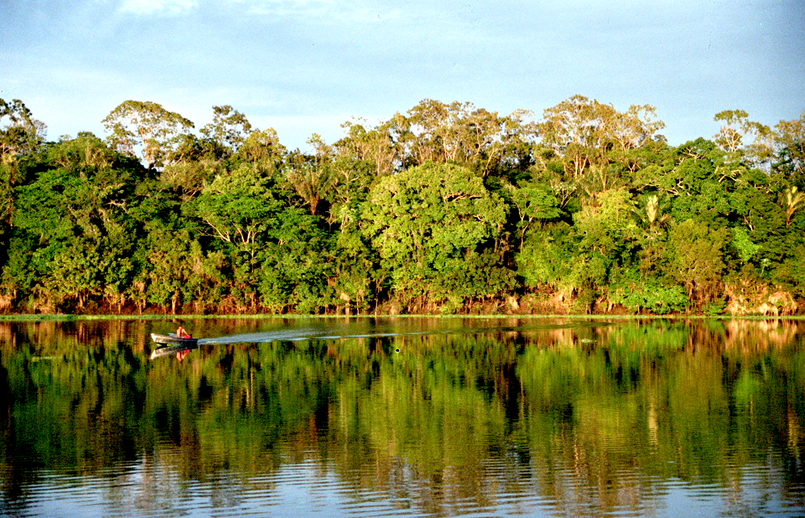{#fig-amazonia-paisagem fig-align="center" width="80%"}

O Cerrado (Fig. @fig-cerrado-paisagem) apresenta naturalmente um mosaico de fisionomias (campo limpo, campo sujo, cerrado *stricto sensu* e cerradão), cuja conversão para monoculturas tem reduzido a heterogeneidade original e simplificado a estrutura da paisagem em extensas áreas do Brasil Central.

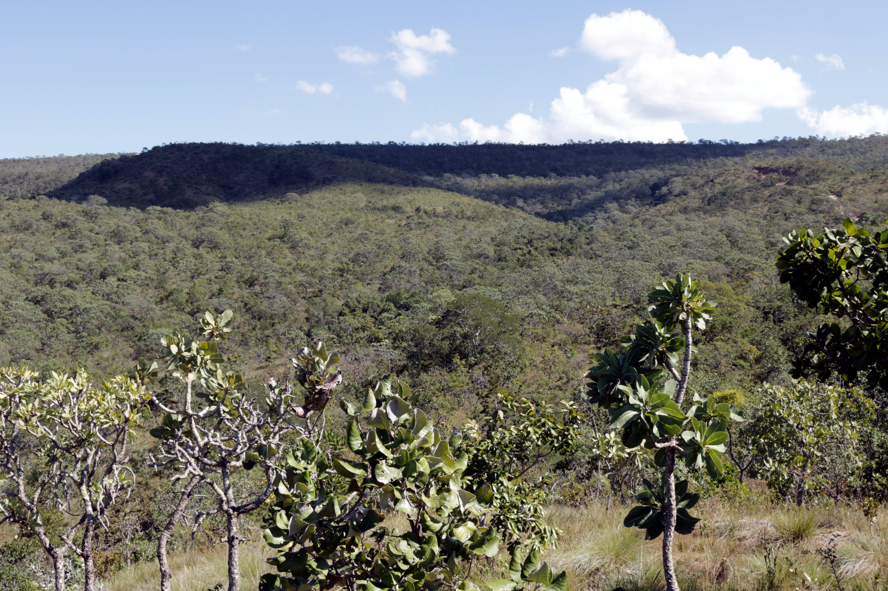{#fig-cerrado-paisagem fig-align="center" width="80%"}

A Caatinga (Fig. @fig-caatinga-paisagem), com sua vegetação xerófila decídua, exibe alta variação sazonal de cobertura, o que impõe desafios específicos ao monitoramento por sensoriamento remoto e à quantificação de métricas de paisagem ao longo do ciclo anual.

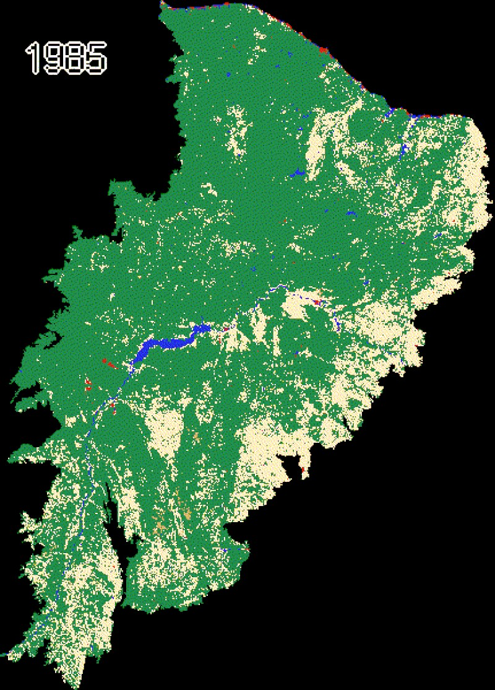{#fig-caatinga-paisagem fig-align="center" width="80%"}

A heterogeneidade espacial da paisagem rural (Fig. @fig-mosaico-rural), expressa pela intercalação de fragmentos florestais, cultivos, pastagens e corpos d'água, constitui a variável central da ecologia da paisagem e determina a capacidade do mosaico de sustentar processos ecológicos e serviços ecossistêmicos.

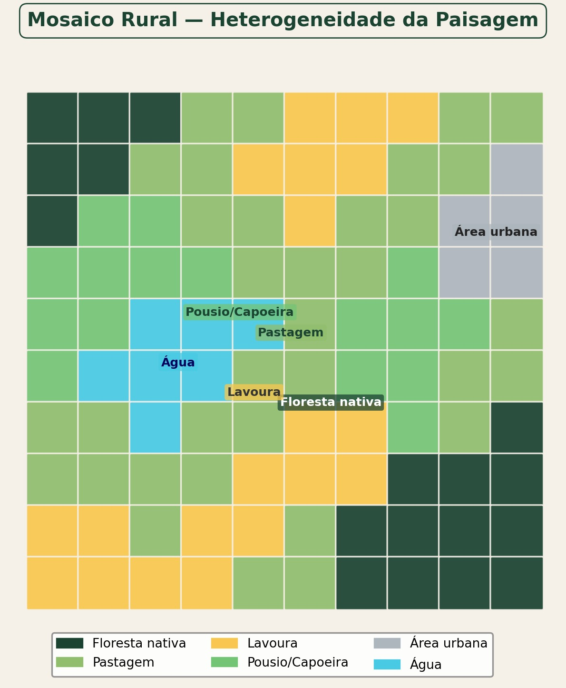{#fig-mosaico-rural fig-align="center" width="80%"}

Quando os limiares sistêmicos são ultrapassados, mecanismos de retroalimentação positiva perpetuam a degradação. A erosão acelerada (Fig. @fig-erosao-paisagem) exemplifica esse processo, pois a perda de cobertura vegetal expõe o solo à ação das chuvas, que remove a camada fértil, que por sua vez inviabiliza a regeneração da vegetação, consolidando uma trajetória de degradação que só pode ser revertida por intervenção externa.

{#fig-erosao-paisagem fig-align="center" width="80%"}

## Questões centrais da disciplina

As questões de pesquisa da ecologia da paisagem podem ser agrupadas em cinco eixos, conforme a síntese proposta por Wu e Hobbs [-@wu2004], que constitui o arcabouço organizador dos capítulos subsequentes deste livro.

Os padrões constituem o ponto de partida, com a pergunta sobre como se distribui espacialmente a heterogeneidade e como quantificá-la de forma ecologicamente relevante, o que exige métricas sensíveis aos processos de interesse e dados de cobertura com resolução adequada. A investigação dos processos, por sua vez, busca compreender como fluxos de organismos, nutrientes e distúrbios são condicionados pela estrutura espacial e se existem limiares abaixo dos quais esses processos se degradam abruptamente. A essa pergunta vincula-se a questão da dinâmica, que examina como a paisagem muda ao longo do tempo, quais mecanismos de mudança operam (conversão, abandono, intensificação) e se existem estados estáveis alternativos dos quais a paisagem não retorna espontaneamente. O problema da escala permeia todos os anteriores, pois padrões e processos variam entre escalas e a transposição de informação entre níveis hierárquicos exige atenção à dependência escalar das métricas. A dimensão aplicada fecha o ciclo ao perguntar como o conhecimento ecológico da paisagem pode informar o planejamento territorial, a conservação da biodiversidade e a restauração de ecossistemas degradados.

Esses cinco eixos estruturam implicitamente os capítulos seguintes. A Parte I aborda padrões e escalas, a Parte II fornece as ferramentas de quantificação (sensoriamento remoto, SIG, métricas), a Parte III examina processos e dinâmica (fragmentação, conectividade, mudanças de uso), e a Parte IV trata da aplicação em planejamento e gestão territorial.
