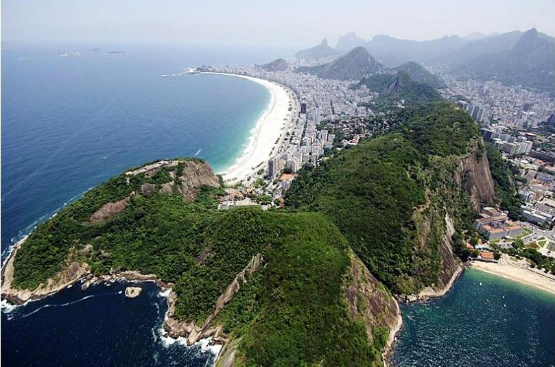

# Estrutura da Paisagem {#sec-estrutura-paisagem}

## O modelo mancha-corredor-matriz

A estrutura da paisagem é descrita pelo modelo mancha-corredor-matriz (*patch-corridor-matrix model*), proposto por Forman e Godron [-@forman1986] e refinado por Forman [-@forman1995]. Esse modelo decompõe qualquer paisagem em três tipos fundamentais de elementos espaciais, cuja composição e configuração determinam as propriedades ecológicas do mosaico. Apesar de sua aparente simplicidade, o modelo é suficientemente flexível para descrever paisagens tão distintas quanto mosaicos agrícolas europeus, matas fragmentadas da Mata Atlântica e savanas do Cerrado, e permanece como o arcabouço mais utilizado na ecologia da paisagem aplicada.

A mancha (*patch*) é uma área relativamente homogênea que difere do seu entorno. Um fragmento florestal imerso numa matriz agrícola, um lago circundado por pastagem ou um afloramento rochoso em meio à Caatinga são exemplos de manchas. O tamanho, a forma e o grau de isolamento de cada mancha determinam sua capacidade de sustentar populações viáveis e de contribuir para processos ecológicos regionais. O corredor (*corridor*) é um elemento linear ou estreito que difere da matriz em ambos os lados. Rios com mata ciliar, estradas, sebes, faixas de vegetação ripária e linhas de transmissão de energia constituem corredores, que podem funcionar como condutos, filtros ou barreiras para o deslocamento de organismos e a propagação de distúrbios. A matriz (*matrix*) é o elemento dominante e mais conectado da paisagem, funcionando como o "fundo" contra o qual manchas e corredores se distinguem. A @fig-mcm-modelo esquematiza esses três elementos num mosaico hipotético.

```{dot}
//| label: fig-mcm-modelo
//| fig-cap: "Representação esquemática do modelo mancha-corredor-matriz numa paisagem hipotética com fragmentos florestais dispersos numa matriz de pastagem, conectados por um corredor de mata ciliar."
//| fig-width: 7
//| fig-height: 4
graph {
    bgcolor="transparent"
    node [fontname="Helvetica", fontsize=10, penwidth=0.8]
    edge [style=invis]

    subgraph cluster_matrix {
        label="MATRIZ (Pastagem)"
        labeljust=c
        fontname="Helvetica"
        fontsize=12
        style="rounded,filled"
        fillcolor="#F5DEB3"
        color="#8D6E63"

        P1 [label="MANCHA\n(Fragmento 1)", shape=ellipse, style=filled, fillcolor="#228B22", fontcolor=white, color="#1B5E20", penwidth=1.5]
        P2 [label="MANCHA\n(Fragmento 2)", shape=ellipse, style=filled, fillcolor="#228B22", fontcolor=white, color="#1B5E20", penwidth=1.5]
        P3 [label="MANCHA\n(Fragmento 3)", shape=ellipse, style=filled, fillcolor="#228B22", fontcolor=white, color="#1B5E20", penwidth=1.5]
        C1 [label="CORREDOR\n(Mata ciliar)", shape=box, style="filled,rounded", fillcolor="#006400", fontcolor=white, color="#004D00", width=3.5, penwidth=1.5]

        {rank=same; P1; P2}
        P1 -- C1 [style=solid, color="#006400", penwidth=2]
        P2 -- C1 [style=solid, color="#006400", penwidth=2]
        C1 -- P3 [style=dashed, color="#888888", label="isolamento", fontname="Helvetica", fontsize=8]
    }
}
```

A visualização de um mosaico real (Fig. @fig-paisagem-mosaico) permite contrastar a abstração do modelo teórico com a complexidade de uma paisagem concreta, na qual os limites entre manchas, corredores e matriz raramente são tão nítidos quanto no diagrama.

{#fig-paisagem-mosaico fig-align="center" width="85%"}

A @fig-mcm-modelo evidencia propriedades estruturais que devem ser lidas em termos de funcionalidade ecológica. Os três fragmentos (manchas P1, P2 e P3) diferem em posição relativa e, portanto, em grau de isolamento. Enquanto P1 e P2 estão próximos e potencialmente conectados pelo corredor de mata ciliar, P3 encontra-se na porção inferior da paisagem, separado dos demais não apenas pela distância, mas pela continuidade da matriz de pastagem que o envolve. O corredor ripário (C1) liga espacialmente P1 e P2, mas sua funcionalidade como conduto depende de sua largura, integridade e qualidade de habitat, atributos que não são capturados pelo esquema geométrico e que exigem dados de campo ou imagens de alta resolução para serem avaliados. A matriz de pastagem, aparentemente homogênea no diagrama, pode na realidade apresentar gradientes de permeabilidade (pastagens em abandono com regeneração secundária versus pastagens intensivas manejadas), e essa variação interna da matriz condiciona fortemente a conectividade funcional entre os fragmentos [@fahrig2017].

## Manchas

As manchas diferem entre si em tamanho, forma, tipo e contexto (posição na paisagem). Cada um desses atributos possui implicações ecológicas extensamente documentadas na literatura e constitui a base para a seleção de métricas de paisagem no @sec-metricas.

O tamanho da mancha é o atributo mais estudado e o que possui a relação mais robusta com a biodiversidade. A teoria de biogeografia de ilhas, adaptada ao contexto terrestre por Diamond (1975) e amplamente testada em paisagens fragmentadas, prediz que manchas maiores sustentam mais espécies em virtude da relação espécie-área ($S = cA^z$, onde $S$ é a riqueza, $A$ é a área, e $c$ e $z$ são constantes empíricas). Do ponto de vista funcional, manchas maiores contêm proporcionalmente mais área nuclear (*core area*), definida como a porção interior suficientemente distante da borda para não sofrer efeitos de borda significativos. A relação entre área total e área nuclear depende da largura de borda adotada (tipicamente 50 a 100 m para florestas tropicais) e da forma do fragmento. Um fragmento de 100 ha com forma circular possui aproximadamente 60% de área nuclear (considerando borda de 100 m), enquanto um fragmento de mesma área mas com forma alongada (500 m × 2.000 m) pode ter menos de 30% de área nuclear, porque a borda penetra proporcionalmente mais no interior.

A forma da mancha é quantificada por índices que comparam o perímetro real ao perímetro de uma forma regular (círculo ou quadrado) de mesma área. Manchas com formas regulares (compactas) possuem menor razão perímetro/área e, consequentemente, maior proporção de área nuclear. Manchas alongadas ou irregulares, por sua vez, apresentam maior proporção de borda, amplificando os efeitos de borda sobre microclima, vento, luminosidade e invasão por espécies generalistas. O contexto da mancha refere-se à natureza da vizinhança. Uma mancha florestal circundada por capoeira em regeneração sofre menor estresse de borda do que uma mancha de mesma área e forma circundada por pastagem intensiva ou área urbana, indicando que o efeito de borda é mediado pelo contraste entre a mancha e a matriz adjacente.

::: {.callout-note}
## Efeito de borda em florestas tropicais
Em fragmentos de Mata Atlântica, a mortalidade de árvores dentro dos primeiros 100 metros de borda é até 3 vezes maior que no interior do fragmento, e a temperatura do ar na borda pode ser 2–4°C superior à do interior, alterando a composição de espécies e a dinâmica de regeneração [@haddad2015]. O efeito de borda não é estático, pois em fragmentos recém-isolados a degradação da borda progride em direção ao interior ao longo de décadas, num processo denominado "dívida de extinção temporal".
:::

## Corredores

Os corredores desempenham funções ecológicas que variam conforme sua estrutura, posição na paisagem e o grupo taxonômico considerado. A função mais estudada é a de conduto, facilitando o deslocamento de organismos entre manchas de habitat. Matas ciliares que conectam fragmentos florestais, por exemplo, permitem o fluxo de aves, pequenos mamíferos, morcegos e invertebrados entre remanescentes que de outra forma estariam funcionalmente isolados. Estudos com rádio-telemetria em fragmentos de Mata Atlântica demonstram que espécies com baixa capacidade de deslocamento em área aberta (como marsupiais e pequenos roedores florestais) utilizam preferencialmente corredores ripários para movimentação entre fragmentos, enquanto espécies com maior mobilidade (algumas aves e morcegos) podem cruzar lacunas na matriz sem necessidade de corredor.

Além da função de conduto, os corredores podem atuar como habitat para espécies que toleram ou preferem ambientes lineares (aves de sub-bosque que forrageiam ao longo de matas ripárias, por exemplo), como filtro seletivo que permite a passagem de algumas espécies mas não de outras (um corredor estreito pode ser funcional para invertebrados mas não para mamíferos de médio porte), e como barreira ao fluxo de determinados processos, como a propagação de fogo ou o escoamento superficial [@forman1995]. Uma faixa de vegetação ripária, por exemplo, funciona simultaneamente como conduto para espécies florestais (fluxo longitudinal ao longo do corredor) e como barreira para sedimentos e nutrientes (interceptação do fluxo transversal proveniente de áreas agrícolas adjacentes).

A efetividade de um corredor como conduto depende de sua largura, continuidade e qualidade do habitat. Corredores estreitos (menos de 30 m) perdem funcionalidade para espécies sensíveis ao efeito de borda, pois toda a sua extensão é afetada por condições microclimáticas de borda. Corredores com interrupções (estradas que os cruzam, secções desmatadas, represamentos) perdem continuidade e podem funcionar como armadilhas ecológicas se atraem organismos para áreas sem saída. Em paisagens tropicais brasileiras, a legislação de Áreas de Preservação Permanente (APP) estabelece larguras mínimas de mata ciliar que variam de 30 a 500 m conforme a largura do curso d'água (Lei 12.651/2012), e essas faixas frequentemente constituem os corredores ecologicamente mais importantes da paisagem.

## Matriz

A matriz é frequentemente tratada como mero "fundo" homogêneo sem função ecológica, mas pesquisas da última década demonstram que sua permeabilidade condiciona fortemente a conectividade funcional da paisagem [@fahrig2017]. Uma matriz de pastagem abandonada em processo de regeneração secundária é substancialmente mais permeável para espécies florestais do que uma matriz de monocultura intensiva, que por sua vez é mais permeável do que uma área urbana. Essa variação interna da matriz implica que dois fragmentos equidistantes podem apresentar conectividade funcional radicalmente diferente, dependendo do tipo de uso do solo que os separa.

A qualidade da matriz pode ser descrita pelo conceito de resistência ao deslocamento. Uma espécie florestal que cruza uma pastagem enfrenta maior resistência (risco de predação por ausência de cobertura, estresse térmico por exposição solar direta, ausência de recursos alimentares e de sítios de repouso) do que ao cruzar uma capoeira ou um sistema agroflorestal, que oferecem cobertura parcial e recursos mínimos. Modelos de conectividade funcional, como os baseados em teoria de circuitos (*Circuitscape*) ou custo-distância (*least-cost path*), incorporam explicitamente a resistência da matriz na quantificação de conexões entre manchas, e a calibração dos valores de resistência (empírica, por opinião de especialistas ou por dados de telemetria) é uma das etapas mais críticas e subjetivas da modelagem de conectividade, conforme será discutido no @sec-fragmentacao.

## Composição e configuração

A estrutura da paisagem é descrita por dois componentes complementares que fornecem informações ecologicamente distintas e que não devem ser confundidos [@turner2015]. A composição refere-se aos tipos de elementos presentes e suas proporções relativas (quanto da paisagem é floresta, quanto é agricultura, quanto é área urbana, quanto é corpo d'água). A configuração refere-se ao arranjo espacial desses elementos (os fragmentos florestais estão concentrados no centro da paisagem ou dispersos pelas bordas? São grandes e poucos ou pequenos e numerosos? Estão conectados por corredores ou completamente isolados?).

Duas paisagens podem ter composição idêntica (mesma proporção de floresta, por exemplo 30%) mas configurações radicalmente diferentes. Uma paisagem na qual os 30% de floresta formam um único bloco contíguo terá elevada área nuclear, baixa densidade de bordas e alta conectividade interna. Outra paisagem na qual os mesmos 30% de floresta estão distribuídos em centenas de pequenos fragmentos dispersos na matriz agrícola terá área nuclear reduzida, alta densidade de bordas, elevado isolamento entre manchas e baixa conectividade funcional [@mcgarigal2002]. Essas diferenças de configuração produzem efeitos ecológicos mensuráveis e distintos sobre riqueza de espécies, taxas de extinção local, fluxo gênico, polinização, controle de pragas e serviços hidrológicos. A @tbl-composicao-configuracao sistematiza as diferenças entre esses dois componentes.

| Atributo | Composição | Configuração |
|:---|:---|:---|
| O que descreve | Tipos de cobertura e suas proporções | Arranjo espacial dos elementos |
| Exemplo de métrica | Proporção de habitat (PLAND), diversidade de Shannon (SHDI) | Número de manchas (NP), área nuclear (CORE), índice de proximidade (PROX) |
| Influência ecológica | Quantidade total de habitat disponível | Acessibilidade, conectividade, efeito de borda, grau de isolamento |
| Analogia | "O que há na paisagem e quanto" | "Como está organizado espacialmente" |
| Sensibilidade à escala | Moderada (depende da extensão) | Alta (depende do grão e da extensão) |

: Comparação entre composição e configuração como descritores da estrutura da paisagem. {#tbl-composicao-configuracao .striped .hover}

A @tbl-composicao-configuracao evidencia que composição e configuração são analiticamente separáveis, mas ecologicamente interdependentes. Fahrig [-@fahrig2003] demonstrou que a composição (particularmente a proporção total de habitat) possui efeito dominante sobre a biodiversidade, explicando tipicamente 2 a 5 vezes mais variação na riqueza de espécies do que métricas de configuração. Contudo, em paisagens com proporção intermediária de habitat (20–50%), a configuração torna-se um modulador relevante, pois determina se o habitat remanescente está acessível ou fragmentado. Em paisagens com proporção muito baixa de habitat (inferior a 10–20%), tanto a quantidade quanto a configuração são críticas, pois a paisagem pode cruzar limiares de percolação abaixo dos quais a conectividade estrutural colapsa e os processos ecológicos dependentes de fluxo entre manchas cessam abruptamente.

## Heterogeneidade

A heterogeneidade da paisagem é a propriedade emergente da combinação de composição e configuração. Uma paisagem com muitos tipos de cobertura distribuídos em arranjo complexo e intercalado é mais heterogênea do que uma paisagem dominada por um único tipo de uso em configuração simples. A heterogeneidade pode ser quantificada por métricas de diversidade (índice de Shannon, índice de Simpson) aplicadas à composição de classes, ou por métricas de complexidade espacial (dimensão fractal, lacunaridade) que capturam a irregularidade da configuração.

A relação entre heterogeneidade e biodiversidade é mediada pela escala e pelo grupo taxonômico considerado, e não é universalmente positiva. Para espécies generalistas que exploram múltiplos tipos de habitat e dependem da complementaridade de recursos (áreas de alimentação em campo aberto e sítios de nidificação em fragmentos florestais, por exemplo), paisagens heterogêneas tendem a sustentar maior diversidade porque oferecem maior variedade de nichos e recursos complementares no espaço. Para espécies especialistas sensíveis a efeitos de borda e dependentes de habitat contínuo (como aves de sub-bosque florestal que evitam ambientes abertos), a heterogeneidade elevada pode ser deletéria quando implica que o habitat preferencial está subdividido em manchas muito pequenas e isoladas, cada uma delas dominada por condições de borda.

::: {.callout-tip}
## Heterogeneidade vs. fragmentação
É fundamental distinguir heterogeneidade da paisagem (diversidade de elementos presentes no mosaico, que pode decorrer da variabilidade natural do relevo, dos solos e dos ecossistemas) de fragmentação de habitat (subdivisão de habitat contínuo em manchas menores e mais isoladas, tipicamente causada por atividades antrópicas). Paisagens podem ser naturalmente heterogêneas sem necessariamente apresentar fragmentação de habitat (um ecótono entre floresta e cerrado, por exemplo) e, inversamente, fragmentação intensa pode ocorrer numa paisagem que, em termos de diversidade de classes, é pouco heterogênea (uma paisagem binária de floresta e soja).
:::

## Estrutura em paisagens tropicais brasileiras

No contexto das paisagens brasileiras, o modelo mancha-corredor-matriz assume formas específicas condicionadas pela história de uso da terra e pelas características biogeográficas de cada bioma. Na Mata Atlântica, os fragmentos florestais remanescentes (8–12% da cobertura original) constituem manchas inseridas numa matriz agrícola, pecuária e urbana heterogênea, com corredores frequentemente restritos a matas ciliares estreitas, muitas delas degradadas. A fragmentação é antiga (séculos de colonização) e os fragmentos remanescentes são predominantemente pequenos (mais de 80% menores que 50 ha) e distantes entre si [@ribeiro2009]. A @fig-mosaico-mata-atlantica ilustra esse padrão, no qual manchas residuais de floresta, imersas numa matriz heterogênea, configuram um mosaico cuja conectividade depende quase exclusivamente dos corredores ripários remanescentes.

{#fig-mosaico-mata-atlantica fig-align="center" width="85%"}

No Cerrado, a expansão agrícola das últimas décadas (especialmente soja e pastagens plantadas no Cerrado central e ocidental) converte áreas de vegetação nativa em matriz de monoculturas, gerando manchas residuais de cerrado *sensu stricto* e cerradão frequentemente isoladas em áreas de relevo mais acidentado ou de solos menos aptos à mecanização. Os corredores de vegetação ripária (veredas e matas de galeria) constituem os elementos de conectividade mais relevantes e estão parcialmente protegidos pela legislação de APP.

Na Caatinga, a paisagem é naturalmente heterogênea, com manchas de vegetação arbórea densa alternando com áreas de vegetação aberta, lajedos rochosos e solos expostos, dificultando a distinção entre heterogeneidade natural (condicionada pelo relevo, pelos solos e pelo regime hídrico) e fragmentação antrópica (causada por desmatamento para lenha, pecuária extensiva e agricultura de subsistência). Essa sobreposição de padrões impõe desafios metodológicos que exigem dados de alta resolução e conhecimento de campo para serem resolvidos.

A compreensão da estrutura da paisagem é o primeiro passo para qualquer análise quantitativa. Os capítulos seguintes avançarão para as escalas de observação (@sec-escalas), a percepção e representação da paisagem (@sec-percepcao) e os métodos de quantificação da estrutura por meio de métricas espaciais (@sec-metricas).
