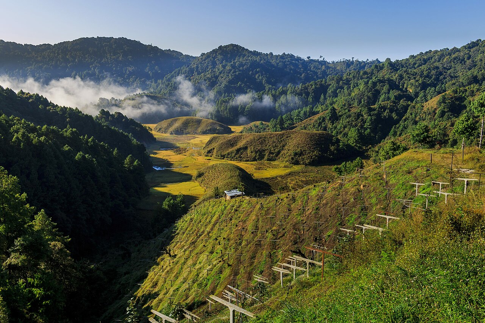
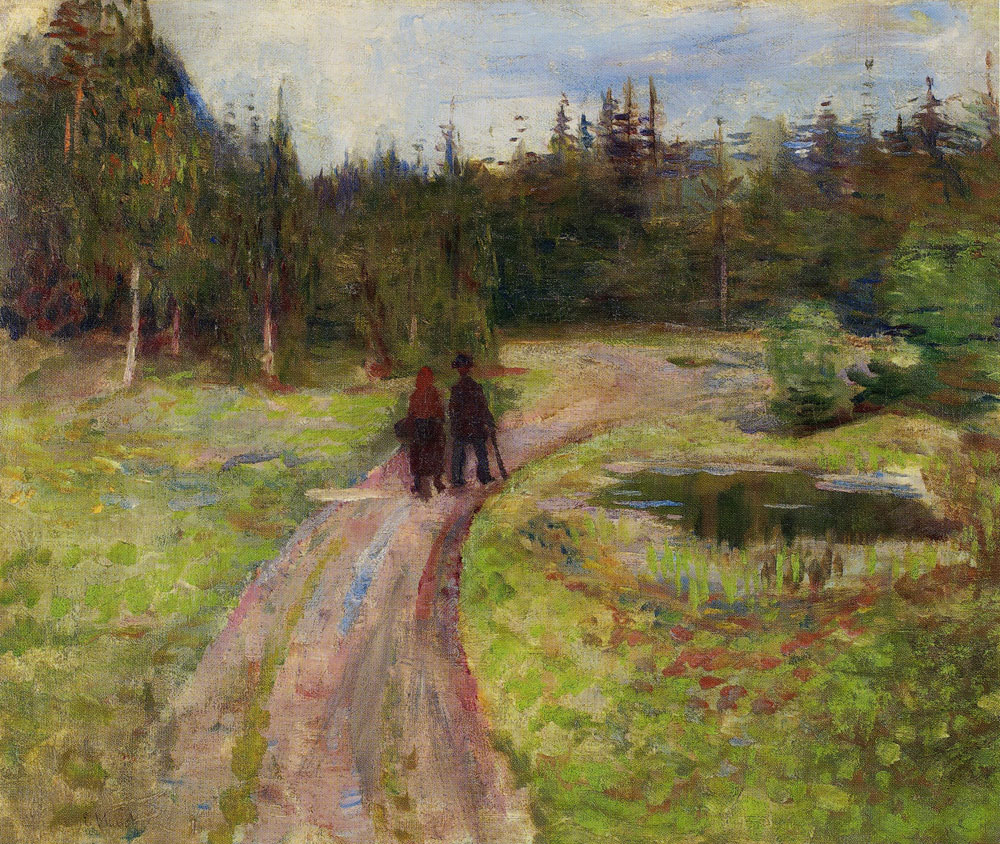
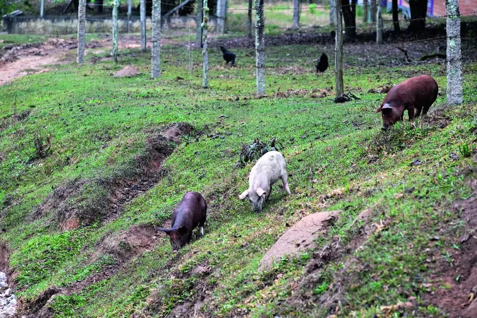

# Percepção e Representação da Paisagem {#sec-percepcao}

## Paisagem percebida e paisagem analisada

A paisagem é, antes de ser um objeto de análise espacial, um objeto de percepção. O termo "paisagem" (*Landschaft*, *landscape*, *paysage*) carrega, em todas as tradições linguísticas, uma dupla acepção. Refere-se simultaneamente a uma porção de território visível a partir de um ponto de observação e a uma representação (pictórica, cartográfica, computacional) dessa porção. Essa dualidade é relevante porque a forma como a paisagem é percebida e representada condiciona diretamente as decisões de manejo, planejamento e conservação que sobre ela incidem.

Na tradição geográfica europeia, a paisagem cultural (*Kulturlandschaft*) é entendida como o produto da interação secular entre uma sociedade e seu substrato biofísico. Nessa perspectiva, a paisagem não é apenas um arranjo de manchas e corredores, mas um texto territorial que registra práticas agrícolas, preferências estéticas, relações de poder e estratégias de sobrevivência ao longo de gerações. A paisagem cultural (Fig. @fig-paisagem-cultural) revela essa sobreposição de camadas humanas e biofísicas num mesmo território, onde a leitura requer tanto ferramentas quantitativas (métricas, índices, classificações) quanto sensibilidade interpretativa (história agrária, etnografia, análise institucional).

{#fig-paisagem-cultural fig-align="center" width="85%"}

Na prática contemporânea da Ciência da Paisagem, contudo, a paisagem analisada é predominantemente a paisagem representada em formato digital, seja como imagem de satélite, mapa temático de uso e cobertura, modelo digital de elevação ou base cadastral vetorial. A transição da percepção direta (observação em campo, fotointerpretação visual) para a representação computacional (classificação automática de imagens, cálculo algorítmico de métricas) implica ganhos de reprodutibilidade e escala, mas também perdas de informação contextual que devem ser reconhecidas e, quando possível, mitigadas por validação em campo.

## Perspectivas filosóficas da percepção

A dimensão perceptiva e vivencial da paisagem foi sistematizada por três autores que permanecem influentes nas ciências humanas e na geografia ambiental, e cujas contribuições são relevantes para compreender por que populações locais valoram, usam e transformam a paisagem de determinado modo.

**Yi-Fu Tuan** [-@tuan1974] cunhou o conceito de **topofilia** para descrever o elo afetivo entre pessoa e lugar: a paisagem não existe apenas como substrato biofísico mensurável, mas como experiência carregada de afeto, memória e significado. A percepção ambiental que sustenta esse vínculo é mediada por sentidos (visão, olfato, audição, tato), cultura (valores, crenças, tradições), experiência pessoal (história de vida, memória) e atitude (postura de admiração, medo ou indiferença). A mesma paisagem pode gerar topofilia (vínculo positivo) ou **topofobia** (aversão) conforme o sujeito. Para o pesquisador, isso implica que dados de percepção não são ruído a ser eliminado, mas informação estruturada sobre as relações entre comunidades e territórios. Na arte, o expressionismo de Edvard Munch (Fig. @fig-munch-floresta) ilustra essa dimensão afetiva ao representar a floresta não como substrato ecológico objetivo, mas como experiência emocional carregada de tensão e inquietação, na qual a paisagem percebida supera a paisagem mensurável.

{#fig-munch-floresta fig-align="center" width="75%"}

**Augustin Berque** [-@berque1984] propôs a distinção entre **paisagem-marca** e **paisagem-matriz**: a paisagem como marca é o produto das ações da sociedade sobre o território (o que a sociedade fez à paisagem); a paisagem como matriz é o conjunto de condicionamentos que a paisagem impõe sobre a sociedade (o que a paisagem faz à sociedade). Essa dupla relação supera a dicotomia sujeito-objeto, reconhecendo que a paisagem é simultaneamente produto e produtora de práticas sociais. O sistema agrícola de cabruca do sul da Bahia exemplifica essa dualidade: é uma paisagem-marca (o agricultor modelou a floresta para o cultivo do cacau sob sombra) e uma paisagem-matriz (o microclima florestal que essa paisagem gera é pré-requisito para a qualidade do cacau e condiciona o próprio modo de vida das comunidades cacauicultoras), como ilustra a @fig-cabruca-cacau.

{#fig-cabruca-cacau fig-align="center" width="85%"}

**Denis Cosgrove** [-@cosgrove1984] situou a paisagem no campo do poder simbólico: a "forma de ver a paisagem" (*way of seeing*) não é neutra, mas historicamente construída e associada ao controle territorial. Mapas, pinturas e hoje imagens de satélite são ao mesmo tempo representações e instrumentos de poder, que elegem o que é visível, nomeável e administrável. Essa perspectiva é especialmente relevante para o Brasil, cujas paisagens mais vulneráveis (Caatinga, cerrado do Matopiba, Amazônia de bordas) são aquelas cujas populações tradicionais têm menor acesso a tecnologias de representação e, portanto, menor visibilidade nos processos de planejamento territorial.

**Paulo César da Costa Gomes** [-@gomes1996] aprofunda esse argumento ao tratar a paisagem como dimensão simbólica e cultural do território, isto é, como condição de visibilidade pública daquilo que uma sociedade reconhece, nomeia e disputa como espaço comum. Nessa formulação, toda forma percebida é mediada por convenções estéticas, jurídicas e políticas que definem o que se torna paisagem reconhecível, de modo que a leitura da paisagem cultural exige articular o substrato biofísico com os códigos de representação que historicamente o tornaram público. A combinação dessa abordagem com as anteriores produz um arcabouço no qual a paisagem é simultaneamente vínculo afetivo (Tuan), dualidade marca-matriz entre sociedade e território (Berque), maneira de ver socialmente construída (Cosgrove) e dimensão simbólica que regula a visibilidade pública do espaço (Costa Gomes). Os aportes dessas perspectivas para a análise territorial integrada encontram-se sintetizados na @tbl-percepcao-autores.

| Autor | Conceito central | Aporte à análise de paisagem |
|:------|:-----------------|:-----------------------------|
| Tuan (1974) | Topofilia e topofobia | Explica a valoração diferencial do território por populações locais; orienta metodologias participativas |
| Berque (1984) | Paisagem-marca / paisagem-matriz | Articula dimensão histórica e condicionamento mútuo entre sociedade e território |
| Cosgrove (1984) | Paisagem como *way of seeing* | Revela relações de poder na representação cartográfica e nos instrumentos de planejamento |
| Costa Gomes (1996) | Dimensão simbólica e visibilidade pública | Explicita as convenções estéticas, jurídicas e políticas que tornam a paisagem reconhecível como espaço comum |

: Perspectivas filosóficas de percepção da paisagem e sua relevância operacional. {#tbl-percepcao-autores .striped .hover}

::: {.callout-note}
## Paisagem cultural e patrimônio
A dimensão perceptiva e cultural da paisagem é reconhecida institucionalmente por organismos como o IPHAN (Instituto do Patrimônio Histórico e Artístico Nacional), a UNESCO (com a categoria "Paisagem Cultural da Humanidade") e a Convenção Europeia da Paisagem (Florença, 2000). A Chancela da Paisagem Cultural Brasileira, instituída pelo IPHAN em 2009, protege porções do território nacional nas quais a inter-relação entre natureza, cultura e processos dinâmicos de ocupação é considerada de valor excepcional. Exemplos brasileiros reconhecidos ou candidatos incluem a Cabruca do sul da Bahia, o Sistema Faxinal do sul do Brasil e os territórios de Fundo de Pasto do semiárido baiano — todos casos em que a paisagem é ao mesmo tempo resultado de práticas tradicionais e condição de reprodução dessas práticas.
:::

{#fig-faxinal-paisagem-cultural fig-align="center" width="85%"}

A percepção da paisagem é condicionada pelo ponto de observação e pela escala de análise. A visão panorâmica de um mosaico paisagístico (Fig. @fig-perspectiva-paisagem) evidencia como a mudança de perspectiva transforma a leitura do território, revelando padrões de uso, limites entre elementos e relações de vizinhança que não são perceptíveis ao nível do solo.

{#fig-perspectiva-paisagem fig-align="center" width="85%"}

## Da percepção à representação cartográfica

A transição da percepção visual para a representação cartográfica envolve um conjunto de decisões metodológicas que determinam o que será incluído e excluído da análise, e cujas consequências propagam-se por toda a cadeia analítica subsequente. Toda carta de uso e cobertura do solo é uma abstração que classifica a variabilidade contínua da superfície terrestre em categorias discretas (floresta, pastagem, área urbana, corpo d'água). O número de categorias, os critérios de classificação e a resolução espacial são escolhas que refletem os objetivos da análise e condicionam os resultados. Uma classificação com 5 classes produzirá uma paisagem aparentemente mais homogênea do que uma classificação com 25 classes aplicada à mesma imagem, e métricas como número de manchas, diversidade de Shannon e densidade de bordas serão radicalmente diferentes nos dois casos.

A fotografia aérea, utilizada desde o trabalho pioneiro de Troll [-@troll1939], foi durante décadas a principal fonte de dados para a representação da paisagem, e a fotointerpretação manual permanece como método de referência para validação de classificações automáticas. A partir da década de 1970, imagens de satélite (Landsat, SPOT, CBERS) ampliaram a extensão e a frequência temporal da observação, permitindo análises de dinâmica da paisagem em escalas continentais. Mais recentemente, veículos aéreos não tripulados (VANT/drones) e imagens de alta resolução (Planet, WorldView) preencheram a lacuna entre a fotografia aérea clássica e as imagens orbitais de média resolução, criando um continuum de fontes de dados que se diferenciam pela escala espacial, pelo custo e pela frequência de revisita, conforme sistematiza a @fig-fontes-dados.

```{dot}
//| label: fig-fontes-dados
//| fig-cap: "Principais fontes de dados para representação da paisagem, organizadas por escala espacial e resolução."
//| fig-width: 6.5
digraph {
    rankdir=LR
    bgcolor="transparent"
    node [shape=box, style="rounded,filled", fontname="Helvetica", fontsize=9, margin="0.2,0.1", penwidth=0.8]
    edge [fontname="Helvetica", fontsize=8, color="#555555", penwidth=1.0]

    A [label="Observação\nde campo", fillcolor="#E8F5E9", color="#2E7D32"]
    B [label="Levantamento\nde campo", fillcolor="#C8E6C9", color="#2E7D32"]
    C [label="VANT / Drone", fillcolor="#E3F2FD", color="#1565C0"]
    D [label="Ortofoto\n< 10 cm", fillcolor="#BBDEFB", color="#1565C0"]
    E [label="Alta resolução\nPlanet, WorldView", fillcolor="#FFF3E0", color="#E65100"]
    F [label="Imagem\n0.3–5 m", fillcolor="#FFE0B2", color="#E65100"]
    G [label="Média resolução\nSentinel, Landsat", fillcolor="#FCE4EC", color="#AD1457"]
    H [label="Imagem\n10–30 m", fillcolor="#F8BBD0", color="#AD1457"]
    I [label="Baixa resolução\nMODIS", fillcolor="#E1BEE7", color="#6A1B9A"]
    J [label="Imagem\n250–1000 m", fillcolor="#CE93D8", color="#6A1B9A"]

    A -> B [label="Escala local\n< 10 ha"]
    C -> D [label="Escala detalhe\n10–100 ha"]
    E -> F [label="Escala local\n$10^2$–$10^3$ ha"]
    G -> H [label="Escala regional\n$10^3$–$10^5$ ha"]
    I -> J [label="Escala continental\n> $10^5$ ha"]
}
```

A @fig-fontes-dados evidencia que não existe uma fonte de dados universalmente adequada para todas as análises de paisagem. A escolha depende da extensão da área de estudo, do processo ecológico de interesse e da resolução mínima necessária para detectar os elementos da paisagem relevantes. Para estudos de conectividade em escala de bacia hidrográfica ($10^3$–$10^4$ ha), imagens Sentinel-2 (10 m) ou Landsat (30 m) são tipicamente adequadas, pois detectam fragmentos a partir de 0,01 ha e 0,09 ha, respectivamente. Para monitoramento de APP e restauração em escala de propriedade rural ($10^1$–$10^2$ ha), imagens de alta resolução (Planet, 3–5 m) ou levantamentos por VANT (resolução sub-decimétrica) são necessários para mapear a largura real da faixa ripária e avaliar o estágio de regeneração. Para detecção de desmatamento em escala amazônica ($10^6$–$10^8$ ha), dados MODIS (250 m) permitem alertas diários, enquanto a confirmação e quantificação exigem Landsat ou Sentinel.

A passagem de uma escala a outra não é trivial. Dados de alta resolução contêm variabilidade intra-fragmento (clareiras, sub-bosque, trilhas) que pode ser confundida com fragmentação real se a classificação não for adequadamente generalizada. Dados de baixa resolução, inversamente, homogeneízam a paisagem e suprimem elementos menores que seu grão (corredores estreitos, pequenos fragmentos), subestimando a diversidade estrutural. A calibração entre escalas é um problema ativo na Ciência da Paisagem e será retomado no @sec-escalas.

## Modelos de representação

Duas abordagens dominam a representação computacional da paisagem. O modelo raster (matricial) divide o espaço em células regulares (pixels), cada uma atribuída a uma classe ou valor numérico. É o formato nativo das imagens de satélite e o mais utilizado para cálculo de métricas da paisagem em softwares como FRAGSTATS [@mcgarigal2012] e landscapemetrics (R). A principal vantagem do modelo raster é a continuidade espacial (todo o espaço está representado, sem lacunas) e a eficiência computacional para operações algébricas (sobreposição de camadas, cálculo de índices espectrais, operações de vizinhança).

O modelo vetorial representa a paisagem por meio de pontos, linhas e polígonos. É o formato preferido para cadastros fundiários (CAR, Sistema de Cadastro Ambiental Rural), limites de unidades de conservação, rede hidrográfica e mapeamentos de detalhe com validação em campo. A conversão entre raster e vetor introduz artefatos que devem ser controlados na análise, especialmente efeitos de escada (*staircasing*) na vetorização de rasters e perda de detalhe na rasterização de polígonos complexos. A @tbl-raster-vetor compara as propriedades dos dois modelos.

| Característica | Modelo raster | Modelo vetorial |
|:---|:---|:---|
| Unidade espacial | Pixel (célula regular) | Ponto, linha, polígono |
| Fonte típica | Imagens de satélite, MDE | Cadastros fundiários, levantamentos GPS |
| Vantagem principal | Continuidade espacial, eficiência para operações algébricas | Precisão de limites, topologia explícita |
| Limitação principal | Resolução fixa, artefatos de borda em conversão | Complexidade computacional, generalização necessária |
| Software típico | FRAGSTATS, QGIS Raster, Google Earth Engine | QGIS, PostGIS, GeoPandas |
| Uso em métricas | Cálculo direto (PLAND, NP, SHAPE, CORE) | Requer rasterização prévia para FRAGSTATS |

: Comparação entre os modelos raster e vetorial para representação da paisagem. {#tbl-raster-vetor .striped .hover}

A @tbl-raster-vetor evidencia que raster e vetor não são modelos concorrentes, mas complementares. Na prática da análise da paisagem, o fluxo típico envolve classificação de imagens raster (sensoriamento remoto), cálculo de métricas em ambiente raster (FRAGSTATS, landscapemetrics) e sobreposição dos resultados com dados vetoriais (limites de propriedades, unidades de conservação, zoneamento). A integração dos dois modelos num único ambiente SIG (como QGIS ou ArcGIS) é pré-requisito para a análise espacial completa.

## Classificação e legendas

A classificação de uso e cobertura do solo é o passo que transforma dados brutos (imagens, fotografias) em mapas temáticos utilizáveis para análise da estrutura da paisagem. O sistema de legenda (número e definição de classes) determina o nível de detalhe da representação e deve ser definido em função dos objetivos da análise e do processo ecológico de interesse.

No Brasil, sistemas de classificação amplamente utilizados incluem o sistema do IBGE (Manual Técnico de Uso da Terra, com hierarquia de níveis de detalhamento), o sistema MapBiomas (com 6 níveis hierárquicos e mais de 30 classes no nível mais detalhado) e sistemas adaptados a biomas específicos. A escolha do sistema de legenda afeta diretamente as métricas de paisagem calculadas. Uma classificação que agrupe todas as formações florestais numa única classe ("Floresta") produzirá valores de fragmentação menores (menos manchas, maiores) do que uma classificação que distinga floresta ombrófila densa, floresta estacional semidecidual e mangue como classes separadas (mais manchas, menores). Essa sensibilidade das métricas à legenda é uma fonte de incerteza frequentemente subestimada.

::: {.callout-note}
## Classificação e processo ecológico
A legenda deve refletir a relevância funcional das classes para o processo ecológico em estudo. Se o interesse é a dispersão de aves frugívoras, a distinção entre "floresta primária" e "capoeira avançada" pode ser irrelevante (ambas fornecem recursos alimentares e cobertura), mas a distinção entre "qualquer floresta" e "área aberta" é essencial (a permeabilidade da matriz difere radicalmente). Se o interesse é hidrologia, a distinção entre "pastagem" e "solo exposto" é fundamental (taxas de infiltração e escoamento distintas), enquanto "floresta" e "capoeira" podem ser agrupadas (ambas oferecem alta interceptação e baixo escoamento superficial).
:::

## Representação da paisagem em ambiente tropical

Paisagens tropicais impõem desafios específicos à representação que exigem adaptações metodológicas em relação aos protocolos desenvolvidos para paisagens temperadas. A nebulosidade persistente durante a estação chuvosa limita severamente a disponibilidade de imagens ópticas livres de nuvens, especialmente na Amazônia e na Zona da Mata nordestina, onde séries de 4 a 6 meses podem não conter nenhuma cena utilizável. Sistemas de radar (SAR), como o Sentinel-1, oferecem alternativa ao penetrar nuvens e capturar informação sobre a estrutura da vegetação independentemente da cobertura atmosférica.

A alta diversidade de fitofisionomias dificulta a separação espectral entre classes, particularmente no Cerrado, onde a transição entre campo limpo, campo sujo, cerrado ralo, cerrado típico, cerrado denso e cerradão forma um gradiente contínuo de biomassa e cobertura de dossel que não se discretiza facilmente em classes temáticas. Nesses casos, abordagens baseadas em séries temporais de índices de vegetação (NDVI, EVI) permitem explorar a fenologia como critério de separação, pois formações decíduas e perenifólias apresentam assinaturas temporais distintas mesmo quando suas respostas espectrais em uma única data são semelhantes.

A representação adequada da paisagem é pré-requisito para qualquer análise quantitativa subsequente. Os capítulos da Parte II detalharão os procedimentos de sensoriamento remoto (@sec-sensoriamento), geoprocessamento (@sec-sig), classificação (@sec-uso-cobertura) e cálculo de métricas (@sec-metricas) que transformam representações cartográficas em indicadores quantitativos da estrutura, função e dinâmica da paisagem.

## Bases públicas de dados espaciais para o Brasil

A consolidação de plataformas abertas de distribuição de dados espaciais na última década transformou radicalmente o acesso a informações territoriais no Brasil. A @tbl-bases-publicas organiza as principais bases disponíveis para análises de paisagem no território brasileiro, com indicação do dado, resolução e endereço de acesso.

| Base / Plataforma | Dado principal | Resolução | Acesso |
|:------------------|:--------------|:---------:|:------:|
| **MapBiomas** | Uso e cobertura da terra, série 1985–atual | 30 m | mapbiomas.org |
| **TOPODATA (INPE)** | Modelo Digital de Elevação, declividade, aspecto | 30 m | topodata.inpe.br |
| **IBGE** | Bases cartográficas, censos, malha de setores | 1:250.000 | ibge.gov.br/geociencias |
| **ANA / SNIRH** | Bacias hidrográficas, rede de drenagem, outorgas | 1:1.000.000 | snirh.gov.br |
| **SICAR** | Cadastro Ambiental Rural (APP, RL) | Variável | car.gov.br |
| **ICMBio** | Limites de unidades de conservação | — | icmbio.gov.br |
| **CPRM** | Geologia, hidrogeologia, unidades litológicas | 1:1.000.000 | geosgb.cprm.gov.br |
| **EMBRAPA Solos** | Classes de solos, aptidão agrícola | 1:250.000 | embrapa.br/solos |
| **PRODES / TerraBrasilis** | Desmatamento na Amazônia, alertas anuais | 30 m | terrabrasilis.inpe.br |
| **Google Earth Engine** | Processamento de imagens em escala planetária | Variável | earthengine.google.com |
| **Copernicus Browser** | Imagens Sentinel-1 (SAR) e Sentinel-2 (óptico) | 10–20 m | browser.dataspace.copernicus.eu |

: Principais bases públicas de dados espaciais para análise da paisagem no Brasil. {#tbl-bases-publicas .striped .hover}

::: {.callout-tip}
## Fluxo mínimo de dados para um diagnóstico de paisagem
Para a maioria dos estudos de Ciência da Paisagem em bacias hidrográficas brasileiras, quatro bases formam o núcleo mínimo: (1) modelo digital de elevação do TOPODATA para derivar declividade, aspecto e rede de drenagem; (2) mapa de uso e cobertura do MapBiomas para a série temporal de mudanças; (3) base hidrográfica da ANA/SNIRH para delimitação de bacias e sub-bacias; e (4) dados do SICAR para identificar cobertura legal de APP e Reserva Legal nas propriedades inseridas na área de estudo. A sobreposição dessas quatro camadas permite identificar violações de APP, fragmentação do hábitat, trajetórias de mudança de uso e gaps de conectividade num único ambiente SIG.
:::
