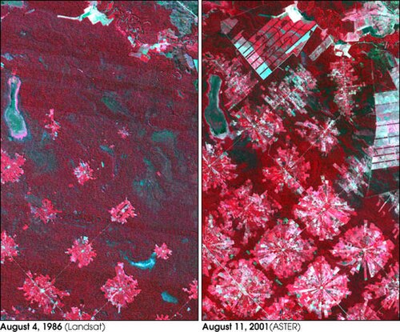

# Fragmentação e Conectividade {#sec-fragmentacao}

## Fragmentação de habitat

A fragmentação de habitat é o processo pelo qual uma área contínua de habitat é subdividida em manchas menores, mais isoladas e com maior proporção de borda. É considerado um dos principais fatores de perda de biodiversidade em escala global e opera em sinergia com a perda total de habitat, amplificando os efeitos negativos desta última [@fahrig2003]. A distinção entre perda de habitat (redução da proporção total) e fragmentação per se (subdivisão do remanescente, mantendo a proporção constante) é conceitualmente fundamental, embora na prática ambos os processos ocorram simultaneamente e de forma correlacionada.

Fahrig [-@fahrig2003] sintetizou evidências de mais de 100 estudos e concluiu que a perda de habitat explica a maior parte da variação na riqueza e abundância de espécies em paisagens fragmentadas, enquanto os efeitos da fragmentação per se são comparativamente menores e frequentemente inconsistentes em direção. Contudo, trabalho posterior da mesma autora [@fahrig2017] provocou debate intenso ao argumentar que os efeitos da fragmentação per se, quando detectados, são mais frequentemente positivos do que negativos para a biodiversidade, hipótese contestada por diversos autores que apontaram limitações metodológicas e vieses de escala.

Independentemente de qual componente domina, os mecanismos pelos quais a fragmentação afeta a biota são bem documentados. A redução do tamanho das manchas diminui a área disponível para populações, aumenta a razão perímetro/área (amplificando efeitos de borda) e reduz a área nuclear funcional. O aumento do isolamento entre manchas reduz as taxas de (re)colonização, diminui o fluxo gênico e aumenta a vulnerabilidade a eventos estocásticos (demográficos, genéticos e ambientais). O aumento da proporção de borda altera o microclima (temperatura, umidade, vento, luminosidade), favorece espécies generalistas e invasoras, e aumenta as taxas de predação e parasitismo de ninhos nas faixas marginais. A @fig-mecanismos-fragmentacao sintetiza esses mecanismos.

```{dot}
//| label: fig-mecanismos-fragmentacao
//| fig-cap: "Mecanismos pelos quais a fragmentação de habitat conduz à perda de biodiversidade, distinguindo os efeitos da perda de área, da subdivisão e do aumento de borda."
//| fig-width: 6.5
digraph {
    rankdir=TB
    bgcolor="transparent"
    node [shape=box, style="rounded,filled", fontname="Helvetica", fontsize=10, margin="0.25,0.12", penwidth=0.8]
    edge [color="#555555", penwidth=1.0]

    A [label="Conversão de habitat", fillcolor="#B71C1C", fontcolor="white", color="#7F0000", penwidth=1.5]
    B [label="Perda de área total", fillcolor="#FFCDD2", color="#C62828"]
    C [label="Subdivisão em\nmanchas menores", fillcolor="#FFCDD2", color="#C62828"]
    D [label="Menor capacidade\nde suporte", fillcolor="#FFE0B2", color="#E65100"]
    E [label="Aumento de\nisolamento", fillcolor="#FFE0B2", color="#E65100"]
    F [label="Aumento de\nproporção de borda", fillcolor="#FFE0B2", color="#E65100"]
    G [label="Extinção local\nde espécies", fillcolor="#E1BEE7", color="#6A1B9A"]
    H [label="Redução de fluxo gênico\ne recolonização", fillcolor="#E1BEE7", color="#6A1B9A"]
    I [label="Alteração microclimática\ne invasão biológica", fillcolor="#E1BEE7", color="#6A1B9A"]
    J [label="Perda de\nbiodiversidade", fillcolor="#B71C1C", fontcolor="white", color="#7F0000", penwidth=1.5]

    A -> B
    A -> C
    B -> D
    C -> E
    C -> F
    D -> G
    E -> H
    F -> I
    G -> J
    H -> J
    I -> J
}
```

A @fig-mecanismos-fragmentacao revela que a perda de biodiversidade não resulta de um mecanismo único, mas de três vias causais convergentes que atuam simultaneamente e se reforçam mutuamente. A via da perda de área (direta) reduz a capacidade de suporte do habitat remanescente. A via do isolamento (indireta) compromete a capacidade de recolonização após extinções locais, transformando o que seria um processo dinâmico de extinção-recolonização (metapopulação funcional) em extinção irreversível. A via do efeito de borda (indireta) degrada a qualidade do habitat remanescente, reduzindo sua funcionalidade mesmo quando sua área nominal é mantida. A interação entre essas vias explica por que os efeitos da fragmentação são tipicamente não-lineares, com limiares abruptos de resposta quando a proporção de habitat cai abaixo de valores críticos. Os estágios progressivos dessa trajetória estão representados na @fig-estagios-fragmentacao.

{#fig-estagios-fragmentacao fig-align="center" width="85%"}

Em paisagens onde a fragmentação atingiu estágios avançados (Fig. @fig-fragmentacao-florestal), a área nuclear dos fragmentos remanescentes é drasticamente reduzida e a proporção de borda em relação ao interior torna-se dominante, alterando a composição de espécies e os processos ecológicos mesmo nos fragmentos de maior extensão.

{#fig-fragmentacao-florestal fig-align="center" width="85%"}

## Limiares de fragmentação

Estudos teóricos baseados em teoria de percolação e simulações neutras predizem que a conectividade estrutural de uma paisagem colapsa quando a proporção de habitat cai abaixo de aproximadamente 59% (limiar de percolação em mapas aleatórios). Em paisagens reais, com padrões não-aleatórios de desmatamento, limiares empíricos de 20–30% de habitat remanescente são frequentemente reportados como pontos de inflexão abaixo dos quais a riqueza de espécies, a conectividade funcional e os serviços ecossistêmicos declinam abruptamente.

A existência de limiares tem implicações diretas para o planejamento territorial. Se uma bacia hidrográfica possui 35% de cobertura florestal, ela pode estar acima do limiar crítico de conectividade. Se a mesma bacia tem apenas 15%, ela pode já ter cruzado o limiar, e a restauração de fragmentos adicionais pode ter retorno ecológico proporcionalmente muito maior do que a mesma área restaurada na paisagem de 35%. A identificação de limiares específicos para cada contexto (bioma, grupo taxonômico, tipo de matriz) é um campo ativo de pesquisa e requer dados de biodiversidade associados a gradientes de proporção de habitat.

## Conectividade estrutural e funcional

A conectividade é a propriedade da paisagem que facilita ou impede o deslocamento de organismos e o fluxo de processos ecológicos entre manchas de habitat [@taylor1993]. A conectividade estrutural refere-se à continuidade física dos habitats no espaço, quantificada por métricas de distância entre manchas (ENN), índice de proximidade (PROX) e proporção de habitat (PLAND). A conectividade funcional incorpora a resposta comportamental dos organismos à estrutura da paisagem, reconhecendo que espécies diferentes percebem a mesma paisagem de formas radicalmente distintas.

Um corredor ripário de 30 m de largura é funcionalmente conectivo para invertebrados, anfíbios e pequenas aves de sub-bosque, mas pode ser uma barreira efetiva para mamíferos de grande porte que o evitam por sua estreiteza. Uma pastagem de 500 m entre dois fragmentos pode ser trivialmente cruzável para um tucano mas intransponível para uma formiga-de-correição. Portanto, a conectividade funcional é intrinsecamente espécie-específica e não pode ser avaliada apenas por métricas estruturais.

A **permeabilidade da matriz** é o conceito-chave que medeia a relação entre estrutura e conectividade funcional. Cada tipo de cobertura do solo impõe um grau diferente de resistência ao deslocamento dos organismos, quantificável como custo de passagem e calibrável por dados de telemetria ou compilações bibliográficas da literatura especializada (@tbl-resistencia-matriz).

| Tipo de cobertura | Permeabilidade | Custo de deslocamento (ref.) |
|:------------------|:--------------:|:----------------------------:|
| Floresta nativa contínua | Muito alta | 1 |
| Floresta secundária / capoeira | Alta | 1–5 |
| Silvicultura (eucalipto, pinus) | Média-alta | 5–15 |
| Pastagem com árvores / silvipastoril | Média | 20–40 |
| Pastagem limpa | Baixa | 40–80 |
| Monocultura mecanizada (soja, cana) | Muito baixa | 60–100 |
| Área urbana de baixa densidade | Variável | 100–300 |
| Área urbana densa / industrial | Barreira | 300–500 |
| Rodovia pavimentada | Barreira forte | 1000 |
| Corpo d'água (depende da espécie) | Variável | 10–1000 |

: Valores de referência de resistência ao deslocamento por tipo de cobertura do solo. Valores normalizados com floresta nativa = 1. A parametrização precisa deve ser calibrada com dados de telemetria da espécie focal. Fontes: @taylor1993; @saura2007; compilação de literatura. {#tbl-resistencia-matriz .striped .hover}

Entre floresta nativa (custo = 1) e rodovia pavimentada (custo = 1000), a diferença de permeabilidade corresponde a três ordens de grandeza, o que implica que uma rodovia equivale funcionalmente, como barreira ao deslocamento, a uma distância de floresta mil vezes maior. A qualidade da matriz não é, portanto, um detalhe metodológico, mas um determinante central da conectividade funcional (ver @sec-restauracao-conectividade).

## Modelos de conectividade

Três famílias de modelos são utilizadas para avaliar a conectividade funcional da paisagem. A @fig-modelos-conectividade compara seus princípios.

```{dot}
//| label: fig-modelos-conectividade
//| fig-cap: "Três abordagens para modelagem de conectividade funcional da paisagem."
//| fig-width: 6.5
digraph {
    rankdir=LR
    bgcolor="transparent"
    node [shape=box, style="rounded,filled", fontname="Helvetica", fontsize=10, margin="0.25,0.12", penwidth=0.8]
    edge [color="#555555", penwidth=1.0]

    A [label="Modelos de\nConectividade", fillcolor="#2E7D32", fontcolor="white", color="#1B5E20", penwidth=1.5]
    B [label="Custo-distância\n(Least-cost path)", fillcolor="#BBDEFB", color="#1565C0"]
    C [label="Teoria de circuitos\n(Circuitscape)", fillcolor="#FFE0B2", color="#E65100"]
    D [label="Teoria de grafos\n(Redes ecológicas)", fillcolor="#E1BEE7", color="#6A1B9A"]
    E [label="Caminho ótimo\nentre nós", fillcolor="#E3F2FD", color="#1565C0"]
    F [label="Múltiplas rotas\nsimultâneas", fillcolor="#FFF3E0", color="#E65100"]
    G [label="Topologia da rede\nde habitat", fillcolor="#F3E5F5", color="#6A1B9A"]

    A -> {B C D}
    B -> E
    C -> F
    D -> G
}
```

A @fig-modelos-conectividade sintetiza as três abordagens principais, cada uma com pressupostos e aplicações distintas.

O modelo de custo-distância (*least-cost path*, LCP) atribui a cada célula da paisagem um valor de resistência ao deslocamento e calcula o caminho de menor custo acumulado entre pares de manchas. A resistência é definida por um raster de fricção calibrado com dados de telemetria, opinião de especialistas ou relações empíricas entre permeabilidade e tipo de cobertura. O LCP assume que o organismo possui conhecimento perfeito da paisagem e seleciona a rota ótima, premissa frequentemente irrealista que pode subestimar o custo real de deslocamento para espécies com percepção limitada do ambiente.

O modelo de teoria de circuitos (*Circuitscape*) trata a paisagem como um circuito elétrico no qual cada célula possui uma condutância proporcional à permeabilidade do habitat. A corrente elétrica entre dois nós (fragmentos) flui por múltiplas rotas simultaneamente, ponderadas pela resistência, e a corrente total quantifica a conectividade efetiva entre os nós. A principal vantagem em relação ao LCP é a consideração de rotas alternativas, o que torna o modelo mais robusto à perda localizada de conectividade (remoção de um corredor, por exemplo) e permite identificar pixels de alta importância para a conectividade (gargalos, *pinch points*) [@taylor1993].

O modelo de teoria de grafos (redes ecológicas) representam os fragmentos como nós e as conexões potenciais entre eles como arestas, cuja presença ou peso depende da distância e da permeabilidade da matriz. Métricas de conectividade de grafos, como o índice integral de conectividade (*IIC*) e o índice de probabilidade de conectividade (*PC*) [@saura2007], quantificam a importância de cada nó e aresta para a conectividade global da rede, permitindo priorizar fragmentos para conservação ou restauração com base em sua contribuição para a manutenção de fluxos ecológicos na paisagem.

## Conectividade e espécies focais

A parametrização de modelos de conectividade requer informações biológicas sobre as espécies focais (*focal species*), incluindo capacidade de dispersão (distância máxima de deslocamento), sensibilidade ao tipo de matriz (resistência diferencial por cobertura), requisitos de habitat (área mínima viável, estrutura de vegetação) e modo de deslocamento (voo, caminhada, natação). A escolha da espécie focal determina os valores de resistência e os limiares de distância utilizados no modelo, e diferentes espécies focais podem produzir avaliações de conectividade radicalmente diferentes para a mesma paisagem.

Na prática, quando dados biológicos detalhados não estão disponíveis, são utilizadas espécies guarda-chuva (*umbrella species*), cuja conservação beneficia um conjunto amplo de espécies co-ocorrentes. Mamíferos de grande porte com alta demanda de área (onça-pintada, anta) são frequentemente empregados como espécies guarda-chuva para conectividade, sob a premissa de que uma paisagem conectada para essas espécies será conectada a fortiori para espécies com menores requisitos de área e deslocamento. Essa premissa, contudo, não se aplica a espécies com modos de deslocamento qualitativamente distintos (anfíbios que dependem de corredores aquáticos, por exemplo).

## Restauração da conectividade {#sec-restauracao-conectividade}

A restauração da conectividade em paisagens fragmentadas envolve três estratégias complementares. A primeira, e mais intuitiva, é a implantação de corredores ecológicos (faixas lineares de habitat que ligam fragmentos), discutida em detalhe no @sec-corredores. A segunda é o aumento da permeabilidade da matriz, por meio da substituição de usos intensivos (monocultura, pastagem limpa) por usos que oferecem cobertura parcial e recursos para a fauna (sistemas agroflorestais, silvipastoris, agricultura diversificada), reduzindo a resistência ao deslocamento sem necessariamente criar habitat contíguo. A terceira é a criação de stepping stones (trampolins ecológicos), manchas pequenas de habitat posicionadas estrategicamente entre fragmentos maiores para reduzir a distância efetiva de deslocamento.

A priorização espacial de áreas para restauração da conectividade pode ser informada pelos modelos de circuitos e grafos discutidos acima. Áreas identificadas como gargalos de conectividade (pixels com alta corrente em modelos Circuitscape) ou como nós de alta centralidade (grafos) são candidatas prioritárias para restauração, pois sua recuperação produz o maior incremento de conectividade por unidade de área restaurada.

::: {.callout-important}
## Conectividade no Código Florestal brasileiro
A Lei 12.651/2012 (Código Florestal) não prevê mecanismos explícitos de avaliação de conectividade na escala da paisagem. As Áreas de Preservação Permanente (APP) e as Reservas Legais (RL) são definidas propriedade a propriedade, sem coordenação espacial entre vizinhos. A alocação estratégica de RL para maximizar a conectividade entre fragmentos remanescentes é uma recomendação recorrente na literatura de ecologia da paisagem no Brasil, mas sua implementação depende de instrumentos de governança territorial (zoneamento ambiental municipal, planos de bacia, cadastro ambiental rural integrado) que ainda estão em desenvolvimento.
:::

## Fragmentação e conectividade em paisagens brasileiras

Os biomas brasileiros apresentam graus distintos de fragmentação e conectividade. A Mata Atlântica, com apenas 12% de remanescentes distribuídos em mais de 245.000 fragmentos (dos quais mais de 80% são menores que 50 ha), representa um dos cenários de fragmentação mais extremos do planeta [@ribeiro2009]. A conectividade funcional é criticamente baixa para espécies de grande porte e mediada quase exclusivamente por corredores ripários e por uma matriz de variável permeabilidade (capoeiras, pastagens, silvicultura).

O Cerrado, com aproximadamente 50% de área convertida, apresenta fragmentação crescente especialmente no arco do desmatamento (Cerrado baiano, goiano e matogrossense), onde grandes blocos de vegetação nativa são convertidos em monoculturas de soja e algodão. A conectividade é mantida por veredas e matas de galeria, que formam a rede de corredores naturais do bioma mas cuja proteção legal (APP) nem sempre se traduz em conservação efetiva.

A Amazônia, apesar de manter mais de 80% de cobertura florestal, apresenta fragmentação severa nas bordas sul e leste (arco do desmatamento), onde o padrão de conversão em "espinha de peixe" (estradas vicinais partindo de eixos rodoviários) cria mosaicos complexos de fragmentos florestais, pastagens, cultivos e regeneração secundária. A conectividade entre os grandes blocos florestais remanescentes depende criticamente da manutenção de corredores em áreas indígenas e unidades de conservação.

## Resiliência e vulnerabilidade em paisagens fragmentadas {#sec-resiliencia-paisagem}

Paisagens fragmentadas que mantêm conectividade funcional acima dos limiares de percolação apresentam maior capacidade de absorver perturbações e retornar a estados funcionais equivalentes ao original, propriedade que a literatura designa como **resiliência da paisagem** [@holling1973]. Quando perturbações excedem a capacidade de amortecimento do sistema, a paisagem cruza um limiar de mudança de estado e pode estabilizar-se num regime alternativo de menor biodiversidade e menor provisão de serviços ecossistêmicos.

A **vulnerabilidade socioambiental** complementa a resiliência ao quantificar a exposição ao risco e a sensibilidade da paisagem e das populações que a habitam, em vez de focar na capacidade de recuperação. O framework IPCC articula a vulnerabilidade como função interativa de exposição (grau de contato com o agente de perturbação), sensibilidade (grau em que o sistema é afetado) e capacidade adaptativa (potencial de ajuste e reestruturação). Na escala da paisagem, a **exposição** expressa-se como proximidade a frentes de desmatamento, estradas não pavimentadas, pivôs de irrigação e expansão urbana; a **sensibilidade**, como proporção de habitat remanescente, grau de fragmentação, tamanho médio dos fragmentos e área-núcleo disponível; e a **capacidade adaptativa**, como permeabilidade da matriz, densidade de corredores ripários, presença de unidades de conservação e disponibilidade de áreas para restauração. A integração dessas dimensões em mapas de vulnerabilidade permite identificar zonas de alerta crítico, onde alta exposição simultânea a alta sensibilidade e baixa capacidade adaptativa aumenta a probabilidade de mudança de estado irreversível.

::: {.callout-important}
## Limiares e irreversibilidade
A teoria de percolação indica que paisagens com menos de 30% de habitat remanescente operam próximas a limiares de desconexão estrutural. A teoria de sistemas complexos sugere que, próximos a esses limiares, pequenas perturbações adicionais podem provocar transições de estado abruptas e desproporcionais à perturbação que as desencadeou. Para o planejamento territorial, isso implica que a relação entre invasão antrópica e degradação ecológica é não-linear, sendo que os primeiros 40–50% de conversão de habitat produzem impactos moderados, ao passo que a conversão dos últimos 20–30% pode precipitar colapso funcional desproporcional. A antecipação desses limiares, e não apenas a reação a eventos já observáveis, constitui o principal argumento para integrar análise de resiliência no planejamento preventivo de paisagens.
:::

A resiliência pode ser incrementada por estratégias paisagísticas complementares que incluem a manutenção de habitat acima dos limiares críticos de proporção e conectividade, a diversificação estrutural da paisagem visando heterogeneidade e múltiplas rotas alternativas, a melhoria da qualidade da matriz (ver @tbl-resistencia-matriz) como meio de ampliar a capacidade adaptativa sem necessariamente aumentar a área protegida, e a alocação estratégica de áreas de restauração em zonas identificadas como gargalos pelos modelos de circuitos. O mosaico heterogêneo e conectado resultante dessas estratégias é o modelo estrutural de referência para paisagens funcionalmente resilientes (@fig-paisagem-resiliente).

{#fig-paisagem-resiliente fig-align="center" width="85%"}
