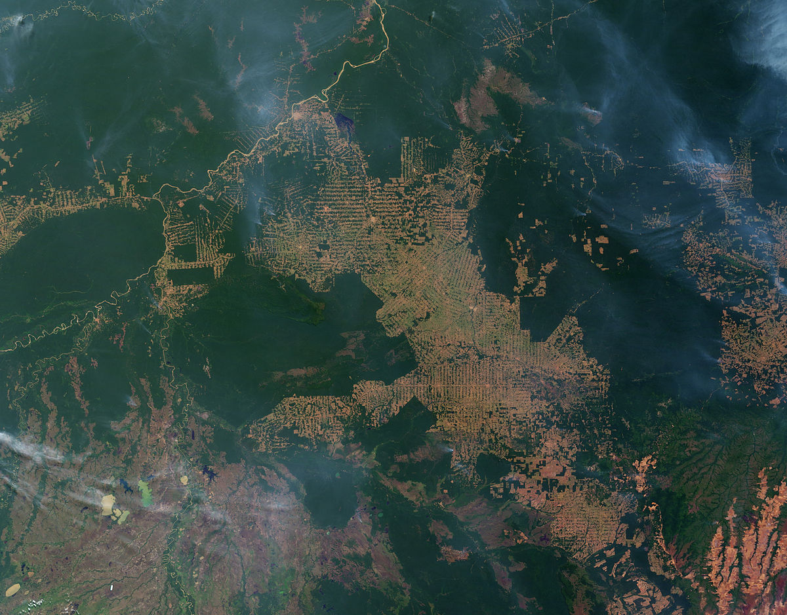
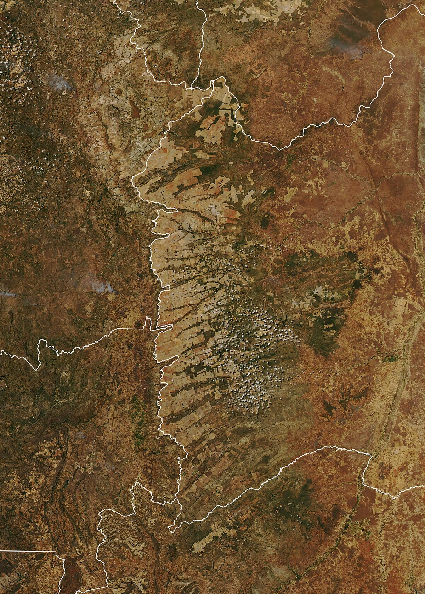

# Dinâmica do Uso e Cobertura do Solo {#sec-dinamica-uso}

## Por que a paisagem muda?

Imagine que você sobrevoa uma região do oeste baiano e observa, de um lado, extensas plantações de soja com pivôs-centrais e, de outro, remanescentes de cerrado nativo. Se pudesse voltar no tempo trinta anos, veria uma paisagem radicalmente diferente, dominada por pastagens extensivas e cerrado contínuo. E se voltasse sessenta anos, encontraria cerrado praticamente intocado. Essa transformação, que converteu milhões de hectares de vegetação nativa em áreas agrícolas ao longo de poucas décadas, é um exemplo de dinâmica do uso e cobertura do solo. Entender por que, onde, quando e como essas mudanças ocorrem é uma das questões centrais da Ciência da Paisagem e, simultaneamente, uma das perguntas mais urgentes para a gestão sustentável do território.

O uso do solo refere-se à finalidade humana atribuída a uma porção da superfície terrestre (agricultura, pecuária, moradia, conservação), enquanto a cobertura do solo descreve a condição biofísica observável dessa superfície (floresta, pastagem, solo exposto, área construída). Embora frequentemente usados como sinônimos, os dois conceitos capturam dimensões distintas. Uma mesma cobertura (pastagem) pode corresponder a usos diferentes (pecuária extensiva, área abandonada em regeneração, reserva legal subutilizada), e um mesmo uso (produção agrícola) pode se manifestar em coberturas distintas ao longo do ano (solo exposto após colheita, cultivo em crescimento, palhada de plantio direto). A dinâmica do uso e cobertura do solo trata, portanto, das transformações simultâneas nessas duas dimensões.

## Forças motrizes da mudança

As mudanças no uso e cobertura do solo não ocorrem ao acaso. Elas são impulsionadas por forças motrizes (*driving forces*) que podem ser classificadas em cinco grandes categorias, representadas na @fig-forcas-motrizes-lulc.

```{dot}
//| label: fig-forcas-motrizes-lulc
//| fig-cap: "Cinco categorias de forças motrizes que condicionam as mudanças de uso e cobertura do solo, convergindo para a transformação observada na paisagem."
//| fig-width: 6.5
digraph {
    rankdir=TB
    bgcolor="transparent"
    node [shape=box, style="rounded,filled", fontname="Helvetica", fontsize=10, margin="0.25,0.12", penwidth=0.8]
    edge [color="#555555", penwidth=1.0]

    A [label="Forças Motrizes de\nMudança de Uso do Solo", fillcolor="#2E7D32", fontcolor="white", color="#1B5E20", penwidth=1.5]
    B [label="Demográficas\ncrescimento, migração,\nurbanização", fillcolor="#E8F5E9", color="#2E7D32"]
    C [label="Econômicas\npreços, mercados,\ncrédito, emprego", fillcolor="#E3F2FD", color="#1565C0"]
    D [label="Tecnológicas\nmecanização, irrigação,\nOGMs, insumos", fillcolor="#FFF3E0", color="#E65100"]
    E [label="Institucionais\nlegislação, políticas\npúblicas, posse da terra", fillcolor="#F3E5F5", color="#6A1B9A"]
    F [label="Biofísicas\nclima, relevo, solos,\naptidão agrícola", fillcolor="#BBDEFB", color="#1565C0"]
    G [label="Mudança de Uso\ne Cobertura do Solo", fillcolor="#1B5E20", fontcolor="white", color="#0D3310", penwidth=1.5]

    A -> {B C D E F}
    B -> G
    C -> G
    D -> G
    E -> G
    F -> G
}
```

A @fig-forcas-motrizes-lulc mostra que a mudança de uso do solo é o resultado da convergência de múltiplas forças que operam simultaneamente e em diferentes escalas. Para compreender intuitivamente o diagrama, considere um exemplo concreto. O desmatamento de uma área de cerrado no Matopiba (região de fronteira agrícola nos estados do Maranhão, Tocantins, Piauí e Bahia) não é explicado por uma única causa, mas pela confluência de fatores demográficos (migração de agricultores do Sul), econômicos (alta no preço internacional da soja), tecnológicos (desenvolvimento de cultivares adaptadas ao cerrado e irrigação por pivô-central), institucionais (fragilidade de fiscalização ambiental e regularização fundiária precária) e biofísicos (topografia plana, solos profundos e clima com estação seca definida que permite mecanização e secagem natural do grão). Nenhum desses fatores, isoladamente, seria suficiente para explicar a conversão. É a interação entre eles que produz a mudança.

As forças motrizes operam em escalas distintas. As forças proximais (*proximate causes*) são as ações humanas diretas que alteram a cobertura do solo, como a derrubada de uma área de floresta, a construção de uma estrada ou a implantação de um sistema de irrigação. As forças subjacentes (*underlying causes*) são os processos sociais, econômicos e políticos mais amplos que criam as condições para que as ações diretas ocorrem, como o crescimento da demanda global por commodities, a valorização fundiária, ou a criação de linhas de crédito para expansão agrícola. A distinção entre forças proximais e subjacentes é análoga à distinção médica entre sintoma e doença. Combater apenas as forças proximais (multar o desmatamento ilegal) sem abordar as subjacentes (ajustar incentivos econômicos e garantir alternativas de renda) tende a ser ineficaz ou a deslocar o problema para outra região, fenômeno conhecido como vazamento (*leakage*).

## Regimes de distúrbio e heterogeneidade espacial

Além das forças motrizes socioeconômicas e institucionais, a dinâmica da paisagem é modulada por regimes de distúrbio, definidos como o padrão temporal e espacial de eventos que removem biomassa, alteram a estrutura da vegetação ou redefinem as condições abióticas de uma área [@turner2010]. O conceito de regime implica que os distúrbios não são eventos isolados, mas obedecem a frequências, intensidades, extensões e sazonalidades características de cada paisagem e bioma [@white1979]. Uma floresta amazônica com regime de distúrbio dominado por queda de árvores individuais e inundações sazonais produz um mosaico de clareiras em diferentes estágios sucessionais, enquanto uma paisagem de cerrado submetida a regime de fogo recorrente (intervalos de 2 a 5 anos) mantém fitofisionomias abertas (campo limpo, campo sujo) em equilíbrio dinâmico com formações mais densas (cerradão) onde o fogo é menos frequente.

O reconhecimento dos distúrbios como forçantes primárias da heterogeneidade espacial é uma contribuição central da ecologia da paisagem à compreensão da dinâmica de uso do solo. Turner [-@turner2010] demonstrou que a interação entre regime de distúrbio e extensão da paisagem determina se o sistema opera em regime de equilíbrio (distúrbios frequentes mas pequenos em relação à paisagem, de modo que a proporção de cada estágio sucessional permanece relativamente estável) ou em regime de não-equilíbrio (distúrbios raros mas extensos que alteram simultaneamente grande parte da paisagem, como incêndios florestais catastróficos ou tempestades tropicais).

No contexto brasileiro, três categorias de distúrbio merecem atenção especial na modelagem da dinâmica da paisagem. O fogo, tanto natural (descargas elétricas no Cerrado) quanto antrópico (queimadas para manejo de pastagem e abertura de área), opera como agente seletivo que favorece espécies rebrotantes e tolerantes ao calor, mantém formações savânicas e, quando descontrolado, converte florestas em formações abertas irreversíveis, particularmente em bordas de fragmentos [@bowman2009]. Na Amazônia, queimadas associadas ao desmatamento (Fig. @fig-queimada-amazonia) constituem o mecanismo primário de conversão florestal e liberam quantidades expressivas de carbono para a atmosfera, conectando a dinâmica de uso do solo às mudanças climáticas globais.

{#fig-queimada-amazonia fig-align="center" width="85%"}

Os eventos climáticos extremos (secas prolongadas, como a de 2015–2016 na Amazônia, e chuvas intensas concentradas) produzem mortalidade seletiva de árvores, deslizamentos de terra, erosão de margens fluviais e redefinição de feições geomorfológicas que alteram a cobertura do solo em escala de bacia hidrográfica. As perturbações antrópicas agudas (construção de barragens, implantação de infraestrutura linear como rodovias e linhas de transmissão, mineração a céu aberto) criam descontinuidades abruptas na paisagem que fragmentam habitats e redefinem padrões de drenagem e conectividade.

A incorporação dos regimes de distúrbio à modelagem de mudanças de uso do solo exige que os modelos (discutidos adiante) sejam parametrizados não apenas com variáveis socioeconômicas e biofísicas estáticas, mas também com frequências e intensidades de distúrbio condicionadas ao clima e ao tipo de cobertura. Essa parametrização é particularmente desafiadora em cenários de mudanças climáticas, nos quais a frequência e a intensidade dos eventos extremos se alteram de forma não linear, modificando regimes de distúrbio historicamente estáveis e produzindo trajetórias de transformação da paisagem sem precedentes nos registros observacionais.

## O ciclo de fronteira agrícola

Um padrão recorrente na dinâmica de uso do solo em regiões tropicais é o ciclo de fronteira agrícola, uma sequência típica de transformações da paisagem que se repete com variações regionais em diversas partes do mundo. No caso brasileiro, esse ciclo pode ser descrito em etapas que, embora apresentadas aqui de forma sequencial para fins didáticos, na prática se sobrepõem temporal e espacialmente.

A primeira etapa é a abertura, na qual a vegetação nativa é removida, geralmente por corte e queima, para implantação de pastagem extensiva ou culturas de subsistência. A supressão da cobertura vegetal nessa fase (Fig. @fig-supressao-desmatamento) gera uma paisagem com grandes manchas de habitat remanescente intercaladas por clareiras relativamente pequenas, tipicamente realizada por pequenos produtores, posseiros ou projetos de colonização.

{#fig-supressao-desmatamento fig-align="center" width="85%"}

A segunda etapa é a consolidação, na qual as áreas abertas se expandem e se conectam, as propriedades se aglutinam por compra ou concentração fundiária, e a paisagem se transforma num mosaico dominado pela matriz antrópica com fragmentos residuais de vegetação nativa. A terceira etapa é a intensificação, na qual as áreas consolidadas recebem investimentos em mecanização, irrigação, correção do solo e culturas de alto rendimento (soja, milho, algodão), substituindo a pecuária extensiva por agricultura de precisão. A quarta etapa, quando ocorre, é a estabilização ou reversão parcial, na qual a legislação ambiental (Código Florestal), programas de restauração e mudanças de mercado (moratória da soja, certificações ambientais) promovem a regeneração de áreas marginais e a conformação de reservas legais e APPs.

Esse ciclo foi documentado de forma emblemática na Amazônia brasileira, onde o modelo clássico de "espinha de peixe" (desmatamento ao longo de estradas que se ramificam perpendicularmente a partir de rodovias principais) é visível em imagens de satélite e constitui um dos padrões de mudança de paisagem mais estudados do mundo. No Cerrado, o ciclo seguiu uma variante diferente, com conversão direta para agricultura mecanizada em áreas planas (chapadas), sem a fase intermediária de pecuária extensiva que caracterizou a Amazônia. A região do MATOPIBA (Fig. @fig-expansao-matopiba) exemplifica a fase avançada desse processo, na qual a expansão agrícola converte rapidamente a cobertura savânica em monoculturas, simplificando a estrutura da paisagem e reduzindo a heterogeneidade em escala regional.

{#fig-expansao-matopiba fig-align="center" width="85%"}

## Transições de uso do solo e a teoria da transição florestal

A observação de que muitos países passaram por fases de desmatamento seguidas por fases de reflorestamento levou à formulação da teoria da transição florestal (*forest transition theory*), proposta por Alexander Mather na década de 1990. Segundo essa teoria, a relação entre desenvolvimento econômico e cobertura florestal segue uma curva em formato de U invertido. Nas fases iniciais de desenvolvimento, a cobertura florestal diminui à medida que as florestas são convertidas para agricultura e extração de madeira. Em algum ponto, a taxa de desmatamento desacelera e eventualmente se inverte, com a cobertura florestal começando a aumentar por regeneração espontânea de terras marginais abandonadas e por reflorestamento ativo.

Compreender essa teoria é importante porque ela sugere que o desmatamento não é um processo irreversível e que, sob certas condições econômicas, tecnológicas e institucionais, as paisagens podem recuperar parte de sua cobertura florestal. Entretanto, a teoria tem limitações significativas. A floresta que retorna (floresta secundária ou plantação comercial) não é ecologicamente equivalente à floresta primária que foi removida, possuindo menor diversidade de espécies, menor estoque de carbono, estrutura simplificada e menor provisão de serviços ecossistêmicos. Além disso, a transição florestal observada em países europeus e no leste dos Estados Unidos ocorreu em contextos socioeconômicos muito diferentes dos da fronteira agrícola tropical contemporânea, e não há garantia de que o mesmo padrão se repetirá nos trópicos.

## Modelagem de mudanças de uso do solo

Para projetar cenários futuros e avaliar o impacto potencial de políticas públicas, cientistas da paisagem desenvolveram modelos de mudança de uso do solo (*land use change models*) que simulam computacionalmente as trajetórias de conversão da paisagem ao longo do tempo. Esses modelos variam enormemente em complexidade, escala e abordagem, mas compartilham uma estrutura lógica comum sintetizada na @fig-estrutura-modelo-lulc.

```{dot}
//| label: fig-estrutura-modelo-lulc
//| fig-cap: "Estrutura lógica geral de um modelo de mudança de uso do solo, integrando dados espaciais, variáveis explicativas e regras de transição para projetar cenários futuros."
//| fig-width: 6.5
digraph {
    rankdir=LR
    bgcolor="transparent"
    node [shape=box, style="rounded,filled", fontname="Helvetica", fontsize=10, margin="0.25,0.12", penwidth=0.8]
    edge [color="#555555", penwidth=1.0]

    A [label="Mapa de uso\ndo solo\n(Tempo 1)", fillcolor="#BBDEFB", color="#1565C0"]
    C [label="Variáveis\nexplicativas\n(relevo, solos,\ndistância a estradas,\nmercados)", fillcolor="#FFE0B2", color="#E65100"]
    D [label="Taxas e regras\nde transição\n(calibradas)", fillcolor="#E1BEE7", color="#6A1B9A"]
    B [label="Modelo de\nmudança", fillcolor="#2E7D32", fontcolor="white", color="#1B5E20", penwidth=1.5]
    E [label="Mapa de uso\ndo solo\n(Tempo 2\nsimulado)", fillcolor="#C8E6C9", color="#2E7D32"]
    F [label="Validação com\nmapa real\n(Tempo 2)", fillcolor="#FFF9C4", color="#F57F17"]

    A -> B
    C -> B
    D -> B
    B -> E
    E -> F
}
```

A @fig-estrutura-modelo-lulc permite visualizar a lógica de um modelo de mudança de uso do solo como uma "máquina de previsão". O modelo recebe como entradas um mapa de uso do solo em um momento inicial (Tempo 1), um conjunto de variáveis que explicam onde as mudanças têm maior probabilidade de ocorrer (distância a estradas, declividade, tipo de solo, proximidade a áreas já desmatadas) e um conjunto de regras ou taxas de transição que definem quanto de cada classe será convertida e para qual outra classe. Processando essas informações, o modelo gera um mapa simulado para uma data futura (Tempo 2). A qualidade do modelo é avaliada comparando o mapa simulado com o mapa real dessa data futura, quando disponível.

Entre os modelos mais utilizados em paisagens brasileiras, destacam-se três famílias. Os modelos baseados em autômatos celulares, como o Dinamica EGO [@soares-filho2006], discretizam o território em células (pixels) e aplicam regras de transição que dependem do estado atual de cada célula e de sua vizinhança. São particularmente úteis para simular a expansão espacial do desmatamento, pois capturam o efeito de contágio (áreas próximas a desmatamento recente têm maior probabilidade de serem desmatadas). Os modelos baseados em agentes (*agent-based models*) simulam as decisões de atores individuais (agricultores, pecuaristas, assentados) que interagem com o ambiente e entre si, permitindo representar heterogeneidade socioeconômica e comportamental. Os modelos estatísticos de regressão utilizam regressão logística, redes neurais ou machine learning para estimar a probabilidade de transição de cada pixel em função de variáveis explanatórias, sem modelar explicitamente os processos decisórios.

Para definir *quanto* de alteração ocorrerá em um intervalo de tempo, os modelos espaciais ancoram-se frequentemente nas **Cadeias de Markov (Cadeias Markovianas)**. Na modelagem dinâmica, uma Cadeia de Markov baseia-se na premissa estocástica de que o estado futuro de um sistema (o uso do solo projetado para o instante $t+1$) depende apenas do seu estado transicional no presente ($t$) e de uma matriz probabilÃstica de mudança, ignorando a temporalidade passada extensa (propriedade de falta de memória).

Matematicamente, a dinâmica de uso do solo opera sob matrizes de transição de probabilidade $\mathbf{P}$:

$$
\mathbf{P} = 
\begin{bmatrix} 
p_{11} & p_{12} & \dots & p_{1n} \\ 
p_{21} & p_{22} & \dots & p_{2n} \\ 
\vdots & \vdots & \ddots & \vdots \\ 
p_{n1} & p_{n2} & \dots & p_{nn} 
\end{bmatrix}
$$

Onde $p_{ij}$ denota a probabilidade empÃrica de um pixel da classe $i$ transitar restritamente para a classe $j$ no próximo ciclo. Em cada linha, a probabilidade unitária dita que a soma é 1 ($\sum_{j=1}^{n} p_{ij} = 1$), indicando que o pixel permanece em sua cobertura atual ($p_{ii}$) ou migra categoricamente ($p_{ij}$).

**Exemplo de cálculo: Cadeia de Markov para Uso AgrÃcola e Sucessão**
Considere uma bacia de $15.000$ ha, mapeada no tempo atual ($t_0$) com $10.000$ ha de Floresta Nativa ($F$) e $5.000$ ha de Pastagem ($P$). Ao calibrar uma série histórica de satélite, o analista descobre a seguinte Matriz $\mathbf{P}$ de probabilidades anuais de transição:

$$
\mathbf{P} = 
\begin{bmatrix} 
0.96 & 0.04 \\ 
0.02 & 0.98 
\end{bmatrix}
$$

**Dinâmica e Interpretação**:
1. *Linha Superior*: Uma fração florestal tem $96\%$ de chance de ser preservada ($p_{FF}=0.96$) e $4\%$ de virar pastagem legal/ilegal ($p_{FP}=0.04$) por ano.
2. *Linha Inferior*: Um polÃgono de pastagem apresenta apenas $2\%$ de chance média de abandono e sucessão passiva ($p_{PF}=0.02$), enquanto retém formidáveis $98\%$ de chance produtivo-espacial ($p_{PP}=0.98$).

Injetando este parâmetro para $t_1$ de modo independente, multiplica-se quantitativamente o vetor de áreas por $\mathbf{P}$:
- Nova à rea de Floresta ($F_{t_1}$): $(10.000 \times 0.96) + (5.000 \times 0.02) = 9.600 + 100 = 9.700 \text{ ha}$.
- Nova à rea de Pastagem ($P_{t_1}$): $(10.000 \times 0.04) + (5.000 \times 0.98) = 400 + 4.900 = 5.300 \text{ ha}$.

Ao injetar esta dinâmica isolada, a máquina indica uma alteração global de $-300$ ha de florestas ativas e $+300$ ha lÃquidos de pastagens em uma unidade temporal. Contudo, Cadeias de Markov **não são espacialmente explÃcitas**; elas só apontam a quantidade de ha alterados. Para descobrir as coordenadas de cada um desses 300 hectares desmatados ou regenerados, são necessários os operadores de propagação dos Autômatos Celulares, que alocarão vetorialmente as matrizes $\mathbf{P}$ sempre nas fronteiras de contágio mais próximas.

Independentemente da abordagem, todos os modelos de mudança de uso do solo enfrentam limitações fundamentais. Eles projetam o futuro com base no passado, assumindo que as relações entre variáveis se mantêm. Mudanças abruptas em políticas públicas (nova legislação ambiental), mercados (colapso de preços de commodities) ou tecnologia (novas cultivares, energia solar em áreas rurais) podem invalidar as projeções. Por isso, os modelos são mais úteis para explorar cenários contrastantes ("o que aconteceria se o desmatamento ilegal fosse eliminado?" vs. "o que aconteceria se a fiscalização fosse reduzida?") do que para prever o futuro com precisão determinística. A modelagem de cenários é aprofundada no @sec-modelagem-cenarios.

## Intensificação vs. expansão

Uma questão central na dinâmica contemporânea do uso do solo é se a crescente demanda por alimentos será atendida por intensificação (aumento de produtividade nas áreas já cultivadas) ou por expansão (conversão de novas áreas de vegetação nativa). A intensificação agrícola, quando bem conduzida, permite produzir mais por unidade de área (mais quilogramas de grão por hectare) sem necessidade de desmatar novas áreas. Tecnologias como irrigação de precisão, plantio direto, integração lavoura-pecuária-floresta (ILPF), melhoramento genético e agricultura de precisão possibilitaram ganhos expressivos de produtividade no Brasil, especialmente em culturas como soja e milho, onde a produtividade por hectare mais que dobrou nas últimas três décadas.

Entretanto, a relação entre intensificação e conservação não é linear nem automática. O paradoxo de Jevons (originalmente formulado para energia, mas aplicável à terra) sugere que o aumento de eficiência pode, paradoxalmente, estimular maior consumo total. Se a intensificação torna a agricultura mais lucrativa, ela pode atrair mais capital e trabalho para o setor, incentivando a expansão para novas áreas em vez de reduzir a pressão sobre as remanescentes. Evidências empíricas mostram que a intensificação agrícola no Cerrado brasileiro foi acompanhada, e não substituída, pela expansão da fronteira agrícola, especialmente nas regiões do Matopiba e do arco do desmatamento amazônico.

A implicação para a Ciência da Paisagem é que a dinâmica do uso do solo não pode ser compreendida apenas em termos biofísicos (aptidão do solo, declividade, clima), mas exige a integração com variáveis socioeconômicas (preços, custos de transporte, estrutura fundiária, acesso a crédito) e institucionais (legislação ambiental, fiscalização, regularização fundiária, mercado de carbono). Essa integração multidimensional é o desafio central da modelagem de mudanças de uso do solo e do planejamento territorial, temas aprofundados nos capítulos subsequentes.

## Aplicação brasileira e o papel do monitoramento

O Brasil desenvolveu um dos sistemas mais avançados do mundo para monitoramento de mudanças de uso e cobertura do solo. O sistema PRODES (Projeto de Monitoramento do Desmatamento na Amazônia Legal por Satélite), operado pelo INPE desde 1988, fornece estimativas anuais da taxa de desmatamento por corte raso na Amazônia Legal com base em imagens Landsat. O sistema DETER (Detecção de Desmatamento em Tempo Real) complementa o PRODES com alertas quase diários usando imagens de menor resolução espacial mas maior resolução temporal, permitindo ações de fiscalização rápida. O projeto MapBiomas, já mencionado no @sec-deteccao-mudancas, produz mapas anuais de uso e cobertura para todo o território brasileiro desde 1985.

Esses sistemas de monitoramento transformaram a dinâmica do uso do solo de um processo difuso e pouco documentado em um fenômeno espacialmente explícito, temporalmente resolvido e publicamente acessível. A disponibilidade de dados de desmatamento em tempo quase real mudou fundamentalmente a dinâmica política da conservação, permitindo que a sociedade, a mídia e os órgãos de fiscalização acompanhem as tendências de conversão de vegetação nativa com transparência sem precedentes. A correlação entre implementação desses sistemas e redução nas taxas de desmatamento na Amazônia (queda de 78% entre 2004 e 2012, parcialmente atribuída à combinação de monitoramento, fiscalização e moratória da soja) ilustra como a informação geográfica pode influenciar a dinâmica real do uso do solo, fechando o ciclo entre diagnóstico e gestão territorial.

::: {.callout-tip}
## Para aprofundar
A plataforma MapBiomas (mapbiomas.org) permite explorar interativamente as mudanças de uso e cobertura do solo para qualquer município brasileiro desde 1985. Experimente selecionar seu município e observar as trajetórias de mudança ao longo de quatro décadas. O módulo "Transições" permite visualizar matrizes de transição entre quaisquer dois anos, aplicando os conceitos discutidos no @sec-deteccao-mudancas.
:::

