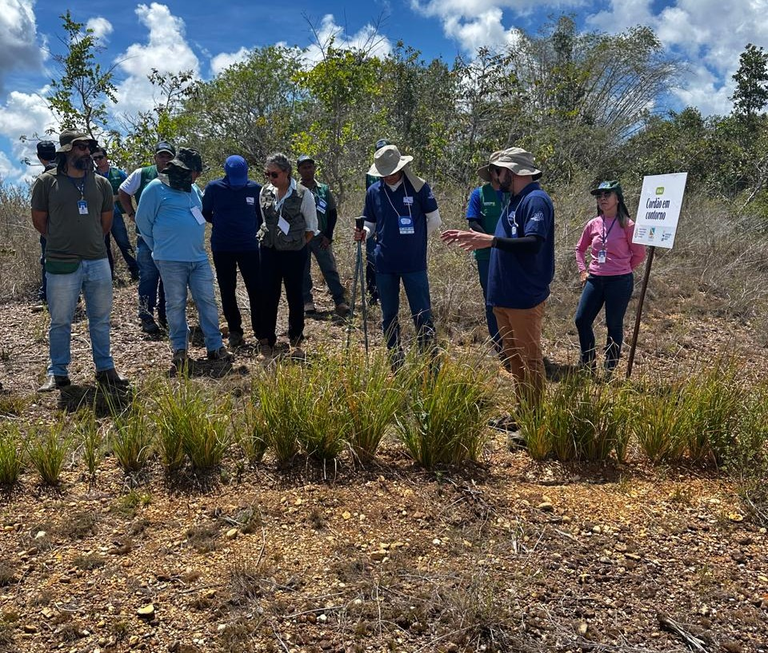
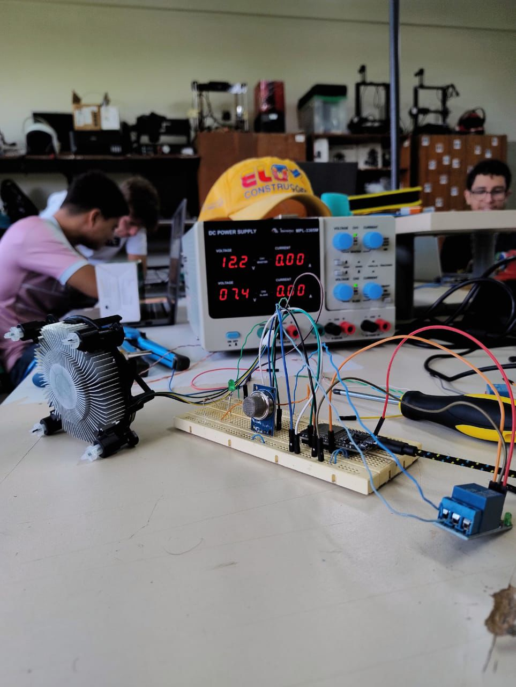
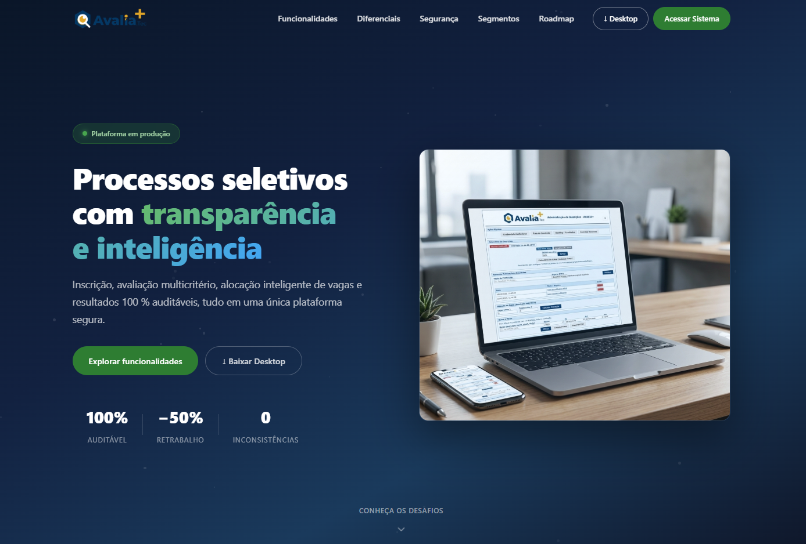
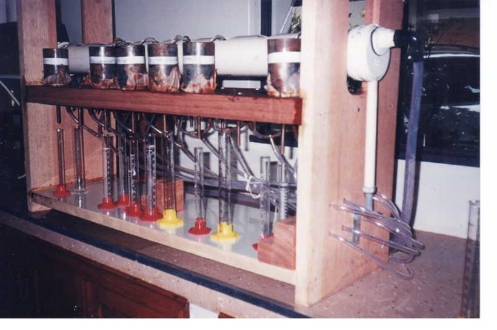
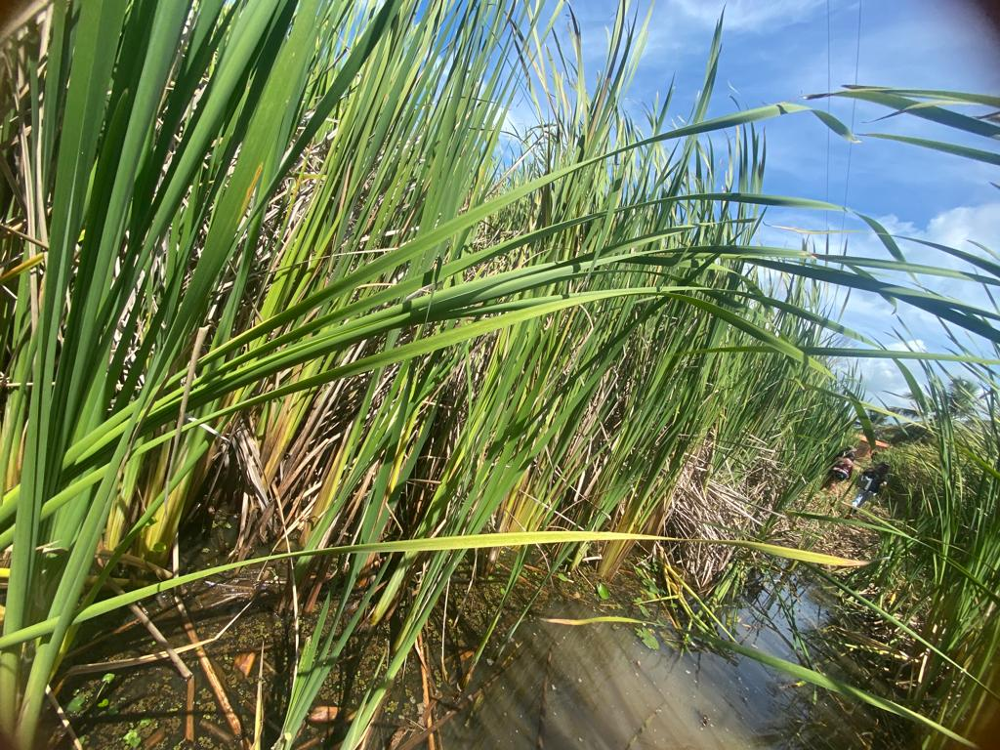
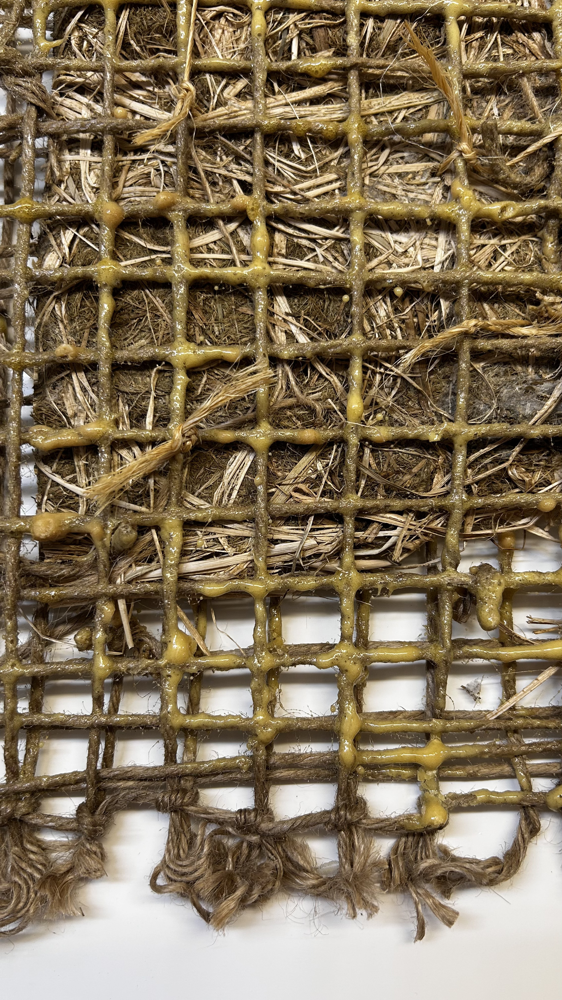
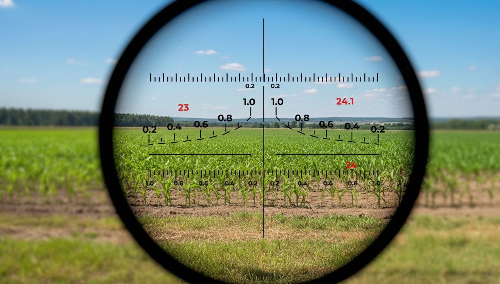
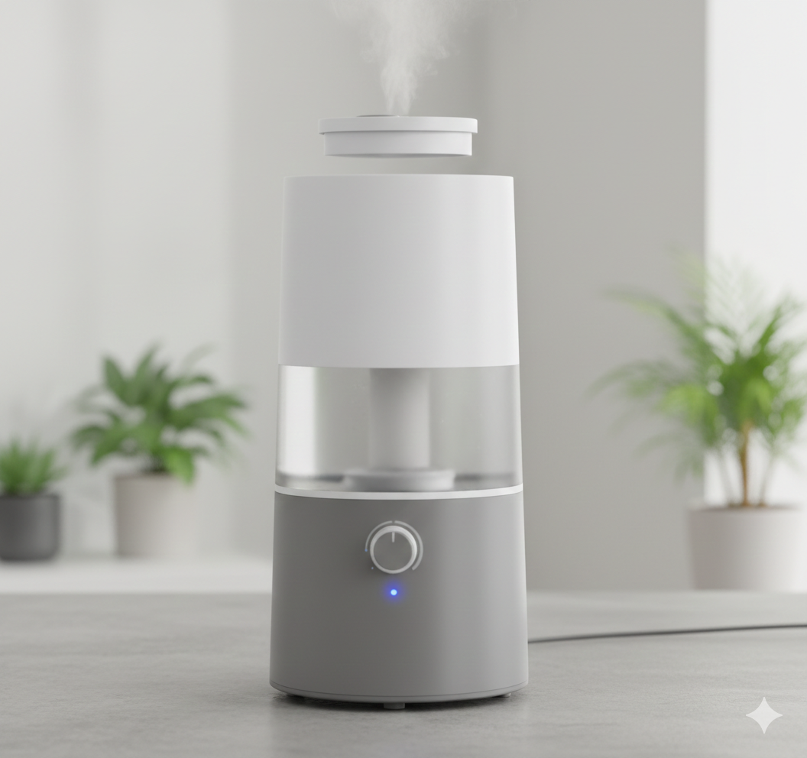
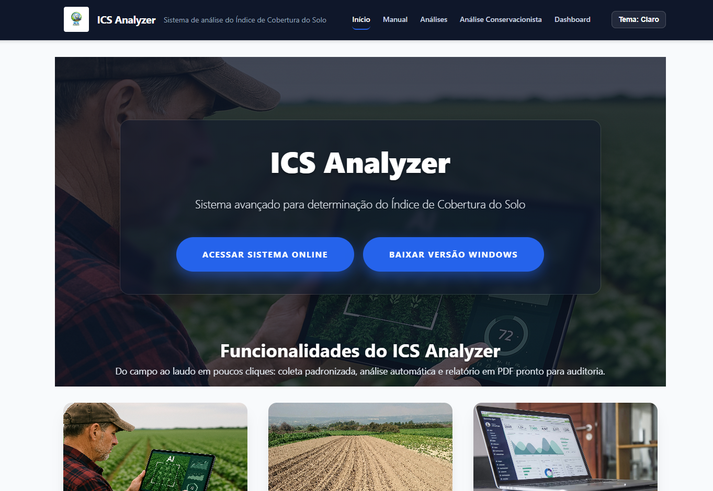

::: {.text-end .mb-3}
[Português](index.qmd) | [English](index-en.qmd) | [Español](index-es.qmd) | **Français** | [ Télécharger CV](cv-luiz-diego-en.pdf){.btn .btn-outline-primary .btn-sm}
:::

::: {.hero-value-statement}
> **Je transforme les territoires grâce aux solutions fondées sur la nature, à la propriété intellectuelle et à l'innovation durable — reliant la recherche scientifique à des impacts concrets dans le Semi-Aride brésilien et au-delà.**
:::

::: {.text-center .mb-4}
[ Me contacter](mailto:ldvsantos@uefs.br?subject=Opportunité%20Professionnelle%20-%20Luiz%20Diego%20Vidal%20Santos){.btn .btn-primary .btn-lg .me-2}
[ WhatsApp](https://wa.me/5579999063350?text=Bonjour%20Prof.%20Luiz%20Diego%2C%20je%20souhaiterais%20discuter%20d%27une%20opportunité.){.btn .btn-success .btn-lg}
:::

##  À propos de moi

Je suis **Ingénieur Agronome** (UFS) et titulaire d'un **Doctorat en Propriété Intellectuelle et Innovation** (UFS, 2023), avec orientation sur la commercialisation agroforestière durable. Je suis actuellement Professeur Invité au Programme de Master en Planification Territoriale de l'[Université Fédérale de l'État de Feira de Santana (UEFS)](https://www.uefs.br/) et chercheur à l'Incubateur d'Initiatives d'Économie Populaire et Solidaire (UEFS).

Je dirige le groupe **PLANeT-Inova** (Planification Territoriale, *Solutions fondées sur la Nature* et Innovation Durable) et participe aux Groupes de Recherche sur la Gestion Hydroenvironnementale du Bas São Francisco et sur la Gestion des Sols et la Durabilité, tous deux affiliés à l'UFS.

J'ai co-fondé la Ligue Académique pour l'Agriculture Durable **(L-AGROS)** et l'Unité de Diffusion Technologique et d'Innovation en Conservation des Sols et des Eaux **(UDTI)**.

---

##  Formation

| Période | Diplôme | Établissement |
|---------|---------|---------------|
| 2024-2026 | **Post-doctorat** - Sciences Agricoles / Agronomie (Bourse CNPq) | UFS |
| 2021-2023 | **Doctorat** - Science de la Propriété Intellectuelle | UFS |
| 2019-2020 | **Master** - Science de la Propriété Intellectuelle | UFS |
| 2019-2022 | **Spécialisation** - Production et Développement Rural | Unyleya |
| 2013-2014 | **Spécialisation** - Qualité, Santé et Gestion Environnementale | AVM Educacional |
| 2016-2021 | **Licence** - Ingénierie Agronomique | UFS |

: {.striped .hover}

---

##  Expérience Professionnelle

::: {.callout-note appearance="minimal" icon=false}
### Université Fédérale de l'État de Feira de Santana (UEFS)
**Professeur Invité** · 2024 - Présent

Programme de Master en Planification Territoriale · Temps plein
:::

::: {.callout-note appearance="minimal" icon=false}
### Université Fédérale de Sergipe (UFS)
**Chercheur Post-doctoral** · 2019 - Présent

Centre des Sciences Agricoles Appliquées - Recherche, Extension et Développement
:::

::: {.callout-note appearance="minimal" icon=false}
### Conseil Régional d'Éducation Physique (CREF 13)
**Superviseur d'Inspection** · 2021-2024

Fonctionnaire - Temps plein
:::

::: {.callout-note appearance="minimal" icon=false}
### Institut Fédéral de Sergipe (IFS) - Campus São Cristóvão
**Professeur** · 2021-2023
:::

---

##  Projets en cours {#projects}

::: {.panel-tabset}

### Recherche

::: {.card .mb-3}
#### Sauvegarde des Systèmes Agricoles Traditionnels
**2025 - Présent**

Développement et application de questionnaires de cartographie, création d'une base de données géoréférencée et développement d'une échelle d'évaluation (*Likert*) sur cinq construits. Le projet vise à protéger les savoirs traditionnels des peuples et communautés du Semi-Aride du Nord-Est.

**Équipe :** L.D.V. Santos (IP), C.O.V. Santana, P.R. Gagá, S.K.A. Sousa, R.A.S. Machado, T.C. Azevedo
:::

::: {.card .mb-3}
#### Unité de Référence Technique pour les Géotextiles en Contrôle de l'Érosion
**2025 - Présent**

Développement d'une unité de référence technique pour l'application de géotextiles dans le contrôle de l'érosion des sols, impliquant des étudiants de licence, master et doctorat.

**Équipe :** L.D.V. Santos (IP), R.H. Marino, F.S.R. Holanda, A.S.N. Souza, R.A.S. Machado, T.C. Azevedo, K.R. Andrade, V.P. Neto, E.S. Santos
:::

### Développement Technologique

::: {.card .mb-3}
#### CLEANBONER : Système de Monitoring Intelligent
**2025 - Présent**

Projet de développement technologique d'un système intelligent de monitoring environnemental.

**Équipe :** L.D.V. Santos (IP), C.O.V. Santana, S.K.A. Sousa
:::

::: {.card .mb-3}
#### Biospeckle Laser - Analyse de Fréquence
**2017-2020** (Terminé)

Série de projets sur l'application du biospeckle laser pour l'analyse de fréquence et la corrélation avec les valeurs d'humidité du sol. Développement d'algorithmes de screening et d'analyse par Transformée de Fourier.
:::

::: {.card .mb-3}
#### Inoculants Mycorhiziens sur Tomate Cerise
**Terminé**

Étude de l'effet des champignons mycorhiziens sur le développement et la production de tomate cerise commune.
:::

### Extension

::: {.card .mb-3}
#### Empreenda AgroCast
**2020 - Présent**

Outil pédagogique (podcast) promouvant l'entrepreneuriat dans le secteur agricole. Créé en réponse à la pandémie de COVID-19 comme alternative pour développer les compétences entrepreneuriales en Sciences Agricoles.
:::

::: {.card .mb-3}
#### Ligue Académique pour l'Agriculture Durable (L-AGROS)
**2020 - Présent**

Extension universitaire au Centre des Sciences Agricoles Appliquées de l'UFS, promouvant l'agriculture durable et l'innovation.
:::

::: {.card .mb-3}
#### Sauvegarde des Systèmes Agricoles - Extension
**2024 - Présent**

Projet d'extension visant à protéger les systèmes agricoles traditionnels du Semi-Aride du Nord-Est.
:::

:::

---

##  Domaines de Recherche

::: {.grid}

::: {.g-col-12 .g-col-md-6}
Mes axes de recherche articulent **planification territoriale et solutions fondées sur la nature**, en se concentrant sur la **conservation des sols et des eaux par une gestion durable**.
:::

::: {.g-col-12 .g-col-md-6}
Parallèlement, je développe des recherches en **propriété intellectuelle, prospection technologique et patentométrie**, en intégrant ces domaines à l'**innovation durable, l'entrepreneuriat et le transfert de technologie**.
:::

:::

---

##  Projets Mis en Avant

::: {.grid}

::: {.g-col-12 .g-col-md-6}
::: {.card .featured-project}
{.project-img fig-alt="Recherche de terrain sur les systèmes agricoles traditionnels dans le Semi-Aride brésilien"}

#### Sauvegarde des Systèmes Agricoles Traditionnels

Protection des savoirs traditionnels des communautés du Semi-Aride. Base de données géoréférencée avec échelle Likert à 5 construits.

**Résultat :** Cartographie communautaire et création d'un protocole de sauvegarde inédit au Brésil.
:::
:::

::: {.g-col-12 .g-col-md-6}
::: {.card .featured-project}
{.project-img fig-alt="Géotextiles déployés sur des talus pour le contrôle de l'érosion dans le Bas São Francisco"}

#### Géotextiles pour le Contrôle de l'Érosion

Développement d'une unité de référence technique pour l'application de géotextiles dans le contrôle de l'érosion des sols, avec reprofilage, revégétalisation et techniques en fibres de sisal.

**Résultat :** Réduction mesurable des pertes en sol dans les zones critiques du Bas São Francisco.
:::
:::

::: {.g-col-12 .g-col-md-6}
::: {.card .featured-project}
{.project-img fig-alt="Système de monitoring environnemental intelligent CLEANBONER"}

#### CLEANBONER : Monitoring Intelligent

Système de monitoring environnemental intelligent basé sur l'IoT avec analyse de données en temps réel.

**Résultat :** Prototype IoT fonctionnel appliqué aux conditions semi-arides.
:::
:::

::: {.g-col-12 .g-col-md-6}
::: {.card .featured-project}
{.project-img fig-alt="Équipement Biospeckle Laser pour l'analyse de fréquence et l'humidité du sol"}

#### Biospeckle Laser - Analyse de Fréquence

Application du biospeckle laser pour l'analyse de fréquence et la corrélation avec les valeurs d'humidité du sol. Développement d'algorithmes de screening et d'analyse par Transformée de Fourier.

**Résultat :** Méthode innovante non destructive d'analyse des propriétés du sol par laser.
:::
:::

::: {.g-col-12 .g-col-md-6}
::: {.card .featured-project}
{.project-img fig-alt="Plateforme Avalia+ pour la soumission et l'évaluation de projets d'innovation"}

#### Avalia+ : Plateforme de Soumission

Plateforme web pour la soumission de projets d'innovation avec validation CPF, génération de PDF avec protocole et hash SHA-256 vérifiable, évaluation anonyme et panneau d'administration.

**Résultat :** Système en production assurant l'intégrité et la traçabilité des soumissions.
:::
:::

::: {.g-col-12 .g-col-md-6}
::: {.card .featured-project}
{.project-img fig-alt="Système mécanique pour le prélèvement d'échantillons de sol non remaniés"}

#### Brevet : Préleveur de Sol Non Remanié

Arrangement constructif d'un système mécanique pour le prélèvement d'échantillons de sol non remaniés avec méthode de préservation structurale. Dépôt INPI : BR10202401648.

**Résultat :** Brevet déposé en 2024. Résout le problème de préservation de la structure originale du sol lors du prélèvement.
:::
:::

::: {.g-col-12 .g-col-md-6}
::: {.card .featured-project}
{.project-img fig-alt="Perméamètre à charge constante et décroissante continue"}

#### Brevet : Perméamètre Continu

Équipement pour déterminer la conductivité hydraulique en milieux poreux, permettant des essais à charge constante et décroissante dans un seul appareil. Dépôt INPI : BR10202301830.

**Résultat :** Brevet **accordé en 2025**. Innovation en instrumentation pour l'analyse physique des sols.
:::
:::

::: {.g-col-12 .g-col-md-6}
::: {.card .featured-project}
{.project-img fig-alt="Géotextile type géogrille en fibres de Typha domingensis"}

#### Brevet : Géotextile de Massette (Jonc)

Géotextile tissé type géogrille en fibres de *Typha domingensis* (massette) à haute résistance à la traction pour le contrôle de l'érosion des sols. Dépôt INPI : BR10202302221.

**Résultat :** Brevet **accordé en 2025**. Solution fondée sur la Nature (SfN) économique pour talus et zones dégradées.
:::
:::

::: {.g-col-12 .g-col-md-6}
::: {.card .featured-project}
{.project-img fig-alt="Géodrain végétal biodégradable pour la stabilisation de talus"}

#### Brevet : Géodrain Végétal

Géotextile géodrain double plaque en fibres naturelles de massette et de bananier, lié à la résine végétale. Tube de drainage poreux biodégradable installé en « arête de poisson ».

**Résultat :** Prototype TRL 6 testé sur le terrain. Solution 100% biodégradable remplaçant les structures en béton.
:::
:::

::: {.g-col-12 .g-col-md-6}
::: {.card .featured-project}
{.project-img fig-alt="Géocomposite hybride pour la protection des sols combinant renforcement et drainage"}

#### Brevet : Géocomposite de Protection des Sols

Géocomposite combinant deux ou plusieurs fonctions géotechniques en un seul produit, intégrant un mat de fibres avec un treillis de renforcement pour application sur talus en Semi-Aride.

**Résultat :** Phase de documentation pour dépôt INPI. Application expérimentale sur le terrain avec protection intégrée contre l'érosion.
:::
:::

::: {.g-col-12 .g-col-md-6}
::: {.card .featured-project}
{.project-img fig-alt="Géocellules 3D installées sur le terrain pour le contrôle de l'érosion"}

#### Projet : Géocellules pour le Contrôle de l'Érosion

Application de **géocellules** (confinement 3D) pour la stabilisation de talus et canaux, avec installation et évaluation des performances dans une expérience sur le terrain.

**Résultat :** Mise en œuvre sur le terrain avec documentation photographique et évaluation des performances.
:::
:::

::: {.g-col-12 .g-col-md-6}
::: {.card .featured-project}
{.project-img fig-alt="Reprofilage végétalisé sur talus dégradé comme étape d'ingénierie naturelle"}

#### SfN : Reprofilage Végétalisé

Protocole intégré de **Solutions fondées sur la Nature** pour la stabilisation de talus dégradés - combinant reprofilage végétalisé, géosynthétiques (géotextiles, géocomposites, géogrille) et revégétalisation avec des espèces natives dans un essai d'ingénierie naturelle.

**Résultat :** Réduction de 40-60 % des pertes en sol, coût 30 % inférieur aux solutions conventionnelles, et établissement de la végétation sur 90 % de la zone traitée. [Lire la suite →](/posts/nbs-retaludamento/)
:::
:::

::: {.g-col-12 .g-col-md-6}
::: {.card .featured-project}
{.project-img fig-alt="Appareil pour l'analyse visuelle d'échantillons de sol"}

#### Brevet : Appareil d'Analyse d'Échantillons de Sol

Dispositif pour l'analyse et la classification visuelle d'échantillons de sol avec système d'éclairage standardisé et capture d'images.

**Résultat :** Brevet en développement avec article scientifique associé.
:::
:::

::: {.g-col-12 .g-col-md-6}
::: {.card .featured-project}
{.project-img fig-alt="Humidificateur sanitaire résidentiel à brume d'ozone"}

#### Brevet : Humidificateur Sanitaire à Ozone

Humidificateur sanitaire résidentiel à brume d'ozone, combinant humidification et désinfection de l'air. Dépôt INPI : BR20202500452.

**Résultat :** Brevet déposé en 2025. Application en santé environnementale résidentielle.
:::
:::

::: {.g-col-12 .g-col-md-6}
::: {.card .featured-project}
{.project-img fig-alt="Interface ICS Analyzer pour l'analyse de l'Indice de Couverture du Sol avec tableau de bord et machine learning"}

#### ICS Analyzer : Analyse de l'Indice de Couverture du Sol

Système multiplateforme pour la détermination de l'ICS avec pipeline de machine learning (Ridge + K-Fold CV), diagnostic de conservation flou (ISPC), tableau de bord interactif et génération automatisée de rapports PDF.

**Résultat :** Logiciel en production avec version web (GitHub Pages) et bureau (Electron), CI/CD via GitHub Actions et 12 tests unitaires. [Lire la suite →](/posts/projeto-ics-analyzer/)
:::
:::

:::

---

##  Prix et Distinctions

| Année | Prix |
|-------|------|
| 2020 | 1ère Place - Mention Honorable (Présentation Orale), Congrès Brésilien d'Ingénierie Agricole |
| 2020 | 1ère Place - Mention Honorable (Poster), Congrès Brésilien d'Ingénierie Agricole |
| 2019 | Meilleur Article, Symposium International sur l'Innovation Technologique |
| 2018 | Prix d'Excellence SEMAC, UFS |
| 2017 | Prix d'Excellence SEMAC, UFS |

: {.striped .hover}

---

##  Enseignement et Encadrement

J'interviens à l'[UEFS](https://www.uefs.br/) dans le **Programme de Master en Planification Territoriale**, encadrant des étudiants de licence, master et doctorat en agriculture durable et solutions fondées sur la nature, conservation des sols et de la biodiversité, propriété intellectuelle et innovation technologique, ainsi qu'en entrepreneuriat agribusiness. En savoir plus dans la section [Enseignement](teaching/index-fr.qmd).

---

##  Publications

J'ai publié **plus de 98 articles** dans des revues nationales et internationales, couvrant des domaines tels que la conservation des sols, la bioingénierie, la propriété intellectuelle, l'innovation durable et le branding environnemental.

Consultez la liste complète dans la section [Publications](papers/publicacoes-fr.qmd), ou visitez mon profil [ORCID](https://orcid.org/0000-0001-8659-8557).

---

##  Contact

::: {.grid}

::: {.g-col-12 .g-col-md-6}
**Email :** [ldvsantos@uefs.br](mailto:ldvsantos@uefs.br)

**Institution :** [UEFS](https://www.uefs.br/) - Programme de Master en Planification Territoriale
:::

::: {.g-col-12 .g-col-md-6}
**ORCID :** [0000-0001-8659-8557](https://orcid.org/0000-0001-8659-8557)

**Lattes :** [7491112603328096](http://lattes.cnpq.br/7491112603328096)
:::

:::

---

##  Compétences et Outils

::: {.grid}

::: {.g-col-12 .g-col-md-4}
**Recherche & Analyse**

{fig-alt="R"}
{fig-alt="Python"}
{fig-alt="SPSS"}
{fig-alt="Excel"}
:::

::: {.g-col-12 .g-col-md-4}
**SIG & Géospatial**

{fig-alt="QGIS"}
{fig-alt="ArcGIS"}
{fig-alt="Google Earth Engine"}
:::

::: {.g-col-12 .g-col-md-4}
**PI & Gestion**

{fig-alt="PatentSight"}
{fig-alt="Scopus"}
{fig-alt="Web of Science"}
{fig-alt="Gestion de Projet"}
:::

:::

::: {.text-center .mt-2}
{fig-alt="ORCID"}
{fig-alt="Lattes CNPq"}
{fig-alt="CNPq Fellow"}
:::

---

##  Parlons-en ?

Je suis ouvert aux **partenariats académiques**, **consultations**, **encadrements**, et **opportunités professionnelles** dans mes domaines d'expertise.

::: {.text-center .mt-3}
[ Envoyer un email](mailto:ldvsantos@uefs.br?subject=Contact%20via%20Site%20Web%20-%20Luiz%20Diego){.btn .btn-primary .btn-lg .me-2}
[ WhatsApp](https://wa.me/5579999063350?text=Bonjour%20Prof.%20Luiz%20Diego%2C%20j%27ai%20vu%20votre%20site%20web%20et%20souhaiterais%20discuter.){.btn .btn-success .btn-lg}
:::
