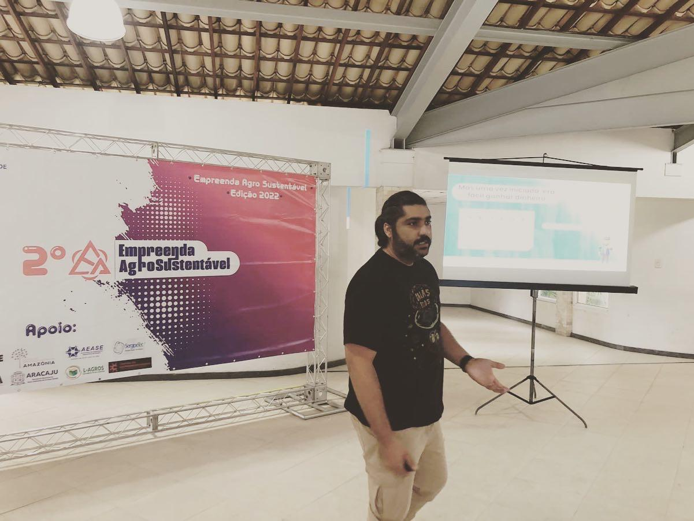
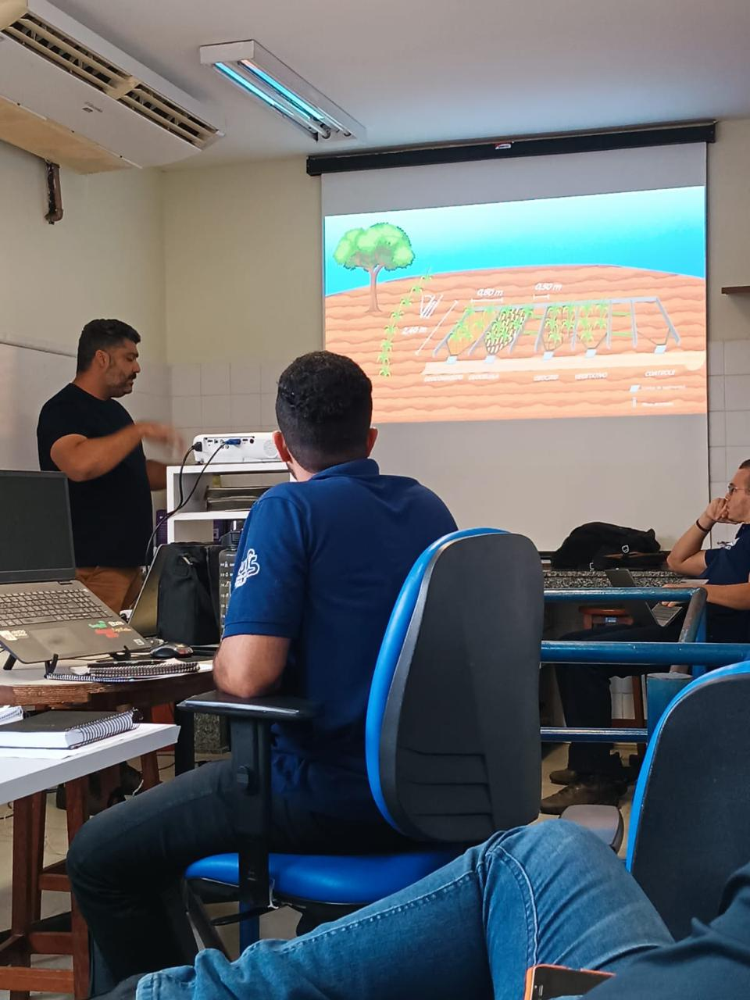

::: {.text-end .mb-3}
[Português](index.qmd) | **English** | [Español](index-es.qmd) | [Français](index-fr.qmd)
:::

##  In the Classroom

::: {.columns}
::: {.column width="50%"}
{fig-alt="Professor Luiz Diego teaching a practical class" width="100%" .rounded}
:::
::: {.column width="50%"}
{fig-alt="Professor Luiz Diego giving a lecture" width="100%" .rounded}
:::
:::

---

::: {.callout-note}
## Content in Portuguese

Media content is currently available in Portuguese only. Please visit the [Portuguese version](index.qmd) to view interviews and media appearances.
:::
