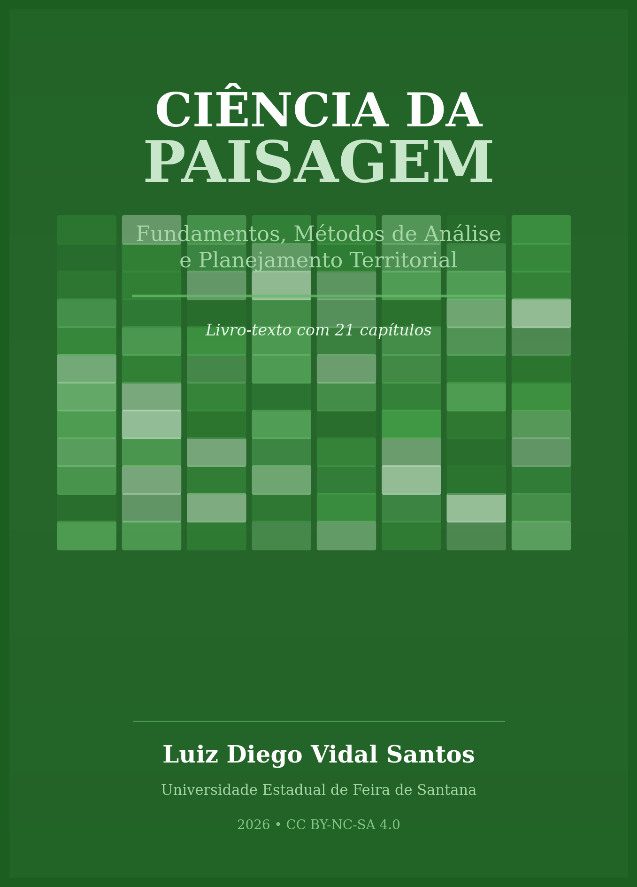

::: {.text-end .mb-3}
[Português](livros.qmd) | [English](livros-en.qmd) | **Español**
:::

Libros y ebooks de autoría de **Luiz Diego Vidal Santos**, disponibles en formato digital.

## Ebooks

::: {.card .shadow-sm .mb-4}
::: {.text-center .p-3}
{fig-alt="Portada del ebook Bioingeniería de Suelos en Regiones Tropicales" style="max-height:320px; object-fit:contain;"}
:::
::: {.card-body}

### Bioingeniería de Suelos en Regiones Tropicales {.card-title}

**Fundamentos, Técnicas y Aplicaciones**

Manual técnico-científico con 21 capítulos organizados en 4 partes, abarcando desde fundamentos de formación de suelos y erosión hasta técnicas de estabilización con materiales vivos, innovaciones en geotextiles y biopolímeros superabsorbentes. Incluye ecuaciones de dimensionamiento, tablas comparativas y estudios de caso. Licencia CC BY-NC-SA 4.0.

[ Acceder al ebook](../books/bioengenharia-solos/){.btn .btn-primary .btn-sm}

:::
:::

::: {.card .shadow-sm .mb-4}
::: {.text-center .p-3}
{fig-alt="Portada del ebook Ciencia del Paisaje" style="max-height:320px; object-fit:contain;"}
:::
::: {.card-body}

### Ciencia del Paisaje {.card-title}

**Fundamentos, Métodos de Análisis y Planificación Territorial**

Libro de texto con 21 capítulos organizados en 4 partes, abarcando desde fundamentos de ecología del paisaje y métricas espaciales hasta teledetección, SIG, dinámica de uso del suelo, servicios ecosistémicos, restauración ecológica y modelación de escenarios para la gestión sostenible de paisajes tropicales. Licencia CC BY-NC-SA 4.0.

[ Acceder al ebook](../books/ciencia-paisagem/){.btn .btn-success .btn-sm}

:::
:::
