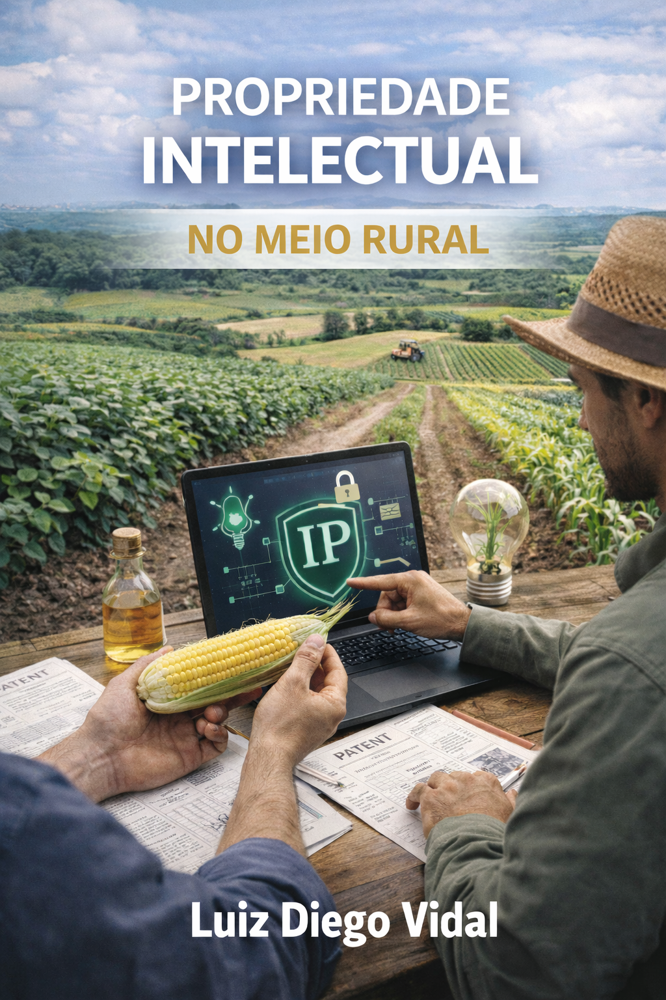
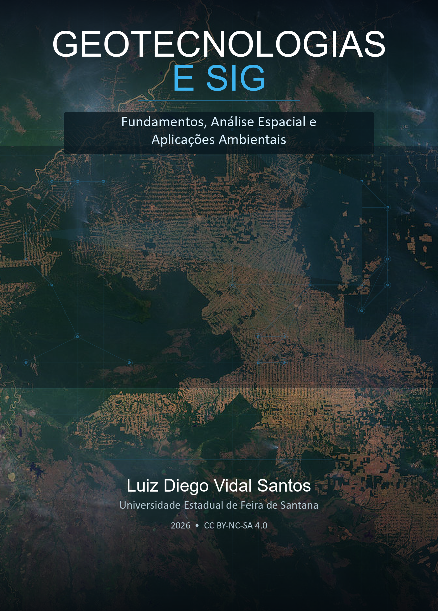

::: {.text-end .mb-3}
**Português** | [English](livros-en.qmd) | [Español](livros-es.qmd) | [Français](livros-fr.qmd)
:::

Meus livros e ebooks, disponíveis em formato digital.

## Ebooks

```{=html}
<div class="book-card">
  <div class="book-cover">
    <a href="../books/branding-agro/">
      
    </a>
  </div>
  <div class="book-info">
    <p class="book-author">Luiz Diego Vidal Santos</p>
    <h4 class="book-title">Gestão de Branding no Agronegócio</h4>
    <p class="book-subtitle">Diferenciação, Posicionamento e Construção de Marcas no Agro</p>
    <p class="book-desc">Livro-texto com 14 capítulos organizados em 3 partes, abordando fundamentos de branding, diferenciação e posicionamento aplicados ao agronegócio. Inclui estratégia de portfólio, público ideal, branding B2B, plataforma de marca, cases práticos e ferramentas de autoavaliação.</p>
    <div class="book-meta">
      <span><i class="bi bi-journal-text"></i> 14 capítulos</span>
      <span><i class="bi bi-unlock"></i> CC BY-NC-SA 4.0</span>
    </div>
    <div class="book-actions">
      <a href="../books/branding-agro/" class="btn btn-dark btn-sm"><i class="fa-solid fa-book-open"></i> Acessar o ebook</a>
    </div>
  </div>
</div>

<div class="book-card">
  <div class="book-cover">
    <a href="../books/bioengenharia-solos/">
      
    </a>
  </div>
  <div class="book-info">
    <p class="book-author">Luiz Diego Vidal Santos</p>
    <h4 class="book-title">Bioengenharia de Solos em Regiões Tropicais</h4>
    <p class="book-subtitle">Fundamentos, Técnicas e Aplicações</p>
    <p class="book-desc">Manual técnico-científico com 21 capítulos organizados em 4 partes, abrangendo desde fundamentos de formação dos solos e erosão até técnicas de estabilização com materiais vivos, inovações em geotêxteis e biopolímeros superabsorventes. Inclui equações de dimensionamento, tabelas comparativas e estudos de caso.</p>
    <div class="book-meta">
      <span><i class="bi bi-journal-text"></i> 21 capítulos</span>
      <span><i class="bi bi-unlock"></i> CC BY-NC-SA 4.0</span>
    </div>
    <div class="book-actions">
      <a href="../books/bioengenharia-solos/" class="btn btn-primary btn-sm"><i class="fa-solid fa-book-open"></i> Acessar o ebook</a>
    </div>
  </div>
</div>

<div class="book-card">
  <div class="book-cover">
    <a href="../books/ciencia-paisagem/">
      
    </a>
  </div>
  <div class="book-info">
    <p class="book-author">Luiz Diego Vidal Santos</p>
    <h4 class="book-title">Análise da Paisagem</h4>
    <p class="book-subtitle">Fundamentos, Métodos e Planejamento Territorial</p>
    <p class="book-desc">Livro-texto com 21 capítulos organizados em 4 partes, cobrindo desde fundamentos da ecologia da paisagem e métricas espaciais até sensoriamento remoto, geoprocessamento, dinâmica de uso do solo, serviços ecossistêmicos, restauração ecológica e modelagem de cenários para gestão sustentável de paisagens tropicais.</p>
    <div class="book-meta">
      <span><i class="bi bi-journal-text"></i> 21 capítulos</span>
      <span><i class="bi bi-unlock"></i> CC BY-NC-SA 4.0</span>
    </div>
    <div class="book-actions">
      <a href="../books/ciencia-paisagem/" class="btn btn-success btn-sm"><i class="fa-solid fa-book-open"></i> Acessar o ebook</a>
    </div>
  </div>
</div>

<div class="book-card">
  <div class="book-cover">
    <a href="../books/pi/">
      
    </a>
  </div>
  <div class="book-info">
    <p class="book-author">Luiz Diego Vidal Santos</p>
    <h4 class="book-title">Propriedade Intelectual e Inovação no Agronegócio</h4>
    <p class="book-subtitle">Fundamentos, Proteção e Transferência de Tecnologia</p>
    <p class="book-desc">Livro-texto com 11 capítulos organizados em 4 partes, abordando gestão da inovação, proteção de ativos intangíveis (patentes, cultivares, indicações geográficas), valoração de PI, transferência de tecnologia, empreendedorismo tecnológico agrícola, spin-offs acadêmicas e PI na agricultura digital.</p>
    <div class="book-meta">
      <span><i class="bi bi-journal-text"></i> 11 capítulos</span>
      <span><i class="bi bi-unlock"></i> CC BY-NC-SA 4.0</span>
    </div>
    <div class="book-actions">
      <a href="../books/pi/" class="btn btn-warning btn-sm"><i class="fa-solid fa-book-open"></i> Acessar o ebook</a>
    </div>
  </div>
</div>

<div class="book-card">
  <div class="book-cover">
    <a href="../books/geotecnologias-sig/">
      
    </a>
  </div>
  <div class="book-info">
    <p class="book-author">Luiz Diego Vidal Santos</p>
    <h4 class="book-title">Geotecnologias e Sistemas de Informação Geográfica</h4>
    <p class="book-subtitle">Fundamentos, Análise Espacial e Aplicações Ambientais</p>
    <p class="book-desc">Livro-texto com 12 capítulos organizados em 4 partes, cobrindo modelos de dados espaciais, álgebra de mapas e geoestatística, sensoriamento remoto, classificação digital e incerteza, processos erosivos e degradação, hidrologia e gestão da seca, monitoramento ambiental da mineração, exploração mineral preditiva e inteligência artificial aplicada a geociências.</p>
    <div class="book-meta">
      <span><i class="bi bi-journal-text"></i> 12 capítulos</span>
      <span><i class="bi bi-unlock"></i> CC BY-NC-SA 4.0</span>
    </div>
    <div class="book-actions">
      <a href="../books/geotecnologias-sig/" class="btn btn-info btn-sm"><i class="fa-solid fa-book-open"></i> Acessar o ebook</a>
    </div>
  </div>
</div>
```
